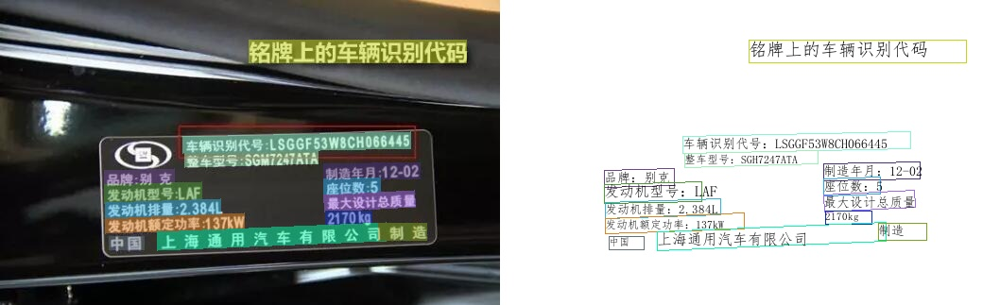
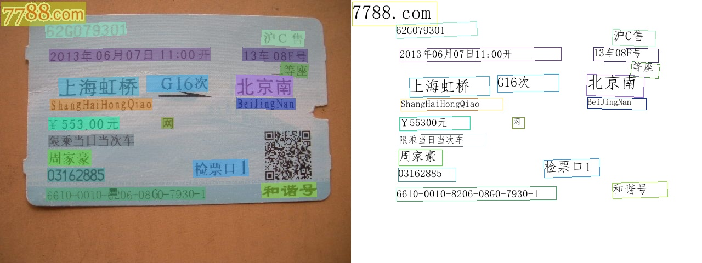
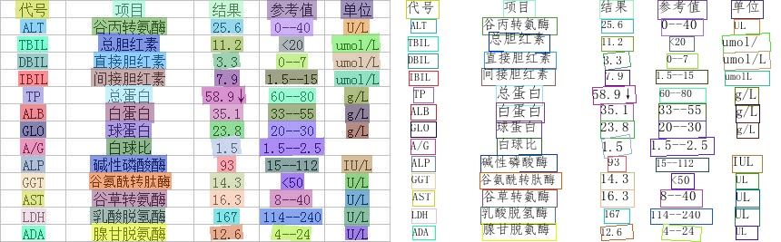
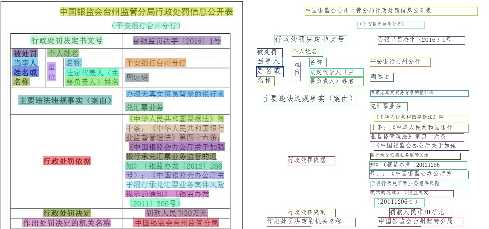
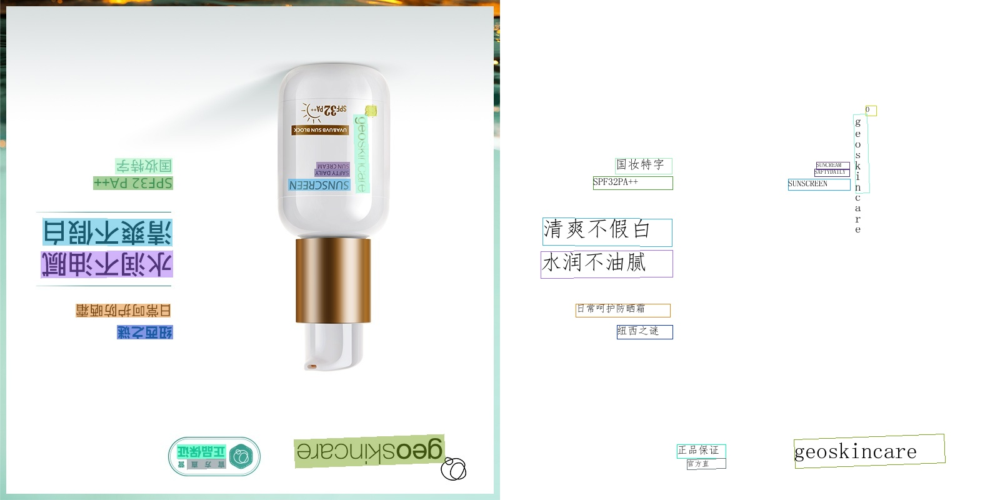
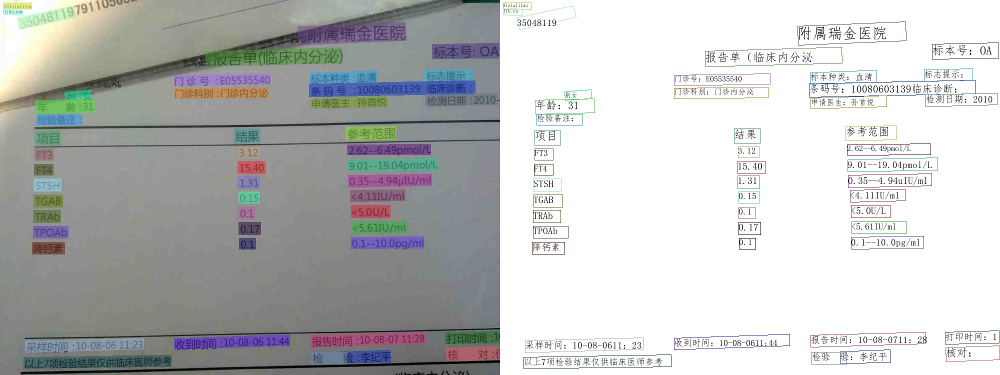
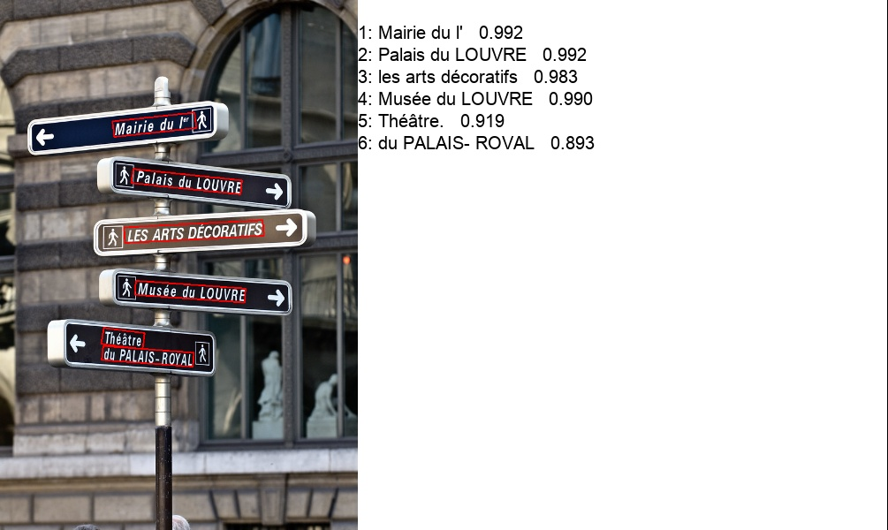
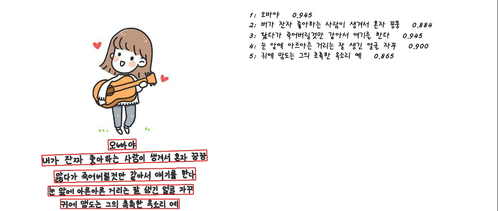

# 效果展示

## 通用ppocr_server_2.0效果展示

    
    
    
    
    
    

## 英文识别模型效果展示

    

## 多语言识别模型效果展示

    
    

## 超轻量ppocr_mobile_1.0效果展示

    
    
    
    

## 通用ppocr_server_1.0效果展示

    
    
    

