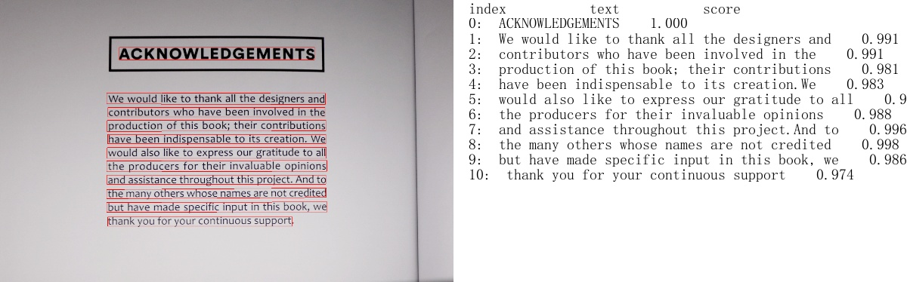

# 效果展示
- [超轻量级中文OCR效果展示](#超轻量级中文OCR)
- [通用中文OCR效果展示](#通用中文OCR)
- [支持空格的中文OCR效果展示](#支持空格的中文OCR)

## 超轻量级中文OCR效果展示

    

    

    

    

    

## 通用中文OCR效果展示

## 支持空格的中文OCR效果展示

### 轻量级模型

### 通用模型

