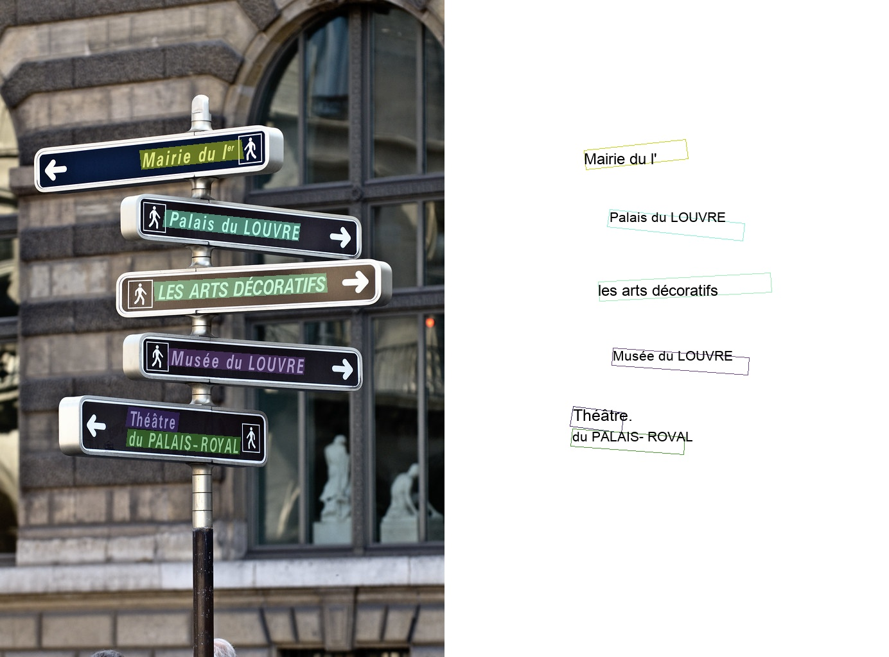

# 效果展示
- PP-OCR 1.1系列模型效果
    - [通用ppocr_server_1.1效果展示](#通用ppocr_server_1.1效果展示)
    - [通用ppocr_mobile_1.1效果展示（待补充）]()
- PP-OCR 1.0系列模型效果  
    - [超轻量ppocr_mobile_1.0效果展示](#超轻量ppocr_mobile_1.0效果展示)
    - [通用ppocr_server_1.0效果展示](#通用ppocr_server_1.0效果展示)

## 通用ppocr_server_1.1效果展示

    
    
    
    
    
    

## 超轻量ppocr_mobile_1.0效果展示

    

    

    

    

## 通用ppocr_server_1.0效果展示

    

    

    

