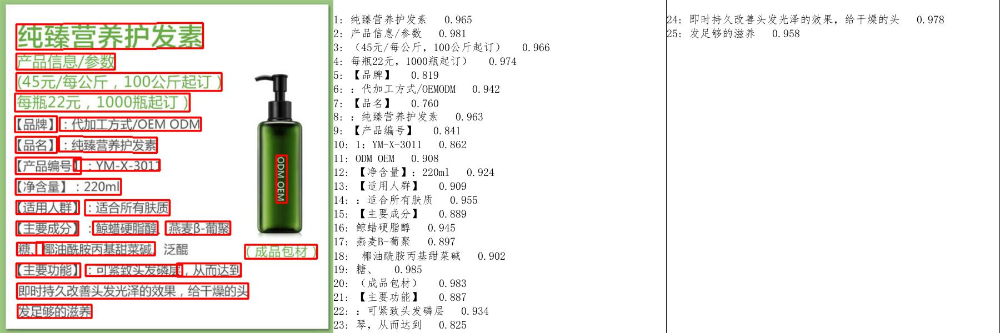

# paddleocr package使用说明

## 1 快速上手

### 1.1 安装whl包

pip安装

```bash
pip install "paddleocr>=2.0.1" # 推荐使用2.0.1+版本
```

本地构建并安装

```bash
python3 setup.py bdist_wheel
pip3 install dist/paddleocr-x.x.x-py3-none-any.whl # x.x.x是paddleocr的版本号
```

## 2 使用

### 2.1 代码使用

paddleocr whl包会自动下载ppocr轻量级模型作为默认模型，可以根据第3节**自定义模型**进行自定义更换。

* 检测+方向分类器+识别全流程

```python
from paddleocr import PaddleOCR, draw_ocr

# Paddleocr目前支持中英文、英文、法语、德语、韩语、日语，可以通过修改lang参数进行切换
# 参数依次为`ch`, `en`, `french`, `german`, `korean`, `japan`。
ocr = PaddleOCR(use_angle_cls=True, lang="ch")  # need to run only once to download and load model into memory
img_path = 'PaddleOCR/doc/imgs/11.jpg'
result = ocr.ocr(img_path, cls=True)
for line in result:
    print(line)

# 显示结果
from PIL import Image

image = Image.open(img_path).convert('RGB')
boxes = [line[0] for line in result]
txts = [line[1][0] for line in result]
scores = [line[1][1] for line in result]
im_show = draw_ocr(image, boxes, txts, scores, font_path='/path/to/PaddleOCR/doc/fonts/simfang.ttf')
im_show = Image.fromarray(im_show)
im_show.save('result.jpg')
```

结果是一个list，每个item包含了文本框，文字和识别置信度

```bash
[[[24.0, 36.0], [304.0, 34.0], [304.0, 72.0], [24.0, 74.0]], ['纯臻营养护发素', 0.964739]]
[[[24.0, 80.0], [172.0, 80.0], [172.0, 104.0], [24.0, 104.0]], ['产品信息/参数', 0.98069626]]
[[[24.0, 109.0], [333.0, 109.0], [333.0, 136.0], [24.0, 136.0]], ['（45元/每公斤，100公斤起订）', 0.9676722]]
......
```

结果可视化

<div align="center">
    
</div>

* 检测+识别

```python
from paddleocr import PaddleOCR, draw_ocr

ocr = PaddleOCR()  # need to run only once to download and load model into memory
img_path = 'PaddleOCR/doc/imgs/11.jpg'
result = ocr.ocr(img_path, cls=False)
for line in result:
    print(line)

# 显示结果
from PIL import Image

image = Image.open(img_path).convert('RGB')
boxes = [line[0] for line in result]
txts = [line[1][0] for line in result]
scores = [line[1][1] for line in result]
im_show = draw_ocr(image, boxes, txts, scores, font_path='/path/to/PaddleOCR/doc/fonts/simfang.ttf')
im_show = Image.fromarray(im_show)
im_show.save('result.jpg')
```

结果是一个list，每个item包含了文本框，文字和识别置信度

```bash
[[[24.0, 36.0], [304.0, 34.0], [304.0, 72.0], [24.0, 74.0]], ['纯臻营养护发素', 0.964739]]
[[[24.0, 80.0], [172.0, 80.0], [172.0, 104.0], [24.0, 104.0]], ['产品信息/参数', 0.98069626]]
[[[24.0, 109.0], [333.0, 109.0], [333.0, 136.0], [24.0, 136.0]], ['（45元/每公斤，100公斤起订）', 0.9676722]]
......
```

结果可视化

<div align="center">
    
</div>

* 方向分类器+识别

```python
from paddleocr import PaddleOCR

ocr = PaddleOCR(use_angle_cls=True)  # need to run only once to download and load model into memory
img_path = 'PaddleOCR/doc/imgs_words/ch/word_1.jpg'
result = ocr.ocr(img_path, det=False, cls=True)
for line in result:
    print(line)
```

结果是一个list，每个item只包含识别结果和识别置信度

```bash
['韩国小馆', 0.9907421]
```

* 单独执行检测

```python
from paddleocr import PaddleOCR, draw_ocr

ocr = PaddleOCR()  # need to run only once to download and load model into memory
img_path = 'PaddleOCR/doc/imgs/11.jpg'
result = ocr.ocr(img_path, rec=False)
for line in result:
    print(line)

# 显示结果
from PIL import Image

image = Image.open(img_path).convert('RGB')
im_show = draw_ocr(image, result, txts=None, scores=None, font_path='/path/to/PaddleOCR/doc/fonts/simfang.ttf')
im_show = Image.fromarray(im_show)
im_show.save('result.jpg')
```

结果是一个list，每个item只包含文本框

```bash
[[26.0, 457.0], [137.0, 457.0], [137.0, 477.0], [26.0, 477.0]]
[[25.0, 425.0], [372.0, 425.0], [372.0, 448.0], [25.0, 448.0]]
[[128.0, 397.0], [273.0, 397.0], [273.0, 414.0], [128.0, 414.0]]
......
```

结果可视化


<div align="center">
    
</div>

* 单独执行识别

```python
from paddleocr import PaddleOCR

ocr = PaddleOCR()  # need to run only once to download and load model into memory
img_path = 'PaddleOCR/doc/imgs_words/ch/word_1.jpg'
result = ocr.ocr(img_path, det=False)
for line in result:
    print(line)
```

结果是一个list，每个item只包含识别结果和识别置信度

```bash
['韩国小馆', 0.9907421]
```

* 单独执行方向分类器

```python
from paddleocr import PaddleOCR

ocr = PaddleOCR(use_angle_cls=True)  # need to run only once to download and load model into memory
img_path = 'PaddleOCR/doc/imgs_words/ch/word_1.jpg'
result = ocr.ocr(img_path, det=False, rec=False, cls=True)
for line in result:
    print(line)
```

结果是一个list，每个item只包含分类结果和分类置信度

```bash
['0', 0.9999924]
```

### 2.2 通过命令行使用

查看帮助信息

```bash
paddleocr -h
```

* 检测+方向分类器+识别全流程

```bash
paddleocr --image_dir PaddleOCR/doc/imgs/11.jpg --use_angle_cls true
```

结果是一个list，每个item包含了文本框，文字和识别置信度

```bash
[[[28.0, 37.0], [302.0, 39.0], [302.0, 72.0], [27.0, 70.0]], ('纯臻营养护发素', 0.9658738374710083)]
......
```

* 检测+识别

```bash
paddleocr --image_dir PaddleOCR/doc/imgs/11.jpg
```

结果是一个list，每个item包含了文本框，文字和识别置信度

```bash
[[[28.0, 37.0], [302.0, 39.0], [302.0, 72.0], [27.0, 70.0]], ('纯臻营养护发素', 0.9658738374710083)]
......
```

* 方向分类器+识别

```bash
paddleocr --image_dir PaddleOCR/doc/imgs_words/ch/word_1.jpg --use_angle_cls true --det false
```

结果是一个list，每个item只包含识别结果和识别置信度

```bash
['韩国小馆', 0.994467]
```

* 单独执行检测

```bash
paddleocr --image_dir PaddleOCR/doc/imgs/11.jpg --rec false
```

结果是一个list，每个item只包含文本框

```bash
[[27.0, 459.0], [136.0, 459.0], [136.0, 479.0], [27.0, 479.0]]
[[28.0, 429.0], [372.0, 429.0], [372.0, 445.0], [28.0, 445.0]]
......
```

* 单独执行识别

```bash
paddleocr --image_dir PaddleOCR/doc/imgs_words/ch/word_1.jpg --det false
```

结果是一个list，每个item只包含识别结果和识别置信度

```bash
['韩国小馆', 0.994467]
```

* 单独执行方向分类器

```bash
paddleocr --image_dir PaddleOCR/doc/imgs_words/ch/word_1.jpg --use_angle_cls true --det false --rec false
```

结果是一个list，每个item只包含分类结果和分类置信度

```bash
['0', 0.9999924]
```

## 3 自定义模型

当内置模型无法满足需求时，需要使用到自己训练的模型。 首先，参照[inference.md](./inference.md) 第一节转换将检测、分类和识别模型转换为inference模型，然后按照如下方式使用

### 3.1 代码使用

```python
from paddleocr import PaddleOCR, draw_ocr

# 模型路径下必须含有model和params文件
ocr = PaddleOCR(det_model_dir='{your_det_model_dir}', rec_model_dir='{your_rec_model_dir}',
                rec_char_dict_path='{your_rec_char_dict_path}', cls_model_dir='{your_cls_model_dir}',
                use_angle_cls=True)
img_path = 'PaddleOCR/doc/imgs/11.jpg'
result = ocr.ocr(img_path, cls=True)
for line in result:
    print(line)

# 显示结果
from PIL import Image

image = Image.open(img_path).convert('RGB')
boxes = [line[0] for line in result]
txts = [line[1][0] for line in result]
scores = [line[1][1] for line in result]
im_show = draw_ocr(image, boxes, txts, scores, font_path='/path/to/PaddleOCR/doc/fonts/simfang.ttf')
im_show = Image.fromarray(im_show)
im_show.save('result.jpg')
```

### 3.2 通过命令行使用

```bash
paddleocr --image_dir PaddleOCR/doc/imgs/11.jpg --det_model_dir {your_det_model_dir} --rec_model_dir {your_rec_model_dir} --rec_char_dict_path {your_rec_char_dict_path} --cls_model_dir {your_cls_model_dir} --use_angle_cls true
```

## 4 使用网络图片或者numpy数组作为输入

### 4.1 网络图片

- 代码使用

```python
from paddleocr import PaddleOCR, draw_ocr, download_with_progressbar

# Paddleocr目前支持中英文、英文、法语、德语、韩语、日语，可以通过修改lang参数进行切换
# 参数依次为`ch`, `en`, `french`, `german`, `korean`, `japan`。
ocr = PaddleOCR(use_angle_cls=True, lang="ch")  # need to run only once to download and load model into memory
img_path = 'http://n.sinaimg.cn/ent/transform/w630h933/20171222/o111-fypvuqf1838418.jpg'
result = ocr.ocr(img_path, cls=True)
for line in result:
    print(line)

# 显示结果
from PIL import Image

download_with_progressbar(img_path, 'tmp.jpg')
image = Image.open('tmp.jpg').convert('RGB')
boxes = [line[0] for line in result]
txts = [line[1][0] for line in result]
scores = [line[1][1] for line in result]
im_show = draw_ocr(image, boxes, txts, scores, font_path='/path/to/PaddleOCR/doc/fonts/simfang.ttf')
im_show = Image.fromarray(im_show)
im_show.save('result.jpg')
```

- 命令行模式

```bash
paddleocr --image_dir http://n.sinaimg.cn/ent/transform/w630h933/20171222/o111-fypvuqf1838418.jpg --use_angle_cls=true
```

### 4.2 numpy数组

仅通过代码使用时支持numpy数组作为输入

```python
import cv2
from paddleocr import PaddleOCR, draw_ocr

# Paddleocr目前支持中英文、英文、法语、德语、韩语、日语，可以通过修改lang参数进行切换
# 参数依次为`ch`, `en`, `french`, `german`, `korean`, `japan`。
ocr = PaddleOCR(use_angle_cls=True, lang="ch")  # need to run only once to download and load model into memory
img_path = 'PaddleOCR/doc/imgs/11.jpg'
img = cv2.imread(img_path)
# img = cv2.cvtColor(img,cv2.COLOR_BGR2GRAY), 如果你自己训练的模型支持灰度图，可以将这句话的注释取消
result = ocr.ocr(img, cls=True)
for line in result:
    print(line)

# 显示结果
from PIL import Image

image = Image.open(img_path).convert('RGB')
boxes = [line[0] for line in result]
txts = [line[1][0] for line in result]
scores = [line[1][1] for line in result]
im_show = draw_ocr(image, boxes, txts, scores, font_path='/path/to/PaddleOCR/doc/fonts/simfang.ttf')
im_show = Image.fromarray(im_show)
im_show.save('result.jpg')
```

## 5 参数说明

| 字段                    | 说明                                                                                                                                                                                                                 | 默认值                  |
|-------------------------|----------------------------------------------------------------------------------------------------------------------------------------------------------------------------------------------------------------------|-------------------------|
| use_gpu                 | 是否使用GPU                                                                                                                                                                                                          | TRUE                    |
| gpu_mem                 | 初始化占用的GPU内存大小                                                                                                                                                                                              | 8000M                   |
| image_dir               | 通过命令行调用时执行预测的图片或文件夹路径                                                                                                                                                                           |                         |
| det_algorithm           | 使用的检测算法类型                                                                                                                                                                                                   | DB                      |
| det_model_dir          |  检测模型所在文件夹。传参方式有两种，1. None: 自动下载内置模型到 `~/.paddleocr/det`；2.自己转换好的inference模型路径，模型路径下必须包含model和params文件 |   None        |
| det_max_side_len        | 检测算法前向时图片长边的最大尺寸，当长边超出这个值时会将长边resize到这个大小，短边等比例缩放                                                                                                                         | 960                     |
| det_db_thresh           | DB模型输出预测图的二值化阈值                                                                                                                                                                                         | 0.3                     |
| det_db_box_thresh       | DB模型输出框的阈值，低于此值的预测框会被丢弃                                                                                                                                                                           | 0.5                     |
| det_db_unclip_ratio     | DB模型输出框扩大的比例                                                                                                                                                                                               | 2                       |
| det_db_score_mode |  计算检测框score的方式，有'fast'和'slow'，如果要检测的文字有弯曲，建议用'slow'，'slow'模式计算的box的score偏大，box不容易被过滤掉  | 'fast' |
| det_east_score_thresh   | EAST模型输出预测图的二值化阈值                                                                                                                                                                                       | 0.8                     |
| det_east_cover_thresh   | EAST模型输出框的阈值，低于此值的预测框会被丢弃                                                                                                                                                                         | 0.1                     |
| det_east_nms_thresh     | EAST模型输出框NMS的阈值                                                                                                                                                                                              | 0.2                     |
| rec_algorithm           | 使用的识别算法类型                                                                                                                                                                                                   | CRNN                    |
| rec_model_dir          | 识别模型所在文件夹。传参方式有两种，1. None: 自动下载内置模型到 `~/.paddleocr/rec`；2.自己转换好的inference模型路径，模型路径下必须包含model和params文件 | None |
| rec_image_shape         | 识别算法的输入图片尺寸                                                                                                                                                                                             | "3,32,320"              |
| rec_batch_num           | 进行识别时，同时前向的图片数                                                                                                                                                                                         | 30                      |
| max_text_length         | 识别算法能识别的最大文字长度                                                                                                                                                                                         | 25                      |
| rec_char_dict_path      | 识别模型字典路径，当rec_model_dir使用方式2传参时需要修改为自己的字典路径                                                                                                                                                | ./ppocr/utils/ppocr_keys_v1.txt                        |
| use_space_char          | 是否识别空格                                                                                                                                                                                                         | TRUE                    |
| drop_score          | 对输出按照分数(来自于识别模型)进行过滤，低于此分数的不返回                                                                                                                                                                                                         | 0.5                    |
| use_angle_cls          | 是否加载分类模型                                                                                                                                                                                                         | FALSE                    |
| cls_model_dir          | 分类模型所在文件夹。传参方式有两种，1. None: 自动下载内置模型到 `~/.paddleocr/cls`；2.自己转换好的inference模型路径，模型路径下必须包含model和params文件                                                                                 | None                    |
| cls_image_shape          | 分类算法的输入图片尺寸                                                                           | "3, 48, 192"                    |
| label_list          | 分类算法的标签列表                                                                           | ['0', '180']                  |
| cls_batch_num          | 进行分类时，同时前向的图片数                                                                          |30                 |
| enable_mkldnn           | 是否启用mkldnn                                                                                                                                                                                                       | FALSE                   |
| use_zero_copy_run           | 是否通过zero_copy_run的方式进行前向                                                                                                                                                                               | FALSE                   |
| lang                     | 模型语言类型,目前支持 目前支持中英文(ch)、英文(en)、法语(french)、德语(german)、韩语(korean)、日语(japan)                                                                                                                                                                                               | ch                    |
| det                     | 前向时使用启动检测                                                                                                                                                                                                   | TRUE                    |
| rec                     | 前向时是否启动识别                                                                                                                                                                                                   | TRUE                    |
| cls                     | 前向时是否启动分类 (命令行模式下使用use_angle_cls控制前向是否启动分类)                                                                                                                                                                                                | FALSE                    |
| show_log                     | 是否打印logger信息                                                                                                                                               | FALSE                    |
| type                     | 执行ocr或者表格结构化, 值可选['ocr','structure']                                                                                                                                                                                             | ocr                    |
| ocr_version                     | OCR模型版本，可选PP-OCRv3, PP-OCRv2, PP-OCR。PP-OCRv3 支持中、英文的检测、识别、多语种识别，方向分类器等模型；PP-OCRv2 目前仅支持中文的检测和识别模型；PP-OCR支持中文的检测，识别，多语种识别，方向分类器等模型                                                                                                                                        | PP-OCRv3                   |
