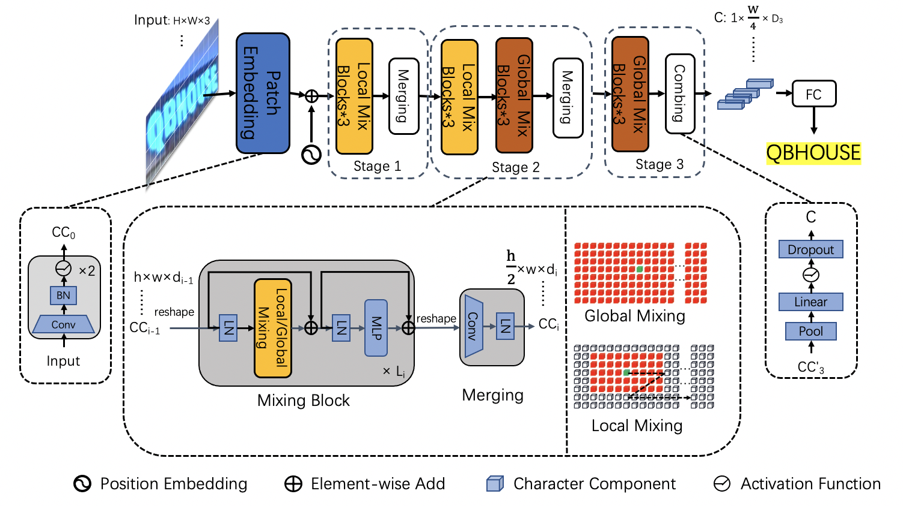
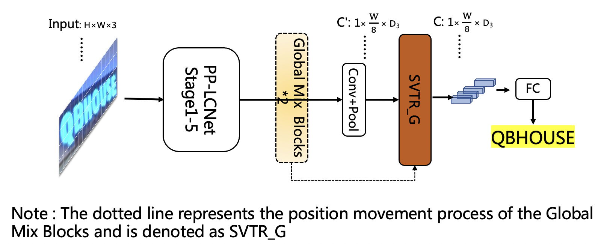
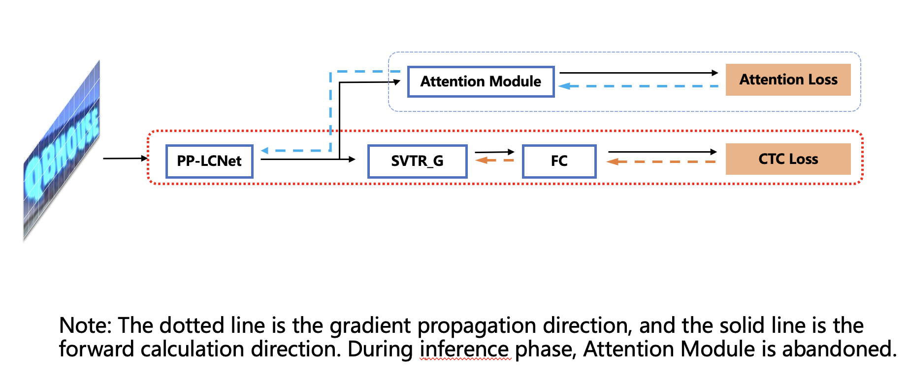

English | [简体中文](../doc_ch/PP-OCRv3_introduction.md)

# PP-OCRv3

- [1. Introduction](#1)
- [2. Optimization for Text Detection Model](#2)
- [3. Optimization for Text Recognition Model](#3)
- [4. End-to-end Evaluation](#4)

## 1. Introduction

PP-OCRv3 is further upgraded on the basis of PP-OCRv2. The overall framework of PP-OCRv3 is same as that of PP-OCRv2. The text detection model and text recognition model are further optimized, respectively. Specifically, the detection network is still optimized based on DBNet, and base model of recognition network is replaced from CRNN to [SVTR](https://arxiv.org/abs/2205.00159), which is recorded in IJCAI 2022. The block diagram of the PP-OCRv3 system is as follows (strategies in the pink box are newly introduced in PP-OCRv3):

    

There are 9 optimization strategies for text detection and recognition models in PP-OCRv3, which are as follows.

- Text detection:
    - LK-PAN: A PAN structure with large receptive field;
    - DML: Deep Mutual Learning strategy for teacher model;
    - RSE-FPN: A FPN structure with residual attention mechanism;

- Text recognition:
    - SVTR_LCNet: A Light-weight text recognition network;
    - GTC: Guided training of CTC by Attention;
    - TextConAug: A data augmentation strategy for mining textual context information;
    - TextRotNet: Self-supervised strategy for a better pretrained model;
    - UDML: Unified deep mutual learning strategy;
    - UIM: Unlabeled data mining strategy.

In terms of effect, when the speed is comparable, the accuracy of various scenes is greatly improved:

- In Chinese scenarios, PP-OCRv3 outperforms PP-OCRv2 by more than 5%.
- In English scenarios, PP-OCRv3 outperforms PP-OCRv2 by more than 11%.
- In multi-language scenarios, models for more than 80 languages are optimized, the average accuracy is increased by more than 5%.

## 2. Optimization for Text Detection Model

The PP-OCRv3 detection model upgrades the [CML](https://arxiv.org/pdf/2109.03144.pdf) (Collaborative Mutual Learning) distillation strategy proposed in PP-OCRv2. As shown in the figure below, the main idea of CML combines ① the traditional distillation strategy of Teacher guiding Student and ② the DML strategy, which allows the Students network to learn from each other. PP-OCRv3 further optimizes the effect of teacher model and student model respectively. For the Teacher model, a pan module with large receptive field named LK-PAN is proposed and the DML distillation strategy is adopted; for the student model, a FPN module with residual attention mechanism named RSE-FPN is proposed.

    

The ablation experiments are as follows:

|ID|Strategy|Model Size|Hmean|The Inference Time（cpu + mkldnn)|
|-|-|-|-|-|
|baseline teacher|PP-OCR server|49M|83.2%|171ms|
|baseline teacher|DB-R50|99M|83.5%|260ms|
|teacher1|DB-R50-LK-PAN|124M|85.0%|396ms|
|teacher2|DB-R50-LK-PAN-DML|124M|86.0%|396ms|
|baseline student|PP-OCRv2|3M|83.2%|117ms|
|student0|DB-MV3-RSE-FPN|3.6M|84.5%|124ms|
|student1|DB-MV3-CML（teacher2）|3M|84.3%|117ms|
|student2|DB-MV3-RSE-FPN-CML（teacher2）|3.6M|85.4%|124ms|

Testing environment: Intel Gold 6148 CPU, with MKLDNN acceleration enabled during inference.

**(1) LK-PAN: A PAN structure with large receptive field**

LK-PAN (Large Kernel PAN) is a lightweight [PAN](https://arxiv.org/pdf/1803.01534.pdf) structure with larger receptive field. The main idea is to change the convolution kernel size in the path augmentation of the PAN structure from `3*3` to `9*9`. By increasing the convolution kernel size, the receptive field of each position of the feature map is improved, making it easier to detect text in large fonts and text with extreme aspect ratios. Using LK-PAN, the hmean of the teacher model can be improved from 83.2% to 85.0%.

    

**(2) DML: Deep Mutual Learning Strategy for Teacher Model**

[DML](https://arxiv.org/abs/1706.00384)(Collaborative Mutual Learning), as shown in the figure below, can effectively improve the accuracy of the text detection model by learning from each other with two models with the same structure. The DML strategy is adopted in the teacher model training, and the hmean is increased from 85% to 86%. By updating the teacher model of CML in PP-OCRv2 to the above-mentioned higher-precision one, the hmean of the student model can be further improved from 83.2% to 84.3%.

    

**(3) RSE-FPN: A FPN structure with residual attention mechanism**

RSE-FPN (Residual Squeeze-and-Excitation FPN) is shown in the figure below. RSE-FPN introduces residual attention mechanism by replacing the convolutional layer in the FPN with RSEConv, to improve the representation ability of the feature map.

Considering that the features of some channels will be suppressed if the convolution layer in FPN is directly replaced with SEblock, as the number of FPN channels in the detection model of PP-OCRv2 is 96, which is very small. The introduction of residual structure in RSEConv can alleviate the above problems and improve the text detection effect. By updating the FPN structure of the student model of CML to RSE-FPN, the hmean of the student model can be further improved from 84.3% to 85.4%.

    

## 3. Optimization for Text Recognition Model

The recognition module of PP-OCRv3 is optimized based on the text recognition algorithm [SVTR](https://arxiv.org/abs/2205.00159). RNN is abandoned in SVTR, and the context information of the text line image is more effectively mined by introducing the Transformers structure, thereby improving the text recognition ability.

The recognition accuracy of SVTR_inty outperforms PP-OCRv2 recognition model by 5.3%, while the prediction speed nearly 11 times slower. It takes nearly 100ms to predict a text line on CPU. Therefore, as shown in the figure below, PP-OCRv3 adopts the following six optimization strategies to accelerate the recognition model.

    

Based on the above strategy, compared with PP-OCRv2, the PP-OCRv3 recognition model further improves the accuracy by 4.6% with comparable speed. The ablation experiments are as follows:

| ID | strategy |  Model size | accuracy | prediction speed（CPU + MKLDNN)|
|-----|-----|--------|----| --- |
| 01 | PP-OCRv2 | 8M | 74.8% | 8.54ms |
| 02 | SVTR_Tiny | 21M | 80.1% | 97ms |
| 03 | SVTR_LCNet(h32) | 12M | 71.9% | 6.6ms |
| 04 | SVTR_LCNet(h48) | 12M | 73.98% | 7.6ms |
| 05 | + GTC | 12M | 75.8% | 7.6ms |
| 06 | + TextConAug | 12M | 76.3% | 7.6ms |
| 07 | + TextRotNet | 12M | 76.9% | 7.6ms |
| 08 | + UDML | 12M | 78.4% | 7.6ms |
| 09 | + UIM | 12M | 79.4% | 7.6ms |

Note: When testing the speed, the input image shape of Experiment 01-03 is (3, 32, 320), and the input image shape of 04-08 is (3, 48, 320). In the actual prediction, the image is a variable-length input, and the speed will vary. Testing environment: Intel Gold 6148 CPU, with MKLDNN acceleration enabled during prediction.

**（1）SVTR_LCNet：Lightweight Text Recognition Network**

SVTR_LCNet is a lightweight text recognition network fused by Transformer-based network [SVTR](https://arxiv.org/abs/2205.00159) and lightweight CNN-based network [PP-LCNet](https://arxiv.org/abs/2109.15099). The prediction speed of SVTR_LCNet is 20% faster than that of PP-OCRv2 recognizer while the effect is slightly worse because the distillation strategy is not adopted. In addition, the height of the input image is further increased from 32 to 48, which makes the prediction speed slightly slower, but the model effect greatly improved. The recognition accuracy reaches 73.98% (+2.08%), which is close to the accuracy of PP-OCRv2 recognizer trained with the distillation strategy.

SVTR_Tiny network structure is as follows：

    

Due to the limited model structure supported by the MKLDNN acceleration library, SVTR is 10 times slower than PP-OCRv2 on CPU+MKLDNN. PP-OCRv3 expects to improve the accuracy of the model without bringing additional inference time. Through analysis, it is found that the main time-consuming module of SVTR_Tiny structure is Mixing Block, so we have carried out a series of optimizations to the structure of SVTR_Tiny (for detailed speed data, please refer to the ablation experiment table below):

1. Replace the first half of the SVTR network with the first three stages of PP-LCNet, retain 4 Global Mixing Blocks, the accuracy is 76%, and the speedup is 69%. The network structure is as follows:

    

2. Reduce the number of Global Mixing Blocks from 4 to 2, the accuracy is 72.9%, and the speedup is 69%. The network structure is as follows:

    

3. The experiment found that the prediction speed of the Global Mixing Block is related to the shape of the input features. Therefore, after moving the position of the Global Mixing Block to the back of pooling layer, the accuracy dropped to 71.9%, and the speed surpassed the PP-OCRv2-baseline based on the CNN structure by 22%. The network structure is as follows:

    

The ablation experiments are as follows:

| ID | strategy |  Model size | accuracy | prediction speed（CPU + MKLDNN)|
|-----|-----|--------|----| --- |
| 01 | PP-OCRv2-baseline | 8M | 69.3%  | 8.54ms |
| 02 | SVTR_Tiny | 21M | 80.1% | 97ms |
| 03 | SVTR_LCNet(G4) | 9.2M | 76% | 30ms |
| 04 | SVTR_LCNet(G2) | 13M | 72.98% | 9.37ms |
| 05 | SVTR_LCNet(h32) | 12M | 71.9% | 6.6ms |
| 06 | SVTR_LCNet(h48)  | 12M | 73.98% | 7.6ms |

Note: When testing the speed, the input image shape of 01-05 are all (3, 32, 320); PP-OCRv2-baseline represents the model trained without distillation method

**（2）GTC：Attention guides CTC training strategy**

[GTC](https://arxiv.org/pdf/2002.01276.pdf) (Guided Training of CTC), using the Attention module to guide the training of CTC to fuse multiple features is an effective strategy to improve text recognition accuracy. No more time-consuming is added in the inference process as the Attention module is completely removed during prediction. The accuracy of the recognition model is further improved to 75.8% (+1.82%). The training process is as follows:

    

**（3）TextConAug：Data Augmentation Strategy for Mining Text Context Information**

TextConAug is a data augmentation strategy for mining textual context information. The main idea comes from the paper [ConCLR](https://www.cse.cuhk.edu.hk/~byu/papers/C139-AAAI2022-ConCLR.pdf), in which the author proposes data augmentation strategy ConAug to concat 2 different images in a batch to form new images and perform self-supervised comparative learning. PP-OCRv3 applies this method to supervised learning tasks, and designs the TextConAug data augmentation method, which can enrich the context information of training data and improve the diversity of training data. Using this strategy, the accuracy of the recognition model is further improved to 76.3% (+0.5%). The schematic diagram of TextConAug is as follows:

    

**（4）TextRotNet：Self-Supervised Pre-trained Model**

TextRotNet is a pre-trained model trained with a large amount of unlabeled text line data in a self-supervised manner, refered to the paper [STR-Fewer-Labels](https://github.com/ku21fan/STR-Fewer-Labels). This model can initialize the weights of SVTR_LCNet, which helps the text recognition model to converge to a better position. Using this strategy, the accuracy of the recognition model is further improved to 76.9% (+0.6%). The TextRotNet training process is shown in the following figure:

    

**（5）UDML：Unified-Deep Mutual Learning**

UDML (Unified-Deep Mutual Learning) is a strategy proposed in PP-OCRv2 which is very effective to improve the model accuracy. In PP-OCRv3, for two different structures SVTR_LCNet and Attention, the feature map of PP-LCNet, the output of the SVTR module and the output of the Attention module between them are simultaneously supervised and trained. Using this strategy, the accuracy of the recognition model is further improved to 78.4% (+1.5%).

**（6）UIM：Unlabeled Images Mining**

UIM (Unlabeled Images Mining) is a very simple unlabeled data mining strategy. The main idea is to use a high-precision text recognition model to predict unlabeled images to obtain pseudo-labels, and select samples with high prediction confidence as training data for training lightweight models. Using this strategy, the accuracy of the recognition model is further improved to 79.4% (+1%).

    

## 4. End-to-end Evaluation

With the optimization strategies mentioned above, PP-OCRv3 outperforms PP-OCRv2 by 5% in terms of end-to-end Hmean for Chinese scenarios with comparable speed. The specific metrics are shown as follows.

| Model | Hmean |  Model Size (M) | Time Cost (CPU, ms) | Time Cost (T4 GPU, ms) |
|-----|-----|--------|----| --- |
| PP-OCR mobile | 50.3% | 8.1 | 356  | 116 |
| PP-OCR server | 57.0% | 155.1 | 1056 | 200 |
| PP-OCRv2 | 57.6% | 11.6 | 330 | 111 |
| PP-OCRv3 | 62.9% | 15.6 | 331 | 86.64 |

Testing environment:
- CPU: Intel Gold 6148, and MKLDNN acceleration is enabled during CPU inference.

In addition to Chinese scenarios, the recognition model for English is also optimized with an increasement of 11% for end-to-end Hmean, which is shown as follows.

| Model | Recall |  Precision | Hmean |
|-----|-----|--------|----|
| PP-OCR_en | 38.99% | 45.91% | 42.17%  |
| PP-OCRv3_en | 50.95% | 55.53% | 53.14% |

At the same time, recognition models for more than 80 language are also upgraded. The accuracy of the four language families with evaluation sets is increased by more than 5% on average, which is shown as follows.

| Model | Latin | Arabic | Japanese | Korean |
|-----|-----|--------|----| --- |
| PP-OCR_mul | 69.6% | 40.5% | 38.5% | 55.4% |
| PP-OCRv3_mul | 75.2% | 45.37% | 45.8% | 60.1% |
