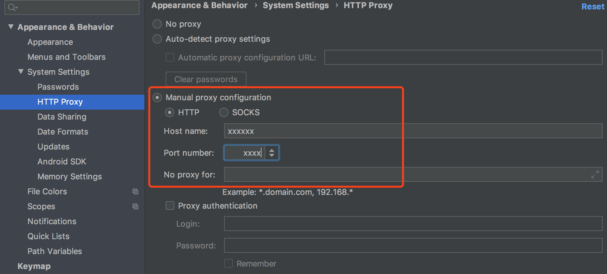
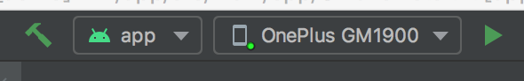
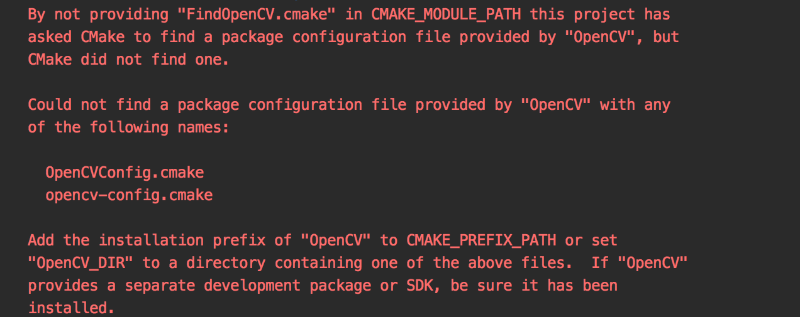

# Android Demo quick start

### 1. Install the latest version of Android Studio

It can be downloaded from https://developer.android.com/studio . This Demo is written by Android Studio version 4.0.

### 2. Create a new project

The NDK version 20b is used in the demo test, and the compilation can be successfully supported for version 20 and above.

If you are a beginner, you can install and test the NDK compilation environment in the following ways.

File -> New ->New Project  to create  "Native C++" project

1. Start a new Android Studio project

   Select Native C++ in the project template, select Paddle OCR/deploy/android_demo path
   After entering the project, it will be automatically compiled. The first compilation
   will take a long time. It is recommended to add an agent to speed up the download.

**Agent add:**

  Android Studio -> Perferences -> Appearance & Behavior -> System Settings -> HTTP Proxy -> Manual proxy configuration

2. Start compilation

Click the compile button, connect the phone, and follow the instructions of Android Studio to complete the operation.

When you see the following picture in Android Studio, the compilation is complete:

**Tip:** At this time, if the following error message that OpenCV cannot be found appears, please re-click compile,
exit the project after compiling, and enter again.

### 3. Send to mobile

Complete the compilation, click Run, and check the effect on the mobile phone.

### 4. How to customize the demo picture

1. Image storage path: android_demo/app/src/main/assets/images

   Place the custom picture under this path

2. Configuration file: android_demo/app/src/main/res/values/strings.xml

   Modify IMAGE_PATH_DEFAULT to a custom picture name

# Get more support

Go to [EasyEdge](https://ai.baidu.com/easyedge/app/open_source_demo?referrerUrl=paddlelite) to get more development support:

- Demo APP: You can use your mobile phone to scan the code to install, which is convenient for the mobile terminal to quickly experience text recognition

- SDK: The model is packaged to adapt to different chip hardware and operating system SDKs, including a complete interface to facilitate secondary development
