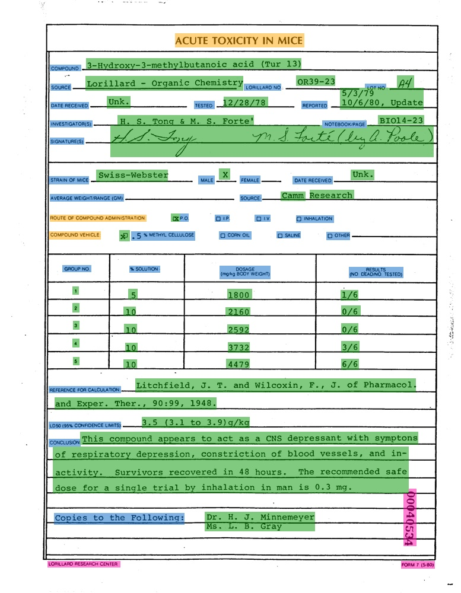
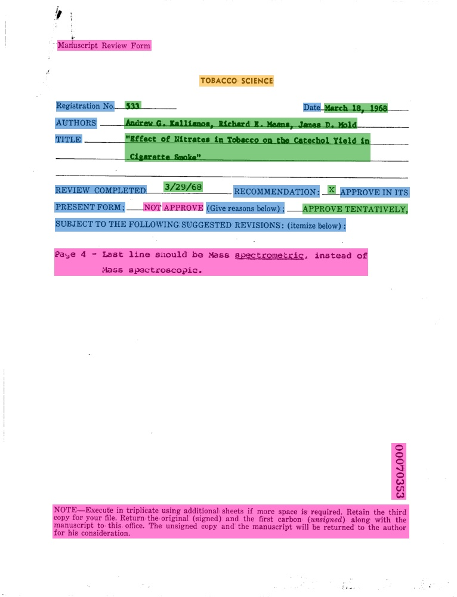
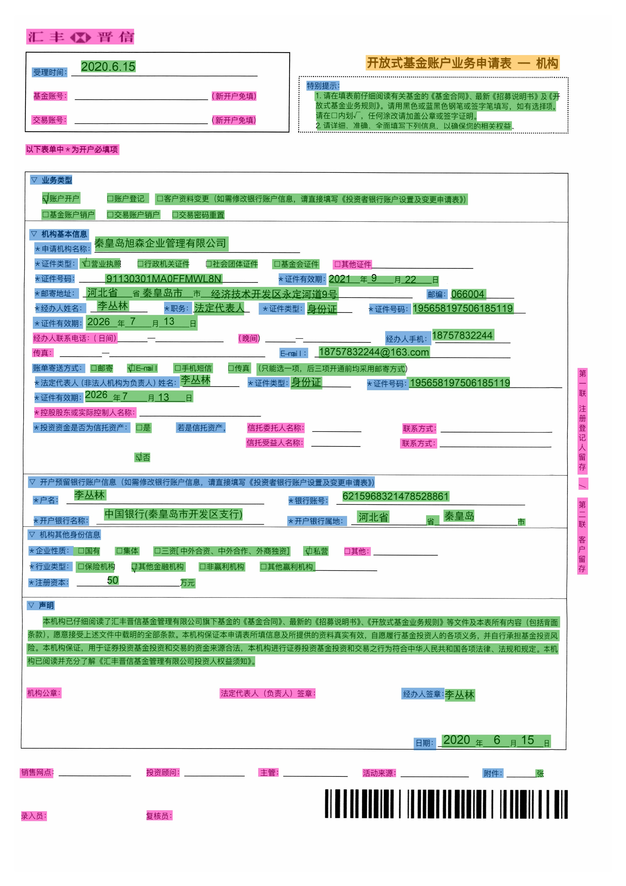

## DocVQA dataset
Here are the common DocVQA datasets, which are being updated continuously. Welcome to contribute datasets~
- [FUNSD dataset](#funsd)
- [XFUND dataset](#xfund)

#### 1. FUNSD dataset
- **Data source**: https://guillaumejaume.github.io/FUNSD/
- **Data Introduction**: The FUNSD dataset is a dataset for form comprehension. It contains 199 real, fully annotated scanned images, including market reports, advertisements, and academic reports, etc., and is divided into 149 50 training sets and 50 test sets. The FUNSD dataset is suitable for many types of DocVQA tasks, such as field-level entity classification, field-level entity connection, etc. Part of the image and the annotation box visualization are shown below:

    
    

    In the figure, the orange area represents `header`, the light blue area represents `question`, the green area represents `answer`, and the pink area represents `other`.

- **Download address**: https://guillaumejaume.github.io/FUNSD/download/

#### 2. XFUND dataset
- **Data source**: https://github.com/doc-analysis/XFUND
- **Data introduction**: XFUND is a multilingual form comprehension dataset, which contains form data in 7 different languages, and all are manually annotated in the form of key-value pairs. The data for each language contains 199 form data, which are divided into 149 training sets and 50 test sets. Part of the image and the annotation box visualization are shown below:

    
    

- **Download address**: https://github.com/doc-analysis/XFUND/releases/tag/v1.0
