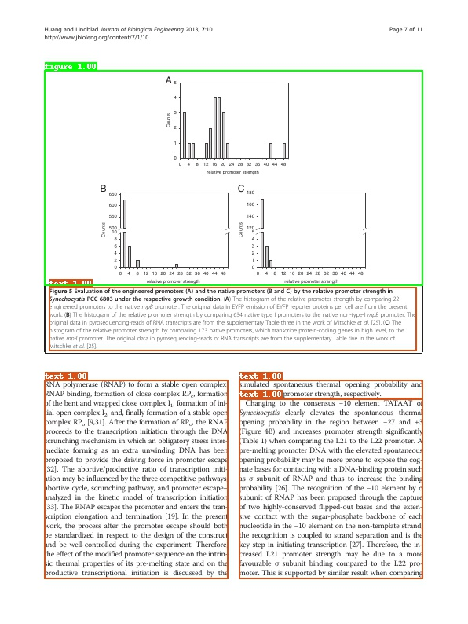
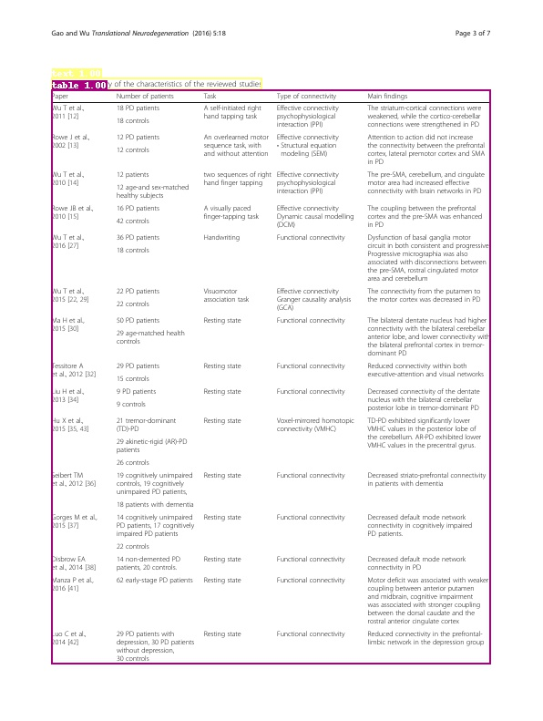
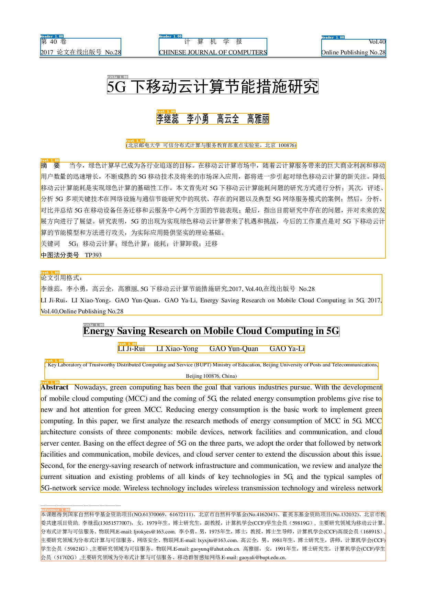
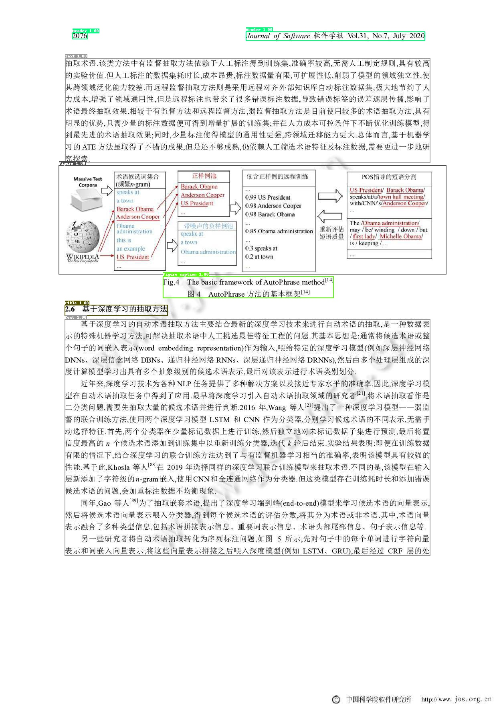
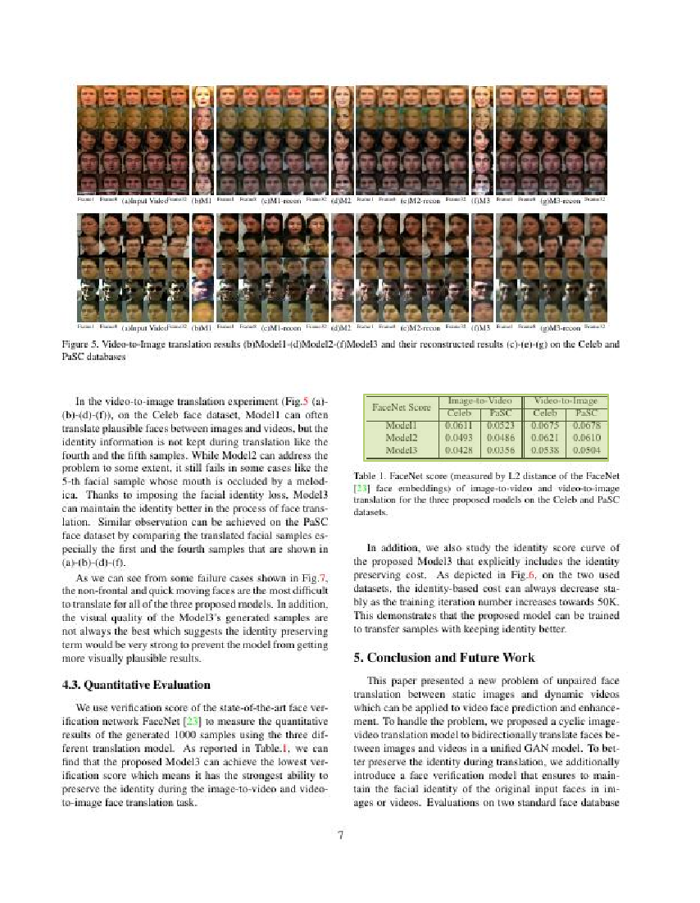
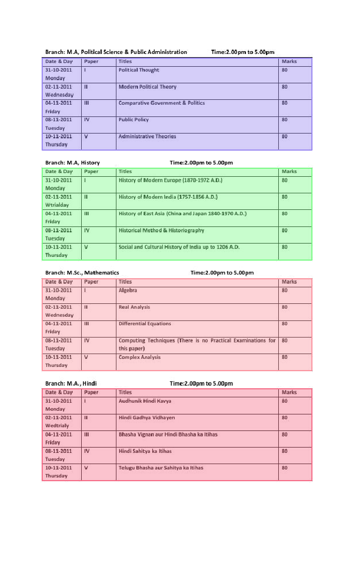

## Layout Analysis Dataset

Here are the common datasets of layout anlysis, which are being updated continuously. Welcome to contribute datasets.

- [PubLayNet dataset](#publaynet)
- [CDLA dataset](#CDLA)
- [TableBank dataset](#TableBank)

Most of the layout analysis datasets are object detection datasets. In addition to open source datasets, you can also label or synthesize datasets using tools such as [labelme](https://github.com/wkentaro/labelme) and so on.

#### 1. PubLayNet dataset

- **Data source**: https://github.com/ibm-aur-nlp/PubLayNet
- **Data introduction**: The PubLayNet dataset contains 350000 training images and 11000 validation images. There are 5 categories in total, namely: `text, title, list, table, figure`. Some images and their annotations as shown below.

    
    

- **Download address**: https://developer.ibm.com/exchanges/data/all/publaynet/
- **Note**: When using this dataset, you need to follow [CDLA-Permissive](https://cdla.io/permissive-1-0/) license.

#### 2、CDLA数据集
- **Data source**: https://github.com/buptlihang/CDLA
- **Data introduction**: CDLA dataset contains 5000 training images and 1000 validation images with 10 categories, which are `Text, Title, Figure, Figure caption, Table, Table caption, Header, Footer, Reference, Equation`. Some images and their annotations as shown below.

    
    

- **Download address**: https://github.com/buptlihang/CDLA
- **Note**: When you train detection model on CDLA dataset using [PaddleDetection](https://github.com/PaddlePaddle/PaddleDetection/tree/develop), you need to remove the label `__ignore__` and `_background_`.

#### 3、TableBank dataet
- **Data source**: https://doc-analysis.github.io/tablebank-page/index.html
- **Data introduction**: TableBank dataset contains 2 types of document: Latex (187199 training images, 7265 validation images and 5719 testing images) and Word (73383 training images 2735 validation images and 2281 testing images). Some images and their annotations as shown below.

    
    

- **Data source**: https://doc-analysis.github.io/tablebank-page/index.html
- **Note**: When using this dataset, you need to follow [Apache-2.0](https://github.com/doc-analysis/TableBank/blob/master/LICENSE) license.
