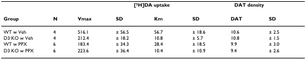
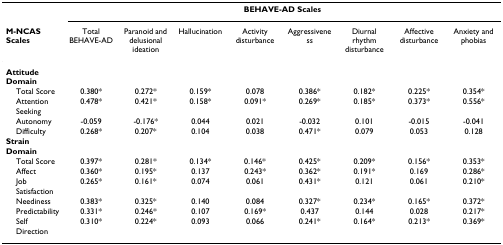

# Table Recognition Datasets

- [Dataset Summary](#dataset-summary)
- [1. PubTabNet](#1-pubtabnet)
- [2. TAL Table Recognition Competition Dataset](#2-tal-table-recognition-competition-dataset)

Here are the commonly used table recognition datasets, which are being updated continuously. Welcome to contribute datasets~

## Dataset Summary

| dataset | Image download link | PPOCR format annotation download link |
|---|---|---|
| PubTabNet |https://github.com/ibm-aur-nlp/PubTabNet| jsonl format, which can be loaded directly with [pubtab_dataset.py](../../../ppocr/data/pubtab_dataset.py) |
| TAL Table Recognition Competition Dataset |https://ai.100tal.com/dataset| jsonl format, which can be loaded directly with [pubtab_dataset.py](../../../ppocr/data/pubtab_dataset.py) |

## 1. PubTabNet
- **Data Introduction**：The training set of the PubTabNet dataset contains 500,000 images and the validation set contains 9000 images. Part of the image visualization is shown below.

    
    

- **illustrate**：When using this dataset, the [CDLA-Permissive](https://cdla.io/permissive-1-0/) protocol is required.

## 2. TAL Table Recognition Competition Dataset
- **Data Introduction**：The training set of the TAL table recognition competition dataset contains 16,000 images. The validation set does not give trainable annotations.

    
    

