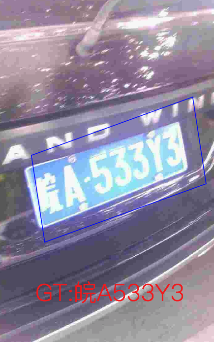
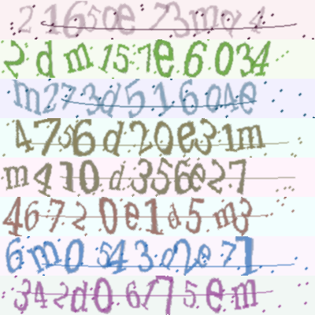

# Vertical multi-language OCR dataset
Here we have sorted out the commonly used vertical multi-language OCR dataset datasets, which are being updated continuously. We welcome you to contribute datasets ～
- [Chinese urban license plate dataset](#Chinese urban license plate dataset)
- [Bank credit card dataset](#Bank credit card dataset)
- [Captcha dataset-Captcha](#Captcha dataset-Captcha)
- [multi-language dataset](#multi-language dataset)

## Chinese urban license plate dataset

- **Data source**：[https://github.com/detectRecog/CCPD](https://github.com/detectRecog/CCPD)

- **Data introduction**: It contains more than 250000 vehicle license plate images and vehicle license plate detection and recognition information labeling. It contains the following license plate image information in different scenes.
    * CCPD-Base: General license plate picture
    * CCPD-DB: The brightness of license plate area is bright, dark or uneven
    * CCPD-FN: The license plate is farther or closer to the camera location
    * CCPD-Rotate: License plate includes rotation (horizontal 20\~50 degrees, vertical-10\~10 degrees)
    * CCPD-Tilt: License plate includes rotation (horizontal 15\~45 degrees, vertical 15\~45 degrees)
    * CCPD-Blur: The license plate contains blurring due to camera lens jitter
    * CCPD-Weather: The license plate is photographed on rainy, snowy or foggy days
    * CCPD-Challenge: So far, some of the most challenging images in license plate detection and recognition tasks
    * CCPD-NP: Pictures of new cars without license plates.

    

- **Download address**
    * Baidu cloud download address (extracted code is hm0U): [https://pan.baidu.com/s/1i5AOjAbtkwb17Zy-NQGqkw](https://pan.baidu.com/s/1i5AOjAbtkwb17Zy-NQGqkw)
    * Google drive download address:[https://drive.google.com/file/d/1rdEsCUcIUaYOVRkx5IMTRNA7PcGMmSgc/view](https://drive.google.com/file/d/1rdEsCUcIUaYOVRkx5IMTRNA7PcGMmSgc/view)

## Bank credit card dataset

- **Data source**: [https://www.kesci.com/home/dataset/5954cf1372ead054a5e25870](https://www.kesci.com/home/dataset/5954cf1372ead054a5e25870)

- **Data introduction**: There are three types of training data
    * 1.Sample card data of China Merchants Bank: including card image data and annotation data, a total of 618 pictures
    * 2.Single character data: including pictures and annotation data, 37 pictures in total.
    * 3.There are only other bank cards, no more detailed information, a total of 50 pictures.

    * The demo image is shown as follows. The annotation information is stored in excel, and the demo image below is marked as
        * Top 8 card number: 62257583
        * Card type: card of our bank
        * End of validity: 07/41
        * Chinese phonetic alphabet of card users: MICHAEL

    

- **Download address**: [https://cdn.kesci.com/cmb2017-2.zip](https://cdn.kesci.com/cmb2017-2.zip)

## Captcha dataset-Captcha

- **Data source**: [https://github.com/lepture/captcha](https://github.com/lepture/captcha)

- **Data introduction**: This is a toolkit for data synthesis. You can output captcha images according to the input text. Use the toolkit to generate several demo images as follows.

    

- **Download address**: The dataset is generated and has no download address.

## multi-language dataset(Multi-lingual scene text detection and recognition)

- **Data source**: [https://rrc.cvc.uab.es/?ch=15&com=downloads](https://rrc.cvc.uab.es/?ch=15&com=downloads)

- **Data introduction**: Multi language detection dataset MLT contains both language recognition and detection tasks.
    * In the detection task, the training set contains 10000 images in 10 languages, and each language contains 1000 training images. The test set contains 10000 images.
    * In the recognition task, the training set contains 111998 samples.

- **Download address**: The training set is large and can be downloaded in two parts. It can only be downloaded after registering on the website:
[https://rrc.cvc.uab.es/?ch=15&com=downloads](https://rrc.cvc.uab.es/?ch=15&com=downloads)
