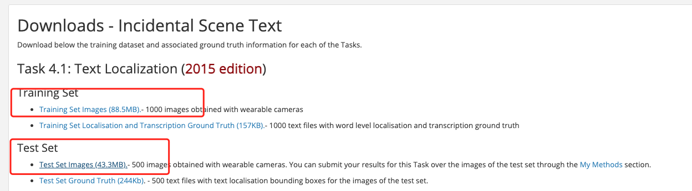

# Text Detection

This section uses the icdar2015 dataset as an example to introduce the training, evaluation, and testing of the detection model in PaddleOCR.

- [1. Data and Weights Preparation](#1-data-and-weights-preparatio)
  * [1.1 Data Preparation](#11-data-preparation)
  * [1.2 Download Pretrained Model](#12-download-pretrained-model)
- [2. Training](#2-training)
  * [2.1 Start Training](#21-start-training)
  * [2.2 Load Trained Model and Continue Training](#22-load-trained-model-and-continue-training)
  * [2.3 Training with New Backbone](#23-training-with-new-backbone)
- [3. Evaluation and Test](#3-evaluation-and-test)
  * [3.1 Evaluation](#31-evaluation)
  * [3.2 Test](#32-test)
- [4. Inference](#4-inference)
- [5. FAQ](#2-faq)

## 1. Data and Weights Preparation

### 1.1 Data Preparation

The icdar2015 dataset contains train set which has 1000 images obtained with wearable cameras and test set which has 500 images obtained with wearable cameras. The icdar2015 can be obtained from [official website](https://rrc.cvc.uab.es/?ch=4&com=downloads). Registration is required for downloading.


After registering and logging in, download the part marked in the red box in the figure below. And, the content downloaded by `Training Set Images` should be saved as the folder `icdar_c4_train_imgs`, and the content downloaded by `Test Set Images` is saved as the folder `ch4_test_images`

<p align="center">
 
<p align="center">

Decompress the downloaded dataset to the working directory, assuming it is decompressed under PaddleOCR/train_data/. In addition, PaddleOCR organizes many scattered annotation files into two separate annotation files for train and test respectively, which can be downloaded by wget:
```shell
# Under the PaddleOCR path
cd PaddleOCR/
wget -P ./train_data/  https://paddleocr.bj.bcebos.com/dataset/train_icdar2015_label.txt
wget -P ./train_data/  https://paddleocr.bj.bcebos.com/dataset/test_icdar2015_label.txt
```

After decompressing the data set and downloading the annotation file, PaddleOCR/train_data/ has two folders and two files, which are:
```
/PaddleOCR/train_data/icdar2015/text_localization/
  └─ icdar_c4_train_imgs/         Training data of icdar dataset
  └─ ch4_test_images/             Testing data of icdar dataset
  └─ train_icdar2015_label.txt    Training annotation of icdar dataset
  └─ test_icdar2015_label.txt     Test annotation of icdar dataset
```

The provided annotation file format is as follow, seperated by "\t":
```
" Image file name             Image annotation information encoded by json.dumps"
ch4_test_images/img_61.jpg    [{"transcription": "MASA", "points": [[310, 104], [416, 141], [418, 216], [312, 179]]}, {...}]
```
The image annotation after **json.dumps()** encoding is a list containing multiple dictionaries.

The `points` in the dictionary represent the coordinates (x, y) of the four points of the text box, arranged clockwise from the point at the upper left corner.

`transcription` represents the text of the current text box. **When its content is "###" it means that the text box is invalid and will be skipped during training.**

If you want to train PaddleOCR on other datasets, please build the annotation file according to the above format.


### 1.2 Download Pretrained Model

First download the pretrained model. The detection model of PaddleOCR currently supports 3 backbones, namely MobileNetV3, ResNet18_vd and ResNet50_vd. You can use the model in [PaddleClas](https://github.com/PaddlePaddle/PaddleClas/tree/release/2.0/ppcls/modeling/architectures) to replace backbone according to your needs.
And the responding download link of backbone pretrain weights can be found in (https://github.com/PaddlePaddle/PaddleClas/blob/release%2F2.0/README_cn.md#resnet%E5%8F%8A%E5%85%B6vd%E7%B3%BB%E5%88%97).

```shell
cd PaddleOCR/
# Download the pre-trained model of MobileNetV3
wget -P ./pretrain_models/ https://paddleocr.bj.bcebos.com/pretrained/MobileNetV3_large_x0_5_pretrained.pdparams
# or, download the pre-trained model of ResNet18_vd
wget -P ./pretrain_models/ https://paddleocr.bj.bcebos.com/pretrained/ResNet18_vd_pretrained.pdparams
# or, download the pre-trained model of ResNet50_vd
wget -P ./pretrain_models/ https://paddleocr.bj.bcebos.com/pretrained/ResNet50_vd_ssld_pretrained.pdparams

```

## 2. Training

### 2.1 Start Training

*If CPU version installed, please set the parameter `use_gpu` to `false` in the configuration.*
```shell
python3 tools/train.py -c configs/det/det_mv3_db.yml  \
         -o Global.pretrained_model=./pretrain_models/MobileNetV3_large_x0_5_pretrained
```

In the above instruction, use `-c` to select the training to use the `configs/det/det_db_mv3.yml` configuration file.
For a detailed explanation of the configuration file, please refer to [config](./config_en.md).

You can also use `-o` to change the training parameters without modifying the yml file. For example, adjust the training learning rate to 0.0001
```shell
# single GPU training
python3 tools/train.py -c configs/det/det_mv3_db.yml -o   \
         Global.pretrained_model=./pretrain_models/MobileNetV3_large_x0_5_pretrained  \
         Optimizer.base_lr=0.0001

# multi-GPU training
# Set the GPU ID used by the '--gpus' parameter.
python3 -m paddle.distributed.launch --gpus '0,1,2,3'  tools/train.py -c configs/det/det_mv3_db.yml -o Global.pretrained_model=./pretrain_models/MobileNetV3_large_x0_5_pretrained

# multi-Node, multi-GPU training
# Set the IPs of your nodes used by the '--ips' parameter. Set the GPU ID used by the '--gpus' parameter.
python3 -m paddle.distributed.launch --ips="xx.xx.xx.xx,xx.xx.xx.xx" --gpus '0,1,2,3' tools/train.py -c configs/det/det_mv3_db.yml \
     -o Global.pretrained_model=./pretrain_models/MobileNetV3_large_x0_5_pretrained
```
**Note:** For multi-Node multi-GPU training, you need to replace the `ips` value in the preceding command with the address of your machine, and the machines must be able to ping each other. In addition, it requires activating commands separately on multiple machines when we start the training. The command for viewing the IP address of the machine is `ifconfig`.

If you want to further speed up the training, you can use [automatic mixed precision training](https://www.paddlepaddle.org.cn/documentation/docs/zh/guides/01_paddle2.0_introduction/basic_concept/amp_en.html). for single card training, the command is as follows:
```
python3 tools/train.py -c configs/det/det_mv3_db.yml \
     -o Global.pretrained_model=./pretrain_models/MobileNetV3_large_x0_5_pretrained \
     Global.use_amp=True Global.scale_loss=1024.0 Global.use_dynamic_loss_scaling=True
```

### 2.2 Load Trained Model and Continue Training
If you expect to load trained model and continue the training again, you can specify the parameter `Global.checkpoints` as the model path to be loaded.

For example:
```shell
python3 tools/train.py -c configs/det/det_mv3_db.yml -o Global.checkpoints=./your/trained/model
```

**Note**: The priority of `Global.checkpoints` is higher than that of `Global.pretrained_model`, that is, when two parameters are specified at the same time, the model specified by `Global.checkpoints` will be loaded first. If the model path specified by `Global.checkpoints` is wrong, the one specified by `Global.pretrained_model` will be loaded.


### 2.3 Training with New Backbone

The network part completes the construction of the network, and PaddleOCR divides the network into four parts, which are under [ppocr/modeling](../../ppocr/modeling). The data entering the network will pass through these four parts in sequence(transforms->backbones->
necks->heads).

```bash
├── architectures # Code for building network
├── transforms    # Image Transformation Module
├── backbones     # Feature extraction module
├── necks         # Feature enhancement module
└── heads         # Output module
```

If the Backbone to be replaced has a corresponding implementation in PaddleOCR, you can directly modify the parameters in the `Backbone` part of the configuration yml file.

However, if you want to use a new Backbone, an example of replacing the backbones is as follows:

1. Create a new file under the [ppocr/modeling/backbones](../../ppocr/modeling/backbones) folder, such as my_backbone.py.
2. Add code in the my_backbone.py file, the sample code is as follows:

```python
import paddle
import paddle.nn as nn
import paddle.nn.functional as F


class MyBackbone(nn.Layer):
    def __init__(self, *args, **kwargs):
        super(MyBackbone, self).__init__()
        # your init code
        self.conv = nn.xxxx

    def forward(self, inputs):
        # your network forward
        y = self.conv(inputs)
        return y
```

3. Import the added module in the [ppocr/modeling/backbones/\__init\__.py](../../ppocr/modeling/backbones/__init__.py) file.

After adding the four-part modules of the network, you only need to configure them in the configuration file to use, such as:

```yaml
  Backbone:
    name: MyBackbone
    args1: args1
```

**NOTE**: More details about replace Backbone and other mudule can be found in [doc](add_new_algorithm_en.md).

## 3. Evaluation and Test

### 3.1 Evaluation

PaddleOCR calculates three indicators for evaluating performance of OCR detection task: Precision, Recall, and Hmean(F-Score).

Run the following code to calculate the evaluation indicators. The result will be saved in the test result file specified by `save_res_path` in the configuration file `det_db_mv3.yml`

When evaluating, set post-processing parameters `box_thresh=0.6`, `unclip_ratio=1.5`. If you use different datasets, different models for training, these two parameters should be adjusted for better result.

The model parameters during training are saved in the `Global.save_model_dir` directory by default. When evaluating indicators, you need to set `Global.checkpoints` to point to the saved parameter file.
```shell
python3 tools/eval.py -c configs/det/det_mv3_db.yml  -o Global.checkpoints="{path/to/weights}/best_accuracy" PostProcess.box_thresh=0.6 PostProcess.unclip_ratio=1.5
```

* Note: `box_thresh` and `unclip_ratio` are parameters required for DB post-processing, and not need to be set when evaluating the EAST and SAST model.

### 3.2 Test

Test the detection result on a single image:
```shell
python3 tools/infer_det.py -c configs/det/det_mv3_db.yml -o Global.infer_img="./doc/imgs_en/img_10.jpg" Global.pretrained_model="./output/det_db/best_accuracy"
```

When testing the DB model, adjust the post-processing threshold:
```shell
python3 tools/infer_det.py -c configs/det/det_mv3_db.yml -o Global.infer_img="./doc/imgs_en/img_10.jpg" Global.pretrained_model="./output/det_db/best_accuracy"  PostProcess.box_thresh=0.6 PostProcess.unclip_ratio=2.0
```


Test the detection result on all images in the folder:
```shell
python3 tools/infer_det.py -c configs/det/det_mv3_db.yml -o Global.infer_img="./doc/imgs_en/" Global.pretrained_model="./output/det_db/best_accuracy"
```

## 4. Inference

The inference model (the model saved by `paddle.jit.save`) is generally a solidified model saved after the model training is completed, and is mostly used to give prediction in deployment.

The model saved during the training process is the checkpoints model, which saves the parameters of the model and is mostly used to resume training.

Compared with the checkpoints model, the inference model will additionally save the structural information of the model. Therefore, it is easier to deploy because the model structure and model parameters are already solidified in the inference model file, and is suitable for integration with actual systems.

Firstly, we can convert DB trained model to inference model:
```shell
python3 tools/export_model.py -c configs/det/det_mv3_db.yml -o Global.pretrained_model="./output/det_db/best_accuracy" Global.save_inference_dir="./output/det_db_inference/"
```

The detection inference model prediction：
```shell
python3 tools/infer/predict_det.py --det_algorithm="DB" --det_model_dir="./output/det_db_inference/" --image_dir="./doc/imgs/" --use_gpu=True
```

If it is other detection algorithms, such as the EAST, the det_algorithm parameter needs to be modified to EAST, and the default is the DB algorithm:
```shell
python3 tools/infer/predict_det.py --det_algorithm="EAST" --det_model_dir="./output/det_db_inference/" --image_dir="./doc/imgs/" --use_gpu=True
```

## 5. FAQ

Q1: The prediction results of trained model and inference model are inconsistent?

**A**: Most of the problems are caused by the inconsistency of the pre-processing and post-processing parameters during the prediction of the trained model and the pre-processing and post-processing parameters during the prediction of the inference model. Taking the model trained by the det_mv3_db.yml configuration file as an example, the solution to the problem of inconsistent prediction results between the training model and the inference model is as follows:
- Check whether the [trained model preprocessing](https://github.com/PaddlePaddle/PaddleOCR/blob/c1ed243fb68d5d466258243092e56cbae32e2c14/configs/det/det_mv3_db.yml#L116) is consistent with the prediction [preprocessing function of the inference model](https://github.com/PaddlePaddle/PaddleOCR/blob/c1ed243fb68d5d466258243092e56cbae32e2c14/tools/infer/predict_det.py#L42). When the algorithm is evaluated, the input image size will affect the accuracy. In order to be consistent with the paper, the image is resized to [736, 1280] in the training icdar15 configuration file, but there is only a set of default parameters when the inference model predicts, which will be considered To predict the speed problem, the longest side of the image is limited to 960 for resize by default. The preprocessing function of the training model preprocessing and the inference model is located in [ppocr/data/imaug/operators.py](https://github.com/PaddlePaddle/PaddleOCR/blob/c1ed243fb68d5d466258243092e56cbae32e2c14/ppocr/data/imaug/operators.py#L147)
- Check whether the [post-processing of the trained model](https://github.com/PaddlePaddle/PaddleOCR/blob/c1ed243fb68d5d466258243092e56cbae32e2c14/configs/det/det_mv3_db.yml#L51) is consistent with the [post-processing parameters of the inference](https://github.com/PaddlePaddle/PaddleOCR/blob/c1ed243fb68d5d466258243092e56cbae32e2c14/tools/infer/utility.py#L50).
