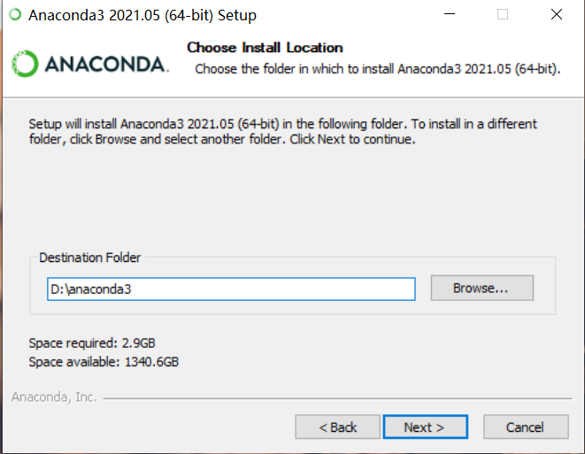
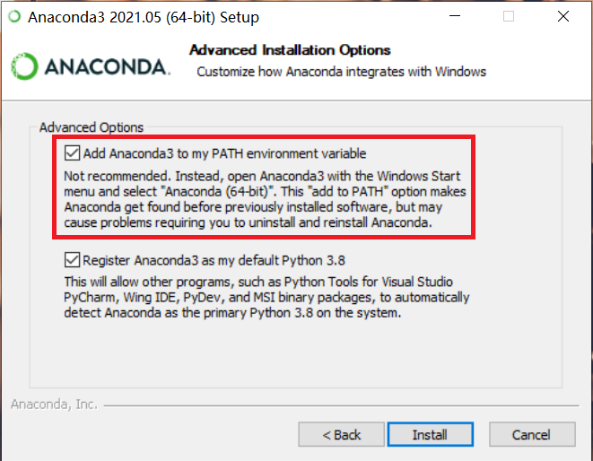
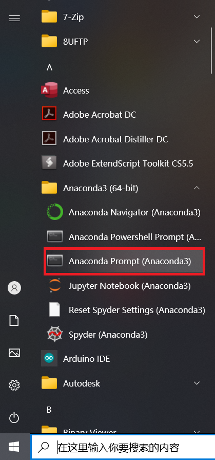
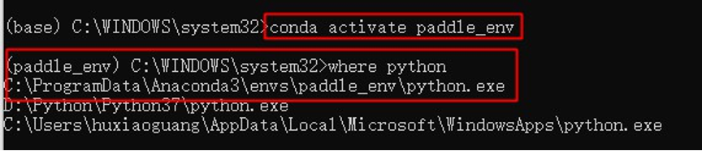
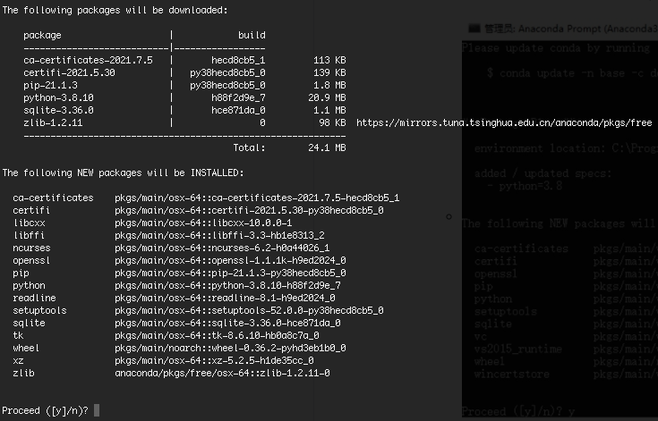
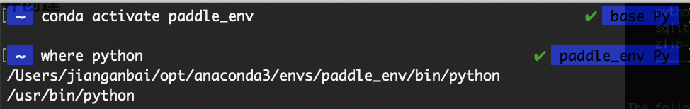
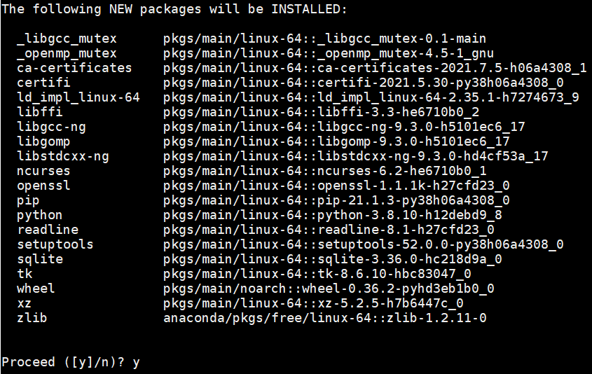

# Environment Preparation

Windows and Mac users are recommended to use Anaconda to build a Python environment, and Linux users are recommended to use docker to build a Python environment. 

Recommended working environment:
- PaddlePaddle >= 2.1.2
- Python 3.7
- CUDA 10.1 / CUDA 10.2
- cuDNN 7.6

> If you already have a Python environment installed, you can skip to [PaddleOCR Quick Start](./quickstart_en.md).

* [1. Python Environment Setup](#1)
  + [1.1 Windows](#1.1)
  + [1.2 Mac](#1.2)
  + [1.3 Linux](#1.3)


<a name="1"></a>

## 1. Python Environment Setup

<a name="1.1"></a>

### 1.1 Windows

#### 1.1.1 Install Anaconda

- Note: To use PaddlePaddle you need to install python environment first, here we choose python integrated environment Anaconda toolkit

  - Anaconda is a common python package manager
  - After installing Anaconda, you can install the python environment, as well as numpy and other required toolkit environment.

- Anaconda download.

  - Address: https://mirrors.tuna.tsinghua.edu.cn/anaconda/archive/?C=M&O=D

  - Most Win10 computers are 64-bit operating systems, choose x86_64 version; if the computer is a 32-bit operating system, choose x86.exe

    

  - After the download is complete, double-click the installer to enter the graphical interface

  - The default installation location is C drive, it is recommended to change the installation location to D drive.

    

  - Check Conda to add environment variables and ignore the warning that

    


#### 1.1.2 Opening the terminal and creating the Conda environment

- Open Anaconda Prompt terminal: bottom left Windows Start Menu -> Anaconda3 -> Anaconda Prompt start console

  


- Create a new Conda environment

  ```shell
  # Enter the following command at the command line to create an environment named paddle_env
  # Here to speed up the download, use the Tsinghua source
  conda create --name paddle_env python=3.8 --channel https://mirrors.tuna.tsinghua.edu.cn/anaconda/pkgs/free/ # This is a one line command
  ```

  This command will create an executable environment named paddle_env with python version 3.8, which will take a while depending on the network status

  The command line will then output a prompt, type y and enter to continue the installation

  

- To activate the Conda environment you just created, enter the following command at the command line.

  ```shell
  # Activate the paddle_env environment
  conda activate paddle_env
  # View the current location of python
  where python
  ```

  

The above anaconda environment and python environment are installed


<a name="1.2"></a>

### 1.2 Mac

#### 1.2.1 Installing Anaconda

- Note: To use PaddlePaddle you need to install the python environment first, here we choose the python integrated environment Anaconda toolkit

  - Anaconda is a common python package manager
  - After installing Anaconda, you can install the python environment, as well as numpy and other required toolkit environment

- Anaconda download:.

  - Address: https://mirrors.tuna.tsinghua.edu.cn/anaconda/archive/?C=M&O=D

  

  - Select `Anaconda3-2021.05-MacOSX-x86_64.pkg` at the bottom to download

- After downloading, double click on the .pkg file to enter the graphical interface

  - Just follow the default settings, it will take a while to install

- It is recommended to install a code editor such as VSCode or PyCharm

#### 1.2.2 Open a terminal and create a Conda environment

- Open the terminal

  - Press command and spacebar at the same time, type "terminal" in the focus search, double click to enter terminal

- **Add Conda to the environment variables**

  - Environment variables are added so that the system can recognize the Conda command

  - Open `~/.bash_profile` in the terminal by typing the following command.

    ```shell
    vim ~/.bash_profile
    ```

  - Add Conda as an environment variable in `~/.bash_profile`.

    ```shell
    # Press i first to enter edit mode
    # In the first line type.
    export PATH="~/opt/anaconda3/bin:$PATH"
    # If you customized the installation location during installation, change ~/opt/anaconda3/bin to the bin folder in the customized installation directory
    ```

    ```shell
    # The modified ~/.bash_profile file should look like this (where xxx is the username)
    export PATH="~/opt/anaconda3/bin:$PATH"
    # >>> conda initialize >>>
    # !!! Contents within this block are managed by 'conda init' !!!
    __conda_setup="$('/Users/xxx/opt/anaconda3/bin/conda' 'shell.bash' 'hook' 2> /dev/null)"
    if [ $? -eq 0 ]; then
            eval "$__conda_setup"
    else
            if [ -f "/Users/xxx/opt/anaconda3/etc/profile.d/conda.sh" ]; then
                    . "/Users/xxx/opt/anaconda3/etc/profile.d/conda.sh"
            else
                    export PATH="/Users/xxx/opt/anaconda3/bin:$PATH"
            fi
    fi
    unset __conda_setup
    # <<< conda initialize <<<
    ```

    - When you are done, press `esc` to exit edit mode, then type `:wq!` and enter to save and exit

  - Verify that the Conda command is recognized.

    - Enter `source ~/.bash_profile` in the terminal to update the environment variables
    - Enter `conda info --envs` in the terminal again, if it shows that there is a base environment, then Conda has been added to the environment variables

- Create a new Conda environment

  ```shell
  # Enter the following command at the command line to create an environment called paddle_env
  # Here to speed up the download, use Tsinghua source
  conda create --name paddle_env python=3.8 --channel https://mirrors.tuna.tsinghua.edu.cn/anaconda/pkgs/free/
  ```

  - This command will create an executable environment named paddle_env with python version 3.8, which will take a while depending on the network status

  - The command line will then output a prompt, type y and enter to continue the installation

    - 

- To activate the Conda environment you just created, enter the following command at the command line.

  ```shell
  # Activate the paddle_env environment
  conda activate paddle_env
  # View the current location of python
  where python
  ```

  

The above anaconda environment and python environment are installed

<a name="1.3"></a>


### 1.3 Linux

Linux users can choose to run either Anaconda or Docker. If you are familiar with Docker and need to train the PaddleOCR model, it is recommended to use the Docker environment, where the development process of PaddleOCR is run. If you are not familiar with Docker, you can also use Anaconda to run the project.

#### 1.3.1 Anaconda environment configuration

- Note: To use PaddlePaddle you need to install the python environment first, here we choose the python integrated environment Anaconda toolkit

  - Anaconda is a common python package manager
  - After installing Anaconda, you can install the python environment, as well as numpy and other required toolkit environment

- **Download Anaconda**.

  - Download at: https://mirrors.tuna.tsinghua.edu.cn/anaconda/archive/?C=M&O=D


  


  - Select the appropriate version for your operating system
      - Type `uname -m` in the terminal to check the command set used by your system

  - Download method 1: Download locally, then transfer the installation package to the Linux server

  - Download method 2: Directly use Linux command line to download

    ```shell
    # First install wget
    sudo apt-get install wget # Ubuntu
    sudo yum install wget # CentOS
    ```
    ```bash
    # Then use wget to download from Tsinghua source
    # If you want to download Anaconda3-2021.05-Linux-x86_64.sh, the download command is as follows
    wget https://mirrors.tuna.tsinghua.edu.cn/anaconda/archive/Anaconda3-2021.05-Linux-x86_64.sh
    # If you want to download another version, you need to change the file name after the last 1 / to the version you want to download
    ```

- To install Anaconda.

  - Type `sh Anaconda3-2021.05-Linux-x86_64.sh` at the command line
    - If you downloaded a different version, replace the file name of the command with the name of the file you downloaded
  - Just follow the installation instructions
    - You can exit by typing q when viewing the license

- **Add conda to the environment variables**

  - If you have already added conda to the environment variable path during the installation, you can skip this step

  - Open `~/.bashrc` in a terminal.

    ```shell
    # Enter the following command in the terminal.
    vim ~/.bashrc
    ```

  - Add conda as an environment variable in `~/.bashrc`.

    ```shell
    # Press i first to enter edit mode # In the first line enter.
    export PATH="~/anaconda3/bin:$PATH"
    # If you customized the installation location during installation, change ~/anaconda3/bin to the bin folder in the customized installation directory
    ```

     ```shell
    # The modified ~/.bash_profile file should look like this (where xxx is the username)
    export PATH="~/opt/anaconda3/bin:$PATH"
    # >>> conda initialize >>>
    # !!! Contents within this block are managed by 'conda init' !!!
    __conda_setup="$('/Users/xxx/opt/anaconda3/bin/conda' 'shell.bash' 'hook' 2> /dev/null)"
    if [ $? -eq 0 ]; then
        eval "$__conda_setup"
    else
        if [ -f "/Users/xxx/opt/anaconda3/etc/profile.d/conda.sh" ]; then
            . "/Users/xxx/opt/anaconda3/etc/profile.d/conda.sh"
        else
            export PATH="/Users/xxx/opt/anaconda3/bin:$PATH"
        fi
    fi
    unset __conda_setup
    # <<< conda initialize <<<
     ```

    - When you are done, press `esc` to exit edit mode, then type `:wq!` and enter to save and exit

  - Verify that the Conda command is recognized.

    - Enter `source ~/.bash_profile` in the terminal to update the environment variables
    - Enter `conda info --envs` in the terminal again, if it shows that there is a base environment, then Conda has been added to the environment variables

- Create a new Conda environment

  ```shell
  # Enter the following command at the command line to create an environment called paddle_env
  # Here to speed up the download, use Tsinghua source
  conda create --name paddle_env python=3.8 --channel https://mirrors.tuna.tsinghua.edu.cn/anaconda/pkgs/free/
  ```

  - This command will create an executable environment named paddle_env with python version 3.8, which will take a while depending on the network status

  - The command line will then output a prompt, type y and enter to continue the installation

    

- To activate the Conda environment you just created, enter the following command at the command line.

  ```shell
  # Activate the paddle_env environment
  conda activate paddle_env
  ```

The above anaconda environment and python environment are installed


#### 1.3.2 Docker environment preparation

**The first time you use this docker image, it will be downloaded automatically. Please be patient.**

```bash
# Switch to the working directory
cd /home/Projects
# You need to create a docker container for the first run, and do not need to run the current command when you run it again
# Create a docker container named ppocr and map the current directory to the /paddle directory of the container

# If using CPU, use docker instead of nvidia-docker to create docker
sudo docker run --name ppocr -v $PWD:/paddle --network=host -it  registry.baidubce.com/paddlepaddle/paddle:2.1.3-gpu-cuda10.2-cudnn7  /bin/bash

# If using GPU, use nvidia-docker to create docker
# docker image registry.baidubce.com/paddlepaddle/paddle:2.1.3-gpu-cuda11.2-cudnn8 is recommended for CUDA11.2 + CUDNN8.
sudo nvidia-docker run --name ppocr -v $PWD:/paddle --shm-size=64G --network=host -it registry.baidubce.com/paddlepaddle/paddle:2.1.3-gpu-cuda10.2-cudnn7 /bin/bash

```
You can also visit [DockerHub](https://hub.docker.com/r/paddlepaddle/paddle/tags/) to get the image that fits your machine.

```
# ctrl+P+Q to exit docker, to re-enter docker using the following command:
sudo docker container exec -it ppocr /bin/bash
```
