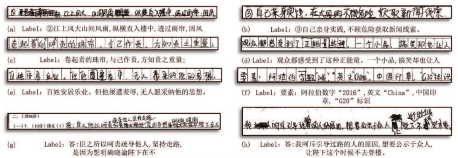
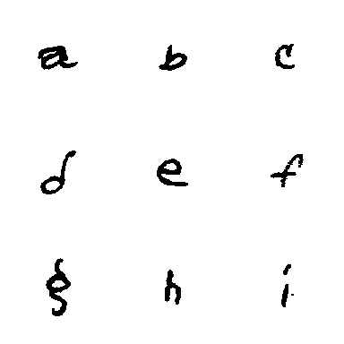

# Handwritten OCR dataset
Here we have sorted out the commonly used handwritten OCR dataset datasets, which are being updated continuously. We welcome you to contribute datasets ~
- [Institute of automation, Chinese Academy of Sciences - handwritten Chinese dataset](#Institute of automation, Chinese Academy of Sciences - handwritten Chinese dataset)
- [South China University of Technology - handwritten Chinese dataset](#South China University of Technology - handwritten Chinese dataset)
- [NIST handwritten single character dataset - English](#NIST handwritten single character dataset - English)

## Institute of automation, Chinese Academy of Sciences - handwritten Chinese dataset
- **Data source**:http://www.nlpr.ia.ac.cn/databases/handwriting/Download.html

- **Data introduction**:
    
* It includes online and offline handwritten data,`HWDB1.0~1.2` has totally 3895135 handwritten single character samples, which belong to 7356 categories (7185 Chinese characters and 171 English letters, numbers and symbols);`HWDB2.0~2.2` has totally 5091 pages of images, which are divided into 52230 text lines and 1349414 words. All text and text samples are stored as grayscale images. Some sample words are shown below.
    
    
    
- **Download address**:http://www.nlpr.ia.ac.cn/databases/handwriting/Download.html

-  **Recommended**:Data for single character, white background, can form a large number of text lines for training. White background can be processed into transparent state, which is convenient to add various backgrounds. For the case of semantic needs, it is suggested to extract single character from real corpus to form text lines.

## South China University of Technology - handwritten Chinese dataset

- **Data source**:https://github.com/HCIILAB/SCUT-EPT_Dataset_Release

- **Data introduction**:

  * The SCUT-EPT Dataset contains 50,000 text line images, selected from examination papers of 2,986 volunteers.  There are totally 4,250 classes in SCUT-EPT dataset, including 4,033 commonly used Chinese characters, 104 symbols, and 113 outlier Chinese characters, where outlier Chinese character means that the Chinese character is outside the character set of the popular CASIA-HWDB1.0-1.2. The total character samples in the SCUT-EPT dataset is 1,267,161, with approximately 25 characters each text line.

    

- **Download address**: [https://pan.baidu.com/s/1h4d1ogn_MAnE_X0LNHowYg](https://pan.baidu.com/s/1h4d1ogn_MAnE_X0LNHowYg)
  * If the link fails or get the unzip password, please check it on the [GitHub Project](https://github.com/HCIILAB/SCUT-EPT_Dataset_Release)

## NIST handwritten single character dataset - English(NIST Handprinted Forms and Characters Database)

- **Data source**: [https://www.nist.gov/srd/nist-special-database-19](https://www.nist.gov/srd/nist-special-database-19)

- **Data introduction**: NIST19 dataset is suitable for handwritten document and character recognition model training. It is extracted from the handwritten sample form of 3600 authors and contains 810000 character images in total. Nine of them are shown below.

    

- **Download address**: [https://www.nist.gov/srd/nist-special-database-19](https://www.nist.gov/srd/nist-special-database-19)
