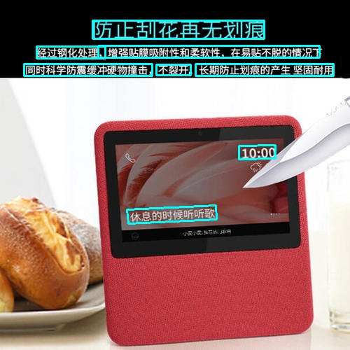
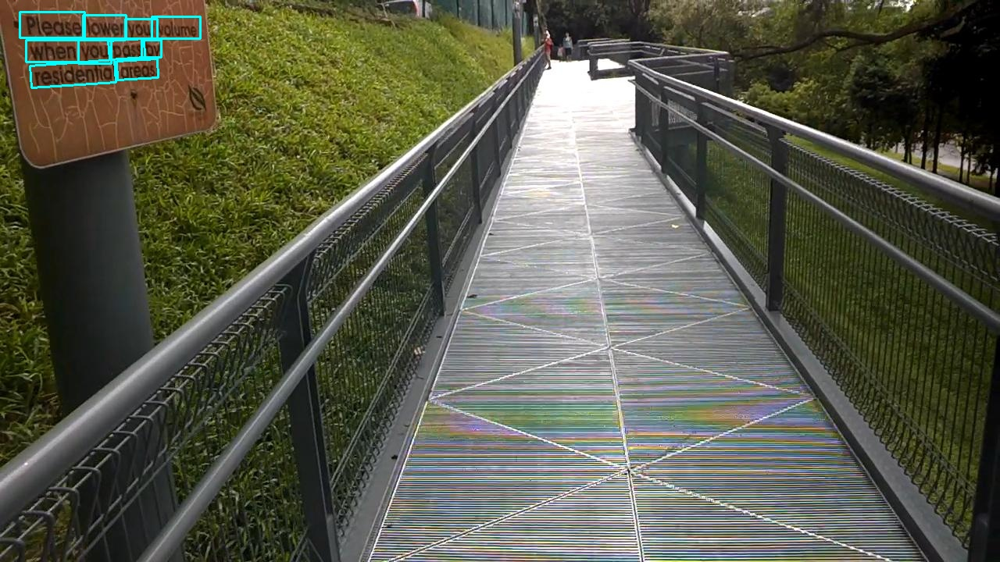
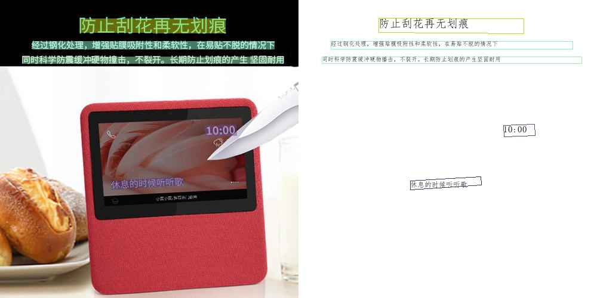
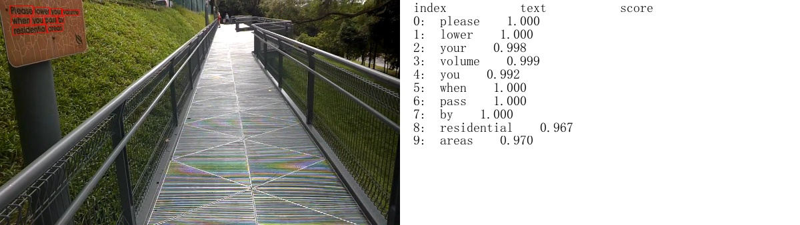

# Prediction from inference model

The inference model (the model saved by fluid.io.save_inference_model) is generally a solidified model saved after the model training is completed, and is mostly used to give prediction in deployment.

The model saved during the training process is the checkpoints model, which saves the parameters of the model and is mostly used to resume training.

Compared with the checkpoints model, the inference model will additionally save the structural information of the model. It has superior performance in predicting in deployment and accelerating inferencing, is flexible and convenient, and is suitable for integration with actual systems. For more details, please refer to the document [Classification prediction framework](https://paddleclas.readthedocs.io/zh_CN/latest/extension/paddle_inference.html).

Next, we first introduce how to convert a trained model into an inference model, and then we will introduce text detection, text recognition, and the concatenation of them based on inference model.

## Training model to inference model
### Detection model to inference model

Download the ultra-lightweight Chinese detection model:
```
wget -P ./ch_lite/ https://paddleocr.bj.bcebos.com/ch_models/ch_det_mv3_db.tar && tar xf ./ch_lite/ch_det_mv3_db.tar -C ./ch_lite/
```
The above model is a DB algorithm trained with MobileNetV3 as the backbone. To convert the trained model into an inference model, just run the following command:
```
python3 tools/export_model.py -c configs/det/det_mv3_db.yml -o Global.checkpoints=./ch_lite/det_mv3_db/best_accuracy Global.save_inference_dir=./inference/det_db/
```
When converting to an inference model, the configuration file used is the same as the configuration file used during training. In addition, you also need to set the `Global.checkpoints` and `Global.save_inference_dir` parameters in the configuration file.
`Global.checkpoints` points to the model parameter file saved during training, and `Global.save_inference_dir` is the directory where the generated inference model is saved.
After the conversion is successful, there are two files in the `save_inference_dir` directory:
```
inference/det_db/
  └─  model     Check the program file of inference model
  └─  params    Check the parameter file of the inference model
```

### Recognition model to inference model

Download the ultra-lightweight Chinese recognition model:
```
wget -P ./ch_lite/ https://paddleocr.bj.bcebos.com/ch_models/ch_rec_mv3_crnn.tar && tar xf ./ch_lite/ch_rec_mv3_crnn.tar -C ./ch_lite/
```

The recognition model is converted to the inference model in the same way as the detection, as follows:
```
python3 tools/export_model.py -c configs/rec/rec_chinese_lite_train.yml -o Global.checkpoints=./ch_lite/rec_mv3_crnn/best_accuracy \
        Global.save_inference_dir=./inference/rec_crnn/
```

If you have a model trained on your own dataset with a different dictionary file, please make sure that you modify the `character_dict_path` in the configuration file to your dictionary file path.

After the conversion is successful, there are two files in the directory:
```
/inference/rec_crnn/
  └─  model     Identify the saved model files
  └─  params    Identify the parameter files of the inference model
```

## Text detection model inference

The following will introduce the ultra-lightweight Chinese detection model inference, DB text detection model inference and EAST text detection model inference. The default configuration is based on the inference setting of the DB text detection model. Because EAST and DB algorithms are very different, when inference, it is necessary to adapt the EAST text detection algorithm by passing in corresponding parameters.

### 1.Ultra-lightweight Chinese detection model inference

For ultra-lightweight Chinese detection model inference, you can execute the following commands:

```
python3 tools/infer/predict_det.py --image_dir="./doc/imgs/2.jpg" --det_model_dir="./inference/det_db/"
```

The visual text detection results are saved to the ./inference_results folder by default, and the name of the result file is prefixed with'det_res'. Examples of results are as follows:



By setting the size of the parameter `det_max_side_len`, the maximum value of picture normalization in the detection algorithm is changed. When the length and width of the picture are less than det_max_side_len, the original picture is used for prediction, otherwise the picture is scaled to the maximum value for prediction. This parameter is set to det_max_side_len=960 by default. If the resolution of the input picture is relatively large and you want to use a larger resolution for prediction, you can execute the following command:

```
python3 tools/infer/predict_det.py --image_dir="./doc/imgs/2.jpg" --det_model_dir="./inference/det_db/" --det_max_side_len=1200
```

If you want to use the CPU for prediction, execute the command as follows
```
python3 tools/infer/predict_det.py --image_dir="./doc/imgs/2.jpg" --det_model_dir="./inference/det_db/" --use_gpu=False
```

### 2.DB text detection model inference

First, convert the model saved in the DB text detection training process into an inference model. Taking the model based on the Resnet50_vd backbone network and trained on the ICDAR2015 English dataset as an example ([model download link](https://paddleocr.bj.bcebos.com/det_r50_vd_db.tar)), you can use the following command to convert:

```
# Set the yml configuration file of the training algorithm after -c
# The Global.checkpoints parameter sets the address of the training model to be converted without adding the file suffix .pdmodel, .pdopt or .pdparams.
# The Global.save_inference_dir parameter sets the address where the converted model will be saved.

python3 tools/export_model.py -c configs/det/det_r50_vd_db.yml -o Global.checkpoints="./models/det_r50_vd_db/best_accuracy" Global.save_inference_dir="./inference/det_db"
```

DB text detection model inference, you can execute the following command:

```
python3 tools/infer/predict_det.py --image_dir="./doc/imgs_en/img_10.jpg" --det_model_dir="./inference/det_db/"
```

The visualized text detection results are saved to the `./inference_results` folder by default, and the name of the result file is prefixed with 'det_res'. Examples of results are as follows:



**Note**: Since the ICDAR2015 dataset has only 1,000 training images, mainly for English scenes, the above model has very poor detection result on Chinese text images.

### 3.EAST text detection model inference

First, convert the model saved in the EAST text detection training process into an inference model. Taking the model based on the Resnet50_vd backbone network and trained on the ICDAR2015 English dataset as an example ([model download link](https://paddleocr.bj.bcebos.com/det_r50_vd_east.tar)), you can use the following command to convert:

```
# Set the yml configuration file of the training algorithm after -c
# The Global.checkpoints parameter sets the address of the training model to be converted without adding the file suffix .pdmodel, .pdopt or .pdparams.
# The Global.save_inference_dir parameter sets the address where the converted model will be saved.

python3 tools/export_model.py -c configs/det/det_r50_vd_east.yml -o Global.checkpoints="./models/det_r50_vd_east/best_accuracy" Global.save_inference_dir="./inference/det_east"
```

For EAST text detection model inference, you need to set the parameter det_algorithm, specify the detection algorithm type to EAST, run the following command:

```
python3 tools/infer/predict_det.py --image_dir="./doc/imgs_en/img_10.jpg" --det_model_dir="./inference/det_east/" --det_algorithm="EAST"
```
The visualized text detection results are saved to the `./inference_results` folder by default, and the name of the result file is prefixed with 'det_res'. Examples of results are as follows:


**Note**: The Python version of NMS in EAST post-processing used in this codebase so the prediction speed is quite slow. If you use the C++ version, there will be a significant speedup.


## Text recognition model inference

The following will introduce the ultra-lightweight Chinese recognition model inference and CTC loss-based recognition model inference. **The recognition model inference based on Attention loss is still being debugged**. For Chinese text recognition, it is recommended to choose the recognition model based on CTC loss. In practice, it is also found that the result of the model based on Attention loss is not as good as the one based on CTC loss.


### 1. Ultra-lightweight Chinese recognition model inference

For ultra-lightweight Chinese recognition model inference, you can execute the following commands:

```
python3 tools/infer/predict_rec.py --image_dir="./doc/imgs_words/ch/word_4.jpg" --rec_model_dir="./inference/rec_crnn/"
```


After executing the command, the prediction results (recognized text and score) of the above image will be printed on the screen.

Predicts of ./doc/imgs_words/ch/word_4.jpg:['实力活力', 0.89552695]


### 2. Recognition model inference based on CTC loss

Taking STAR-Net as an example, we introduce the recognition model inference based on CTC loss. CRNN and Rosetta are used in a similar way, by setting the recognition algorithm parameter `rec_algorithm`.

First, convert the model saved in the STAR-Net text recognition training process into an inference model. Taking the model based on Resnet34_vd backbone network, using MJSynth and SynthText (two English text recognition synthetic datasets) for training, as an example ([model download address](https://paddleocr.bj.bcebos.com/rec_r34_vd_tps_bilstm_ctc.tar)). It can be converted as follow:

```
# Set the yml configuration file of the training algorithm after -c
# The Global.checkpoints parameter sets the address of the training model to be converted without adding the file suffix .pdmodel, .pdopt or .pdparams.
# The Global.save_inference_dir parameter sets the address where the converted model will be saved.

python3 tools/export_model.py -c configs/rec/rec_r34_vd_tps_bilstm_ctc.yml -o Global.checkpoints="./models/rec_r34_vd_tps_bilstm_ctc/best_accuracy" Global.save_inference_dir="./inference/starnet"
```

For STAR-Net text recognition model inference, execute the following commands:

```
python3 tools/infer/predict_rec.py --image_dir="./doc/imgs_words_en/word_336.png" --rec_model_dir="./inference/starnet/" --rec_image_shape="3, 32, 100" --rec_char_type="en"
```


After executing the command, the recognition result of the above image is as follows:

Predicts of ./doc/imgs_words_en/word_336.png:['super', 0.9999555]

**Note**：Since the above model refers to [DTRB](https://arxiv.org/abs/1904.01906) text recognition training and evaluation process, it is different from the training of ultra-lightweight Chinese recognition model in two aspects:

- The image resolution used in training is different: the image resolution used in training the above model is [3，32，100], while during our Chinese model training, in order to ensure the recognition effect of long text, the image resolution used in training is [3, 32, 320]. The default shape parameter of the inference stage is the image resolution used in training phase, that is [3, 32, 320]. Therefore, when running inference of the above English model here, you need to set the shape of the recognition image through the parameter `rec_image_shape`.

- Character list: the experiment in the DTRB paper is only for 26 lowercase English characters and 10 numbers, a total of 36 characters. All upper and lower case characters are converted to lower case characters, and characters not in the above list are ignored and considered as spaces. Therefore, no characters dictionary file is used here, but a dictionary is generated by the below command. Therefore, the parameter `rec_char_type` needs to be set during inference, which is specified as "en" in English.

```
self.character_str = "0123456789abcdefghijklmnopqrstuvwxyz"
dict_character = list(self.character_str)
```

## Text detection and recognition inference concatenation

### 1. Ultra-lightweight Chinese OCR model inference

When performing prediction, you need to specify the path of a single image or a collection of images through the parameter `image_dir`, the parameter `det_model_dir` specifies the path to detect the inference model, and the parameter `rec_model_dir` specifies the path to identify the inference model. The visual recognition results are saved to the `./inference_results` folder by default.

```
python3 tools/infer/predict_system.py --image_dir="./doc/imgs/2.jpg" --det_model_dir="./inference/det_db/"  --rec_model_dir="./inference/rec_crnn/"
```

After executing the command, the recognition result image is as follows:



### 2. Other model inference

If you want to try other detection algorithms or recognition algorithms, please refer to the above text detection model inference and text recognition model inference, update the corresponding configuration and model, the following command uses the combination of the EAST text detection and STAR-Net text recognition:

```
python3 tools/infer/predict_system.py --image_dir="./doc/imgs_en/img_10.jpg" --det_model_dir="./inference/det_east/" --det_algorithm="EAST" --rec_model_dir="./inference/starnet/" --rec_image_shape="3, 32, 100" --rec_char_type="en"
```

After executing the command, the recognition result image is as follows:


