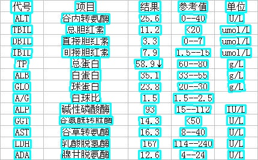
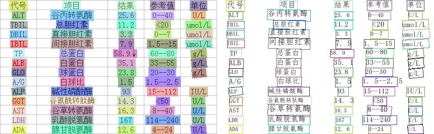

# Python Inference for PP-OCR Model Zoo

This article introduces the use of the Python inference engine for the PP-OCR model library. The content is in order of text detection, text recognition, direction classifier and the prediction method of the three in series on the CPU and GPU.


- [Python Inference for PP-OCR Model Zoo](#python-inference-for-pp-ocr-model-zoo)
  - [Text Detection Model Inference](#text-detection-model-inference)
  - [Text Recognition Model Inference](#text-recognition-model-inference)
    - [1. Lightweight Chinese Recognition Model Inference](#1-lightweight-chinese-recognition-model-inference)
    - [2. Multilingual Model Inference](#2-multilingual-model-inference)
  - [Angle Classification Model Inference](#angle-classification-model-inference)
  - [Text Detection Angle Classification and Recognition Inference Concatenation](#text-detection-angle-classification-and-recognition-inference-concatenation)

<a name="DETECTION_MODEL_INFERENCE"></a>

## Text Detection Model Inference

The default configuration is based on the inference setting of the DB text detection model. For lightweight Chinese detection model inference, you can execute the following commands:

```
# download DB text detection inference model
wget  https://paddleocr.bj.bcebos.com/PP-OCRv3/chinese/ch_PP-OCRv3_det_infer.tar
tar xf ch_PP-OCRv3_det_infer.tar
# run inference
python3 tools/infer/predict_det.py --image_dir="./doc/imgs/00018069.jpg" --det_model_dir="./ch_PP-OCRv3_det_infer/"
```

The visual text detection results are saved to the ./inference_results folder by default, and the name of the result file is prefixed with 'det_res'. Examples of results are as follows:



You can use the parameters `limit_type` and `det_limit_side_len` to limit the size of the input image,
The optional parameters of `limit_type` are [`max`, `min`], and
`det_limit_size_len` is a positive integer, generally set to a multiple of 32, such as 960.

The default setting of the parameters is `limit_type='max', det_limit_side_len=960`. Indicates that the longest side of the network input image cannot exceed 960,
If this value is exceeded, the image will be resized with the same width ratio to ensure that the longest side is `det_limit_side_len`.
Set as `limit_type='min', det_limit_side_len=960`, it means that the shortest side of the image is limited to 960.

If the resolution of the input picture is relatively large and you want to use a larger resolution prediction, you can set det_limit_side_len to the desired value, such as 1216:
```
python3 tools/infer/predict_det.py --image_dir="./doc/imgs/1.jpg" --det_model_dir="./ch_PP-OCRv3_det_infer/" --det_limit_type=max --det_limit_side_len=1216
```

If you want to use the CPU for prediction, execute the command as follows
```
python3 tools/infer/predict_det.py --image_dir="./doc/imgs/1.jpg" --det_model_dir="./ch_PP-OCRv3_det_infer/"  --use_gpu=False
```

<a name="RECOGNITION_MODEL_INFERENCE"></a>

## Text Recognition Model Inference


<a name="LIGHTWEIGHT_RECOGNITION"></a>
### 1. Lightweight Chinese Recognition Model Inference

For lightweight Chinese recognition model inference, you can execute the following commands:

```
# download CRNN text recognition inference model
wget  https://paddleocr.bj.bcebos.com/PP-OCRv3/chinese/ch_PP-OCRv3_rec_infer.tar
tar xf ch_PP-OCRv3_rec_infer.tar
# run inference
python3 tools/infer/predict_rec.py --image_dir="./doc/imgs_words_en/word_10.png" --rec_model_dir="./ch_PP-OCRv3_rec_infer/" --rec_image_shape=3,48,320
```


After executing the command, the prediction results (recognized text and score) of the above image will be printed on the screen.

```bash
Predicts of ./doc/imgs_words_en/word_10.png:('PAIN', 0.988671)
```

<a name="MULTILINGUAL_MODEL_INFERENCE"></a>

### 2. Multilingual Model Inference
If you need to predict [other language models](./models_list_en.md#Multilingual), when using inference model prediction, you need to specify the dictionary path used by `--rec_char_dict_path`. At the same time, in order to get the correct visualization results,
You need to specify the visual font path through `--vis_font_path`. There are small language fonts provided by default under the `doc/fonts` path, such as Korean recognition:

```
wget wget https://paddleocr.bj.bcebos.com/dygraph_v2.0/multilingual/korean_mobile_v2.0_rec_infer.tar

python3 tools/infer/predict_rec.py --image_dir="./doc/imgs_words/korean/1.jpg" --rec_model_dir="./your inference model" --rec_char_dict_path="ppocr/utils/dict/korean_dict.txt" --vis_font_path="doc/fonts/korean.ttf"
```


After executing the command, the prediction result of the above figure is:

``` text
Predicts of ./doc/imgs_words/korean/1.jpg:('바탕으로', 0.9948904)
```

<a name="ANGLE_CLASS_MODEL_INFERENCE"></a>

## Angle Classification Model Inference

For angle classification model inference, you can execute the following commands:


```
# download text angle class inference model：
wget  https://paddleocr.bj.bcebos.com/dygraph_v2.0/ch/ch_ppocr_mobile_v2.0_cls_infer.tar
tar xf ch_ppocr_mobile_v2.0_cls_infer.tar
python3 tools/infer/predict_cls.py --image_dir="./doc/imgs_words_en/word_10.png" --cls_model_dir="ch_ppocr_mobile_v2.0_cls_infer"
```


After executing the command, the prediction results (classification angle and score) of the above image will be printed on the screen.

```
 Predicts of ./doc/imgs_words_en/word_10.png:['0', 0.9999995]
```

<a name="CONCATENATION"></a>
## Text Detection Angle Classification and Recognition Inference Concatenation

When performing prediction, you need to specify the path of a single image or a folder of images through the parameter `image_dir`, the parameter `det_model_dir` specifies the path to detect the inference model, the parameter `cls_model_dir` specifies the path to angle classification inference model and the parameter `rec_model_dir` specifies the path to identify the inference model. The parameter `use_angle_cls` is used to control whether to enable the angle classification model. The parameter `use_mp` specifies whether to use multi-process to infer `total_process_num` specifies process number when using multi-process. The parameter . The visualized recognition results are saved to the `./inference_results` folder by default.

```shell
# use direction classifier
python3 tools/infer/predict_system.py --image_dir="./doc/imgs/00018069.jpg" --det_model_dir="./ch_PP-OCRv3_det_infer/" --cls_model_dir="./cls/" --rec_model_dir="./ch_PP-OCRv2_rec_infer/" --use_angle_cls=true --rec_image_shape=3,48,320

# not use use direction classifier
python3 tools/infer/predict_system.py --image_dir="./doc/imgs/00018069.jpg" --det_model_dir="./ch_PP-OCRv2_det_infer/" --rec_model_dir="./ch_PP-OCRv2_rec_infer/" --use_angle_cls=false --rec_image_shape=3,48,320

# use multi-process
python3 tools/infer/predict_system.py --image_dir="./doc/imgs/00018069.jpg" --det_model_dir="./ch_PP-OCRv2_det_infer/" --rec_model_dir="./ch_PP-OCRv2_rec_infer/" --use_angle_cls=false --use_mp=True --total_process_num=6 --rec_image_shape=3,48,320
```


After executing the command, the recognition result image is as follows:


