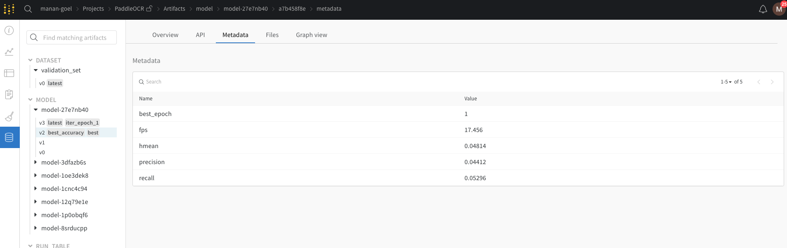

## Logging metrics and models 

PaddleOCR comes with two metric logging tools integrated directly into the training API: [VisualDL](https://readthedocs.org/projects/visualdl/) and [Weights & Biases](https://docs.wandb.ai/). 

### VisualDL
VisualDL is a visualization analysis tool of PaddlePaddle. The integration allows all training metrics to be logged to a VisualDL dashboard. To use it, add the following line to the `Global` section of the config yaml file -

```
Global:
    use_visualdl: True
```

To see the visualizations run the following command in your terminal

```shell
visualdl --logdir <save_model_dir>
```

Now open `localhost:8040` in your browser of choice!

### Weights & Biases
W&B is a MLOps tool that can be used for experiment tracking, dataset/model versioning, visualizing results and collaborating with colleagues. A W&B logger is integrated directly into PaddleOCR and to use it, first you need to install the `wandb` sdk and login to your wandb account.

```shell
pip install wandb
wandb login
```

If you do not have a wandb account, you can make one [here](https://wandb.ai/site).

To visualize and track your model training add the following flag to your config yaml file under the `Global` section -

```
Global:
    use_wandb: True
```

To add more arguments to the `WandbLogger` listed [here](./config_en.md) add the header `wandb` to the yaml file and add the arguments under it - 

```
wandb:
    project: my_project
    entity: my_team
```

This will automatically log all the training and evaluation metrics to the W&B dashboard along with models at every model saving step and evaluation step are with the appropriate tags and metadata.




To view the dashboard, the link to the dashboard is printed to the console at the beginning and end of every training job and you can also access it by logging into your W&B account on your browser.

### Using Multiple Loggers
Both VisualDL and W&B can also be used simultaneously by just setting both the aforementioned flags to True.