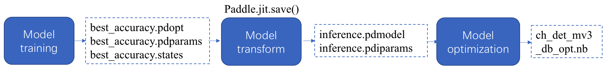

# OCR Model List（V3, updated on 2022.4.28）
> **Note**
> 1. Compared with the model v2, the 3rd version of the detection model has a improvement in accuracy, and the 2.1 version of the recognition model has optimizations in accuracy and speed with CPU.
> 2. Compared with [models 1.1](https://github.com/PaddlePaddle/PaddleOCR/blob/develop/doc/doc_en/models_list_en.md), which are trained with static graph programming paradigm, models 2.0 or higher are the dynamic graph trained version and achieve close performance.
> 3. All models in this tutorial are all ppocr-series models, for more introduction of algorithms and models based on public dataset, you can refer to [algorithm overview tutorial](./algorithm_overview_en.md).

- [OCR Model List（V3, updated on 2022.4.28）]()
  - [1. Text Detection Model](#1-text-detection-model)
    - [1.1 Chinese Detection Model](#1.1)
    - [2.2 English Detection Model](#1.2)
    - [1.3 Multilingual Detection Model](#1.3)
  - [2. Text Recognition Model](#2-text-recognition-model)
    - [2.1 Chinese Recognition Model](#21-chinese-recognition-model)
    - [2.2 English Recognition Model](#22-english-recognition-model)
    - [2.3 Multilingual Recognition Model（Updating...）](#23-multilingual-recognition-modelupdating)
  - [3. Text Angle Classification Model](#3-text-angle-classification-model)
  - [4. Paddle-Lite Model](#4-paddle-lite-model)

The downloadable models provided by PaddleOCR include `inference model`, `trained model`, `pre-trained model` and `nb model`. The differences between the models are as follows:

|model type|model format|description|
|--- | --- | --- |
|inference model|inference.pdmodel、inference.pdiparams|Used for inference based on Paddle inference engine，[detail](./inference_ppocr_en.md)|
|trained model, pre-trained model|\*.pdparams、\*.pdopt、\*.states |The checkpoints model saved in the training process, which stores the parameters of the model, mostly used for model evaluation and continuous training.|
|nb model|\*.nb| Model optimized by Paddle-Lite, which is suitable for mobile-side deployment scenarios (Paddle-Lite is needed for nb model deployment). |

Relationship of the above models is as follows.

## 1. Text Detection Model

### 1. Chinese Detection Model

|model name|description|config|model size|download|
| --- | --- | --- | --- | --- |
|ch_PP-OCRv3_det_slim| [New] slim quantization with distillation lightweight model, supporting Chinese, English, multilingual text detection |[ch_PP-OCRv3_det_cml.yml](../../configs/det/ch_PP-OCRv3/ch_PP-OCRv3_det_cml.yml)| 1.1M |[inference model](https://paddleocr.bj.bcebos.com/PP-OCRv3/chinese/ch_PP-OCRv3_det_slim_infer.tar) / [trained model](https://paddleocr.bj.bcebos.com/PP-OCRv3/chinese/ch_PP-OCRv3_det_slim_distill_train.tar) / [nb model](https://paddleocr.bj.bcebos.com/PP-OCRv3/chinese/ch_PP-OCRv3_det_slim_infer.nb)|
|ch_PP-OCRv3_det| [New] Original lightweight model, supporting Chinese, English, multilingual text detection |[ch_PP-OCRv3_det_cml.yml](../../configs/det/ch_PP-OCRv3/ch_PP-OCRv3_det_cml.yml)| 3.8M |[inference model](https://paddleocr.bj.bcebos.com/PP-OCRv3/chinese/ch_PP-OCRv3_det_infer.tar) / [trained model](https://paddleocr.bj.bcebos.com/PP-OCRv3/chinese/ch_PP-OCRv3_det_distill_train.tar)|
|ch_PP-OCRv2_det_slim| [New] slim quantization with distillation lightweight model, supporting Chinese, English, multilingual text detection|[ch_PP-OCRv2_det_cml.yml](../../configs/det/ch_PP-OCRv2/ch_PP-OCRv2_det_cml.yml)| 3.0M |[inference model](https://paddleocr.bj.bcebos.com/PP-OCRv2/chinese/ch_PP-OCRv2_det_slim_quant_infer.tar)|
|ch_PP-OCRv2_det| [New] Original lightweight model, supporting Chinese, English, multilingual text detection|[ch_PP-OCRv2_det_cml.yml](../../configs/det/ch_PP-OCRv2/ch_PP-OCRv2_det_cml.yml)|3.0M|[inference model](https://paddleocr.bj.bcebos.com/PP-OCRv2/chinese/ch_PP-OCRv2_det_infer.tar) / [trained model](https://paddleocr.bj.bcebos.com/PP-OCRv2/chinese/ch_PP-OCRv2_det_distill_train.tar)|
|ch_ppocr_mobile_slim_v2.0_det|Slim pruned lightweight model, supporting Chinese, English, multilingual text detection|[ch_det_mv3_db_v2.0.yml](../../configs/det/ch_ppocr_v2.0/ch_det_mv3_db_v2.0.yml)|2.6M |[inference model](https://paddleocr.bj.bcebos.com/dygraph_v2.0/slim/ch_ppocr_mobile_v2.0_det_prune_infer.tar)|
|ch_ppocr_mobile_v2.0_det|Original lightweight model, supporting Chinese, English, multilingual text detection|[ch_det_mv3_db_v2.0.yml](../../configs/det/ch_ppocr_v2.0/ch_det_mv3_db_v2.0.yml)|3.0M|[inference model](https://paddleocr.bj.bcebos.com/dygraph_v2.0/ch/ch_ppocr_mobile_v2.0_det_infer.tar) / [trained model](https://paddleocr.bj.bcebos.com/dygraph_v2.0/ch/ch_ppocr_mobile_v2.0_det_train.tar)|
|ch_ppocr_server_v2.0_det|General model, which is larger than the lightweight model, but achieved better performance|[ch_det_res18_db_v2.0.yml](../../configs/det/ch_ppocr_v2.0/ch_det_res18_db_v2.0.yml)|47.0M|[inference model](https://paddleocr.bj.bcebos.com/dygraph_v2.0/ch/ch_ppocr_server_v2.0_det_infer.tar) / [trained model](https://paddleocr.bj.bcebos.com/dygraph_v2.0/ch/ch_ppocr_server_v2.0_det_train.tar)|

### 1.2 English Detection Model

|model name|description|config|model size|download|
| --- | --- | --- | --- | --- |
|en_PP-OCRv3_det_slim | [New] Slim qunatization with distillation lightweight detection model, supporting English | [ch_PP-OCRv3_det_cml.yml](../../configs/det/ch_PP-OCRv3/ch_PP-OCRv3_det_cml.yml) | 1.1M |[inference model](https://paddleocr.bj.bcebos.com/PP-OCRv3/english/en_PP-OCRv3_det_slim_infer.tar) / [trained model](https://paddleocr.bj.bcebos.com/PP-OCRv3/english/en_PP-OCRv3_det_slim_distill_train.tar) / [nb model](https://paddleocr.bj.bcebos.com/PP-OCRv3/english/en_PP-OCRv3_det_slim_infer.nb) |
|en_PP-OCRv3_det | [New] Original lightweight detection model, supporting English |[ch_PP-OCRv3_det_cml.yml](../../configs/det/ch_PP-OCRv3/ch_PP-OCRv3_det_cml.yml)| 3.8M | [inference model](https://paddleocr.bj.bcebos.com/PP-OCRv3/english/en_PP-OCRv3_det_infer.tar) / [trained model](https://paddleocr.bj.bcebos.com/PP-OCRv3/english/en_PP-OCRv3_det_distill_train.tar) |

* Note: English configuration file is same as Chinese except training data, here we only provide one configuration file.

### 1.3 Multilingual Detection Model

|model name|description|config|model size|download|
| --- | --- | --- | --- | --- |
| ml_PP-OCRv3_det_slim | [New] Slim qunatization with distillation lightweight detection model, supporting English | [ch_PP-OCRv3_det_cml.yml](../../configs/det/ch_PP-OCRv3/ch_PP-OCRv3_det_cml.yml) | 1.1M | [inference model](https://paddleocr.bj.bcebos.com/PP-OCRv3/multilingual/Multilingual_PP-OCRv3_det_slim_infer.tar) / [trained model ](https://paddleocr.bj.bcebos.com/PP-OCRv3/multilingual/Multilingual_PP-OCRv3_det_slim_distill_train.tar) / [nb model](https://paddleocr.bj.bcebos.com/PP-OCRv3/multilingual/Multilingual_PP-OCRv3_det_slim_infer.nb) |
| ml_PP-OCRv3_det |[New] Original lightweight detection model, supporting English | [ch_PP-OCRv3_det_cml.yml](../../configs/det/ch_PP-OCRv3/ch_PP-OCRv3_det_cml.yml)| 3.8M | [inference model](https://paddleocr.bj.bcebos.com/PP-OCRv3/multilingual/Multilingual_PP-OCRv3_det_infer.tar) / [trained model](https://paddleocr.bj.bcebos.com/PP-OCRv3/multilingual/Multilingual_PP-OCRv3_det_distill_train.tar) |

* Note: English configuration file is same as Chinese except training data, here we only provide one configuration file.

## 2. Text Recognition Model

### 2.1 Chinese Recognition Model

|model name|description|config|model size|download|
| --- | --- | --- | --- | --- |
|ch_PP-OCRv3_rec_slim | [New] Slim qunatization with distillation lightweight model, supporting Chinese, English text recognition |[ch_PP-OCRv3_rec_distillation.yml](../../configs/rec/PP-OCRv3/ch_PP-OCRv3_rec_distillation.yml)| 4.9M |[inference model](https://paddleocr.bj.bcebos.com/PP-OCRv3/chinese/ch_PP-OCRv3_rec_slim_infer.tar) / [trained model](https://paddleocr.bj.bcebos.com/PP-OCRv3/chinese/ch_PP-OCRv3_rec_slim_train.tar) / [nb model](https://paddleocr.bj.bcebos.com/PP-OCRv3/chinese/ch_PP-OCRv3_rec_slim_infer.nb) |
|ch_PP-OCRv3_rec| [New] Original lightweight model, supporting Chinese, English, multilingual text recognition |[ch_PP-OCRv3_rec_distillation.yml](../../configs/rec/PP-OCRv3/ch_PP-OCRv3_rec_distillation.yml)| 12.4M |[inference model](https://paddleocr.bj.bcebos.com/PP-OCRv3/chinese/ch_PP-OCRv3_rec_infer.tar) / [trained model](https://paddleocr.bj.bcebos.com/PP-OCRv3/chinese/ch_PP-OCRv3_rec_train.tar) |
|ch_PP-OCRv2_rec_slim| Slim qunatization with distillation lightweight model, supporting Chinese, English text recognition|[ch_PP-OCRv2_rec.yml](../../configs/rec/ch_PP-OCRv2/ch_PP-OCRv2_rec.yml)| 9.0M |[inference model](https://paddleocr.bj.bcebos.com/PP-OCRv2/chinese/ch_PP-OCRv2_rec_slim_quant_infer.tar) / [trained model](https://paddleocr.bj.bcebos.com/PP-OCRv2/chinese/ch_PP-OCRv2_rec_slim_quant_train.tar) |
|ch_PP-OCRv2_rec| Original lightweight model, supporting Chinese, English, multilingual text recognition |[ch_PP-OCRv2_rec_distillation.yml](../../configs/rec/ch_PP-OCRv2/ch_PP-OCRv2_rec_distillation.yml)|8.5M|[inference model](https://paddleocr.bj.bcebos.com/PP-OCRv2/chinese/ch_PP-OCRv2_rec_infer.tar) / [trained model](https://paddleocr.bj.bcebos.com/PP-OCRv2/chinese/ch_PP-OCRv2_rec_train.tar) |
|ch_ppocr_mobile_slim_v2.0_rec|Slim pruned and quantized lightweight model, supporting Chinese, English and number recognition|[rec_chinese_lite_train_v2.0.yml](../../configs/rec/ch_ppocr_v2.0/rec_chinese_lite_train_v2.0.yml)| 6.0M | [inference model](https://paddleocr.bj.bcebos.com/dygraph_v2.0/ch/ch_ppocr_mobile_v2.0_rec_slim_infer.tar) / [trained model](https://paddleocr.bj.bcebos.com/dygraph_v2.0/ch/ch_ppocr_mobile_v2.0_rec_slim_train.tar) |
|ch_ppocr_mobile_v2.0_rec|Original lightweight model, supporting Chinese, English and number recognition|[rec_chinese_lite_train_v2.0.yml](../../configs/rec/ch_ppocr_v2.0/rec_chinese_lite_train_v2.0.yml)|5.2M|[inference model](https://paddleocr.bj.bcebos.com/dygraph_v2.0/ch/ch_ppocr_mobile_v2.0_rec_infer.tar) / [trained model](https://paddleocr.bj.bcebos.com/dygraph_v2.0/ch/ch_ppocr_mobile_v2.0_rec_train.tar) / [pre-trained model](https://paddleocr.bj.bcebos.com/dygraph_v2.0/ch/ch_ppocr_mobile_v2.0_rec_pre.tar) |
|ch_ppocr_server_v2.0_rec|General model, supporting Chinese, English and number recognition|[rec_chinese_common_train_v2.0.yml](../../configs/rec/ch_ppocr_v2.0/rec_chinese_common_train_v2.0.yml)|94.8M|[inference model](https://paddleocr.bj.bcebos.com/dygraph_v2.0/ch/ch_ppocr_server_v2.0_rec_infer.tar) / [trained model](https://paddleocr.bj.bcebos.com/dygraph_v2.0/ch/ch_ppocr_server_v2.0_rec_train.tar) / [pre-trained model](https://paddleocr.bj.bcebos.com/dygraph_v2.0/ch/ch_ppocr_server_v2.0_rec_pre.tar) |

**Note:** The `trained model` is fine-tuned on the `pre-trained model` with real data and synthesized vertical text data, which achieved better performance in real scene. The `pre-trained model` is directly trained on the full amount of real data and synthesized data, which is more suitable for fine-tune on your own dataset.

### 2.2 English Recognition Model

|model name|description|config|model size|download|
| --- | --- | --- | --- | --- |
|en_PP-OCRv3_rec_slim | [New] Slim qunatization with distillation lightweight model, supporting english, English text recognition |[en_PP-OCRv3_rec.yml](../../configs/rec/PP-OCRv3/en_PP-OCRv3_rec.yml)| 3.2M |[inference model](https://paddleocr.bj.bcebos.com/PP-OCRv3/english/en_PP-OCRv3_rec_slim_infer.tar) / [trained model](https://paddleocr.bj.bcebos.com/PP-OCRv3/english/en_PP-OCRv3_rec_slim_train.tar) / [nb model](https://paddleocr.bj.bcebos.com/PP-OCRv3/english/en_PP-OCRv3_rec_slim_infer.nb) |
|en_PP-OCRv3_rec| [New] Original lightweight model, supporting english, English, multilingual text recognition |[en_PP-OCRv3_rec.yml](../../configs/rec/PP-OCRv3/en_PP-OCRv3_rec.yml)| 9.6M |[inference model](https://paddleocr.bj.bcebos.com/PP-OCRv3/english/en_PP-OCRv3_rec_infer.tar) / [trained model](https://paddleocr.bj.bcebos.com/PP-OCRv3/english/en_PP-OCRv3_rec_train.tar) |
|en_number_mobile_slim_v2.0_rec|Slim pruned and quantized lightweight model, supporting English and number recognition|[rec_en_number_lite_train.yml](../../configs/rec/multi_language/rec_en_number_lite_train.yml)| 2.7M | [inference model](https://paddleocr.bj.bcebos.com/dygraph_v2.0/en/en_number_mobile_v2.0_rec_slim_infer.tar) / [trained model](https://paddleocr.bj.bcebos.com/dygraph_v2.0/en/en_number_mobile_v2.0_rec_slim_train.tar) |
|en_number_mobile_v2.0_rec|Original lightweight model, supporting English and number recognition|[rec_en_number_lite_train.yml](../../configs/rec/multi_language/rec_en_number_lite_train.yml)|2.6M|[inference model](https://paddleocr.bj.bcebos.com/dygraph_v2.0/multilingual/en_number_mobile_v2.0_rec_infer.tar) / [trained model](https://paddleocr.bj.bcebos.com/dygraph_v2.0/multilingual/en_number_mobile_v2.0_rec_train.tar) |

### 2.3 Multilingual Recognition Model（Updating...）

|model name| dict file | description|config|model size|download|
| --- | --- | --- |--- | --- | --- |
| korean_PP-OCRv3_rec | ppocr/utils/dict/korean_dict.txt |Lightweight model for Korean recognition|[korean_PP-OCRv3_rec.yml](../../configs/rec/PP-OCRv3/multi_language/korean_PP-OCRv3_rec.yml)|11.0M|[inference model](https://paddleocr.bj.bcebos.com/PP-OCRv3/multilingual/korean_PP-OCRv3_rec_infer.tar) / [trained model](https://paddleocr.bj.bcebos.com/PP-OCRv3/multilingual/korean_PP-OCRv3_rec_train.tar) |
| japan_PP-OCRv3_rec | ppocr/utils/dict/japan_dict.txt |Lightweight model for Japanese recognition|[japan_PP-OCRv3_rec.yml](../../configs/rec/PP-OCRv3/multi_language/japan_PP-OCRv3_rec.yml)|11.0M|[inference model](https://paddleocr.bj.bcebos.com/PP-OCRv3/multilingual/japan_PP-OCRv3_rec_infer.tar) / [trained model](https://paddleocr.bj.bcebos.com/PP-OCRv3/multilingual/japan_PP-OCRv3_rec_train.tar) |
| chinese_cht_PP-OCRv3_rec | ppocr/utils/dict/chinese_cht_dict.txt | Lightweight model for chinese cht|[chinese_cht_PP-OCRv3_rec.yml](../../configs/rec/PP-OCRv3/multi_language/chinese_cht_PP-OCRv3_rec.yml)|12.0M|[inference model](https://paddleocr.bj.bcebos.com/PP-OCRv3/multilingual/chinese_cht_PP-OCRv3_rec_infer.tar) / [trained model](https://paddleocr.bj.bcebos.com/PP-OCRv3/multilingual/chinese_cht_PP-OCRv3_rec_train.tar) |
| te_PP-OCRv3_rec | ppocr/utils/dict/te_dict.txt | Lightweight model for Telugu recognition |[te_PP-OCRv3_rec.yml](../../configs/rec/PP-OCRv3/multi_language/te_PP-OCRv3_rec.yml)|9.6M|[inference model](https://paddleocr.bj.bcebos.com/PP-OCRv3/multilingual/te_PP-OCRv3_rec_infer.tar) / [trained model](https://paddleocr.bj.bcebos.com/PP-OCRv3/multilingual/te_PP-OCRv3_rec_train.tar) |
| ka_PP-OCRv3_rec | ppocr/utils/dict/ka_dict.txt | Lightweight model for Kannada recognition |[ka_PP-OCRv3_rec.yml](../../configs/rec/PP-OCRv3/multi_language/ka_PP-OCRv3_rec.yml)|9.9M|[inference model](https://paddleocr.bj.bcebos.com/PP-OCRv3/multilingual/ka_PP-OCRv3_rec_infer.tar) / [trained model](https://paddleocr.bj.bcebos.com/PP-OCRv3/multilingual/ka_PP-OCRv3_rec_train.tar) |
| ta_PP-OCRv3_rec | ppocr/utils/dict/ta_dict.txt |Lightweight model for Tamil recognition|[ta_PP-OCRv3_rec.yml](../../configs/rec/PP-OCRv3/multi_language/ta_PP-OCRv3_rec.yml)|9.6M|[inference model](https://paddleocr.bj.bcebos.com/PP-OCRv3/multilingual/ta_PP-OCRv3_rec_infer.tar) / [trained model](https://paddleocr.bj.bcebos.com/PP-OCRv3/multilingual/ta_PP-OCRv3_rec_train.tar) |
| latin_PP-OCRv3_rec |  ppocr/utils/dict/latin_dict.txt | Lightweight model for latin recognition |  [latin_PP-OCRv3_rec.yml](../../configs/rec/PP-OCRv3/multi_language/latin_PP-OCRv3_rec.yml) |9.7M|[inference model](https://paddleocr.bj.bcebos.com/PP-OCRv3/multilingual/latin_PP-OCRv3_rec_infer.tar) / [trained model](https://paddleocr.bj.bcebos.com/PP-OCRv3/multilingual/latin_PP-OCRv3_rec_train.tar) |
| arabic_PP-OCRv3_rec | ppocr/utils/dict/arabic_dict.txt | Lightweight model for arabic recognition  | [arabic_PP-OCRv3_rec.yml](../../configs/rec/PP-OCRv3/multi_language/arabic_PP-OCRv3_rec.yml) |9.6M|[inference model](https://paddleocr.bj.bcebos.com/PP-OCRv3/multilingual/arabic_PP-OCRv3_rec_infer.tar) / [trained model](https://paddleocr.bj.bcebos.com/PP-OCRv3/multilingual/arabic_PP-OCRv3_rec_train.tar) |
| cyrillic_PP-OCRv3_rec | ppocr/utils/dict/cyrillic_dict.txt | Lightweight model for cyrillic recognition  | [cyrillic_PP-OCRv3_rec.yml](../../configs/rec/PP-OCRv3/multi_language/cyrillic_PP-OCRv3_rec.yml) |9.6M|[inference model](https://paddleocr.bj.bcebos.com/PP-OCRv3/multilingual/cyrillic_PP-OCRv3_rec_infer.tar) / [trained model](https://paddleocr.bj.bcebos.com/PP-OCRv3/multilingual/cyrillic_PP-OCRv3_rec_train.tar) |
| devanagari_PP-OCRv3_rec | ppocr/utils/dict/devanagari_dict.txt | Lightweight model for devanagari recognition | [devanagari_PP-OCRv3_rec.yml](../../configs/rec/PP-OCRv3/multi_language/devanagari_PP-OCRv3_rec.yml) |9.9M|[inference model](https://paddleocr.bj.bcebos.com/PP-OCRv3/multilingual/devanagari_PP-OCRv3_rec_infer.tar) / [trained model](https://paddleocr.bj.bcebos.com/PP-OCRv3/multilingual/devanagari_PP-OCRv3_rec_train.tar) |

For a complete list of languages ​​and tutorials, please refer to : [Multi-language model](./multi_languages_en.md)

## 3. Text Angle Classification Model

|model name|description|config|model size|download|
| --- | --- | --- | --- | --- |
|ch_ppocr_mobile_slim_v2.0_cls|Slim quantized model for text angle classification|[cls_mv3.yml](../../configs/cls/cls_mv3.yml)| 2.1M | [inference model](https://paddleocr.bj.bcebos.com/dygraph_v2.0/ch/ch_ppocr_mobile_v2.0_cls_slim_infer.tar) / [trained model](https://paddleocr.bj.bcebos.com/dygraph_v2.0/ch/ch_ppocr_mobile_v2.0_cls_slim_train.tar) / [nb model](https://paddleocr.bj.bcebos.com/PP-OCRv2/lite/ch_ppocr_mobile_v2.0_cls_infer_opt.nb) |
|ch_ppocr_mobile_v2.0_cls|Original model for text angle classification|[cls_mv3.yml](../../configs/cls/cls_mv3.yml)|1.38M|[inference model](https://paddleocr.bj.bcebos.com/dygraph_v2.0/ch/ch_ppocr_mobile_v2.0_cls_infer.tar) / [trained model](https://paddleocr.bj.bcebos.com/dygraph_v2.0/ch/ch_ppocr_mobile_v2.0_cls_train.tar) |

## 4. Paddle-Lite Model

Paddle Lite is an updated version of Paddle-Mobile, an open-open source deep learning framework designed to make it easy to perform inference on mobile, embeded, and IoT devices. It can further optimize the inference model and generate `nb model` used for edge devices. It's suggested to optimize the quantization model using Paddle-Lite because `INT8` format is used for the model storage and inference.

This chapter lists OCR nb models with PP-OCRv2 or earlier versions. You can access to the latest nb models from the above tables.

|Version|Introduction|Model size|Detection model|Text Direction model|Recognition model|Paddle-Lite branch|
|---|---|---|---|---|---|---|
|PP-OCRv2|extra-lightweight chinese OCR optimized model|11.0M|[download link](https://paddleocr.bj.bcebos.com/PP-OCRv2/lite/ch_PP-OCRv2_det_infer_opt.nb)|[download link](https://paddleocr.bj.bcebos.com/PP-OCRv2/lite/ch_ppocr_mobile_v2.0_cls_infer_opt.nb)|[download link](https://paddleocr.bj.bcebos.com/PP-OCRv2/lite/ch_PP-OCRv2_rec_infer_opt.nb)|v2.10|
|PP-OCRv2(slim)|extra-lightweight chinese OCR optimized model|4.6M|[download link](https://paddleocr.bj.bcebos.com/PP-OCRv2/lite/ch_PP-OCRv2_det_slim_opt.nb)|[download link](https://paddleocr.bj.bcebos.com/PP-OCRv2/lite/ch_ppocr_mobile_v2.0_cls_slim_opt.nb)|[download link](https://paddleocr.bj.bcebos.com/PP-OCRv2/lite/ch_PP-OCRv2_rec_slim_opt.nb)|v2.10|
|PP-OCRv2|extra-lightweight chinese OCR optimized model|11.0M|[download link](https://paddleocr.bj.bcebos.com/PP-OCRv2/chinese/ch_PP-OCRv2_det_infer_opt.nb)|[download link](https://paddleocr.bj.bcebos.com/dygraph_v2.0/lite/ch_ppocr_mobile_v2.0_cls_opt.nb)|[download link](https://paddleocr.bj.bcebos.com/PP-OCRv2/chinese/ch_PP-OCRv2_rec_infer_opt.nb)|v2.9|
|PP-OCRv2(slim)|extra-lightweight chinese OCR optimized model|4.9M|[download link](https://paddleocr.bj.bcebos.com/PP-OCRv2/chinese/ch_PP-OCRv2_det_slim_opt.nb)|[download link](https://paddleocr.bj.bcebos.com/dygraph_v2.0/lite/ch_ppocr_mobile_v2.0_cls_slim_opt.nb)|[download link](https://paddleocr.bj.bcebos.com/PP-OCRv2/chinese/ch_PP-OCRv2_rec_slim_opt.nb)|v2.9|
|V2.0|ppocr_v2.0 extra-lightweight chinese OCR optimized model|7.8M|[download link](https://paddleocr.bj.bcebos.com/dygraph_v2.0/lite/ch_ppocr_mobile_v2.0_det_opt.nb)|[download link](https://paddleocr.bj.bcebos.com/dygraph_v2.0/lite/ch_ppocr_mobile_v2.0_cls_opt.nb)|[download link](https://paddleocr.bj.bcebos.com/dygraph_v2.0/lite/ch_ppocr_mobile_v2.0_rec_opt.nb)|v2.9|
|V2.0(slim)|ppovr_v2.0 extra-lightweight chinese OCR optimized model|3.3M|[download link](https://paddleocr.bj.bcebos.com/dygraph_v2.0/lite/ch_ppocr_mobile_v2.0_det_slim_opt.nb)|[download link](https://paddleocr.bj.bcebos.com/dygraph_v2.0/lite/ch_ppocr_mobile_v2.0_cls_slim_opt.nb)|[download link](https://paddleocr.bj.bcebos.com/dygraph_v2.0/lite/ch_ppocr_mobile_v2.0_rec_slim_opt.nb)|v2.9|
