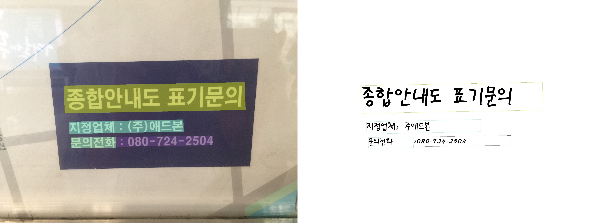
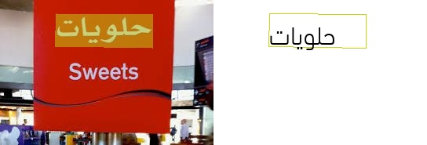

# Multi-language model

**Recent Update**

- 2021.4.9 supports the detection and recognition of 80 languages
- 2021.4.9 supports **lightweight high-precision** English model detection and recognition

PaddleOCR aims to create a rich, leading, and practical OCR tool library, which not only provides
Chinese and English models in general scenarios, but also provides models specifically trained
in English scenarios. And multilingual models covering [80 languages](#language_abbreviations).

Among them, the English model supports the detection and recognition of uppercase and lowercase
letters and common punctuation, and the recognition of space characters is optimized:

<div align="center">
    
</div>

The multilingual models cover Latin, Arabic, Traditional Chinese, Korean, Japanese, etc.:

<div align="center">
    
    
    
    
</div>

This document will briefly introduce how to use the multilingual model.

- [1 Installation](#Install)
    - [1.1 paddle installation](#paddleinstallation)
    - [1.2 paddleocr package installation](#paddleocr_package_install)

- [2 Quick Use](#Quick_Use)
    - [2.1 Command line operation](#Command_line_operation)
    - [2.2 python script running](#python_Script_running)
- [3 Custom Training](#Custom_Training)
- [4 Inference and Deployment](#inference)
- [4 Supported languages and abbreviations](#language_abbreviations)

<a name="Install"></a>
## 1 Installation

<a name="paddle_install"></a>
### 1.1 paddle installation
```
# cpu
pip install paddlepaddle

# gpu
pip install paddlepaddle-gpu
```

<a name="paddleocr_package_install"></a>
### 1.2 paddleocr package installation


pip install
```
pip install "paddleocr>=2.0.6" # 2.0.6 version is recommended
```
Build and install locally
```
python3 setup.py bdist_wheel
pip3 install dist/paddleocr-x.x.x-py3-none-any.whl # x.x.x is the version number of paddleocr
```

<a name="Quick_use"></a>
## 2 Quick use

<a name="Command_line_operation"></a>
### 2.1 Command line operation

View help information

```
paddleocr -h
```

* Whole image prediction (detection + recognition)

Paddleocr currently supports 80 languages, which can be switched by modifying the --lang parameter.
The specific supported [language] (#language_abbreviations) can be viewed in the table.

``` bash
paddleocr --image_dir doc/imgs_en/254.jpg --lang=en
```
<div align="center">
    
    
</div>

The result is a list, each item contains a text box, text and recognition confidence
```text
[('PHO CAPITAL', 0.95723116), [[66.0, 50.0], [327.0, 44.0], [327.0, 76.0], [67.0, 82.0]]]
[('107 State Street', 0.96311164), [[72.0, 90.0], [451.0, 84.0], [452.0, 116.0], [73.0, 121.0]]]
[('Montpelier Vermont', 0.97389287), [[69.0, 132.0], [501.0, 126.0], [501.0, 158.0], [70.0, 164.0]]]
[('8022256183', 0.99810505), [[71.0, 175.0], [363.0, 170.0], [364.0, 202.0], [72.0, 207.0]]]
[('REG 07-24-201706:59 PM', 0.93537045), [[73.0, 299.0], [653.0, 281.0], [654.0, 318.0], [74.0, 336.0]]]
[('045555', 0.99346405), [[509.0, 331.0], [651.0, 325.0], [652.0, 356.0], [511.0, 362.0]]]
[('CT1', 0.9988654), [[535.0, 367.0], [654.0, 367.0], [654.0, 406.0], [535.0, 406.0]]]
......
```

* Recognition

```bash
paddleocr --image_dir doc/imgs_words_en/word_308.png --det false --lang=en
```


The result is a tuple, which returns the recognition result and recognition confidence

```text
(0.99879867, 'LITTLE')
```

* Detection

```
paddleocr --image_dir PaddleOCR/doc/imgs/11.jpg --rec false
```

The result is a list, each item contains only text boxes

```
[[26.0, 457.0], [137.0, 457.0], [137.0, 477.0], [26.0, 477.0]]
[[25.0, 425.0], [372.0, 425.0], [372.0, 448.0], [25.0, 448.0]]
[[128.0, 397.0], [273.0, 397.0], [273.0, 414.0], [128.0, 414.0]]
......
```

<a name="python_script_running"></a>
### 2.2 python script running

ppocr also supports running in python scripts for easy embedding in your own code:

* Whole image prediction (detection + recognition)

```
from paddleocr import PaddleOCR, draw_ocr

# Also switch the language by modifying the lang parameter
ocr = PaddleOCR(lang="korean") # The model file will be downloaded automatically when executed for the first time
img_path ='doc/imgs/korean_1.jpg'
result = ocr.ocr(img_path)
# Recognition and detection can be performed separately through parameter control
# result = ocr.ocr(img_path, det=False)  Only perform recognition
# result = ocr.ocr(img_path, rec=False)  Only perform detection
# Print detection frame and recognition result
for line in result:
    print(line)

# Visualization
from PIL import Image
image = Image.open(img_path).convert('RGB')
boxes = [line[0] for line in result]
txts = [line[1][0] for line in result]
scores = [line[1][1] for line in result]
im_show = draw_ocr(image, boxes, txts, scores, font_path='/path/to/PaddleOCR/doc/fonts/korean.ttf')
im_show = Image.fromarray(im_show)
im_show.save('result.jpg')
```

Visualization of results:


ppocr also supports direction classification. For more usage methods, please refer to: [whl package instructions](https://github.com/PaddlePaddle/PaddleOCR/blob/release/2.0/doc/doc_ch/whl.md).

<a name="Custom_training"></a>
## 3 Custom training

ppocr supports using your own data for custom training or finetune, where the recognition model can refer to [French configuration file](../../configs/rec/multi_language/rec_french_lite_train.yml)
Modify the training data path, dictionary and other parameters.

For specific data preparation and training process, please refer to: [Text Detection](../doc_en/detection_en.md), [Text Recognition](../doc_en/recognition_en.md), more functions such as predictive deployment,
For functions such as data annotation, you can read the complete [Document Tutorial](../../README.md).


<a name="inference"></a>
## 4 Inference and Deployment

In addition to installing the whl package for quick forecasting,
ppocr also provides a variety of forecasting deployment methods.
If necessary, you can read related documents:

- [Python Inference](./inference_en.md)
- [C++ Inference](../../deploy/cpp_infer/readme_en.md)
- [Serving](../../deploy/hubserving/readme_en.md)
- [Mobile](https://github.com/PaddlePaddle/PaddleOCR/blob/develop/deploy/lite/readme_en.md)
- [Benchmark](./benchmark_en.md)


<a name="language_abbreviations"></a>
## 5 Support languages and abbreviations

| Language  | Abbreviation | | Language  | Abbreviation |
| ---  | --- | --- | ---  | --- |
|chinese and english|ch| |Arabic|ar|
|english|en| |Hindi|hi|
|french|fr| |Uyghur|ug|
|german|german| |Persian|fa|
|japan|japan| |Urdu|ur|
|korean|korean| | Serbian(latin) |rs_latin|
|chinese traditional |ch_tra| |Occitan |oc|
| Italian |it| |Marathi|mr|
|Spanish |es| |Nepali|ne|
| Portuguese|pt| |Serbian(cyrillic)|rs_cyrillic|
|Russia|ru||Bulgarian |bg|
|Ukranian|uk| |Estonian |et|
|Belarusian|be| |Irish |ga|
|Telugu |te| |Croatian |hr|
|Saudi Arabia|sa| |Hungarian |hu|
|Tamil |ta| |Indonesian|id|
|Afrikaans |af| |Icelandic|is|
|Azerbaijani  |az||Kurdish|ku|
|Bosnian|bs| |Lithuanian |lt|
|Czech|cs| |Latvian |lv|
|Welsh |cy| |Maori|mi|
|Danish|da| |Malay|ms|
|Maltese |mt| |Adyghe |ady|
|Dutch |nl| |Kabardian |kbd|
|Norwegian |no| |Avar |ava|
|Polish |pl| |Dargwa |dar|
|Romanian |ro| |Ingush |inh|
|Slovak |sk| |Lak |lbe|
|Slovenian |sl| |Lezghian |lez|
|Albanian |sq| |Tabassaran |tab|
|Swedish |sv| |Bihari |bh|
|Swahili |sw| |Maithili |mai|
|Tagalog |tl| |Angika |ang|
|Turkish |tr| |Bhojpuri |bho|
|Uzbek |uz| |Magahi |mah|
|Vietnamese |vi| |Nagpur |sck|
|Mongolian |mn| |Newari |new|
|Abaza |abq| |Goan Konkani|gom|
