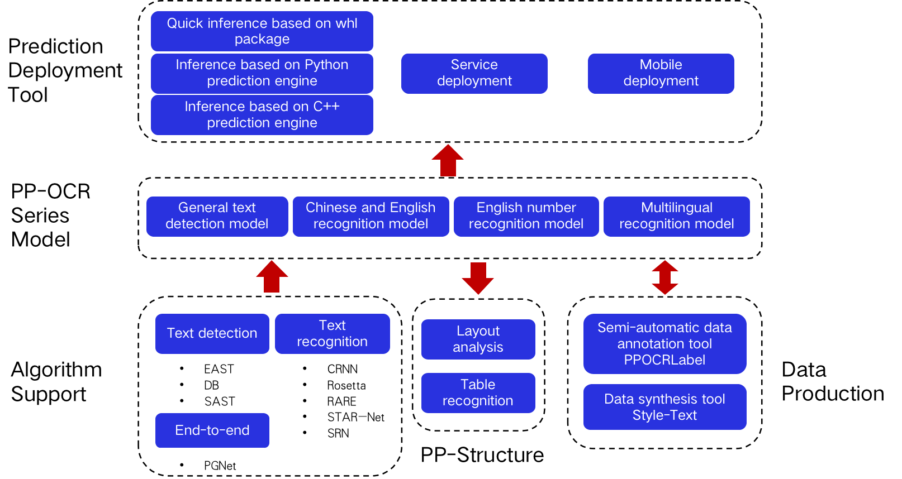

# PaddleOCR Overview and Project Clone

## 1. PaddleOCR Overview

PaddleOCR contains rich text detection, text recognition and end-to-end algorithms. With the experience from real world scenarios and the industry, PaddleOCR chooses DB and CRNN as the basic detection and recognition models, and proposes a series of models, named PP-OCR, for industrial applications after a series of optimization strategies. The PP-OCR model is aimed at general scenarios and forms a model library of different languages. Based on the capabilities of PP-OCR, PaddleOCR releases the PP-Structure toolkit for document scene tasks, including two major tasks: layout analysis and table recognition. In order to get through the entire process of industrial landing, PaddleOCR provides large-scale data production tools and a variety of prediction deployment tools to help developers quickly turn ideas into reality.

<div align="center">
    
</div>


## 2. Project Clone

### **2.1 Clone PaddleOCR repo**

```
# Recommend
git clone https://github.com/PaddlePaddle/PaddleOCR

# If you cannot pull successfully due to network problems, you can switch to the mirror hosted on Gitee:

git clone https://gitee.com/paddlepaddle/PaddleOCR

# Note: The mirror on Gitee may not keep in synchronization with the latest project on GitHub. There might be a delay of 3-5 days. Please try GitHub at first.
```

### **2.2 Install third-party libraries**

```
cd PaddleOCR
pip3 install -r requirements.txt
```

If you getting this error `OSError: [WinError 126] The specified module could not be found` when you install shapely on windows.

Please try to download Shapely whl file from [http://www.lfd.uci.edu/~gohlke/pythonlibs/#shapely](http://www.lfd.uci.edu/~gohlke/pythonlibs/#shapely).

Reference: [Solve shapely installation on windows](https://stackoverflow.com/questions/44398265/install-shapely-oserror-winerror-126-the-specified-module-could-not-be-found)
