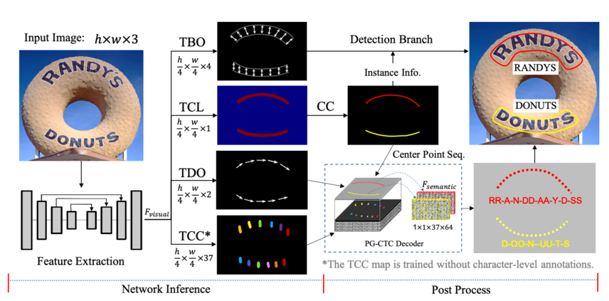
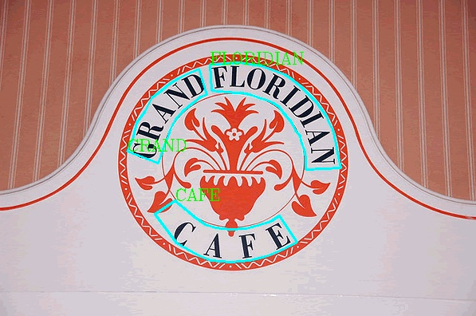
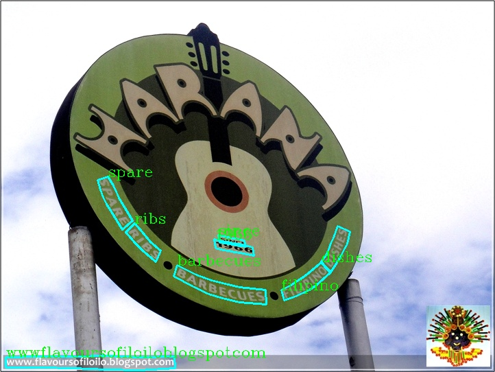

# End-to-end OCR Algorithm-PGNet
- [1. Brief Introduction](#Brief_Introduction)
- [2. Environment Configuration](#Environment_Configuration)
- [3. Quick Use](#Quick_Use)
- [4. Model Training,Evaluation And Inference](#Model_Training_Evaluation_And_Inference)

<a name="Brief_Introduction"></a>
## 1. Brief Introduction
OCR algorithm can be divided into two-stage algorithm and end-to-end algorithm. The two-stage OCR algorithm is generally divided into two parts, text detection and text recognition algorithm. The text detection algorithm gets the detection box of the text line from the image, and then the recognition algorithm identifies the content of the text box. The end-to-end OCR algorithm can complete text detection and recognition in one algorithm. Its basic idea is to design a model with both detection unit and recognition module, share the CNN features of both and train them together. Because one algorithm can complete character recognition, the end-to-end model is smaller and faster.
### Introduction Of PGNet Algorithm
In recent years, the end-to-end OCR algorithm has been well developed, including MaskTextSpotter series, TextSnake, TextDragon, PGNet series and so on. Among these algorithms, PGNet algorithm has the advantages that other algorithms do not
- Pgnet loss is designed to guide training, and no character-level annotations is needed
- NMS and ROI related operations are not needed, It can accelerate the prediction
- The reading order prediction module is proposed
- A graph based modification module (GRM) is proposed to further improve the performance of model recognition
- Higher accuracy and faster prediction speed

For details of PGNet algorithm, please refer to [paper](https://www.aaai.org/AAAI21Papers/AAAI-2885.WangP.pdf) ,The schematic diagram of the algorithm is as follows:

After feature extraction, the input image is sent to four branches: TBO module for text edge offset prediction, TCL module for text centerline prediction, TDO module for text direction offset prediction, and TCC module for text character classification graph prediction.
The output of TBO and TCL can get text detection results after post-processing, and TCL, TDO and TCC are responsible for text recognition.

The results of detection and recognition are as follows:


### Performance
####Test set: Total Text
####Test environment: NVIDIA Tesla V100-SXM2-16GB
| |det_precision|det_recall|det_f_score|e2e_precision|e2e_recall|e2e_f_score|FPS|download|
| --- | --- | --- | --- | --- | --- | --- | --- | --- |
|Paper|85.30|86.80|86.1|-|-|61.7|38.20 (size=640)|-|
|Ours|87.03|82.48|84.69|61.71|58.43|60.03|48.73 (size=768)|[download link](https://paddleocr.bj.bcebos.com/dygraph_v2.0/pgnet/en_server_pgnetA.tar)|

*note：PGNet in PaddleOCR optimizes the prediction speed, and can significantly improve the end-to-end prediction speed within the acceptable range of accuracy reduction*

<a name="Environment_Configuration"></a>
## 2. Environment Configuration
Please refer to [Quick Installation](./installation_en.md) Configure the PaddleOCR running environment.

<a name="Quick_Use"></a>
## 3. Quick Use
### inference model download
This section takes the trained end-to-end model as an example to quickly use the model prediction. First, download the trained end-to-end inference model [download address](https://paddleocr.bj.bcebos.com/dygraph_v2.0/pgnet/e2e_server_pgnetA_infer.tar)
```
mkdir inference && cd inference
# Download the English end-to-end model and unzip it
wget https://paddleocr.bj.bcebos.com/dygraph_v2.0/pgnet/e2e_server_pgnetA_infer.tar && tar xf e2e_server_pgnetA_infer.tar
```
* In Windows environment, if 'wget' is not installed, the link can be copied to the browser when downloading the model, and decompressed and placed in the corresponding directory

After decompression, there should be the following file structure:
```
├── e2e_server_pgnetA_infer
│   ├── inference.pdiparams
│   ├── inference.pdiparams.info
│   └── inference.pdmodel
```
### Single image or image set prediction
```bash
# Prediction single image specified by image_dir
python3 tools/infer/predict_e2e.py --e2e_algorithm="PGNet" --image_dir="./doc/imgs_en/img623.jpg" --e2e_model_dir="./inference/e2e_server_pgnetA_infer/" --e2e_pgnet_polygon=True

# Prediction the collection of images specified by image_dir
python3 tools/infer/predict_e2e.py --e2e_algorithm="PGNet" --image_dir="./doc/imgs_en/" --e2e_model_dir="./inference/e2e_server_pgnetA_infer/" --e2e_pgnet_polygon=True

# If you want to use CPU for prediction, you need to set use_gpu parameter is false
python3 tools/infer/predict_e2e.py --e2e_algorithm="PGNet" --image_dir="./doc/imgs_en/img623.jpg" --e2e_model_dir="./inference/e2e_server_pgnetA_infer/" --e2e_pgnet_polygon=True --use_gpu=False
```
### Visualization results
The visualized end-to-end results are saved to the `./inference_results` folder by default, and the name of the result file is prefixed with 'e2e_res'. Examples of results are as follows:


<a name="Model_Training_Evaluation_And_Inference"></a>
## 4. Model Training,Evaluation And Inference
This section takes the totaltext dataset as an example to introduce the training, evaluation and testing of the end-to-end model in PaddleOCR.

###  Data Preparation
Download and unzip [totaltext](https://github.com/cs-chan/Total-Text-Dataset/blob/master/Dataset/README.md) dataset to PaddleOCR/train_data/, dataset organization structure is as follow：
```
/PaddleOCR/train_data/total_text/train/
  |- rgb/            # total_text training data of dataset
      |- gt_0.png
      | ...  
  |- total_text.txt  # total_text training annotation of dataset
```

total_text.txt: the format of dimension file is as follows，the file name and annotation information are separated by "\t"：
```
" Image file name             Image annotation information encoded by json.dumps"
rgb/gt_0.png    [{"transcription": "EST", "points": [[1004.0,689.0],[1019.0,698.0],[1034.0,708.0],[1049.0,718.0],[1064.0,728.0],[1079.0,738.0],[1095.0,748.0],[1094.0,774.0],[1079.0,765.0],[1065.0,756.0],[1050.0,747.0],[1036.0,738.0],[1021.0,729.0],[1007.0,721.0]]}, {...}]
```
The image annotation after **json.dumps()** encoding is a list containing multiple dictionaries.

The `points` in the dictionary represent the coordinates (x, y) of the four points of the text box, arranged clockwise from the point at the upper left corner.

`transcription` represents the text of the current text box. **When its content is "###" it means that the text box is invalid and will be skipped during training.**

If you want to train PaddleOCR on other datasets, please build the annotation file according to the above format.


### Start Training

PGNet training is divided into two steps: Step 1: training on the synthetic data to get the pretrain_model, and the accuracy of the model is still low; step 2: loading the pretrain_model and training on the totaltext data set; for fast training, we directly provide the pre training model of step 1[download link](https://paddleocr.bj.bcebos.com/dygraph_v2.0/pgnet/train_step1.tar).
```shell
cd PaddleOCR/
download step1 pretrain_models
wget -P ./pretrain_models/ https://paddleocr.bj.bcebos.com/dygraph_v2.0/pgnet/train_step1.tar
You can get the following file format
./pretrain_models/train_step1/
  └─ best_accuracy.pdopt
  └─ best_accuracy.states
  └─ best_accuracy.pdparams
```
*If CPU version installed, please set the parameter `use_gpu` to `false` in the configuration.*

```shell
# single GPU training
python3 tools/train.py -c configs/e2e/e2e_r50_vd_pg.yml -o Global.pretrained_model=./pretrain_models/train_step1/best_accuracy Global.load_static_weights=False
# multi-GPU training
# Set the GPU ID used by the '--gpus' parameter.
python3 -m paddle.distributed.launch --gpus '0,1,2,3' tools/train.py -c configs/e2e/e2e_r50_vd_pg.yml -o Global.pretrained_model=./pretrain_models/train_step1/best_accuracy  Global.load_static_weights=False
```

In the above instruction, use `-c` to select the training to use the `configs/e2e/e2e_r50_vd_pg.yml` configuration file.
For a detailed explanation of the configuration file, please refer to [config](./config_en.md).

You can also use `-o` to change the training parameters without modifying the yml file. For example, adjust the training learning rate to 0.0001
```shell
python3 tools/train.py -c configs/e2e/e2e_r50_vd_pg.yml -o Optimizer.base_lr=0.0001
```

#### Load trained model and continue training
If you expect to load trained model and continue the training again, you can specify the parameter `Global.checkpoints` as the model path to be loaded.
```shell
python3 tools/train.py -c configs/e2e/e2e_r50_vd_pg.yml -o Global.checkpoints=./your/trained/model
```

**Note**: The priority of `Global.checkpoints` is higher than that of `Global.pretrain_weights`, that is, when two parameters are specified at the same time, the model specified by `Global.checkpoints` will be loaded first. If the model path specified by `Global.checkpoints` is wrong, the one specified by `Global.pretrain_weights` will be loaded.

PaddleOCR calculates three indicators for evaluating performance of OCR end-to-end task: Precision, Recall, and Hmean.


Run the following code to calculate the evaluation indicators. The result will be saved in the test result file specified by `save_res_path` in the configuration file `e2e_r50_vd_pg.yml`
When evaluating, set post-processing parameters `max_side_len=768`. If you use different datasets, different models for training.
The model parameters during training are saved in the `Global.save_model_dir` directory by default. When evaluating indicators, you need to set `Global.checkpoints` to point to the saved parameter file.
```shell
python3 tools/eval.py -c configs/e2e/e2e_r50_vd_pg.yml  -o Global.checkpoints="{path/to/weights}/best_accuracy"
```

### Model Test
Test the end-to-end result on a single image:
```shell
python3 tools/infer_e2e.py -c configs/e2e/e2e_r50_vd_pg.yml -o Global.infer_img="./doc/imgs_en/img_10.jpg" Global.pretrained_model="./output/e2e_pgnet/best_accuracy" Global.load_static_weights=false
```

Test the end-to-end result on all images in the folder:
```shell
python3 tools/infer_e2e.py -c configs/e2e/e2e_r50_vd_pg.yml -o Global.infer_img="./doc/imgs_en/" Global.pretrained_model="./output/e2e_pgnet/best_accuracy" Global.load_static_weights=false
```

### Model inference
#### (1).Quadrangle text detection model (ICDAR2015)
First, convert the model saved in the PGNet end-to-end training process into an inference model. In the first stage of training based on composite dataset, the model of English data set training is taken as an example[model download link](https://paddleocr.bj.bcebos.com/dygraph_v2.0/pgnet/en_server_pgnetA.tar), you can use the following command to convert:
```
wget https://paddleocr.bj.bcebos.com/dygraph_v2.0/pgnet/en_server_pgnetA.tar && tar xf en_server_pgnetA.tar
python3 tools/export_model.py -c configs/e2e/e2e_r50_vd_pg.yml -o Global.pretrained_model=./en_server_pgnetA/best_accuracy Global.load_static_weights=False Global.save_inference_dir=./inference/e2e
```
**For PGNet quadrangle end-to-end model inference, you need to set the parameter `--e2e_algorithm="PGNet"`**, run the following command:
```
python3 tools/infer/predict_e2e.py --e2e_algorithm="PGNet" --image_dir="./doc/imgs_en/img_10.jpg" --e2e_model_dir="./inference/e2e/"  --e2e_pgnet_polygon=False
```
The visualized text detection results are saved to the `./inference_results` folder by default, and the name of the result file is prefixed with 'e2e_res'. Examples of results are as follows:


#### (2). Curved text detection model (Total-Text)
For the curved text example, we use the same model as the quadrilateral
**For PGNet end-to-end curved text detection model inference, you need to set the parameter `--e2e_algorithm="PGNet"` and `--e2e_pgnet_polygon=True`**, run the following command:
```
python3 tools/infer/predict_e2e.py --e2e_algorithm="PGNet" --image_dir="./doc/imgs_en/img623.jpg" --e2e_model_dir="./inference/e2e/" --e2e_pgnet_polygon=True
```
The visualized text detection results are saved to the `./inference_results` folder by default, and the name of the result file is prefixed with 'e2e_res'. Examples of results are as follows:


