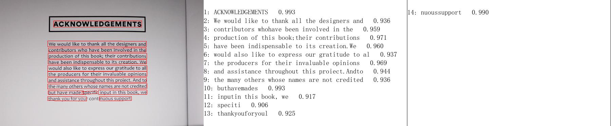

# PaddleOCR Quick Start

**Note:** this tutorial mainly introduces the usage of PP-OCR series models, please refer to [PP-Structure Quick Start](../../ppstructure/docs/quickstart_en.md) for the quick use of document analysis related functions.

- [1. Installation](#1-installation)
    - [1.1 Install PaddlePaddle](#11-install-paddlepaddle)
    - [1.2 Install PaddleOCR Whl Package](#12-install-paddleocr-whl-package)
- [2. Easy-to-Use](#2-easy-to-use)
    - [2.1 Use by Command Line](#21-use-by-command-line)
      - [2.1.1 Chinese and English Model](#211-chinese-and-english-model)
      - [2.1.2 Multi-language Model](#212-multi-language-model)
      - [2.1.3 Layout Analysis](#213-layout-analysis)
    - [2.2 Use by Code](#22-use-by-code)
      - [2.2.1 Chinese & English Model and Multilingual Model](#221-chinese--english-model-and-multilingual-model)
      - [2.2.2 Layout Analysis](#222-layout-analysis)
- [3. Summary](#3-summary)


<a name="1nstallation"></a>

## 1. Installation

<a name="11-install-paddlepaddle"></a>

### 1.1 Install PaddlePaddle

> If you do not have a Python environment, please refer to [Environment Preparation](./environment_en.md).

- If you have CUDA 9 or CUDA 10 installed on your machine, please run the following command to install

  ```bash
  python3 -m pip install paddlepaddle-gpu -i https://mirror.baidu.com/pypi/simple
  ```

- If you have no available GPU on your machine, please run the following command to install the CPU version

  ```bash
  python3 -m pip install paddlepaddle -i https://mirror.baidu.com/pypi/simple
  ```

For more software version requirements, please refer to the instructions in [Installation Document](https://www.paddlepaddle.org.cn/install/quick) for operation.

<a name="12-install-paddleocr-whl-package"></a>

### 1.2 Install PaddleOCR Whl Package

```bash
pip install "paddleocr>=2.0.1" # Recommend to use version 2.0.1+
```

- **For windows users:** If you getting this error `OSError: [WinError 126] The specified module could not be found` when you install shapely on windows. Please try to download Shapely whl file [here](http://www.lfd.uci.edu/~gohlke/pythonlibs/#shapely).

  Reference: [Solve shapely installation on windows](https://stackoverflow.com/questions/44398265/install-shapely-oserror-winerror-126-the-specified-module-could-not-be-found)

- **For layout analysis users**, run the following command to install **Layout-Parser**

  ```bash
  pip3 install -U https://paddleocr.bj.bcebos.com/whl/layoutparser-0.0.0-py3-none-any.whl
  ```

<a name="2-easy-to-use"></a>

## 2. Easy-to-Use

<a name="21-use-by-command-line"></a>

### 2.1 Use by Command Line

PaddleOCR provides a series of test images, click [here](https://paddleocr.bj.bcebos.com/dygraph_v2.1/ppocr_img.zip) to download, and then switch to the corresponding directory in the terminal

```bash
cd /path/to/ppocr_img
```

If you do not use the provided test image, you can replace the following `--image_dir` parameter with the corresponding test image path

<a name="211-english-and-chinese-model"></a>

#### 2.1.1 Chinese and English Model

* Detection, direction classification and recognition: set the parameter`--use_gpu false` to disable the gpu device

  ```bash
  paddleocr --image_dir ./imgs_en/img_12.jpg --use_angle_cls true --lang en --use_gpu false
  ```

  Output will be a list, each item contains bounding box, text and recognition confidence

  ```bash
  [[[441.0, 174.0], [1166.0, 176.0], [1165.0, 222.0], [441.0, 221.0]], ('ACKNOWLEDGEMENTS', 0.9971134662628174)]
  [[[403.0, 346.0], [1204.0, 348.0], [1204.0, 384.0], [402.0, 383.0]], ('We would like to thank all the designers and', 0.9761400818824768)]
  [[[403.0, 396.0], [1204.0, 398.0], [1204.0, 434.0], [402.0, 433.0]], ('contributors who have been involved in the', 0.9791957139968872)]
  ......
  ```

* Only detection: set `--rec` to `false`

  ```bash
  paddleocr --image_dir ./imgs_en/img_12.jpg --rec false
  ```

  Output will be a list, each item only contains bounding box

  ```bash
  [[397.0, 802.0], [1092.0, 802.0], [1092.0, 841.0], [397.0, 841.0]]
  [[397.0, 750.0], [1211.0, 750.0], [1211.0, 789.0], [397.0, 789.0]]
  [[397.0, 702.0], [1209.0, 698.0], [1209.0, 734.0], [397.0, 738.0]]
  ......
  ```

* Only recognition: set `--det` to `false`

  ```bash
  paddleocr --image_dir ./imgs_words_en/word_10.png --det false --lang en
  ```

  Output will be a list, each item contains text and recognition confidence

  ```bash
  ['PAIN', 0.9934559464454651]
  ```

If you need to use the 2.0 model, please specify the parameter `--ocr_version PP-OCR`, paddleocr uses the PP-OCRv3 model by default(`--ocr_version PP-OCRv3`). More whl package usage can be found in [whl package](./whl_en.md)
<a name="212-multi-language-model"></a>

#### 2.1.2 Multi-language Model

Paddleocr currently supports 80 languages, which can be switched by modifying the `--lang` parameter. PP-OCRv3 currently only supports Chinese and English models, and other multilingual models will be updated one after another.

``` bash
paddleocr --image_dir ./doc/imgs_en/254.jpg --lang=en
```

<div align="center">
    
    
</div>
The result is a list, each item contains a text box, text and recognition confidence

```text
[[[67.0, 51.0], [327.0, 46.0], [327.0, 74.0], [68.0, 80.0]], ('PHOCAPITAL', 0.9944712519645691)]
[[[72.0, 92.0], [453.0, 84.0], [454.0, 114.0], [73.0, 122.0]], ('107 State Street', 0.9744491577148438)]
[[[69.0, 135.0], [501.0, 125.0], [501.0, 156.0], [70.0, 165.0]], ('Montpelier Vermont', 0.9357033967971802)]
......
```

Commonly used multilingual abbreviations include

| Language            | Abbreviation |      | Language | Abbreviation |      | Language | Abbreviation |
| ------------------- | ------------ | ---- | -------- | ------------ | ---- | -------- | ------------ |
| Chinese & English   | ch           |      | French   | fr           |      | Japanese | japan        |
| English             | en           |      | German   | german       |      | Korean   | korean       |
| Chinese Traditional | chinese_cht  |      | Italian  | it           |      | Russian  | ru           |

A list of all languages and their corresponding abbreviations can be found in [Multi-Language Model Tutorial](./multi_languages_en.md)
<a name="213-layoutAnalysis"></a>

#### 2.1.3 Layout Analysis

Layout analysis refers to the division of 5 types of areas of the document, including text, title, list, picture and table. For the first three types of regions, directly use the OCR model to complete the text detection and recognition of the corresponding regions, and save the results in txt. For the table area, after the table structuring process, the table picture is converted into an Excel file of the same table style. The picture area will be individually cropped into an image.

To use the layout analysis function of PaddleOCR, you need to specify `--type=structure`

```bash
paddleocr --image_dir=../doc/table/1.png --type=structure
```

- **Results Format**

  The returned results of PP-Structure is a list composed of a dict, an example is as follows

  ```shell
  [
    {   'type': 'Text',
        'bbox': [34, 432, 345, 462],
        'res': ([[36.0, 437.0, 341.0, 437.0, 341.0, 446.0, 36.0, 447.0], [41.0, 454.0, 125.0, 453.0, 125.0, 459.0, 41.0, 460.0]],
                  [('Tigure-6. The performance of CNN and IPT models using difforen', 0.90060663), ('Tent  ', 0.465441)])
    }
  ]
  ```

  The description of each field in dict is as follows

  | Parameter | Description                                                  |
  | --------- | ------------------------------------------------------------ |
  | type      | Type of image area                                           |
  | bbox      | The coordinates of the image area in the original image, respectively [left upper x, left upper y, right bottom x, right bottom y] |
  | res       | OCR or table recognition result of image area。<br> Table: HTML string of the table; <br> OCR: A tuple containing the detection coordinates and recognition results of each single line of text |

- **Parameter Description：**

  | Parameter       | Description                                                  | Default value                                |
  | --------------- | ------------------------------------------------------------ | -------------------------------------------- |
  | output          | The path where excel and recognition results are saved       | ./output/table                               |
  | table_max_len   | The long side of the image is resized in table structure model | 488                                          |
  | table_model_dir | inference model path of table structure model                | None                                         |
  | table_char_dict_path | dict path of table structure model                           | ../ppocr/utils/dict/table_structure_dict.txt |

<a name="22-use-by-code"></a>

### 2.2 Use by Code
<a name="221-chinese---english-model-and-multilingual-model"></a>

#### 2.2.1 Chinese & English Model and Multilingual Model

* detection, angle classification and recognition:

```python
from paddleocr import PaddleOCR,draw_ocr
# Paddleocr supports Chinese, English, French, German, Korean and Japanese.
# You can set the parameter `lang` as `ch`, `en`, `fr`, `german`, `korean`, `japan`
# to switch the language model in order.
ocr = PaddleOCR(use_angle_cls=True, lang='en') # need to run only once to download and load model into memory
img_path = './imgs_en/img_12.jpg'
result = ocr.ocr(img_path, cls=True)
for line in result:
    print(line)


# draw result
from PIL import Image
image = Image.open(img_path).convert('RGB')
boxes = [line[0] for line in result]
txts = [line[1][0] for line in result]
scores = [line[1][1] for line in result]
im_show = draw_ocr(image, boxes, txts, scores, font_path='./fonts/simfang.ttf')
im_show = Image.fromarray(im_show)
im_show.save('result.jpg')
```

Output will be a list, each item contains bounding box, text and recognition confidence

```bash
[[[441.0, 174.0], [1166.0, 176.0], [1165.0, 222.0], [441.0, 221.0]], ('ACKNOWLEDGEMENTS', 0.9971134662628174)]
  [[[403.0, 346.0], [1204.0, 348.0], [1204.0, 384.0], [402.0, 383.0]], ('We would like to thank all the designers and', 0.9761400818824768)]
  [[[403.0, 396.0], [1204.0, 398.0], [1204.0, 434.0], [402.0, 433.0]], ('contributors who have been involved in the', 0.9791957139968872)]
  ......
```

Visualization of results

<div align="center">
    
</div>
<a name="222-layoutAnalysis"></a>

#### 2.2.2 Layout Analysis

```python
import os
import cv2
from paddleocr import PPStructure,draw_structure_result,save_structure_res

table_engine = PPStructure(show_log=True)

save_folder = './output/table'
img_path = './table/1.png'
img = cv2.imread(img_path)
result = table_engine(img)
save_structure_res(result, save_folder,os.path.basename(img_path).split('.')[0])

for line in result:
    line.pop('img')
    print(line)

from PIL import Image

font_path = './fonts/simfang.ttf'
image = Image.open(img_path).convert('RGB')
im_show = draw_structure_result(image, result,font_path=font_path)
im_show = Image.fromarray(im_show)
im_show.save('result.jpg')
```

<a name="3"></a>

## 3. Summary

In this section, you have mastered the use of PaddleOCR whl packages and obtained results.

PaddleOCR is a rich and practical OCR tool library that opens up the whole process of data, model training, compression and inference deployment, so in the [next section](./paddleOCR_overview_en.md) we will first introduce you to the overview of PaddleOCR, and then clone the PaddleOCR project to start the application journey of PaddleOCR.
