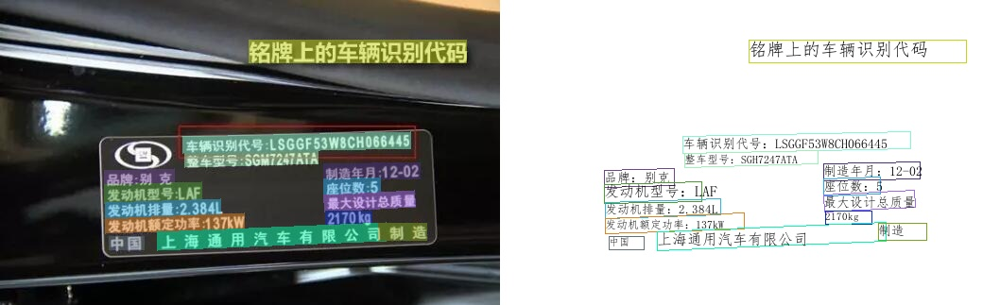
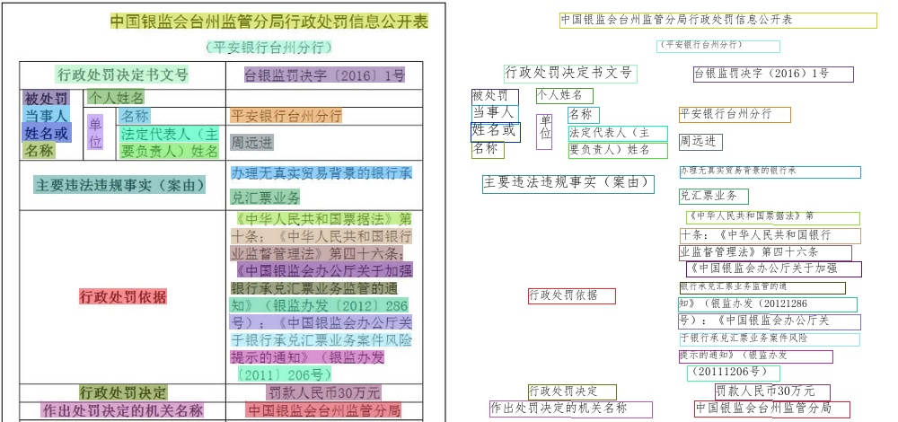
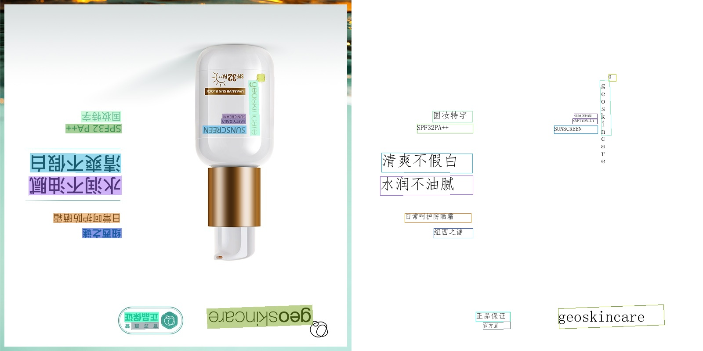
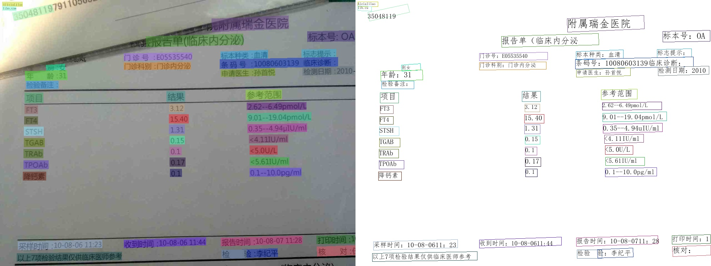
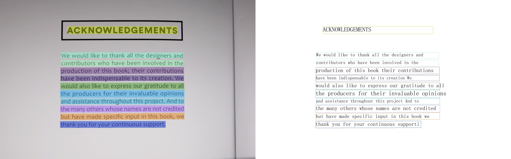

# Visualization

## ch_ppocr_server_1.1

    
    
    
    
    
    

## en_ppocr_mobile_1.1

    

## (multilingual)_ppocr_mobile_1.1

    
    

## ppocr_mobile_1.0

    
    
    
    

## ppocr_server_1.0

    
    
    

