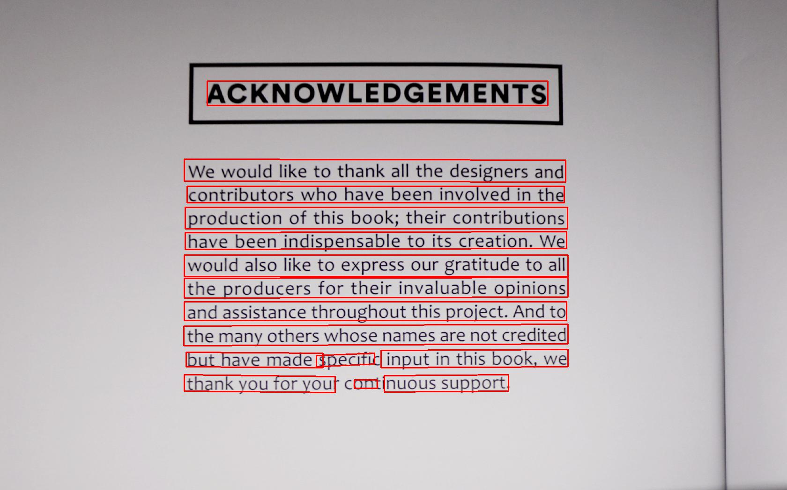

# Paddleocr Package

## 1 Get started quickly
### 1.1 install package
install by pypi
```bash
pip install "paddleocr>=2.0.1" # Recommend to use version 2.0.1+
```

build own whl package and install
```bash
python3 setup.py bdist_wheel
pip3 install dist/paddleocr-x.x.x-py3-none-any.whl # x.x.x is the version of paddleocr
```
## 2 Use
### 2.1 Use by code
The paddleocr whl package will automatically download the ppocr lightweight model as the default model, which can be customized and replaced according to the section 3 **Custom Model**.

* detection angle classification and recognition
```python
from paddleocr import PaddleOCR,draw_ocr
# Paddleocr supports Chinese, English, French, German, Korean and Japanese.
# You can set the parameter `lang` as `ch`, `en`, `french`, `german`, `korean`, `japan`
# to switch the language model in order.
ocr = PaddleOCR(use_angle_cls=True, lang='en') # need to run only once to download and load model into memory
img_path = 'PaddleOCR/doc/imgs_en/img_12.jpg'
result = ocr.ocr(img_path, cls=True)
for line in result:
    print(line)


# draw result
from PIL import Image
image = Image.open(img_path).convert('RGB')
boxes = [line[0] for line in result]
txts = [line[1][0] for line in result]
scores = [line[1][1] for line in result]
im_show = draw_ocr(image, boxes, txts, scores, font_path='/path/to/PaddleOCR/doc/fonts/simfang.ttf')
im_show = Image.fromarray(im_show)
im_show.save('result.jpg')
```

Output will be a list, each item contains bounding box, text and recognition confidence
```bash
[[[442.0, 173.0], [1169.0, 173.0], [1169.0, 225.0], [442.0, 225.0]], ['ACKNOWLEDGEMENTS', 0.99283075]]
[[[393.0, 340.0], [1207.0, 342.0], [1207.0, 389.0], [393.0, 387.0]], ['We would like to thank all the designers and', 0.9357758]]
[[[399.0, 398.0], [1204.0, 398.0], [1204.0, 433.0], [399.0, 433.0]], ['contributors whohave been involved in the', 0.9592447]]
......
```

Visualization of results

<div align="center">
    
</div>

* detection and recognition
```python
from paddleocr import PaddleOCR,draw_ocr
ocr = PaddleOCR(lang='en') # need to run only once to download and load model into memory
img_path = 'PaddleOCR/doc/imgs_en/img_12.jpg'
result = ocr.ocr(img_path, cls=False)
for line in result:
    print(line)

# draw result
from PIL import Image
image = Image.open(img_path).convert('RGB')
boxes = [line[0] for line in result]
txts = [line[1][0] for line in result]
scores = [line[1][1] for line in result]
im_show = draw_ocr(image, boxes, txts, scores, font_path='/path/to/PaddleOCR/doc/fonts/simfang.ttf')
im_show = Image.fromarray(im_show)
im_show.save('result.jpg')
```

Output will be a list, each item contains bounding box, text and recognition confidence
```bash
[[[442.0, 173.0], [1169.0, 173.0], [1169.0, 225.0], [442.0, 225.0]], ['ACKNOWLEDGEMENTS', 0.99283075]]
[[[393.0, 340.0], [1207.0, 342.0], [1207.0, 389.0], [393.0, 387.0]], ['We would like to thank all the designers and', 0.9357758]]
[[[399.0, 398.0], [1204.0, 398.0], [1204.0, 433.0], [399.0, 433.0]], ['contributors whohave been involved in the', 0.9592447]]
......
```

Visualization of results

<div align="center">
    
</div>

* classification and recognition
```python
from paddleocr import PaddleOCR
ocr = PaddleOCR(use_angle_cls=True, lang='en') # need to run only once to load model into memory
img_path = 'PaddleOCR/doc/imgs_words_en/word_10.png'
result = ocr.ocr(img_path, det=False, cls=True)
for line in result:
    print(line)
```

Output will be a list, each item contains recognition text and confidence
```bash
['PAIN', 0.990372]
```

* only detection
```python
from paddleocr import PaddleOCR,draw_ocr
ocr = PaddleOCR() # need to run only once to download and load model into memory
img_path = 'PaddleOCR/doc/imgs_en/img_12.jpg'
result = ocr.ocr(img_path,rec=False)
for line in result:
    print(line)

# draw result
from PIL import Image

image = Image.open(img_path).convert('RGB')
im_show = draw_ocr(image, result, txts=None, scores=None, font_path='/path/to/PaddleOCR/doc/fonts/simfang.ttf')
im_show = Image.fromarray(im_show)
im_show.save('result.jpg')
```

Output will be a list, each item only contains bounding box
```bash
[[756.0, 812.0], [805.0, 812.0], [805.0, 830.0], [756.0, 830.0]]
[[820.0, 803.0], [1085.0, 801.0], [1085.0, 836.0], [820.0, 838.0]]
[[393.0, 801.0], [715.0, 805.0], [715.0, 839.0], [393.0, 836.0]]
......
```

Visualization of results

<div align="center">
    
</div>

* only recognition
```python
from paddleocr import PaddleOCR
ocr = PaddleOCR(lang='en') # need to run only once to load model into memory
img_path = 'PaddleOCR/doc/imgs_words_en/word_10.png'
result = ocr.ocr(img_path, det=False, cls=False)
for line in result:
    print(line)
```

Output will be a list, each item contains recognition text and confidence
```bash
['PAIN', 0.990372]
```

* only classification
```python
from paddleocr import PaddleOCR
ocr = PaddleOCR(use_angle_cls=True) # need to run only once to load model into memory
img_path = 'PaddleOCR/doc/imgs_words_en/word_10.png'
result = ocr.ocr(img_path, det=False, rec=False, cls=True)
for line in result:
    print(line)
```

Output will be a list, each item contains classification result and confidence
```bash
['0', 0.99999964]
```

### 2.2 Use by command line

show help information
```bash
paddleocr -h
```

**Note**: The whl package uses the `PP-OCRv3` model by default, and the input shape used by the recognition model is `3,48,320`, so if you use the recognition function, you need to add the parameter `--rec_image_shape 3,48,320`, if you do not use the default `PP- OCRv3` model, you do not need to set this parameter.

* detection classification and recognition
```bash
paddleocr --image_dir PaddleOCR/doc/imgs_en/img_12.jpg --use_angle_cls true --lang en --rec_image_shape 3,48,320
```

Output will be a list, each item contains bounding box, text and recognition confidence
```bash
[[[441.0, 174.0], [1166.0, 176.0], [1165.0, 222.0], [441.0, 221.0]], ('ACKNOWLEDGEMENTS', 0.9971134662628174)]
[[[403.0, 346.0], [1204.0, 348.0], [1204.0, 384.0], [402.0, 383.0]], ('We would like to thank all the designers and', 0.9761400818824768)]
[[[403.0, 396.0], [1204.0, 398.0], [1204.0, 434.0], [402.0, 433.0]], ('contributors who have been involved in the', 0.9791957139968872)]
......
```

* detection and recognition
```bash
paddleocr --image_dir PaddleOCR/doc/imgs_en/img_12.jpg --lang en --rec_image_shape 3,48,320
```

Output will be a list, each item contains bounding box, text and recognition confidence
```bash
[[[441.0, 174.0], [1166.0, 176.0], [1165.0, 222.0], [441.0, 221.0]], ('ACKNOWLEDGEMENTS', 0.9971134662628174)]
[[[403.0, 346.0], [1204.0, 348.0], [1204.0, 384.0], [402.0, 383.0]], ('We would like to thank all the designers and', 0.9761400818824768)]
[[[403.0, 396.0], [1204.0, 398.0], [1204.0, 434.0], [402.0, 433.0]], ('contributors who have been involved in the', 0.9791957139968872)]
......
```

* classification and recognition
```bash
paddleocr --image_dir PaddleOCR/doc/imgs_words_en/word_10.png --use_angle_cls true --det false --lang en --rec_image_shape 3,48,320
```

Output will be a list, each item contains text and recognition confidence
```bash
['PAIN', 0.9934559464454651]
```

* only detection
```bash
paddleocr --image_dir PaddleOCR/doc/imgs_en/img_12.jpg --rec false
```

Output will be a list, each item only contains bounding box
```bash
[[397.0, 802.0], [1092.0, 802.0], [1092.0, 841.0], [397.0, 841.0]]
[[397.0, 750.0], [1211.0, 750.0], [1211.0, 789.0], [397.0, 789.0]]
[[397.0, 702.0], [1209.0, 698.0], [1209.0, 734.0], [397.0, 738.0]]
......
```

* only recognition
```bash
paddleocr --image_dir PaddleOCR/doc/imgs_words_en/word_10.png --det false --lang en --rec_image_shape 3,48,320
```

Output will be a list, each item contains text and recognition confidence
```bash
['PAIN', 0.9934559464454651]
```

* only classification
```bash
paddleocr --image_dir PaddleOCR/doc/imgs_words_en/word_10.png --use_angle_cls true --det false --rec false
```

Output will be a list, each item contains classification result and confidence
```bash
['0', 0.99999964]
```

## 3 Use custom model
When the built-in model cannot meet the needs, you need to use your own trained model.
First, refer to the first section of [inference_en.md](./inference_en.md) to convert your det and rec model to inference model, and then use it as follows

### 3.1 Use by code

```python
from paddleocr import PaddleOCR,draw_ocr
# The path of detection and recognition model must contain model and params files
ocr = PaddleOCR(det_model_dir='{your_det_model_dir}', rec_model_dir='{your_rec_model_dir}', rec_char_dict_path='{your_rec_char_dict_path}', cls_model_dir='{your_cls_model_dir}', use_angle_cls=True)
img_path = 'PaddleOCR/doc/imgs_en/img_12.jpg'
result = ocr.ocr(img_path, cls=True)
for line in result:
    print(line)

# draw result
from PIL import Image
image = Image.open(img_path).convert('RGB')
boxes = [line[0] for line in result]
txts = [line[1][0] for line in result]
scores = [line[1][1] for line in result]
im_show = draw_ocr(image, boxes, txts, scores, font_path='/path/to/PaddleOCR/doc/fonts/simfang.ttf')
im_show = Image.fromarray(im_show)
im_show.save('result.jpg')
```

### 3.2 Use by command line

```bash
paddleocr --image_dir PaddleOCR/doc/imgs/11.jpg --det_model_dir {your_det_model_dir} --rec_model_dir {your_rec_model_dir} --rec_char_dict_path {your_rec_char_dict_path} --cls_model_dir {your_cls_model_dir} --use_angle_cls true
```

## 4 Use web images or numpy array as input

### 4.1 Web image

- Use by code
```python
from paddleocr import PaddleOCR, draw_ocr
ocr = PaddleOCR(use_angle_cls=True, lang="ch") # need to run only once to download and load model into memory
img_path = 'http://n.sinaimg.cn/ent/transform/w630h933/20171222/o111-fypvuqf1838418.jpg'
result = ocr.ocr(img_path, cls=True)
for line in result:
    print(line)

# show result
from PIL import Image
image = Image.open(img_path).convert('RGB')
boxes = [line[0] for line in result]
txts = [line[1][0] for line in result]
scores = [line[1][1] for line in result]
im_show = draw_ocr(image, boxes, txts, scores, font_path='/path/to/PaddleOCR/doc/fonts/simfang.ttf')
im_show = Image.fromarray(im_show)
im_show.save('result.jpg')
```
- Use by command line
```bash
paddleocr --image_dir http://n.sinaimg.cn/ent/transform/w630h933/20171222/o111-fypvuqf1838418.jpg --use_angle_cls=true
```

### 4.2 Numpy array
Support numpy array as input only when used by code

```python
import cv2
from paddleocr import PaddleOCR, draw_ocr, download_with_progressbar
ocr = PaddleOCR(use_angle_cls=True, lang="ch") # need to run only once to download and load model into memory
img_path = 'PaddleOCR/doc/imgs/11.jpg'
img = cv2.imread(img_path)
# img = cv2.cvtColor(img,cv2.COLOR_BGR2GRAY), If your own training model supports grayscale images, you can uncomment this line
result = ocr.ocr(img_path, cls=True)
for line in result:
    print(line)

# show result
from PIL import Image

download_with_progressbar(img_path, 'tmp.jpg')
image = Image.open('tmp.jpg').convert('RGB')
boxes = [line[0] for line in result]
txts = [line[1][0] for line in result]
scores = [line[1][1] for line in result]
im_show = draw_ocr(image, boxes, txts, scores, font_path='/path/to/PaddleOCR/doc/fonts/simfang.ttf')
im_show = Image.fromarray(im_show)
im_show.save('result.jpg')
```


## 5 Parameter Description

| Parameter                    | Description                                                                                                                                                                                                                 | Default value                  |
|-------------------------|----------------------------------------------------------------------------------------------------------------------------------------------------------------------------------------------------------------------|-------------------------|
| use_gpu                 | use GPU or not                                                                                                                                                                                                          | TRUE                    |
| gpu_mem                 | GPU memory size used for initialization                                                                                                                                                                                              | 8000M                   |
| image_dir               | The images path or folder path for predicting when used by the command line                                                                                                                                                                           |                         |
| det_algorithm           | Type of detection algorithm selected                                                                                                                                                                                                   | DB                      |
| det_model_dir           | the text detection inference model folder. There are two ways to transfer parameters, 1. None: Automatically download the built-in model to `~/.paddleocr/det`; 2. The path of the inference model converted by yourself, the model and params files must be included in the model path | None           |
| det_max_side_len        | The maximum size of the long side of the image. When the long side exceeds this value, the long side will be resized to this size, and the short side will be scaled proportionally                                                                                                                         | 960                     |
| det_db_thresh           | Binarization threshold value of DB output map                                                                                                                                                                                        | 0.3                     |
| det_db_box_thresh       | The threshold value of the DB output box. Boxes score lower than this value will be discarded                                                                                                                                                                         | 0.5                     |
| det_db_unclip_ratio     | The expanded ratio of DB output box                                                                                                                                                                                             | 2                       |
| det_east_score_thresh   | Binarization threshold value of EAST output map                                                                                                                                                                                       | 0.8                     |
| det_east_cover_thresh   | The threshold value of the EAST output box. Boxes score lower than this value will be discarded                                                                                                                                                                         | 0.1                     |
| det_east_nms_thresh     | The NMS threshold value of EAST model output box                                                                                                                                                                                              | 0.2                     |
| rec_algorithm           | Type of recognition algorithm selected                                                                                                                                                                                                | CRNN                    |
| rec_model_dir           | the text recognition inference model folder. There are two ways to transfer parameters, 1. None: Automatically download the built-in model to `~/.paddleocr/rec`; 2. The path of the inference model converted by yourself, the model and params files must be included in the model path | None |
| rec_image_shape         | image shape of recognition algorithm                                                                                                                                                                                            | "3,32,320"              |
| rec_batch_num           | When performing recognition, the batchsize of forward images                                                                                                                                                                                         | 30                      |
| max_text_length         | The maximum text length that the recognition algorithm can recognize                                                                                                                                                                                         | 25                      |
| rec_char_dict_path      | the alphabet path which needs to be modified to your own path when `rec_model_Name` use mode 2                                                                                                                                              | ./ppocr/utils/ppocr_keys_v1.txt                        |
| use_space_char          | Whether to recognize spaces                                                                                                                                                                                                         | TRUE                    |
| drop_score          | Filter the output by score (from the recognition model), and those below this score will not be returned                                                                                                                                                                                                        | 0.5                    |
| use_angle_cls          | Whether to load classification model                                                                                                                                                                                                       | FALSE                    |
| cls_model_dir           | the classification inference model folder. There are two ways to transfer parameters, 1. None: Automatically download the built-in model to `~/.paddleocr/cls`; 2. The path of the inference model converted by yourself, the model and params files must be included in the model path | None |
| cls_image_shape         | image shape of classification algorithm                                                                                                                                                                                            | "3,48,192"              |
| label_list         | label list of classification algorithm                                                                                                                                                                                            | ['0','180']           |
| cls_batch_num           | When performing classification, the batchsize of forward images                                                                                                                                                                                         | 30                      |
| enable_mkldnn           | Whether to enable mkldnn                                                                                                                                                                                                       | FALSE                   |
| use_zero_copy_run           | Whether to forward by zero_copy_run                                                                                                                                                                               | FALSE                   |
| lang                     | The support language, now only Chinese(ch)、English(en)、French(french)、German(german)、Korean(korean)、Japanese(japan) are supported                                                                                                                                                                                                  | ch                    |
| det                     | Enable detction when `ppocr.ocr` func exec                                                                                                                                                                                                   | TRUE                    |
| rec                     | Enable recognition when `ppocr.ocr` func exec                                                                                                                                                                                                   | TRUE                    |
| cls                     | Enable classification when `ppocr.ocr` func exec((Use use_angle_cls in command line mode to control whether to start classification in the forward direction)                                                                                                                                                                                                   | FALSE                    |
| show_log                     | Whether to print log| FALSE                    |
| type                     | Perform ocr or table structuring, the value is selected in ['ocr','structure']                                                                                                                                                                                             | ocr                    |
| ocr_version                     | OCR Model version number, the current model support list is as follows: PP-OCRv3 support Chinese and English detection and recognition model and direction classifier model, PP-OCRv2 support Chinese detection and recognition model, PP-OCR support Chinese detection, recognition and direction classifier, multilingual recognition model | PP-OCRv3                 |
| structure_version                     | table structure Model version number, the current model support list is as follows: PP-STRUCTURE support english table structure model | PP-STRUCTURE                 |
