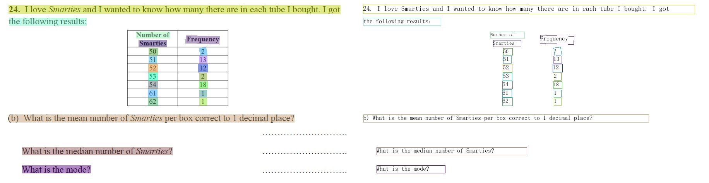

[English](../../README_en.md) | [简体中文](../../README.md) | हिन्दी | [日本語](./README_日本語.md) | [한국인](./README_한국어.md) | [Pу́сский язы́к](./README_Ру́сский_язы́к.md)

<p align="center">
 
<p align="center">
<p align="left">
    <a href="./LICENSE"></a>
    <a href="https://github.com/PaddlePaddle/PaddleOCR/releases"></a>
    <a href=""></a>
    <a href=""></a>
    <a href=""></a>
    <a href="https://pypi.org/project/PaddleOCR/"></a>
    <a href="https://github.com/PaddlePaddle/PaddleOCR/stargazers"></a>
</p>


## प्रस्तावना
पैडलओसीआर का उद्देश्य बहुभाषी,शानदार , ओसीआर और व्यावहारिक ओसीआरउपकरण बनाना है जो यूजर्स को बेहतर मॉडलों  के लिए प्रशिक्षित करने और उन्हें व्यवहार में लागू करने में मदद करते हैं।

<div align="center">
    
</div>
<div align="center">
    
</div>


<div align="center">
    
</div>


## 📣 हाल के अद्यतन
- **🔥2022.8.24 रिलीज Paddleओसीआर [रिलीज/2.6](https://github.com/PaddlePaddle/PaddleOCR/tree/release/2.6)**
  -  रिलीज [PP-Structurev2](../../ppstructure)，फंक्शन और परफॉरमेंस के साथ पूरी तरह से उन्नत, चायनीज शीन्स के अनुकूल, और मदद के लिए [लेआउट रिकवरी](../../ppstructure/recovery) और **पीडीएफ को वर्ड में बदलने के लिए वन लाइन कमांड**;
  - [लेआउट एनालाइस](../../ppstructure/layout) ऑप्टिमाइजेशन: मॉडल स्टोरेज में 95% की कमी, जबकि स्पीड में 11 गुना वृद्धि , और एवरेज CPU स टाइम-कॉस्ट केवल 41ms है;
  - [टेबल रिकोगनाइजेशन](../../ppstructure/table) ऑप्टिमाइजेशन: 3 ऑप्टिमाइज़ेशन के तरीके डिजाइन किए गए हैं, और तुलनात्मक समय की खपत के तहत मॉडल सटीकता में 6% का सुधार हुआ है;
  - [की इंफॉर्मेशन एक्स्ट्रेक्शन](../../ppstructure/kie) ऑप्टिमाइजेशन : एक बिजुवल-स्वतंत्र मॉडल संरचना डिजाइन की गई है, सिमेंटिक एन्टाइटी रिकग्निशन की सटीकता में 2.8% की वृद्धि हुई है, और रिलेशन एक्सट्रैक्शन की सटीकता में 9.1% की वृद्धि हुई है।

- **🔥2022.7 रिलीज [ओसीआर दृश्य आवेदन संग्रह](../../applications/README_en.md)**
  - रिलीज **9 वर्टिकल मॉडल** जैसे कि डिजिटल ट्यूब, एलसीडी स्क्रीन, लाइसेंस प्लेट, हस्तलेखन पहचान मॉडल, उच्च-सटीक एसवीटीआर मॉडल, आदि, जो सामान्य रूप से मुख्य ओसीआर वर्टिकल अनुप्रयोगों, विनिर्माण, वित्त और परिवहन उद्योगों को कवर करते हैं।

- **🔥2022.5.9 रिलीज Paddleओसीआर [रिलीज/2.5](https://github.com/PaddlePaddle/Paddleओसीआर/tree/release/2.5)**
    - रिलीज [PP-OCRv3](../doc_en/ppocr_introduction_en.md#pp-ocrv3):      तुलनात्मक स्पीड के साथ, चाइनीज शीन्स का प्रभाव PP-ओसीआर v2 की तुलना में 5% की और वृद्धि हुयी है इंगलिस शीन्स के प्रभाव में 11% का  सुधार हुआ है, और 80 भाषाओं के बहुभाषी मॉडलों की औसत पहचान सटीकता में 5% से अधिक सुधार हुआ है।
    - रिलीज़ [PPOCRLabelv2](https://github.com/PFCCLab/PPOCRLabel/blob/main/README.md): टेबल टेबल रिकोगनाइजेशन टास्क की इंफॉर्मेशन एक्स्ट्रेक्शन टास्क और अनियमित  टेक्सट इमेज के लिए एनोटेशन फ़ंक्शन एड करे।

    - इंटरएक्टिव ई-बुक जारी करें [*"ओसीआर में गोता लगाएँ"*](../doc_en/ocr_book_en.md), ओसीआर पूर्ण स्टैक तकनीक के अत्याधुनिक सिद्धांत और कोड प्रेक्टिस को कवर करता है।

- [और अधिक](../doc_en/update_en.md)


## 🌟 विशेषताएँ

Paddleओसीआर से संबंधित विभिन्न प्रकार के अत्याधुनिक एल्गोरिथ्म को सपोर्ट करता है, और विकसित औद्योगिक विशेष रुप से प्रदर्शित मॉडल/समाधान [PP- OCR](../doc_en/ppocr_introduction_en.md) और [PP-Structure](../../ppstructure/README.md) इस आधार पर और डेटा प्रोडक्शन की पूरी प्रोसेस के माध्यम से प्राप्त करें, मॉडल ट्रेनिंग, दबाव, अनुमान और  तैनाती।

<div align="center">
    
</div>

## ⚡ शीघ्र अनुभव

```bash
pip3 install paddlepaddle # for gpu user please install paddlepaddle-gpu
pip3 install paddleocr
paddleocr --image_dir /your/test/image.jpg --lang=hi
```

> यदि आपके पास पायथन एनवायरनमेंट नहीं है, कृपया फॉलो कीजिए [एनवायरनमेंट प्रिपेरेशन](../doc_en/environment_en.md).    हम अनुशंसा करते हैं कि आप इसके साथ शुरुआत करें [ट्यूटोरियल](#Tutorials).

<a name="किताब"></a>

## 📚 ई-बुक: *ओसीआर में गोता लगाएँ*
- [ओसीआर में गोता लगाएँ](../doc_en/ocr_book_en.md)

<a name="कम्युनिटी"></a>

## 👫 समुदाय

अंतरराष्ट्रीय डेवलपर्स के लिए, हम सम्मान करते हैं [पैडलओसीआर चर्चाएँ] (https://github.com/PaddlePaddle/PaddleOCR/discussions) हमारे अंतरराष्ट्रीय कम्युनिटी मंच के रूप में। यहां सभी विचारों और प्रश्नों पर अंग्रेजी में चर्चा की जा सकती है।

<a name="समर्थित-चीनी-मॉडल-लिस्ट"></a>

## 🛠️ PP-ओसीआर श्रृंखला मॉडल सूची

|     मॉडल   प्रस्तावना                                                                                    |          मॉडल    नाम                 | रिकमेंडिड  सीन    |   डिटेक्शन मॉडल                                                                                 | रिकोगनाइजेशन मॉडल                                                                        |
| ------------------------------------------------------------ | ---------------------------- | ----------------- | ------------------------------------------------------------ | ------------------------------------------------------------ |
| हिन्दी：हिन्दी अल्ट्रा-लाइटवेट PP-ओसीआरv3 सिस्टम (9.9M) | devanagari_PP-ओसीआरv3_xx | मोबाइल और सर्वर |[इन्फरन्स मॉडल](https://paddleocr.bj.bcebos.com/PP-OCRv3/multilingual/Multilingual_PP-OCRv3_det_infer.tar) / [प्रशिक्षितमॉडल](https://paddleocr.bj.bcebos.com/PP-OCRv3/multilingual/Multilingual_PP-OCRv3_det_distill_train.tar) | [इन्फरन्समॉडल](https://paddleocr.bj.bcebos.com/PP-OCRv3/multilingual/devanagari_PP-OCRv3_rec_infer.tar) / [प्रशिक्षित मॉडल](https://paddleocr.bj.bcebos.com/PP-OCRv3/multilingual/devanagari_PP-OCRv3_rec_train.tar) |
| इंग्लिश अल्ट्रा- लाइट वेट PP-ओसीआरv3 मॉडल （13.4M） | en_PP-ओसीआरv3_xx  | मोबाइल और  सर्वर  | [इन्फरन्स मॉडल](https://paddleocr.bj.bcebos.com/PP-OCRv3/english/en_PP-OCRv3_det_infer.tar) / [प्रशिक्षितमॉडल](https://paddleocr.bj.bcebos.com/PP-OCRv3/english/en_PP-OCRv3_det_distill_train.tar)| [इन्फरन्समॉडल](https://paddleocr.bj.bcebos.com/PP-OCRv3/english/en_PP-OCRv3_rec_infer.tar) / [प्रशिक्षित मॉडल](https://paddleocr.bj.bcebos.com/PP-OCRv3/english/en_PP-OCRv3_rec_train.tar) |
| चाइनीस और इंग्लिश अल्ट्रा- लाइट वेट PP-ओसीआरv3 मॉडल（16.2M）     | ch_PP-ओसीआरv3_xx          | मोबाइल और सर्वर | [इन्फरन्स मॉडल](https://paddleocr.bj.bcebos.com/PP-OCRv3/chinese/ch_PP-OCRv3_det_infer.tar) / [प्रशिक्षित मॉडल](https://paddleocr.bj.bcebos.com/PP-OCRv3/chinese/ch_PP-OCRv3_det_distill_train.tar) | [प्रशिक्षित मॉडल](https://paddleocr.bj.bcebos.com/PP-OCRv3/chinese/ch_PP-OCRv3_rec_infer.tar) / [प्रशिक्षित मॉडल](https://paddleocr.bj.bcebos.com/PP-OCRv3/chinese/ch_PP-OCRv3_rec_train.tar) |


- अधिक मॉडल डाउनलोड (एकाधिक भाषाओं सहित) के लिए, कृपया [PP-ओसीआर सीरीज मॉडल डाउनलोड](../doc_en/models_list_en.md) देखें।
- एक नए भाषा अनुरोध के लिए, कृपया [नई भाषा अनुरोधों के लिए दिशानिर्देश](#language_requests).
- स्ट्रक्चर मॉडल डोकोमेंट एनालाइज के लिए, कृपया देखें [PP-Structure models](../../ppstructure/docs/models_list_en.md).

<a name="ट्यूटोरियल"></a>

## 📖 ट्यूटोरियल

- [एनवायरनमेंट प्रिपरेशन](../doc_en/environment_en.md)
- [PP-OCR 🔥](../doc_en/ppocr_introduction_en.md)
    - [क्विक स्टार्ट](../doc_en/quickstart_en.md)
    - [मॉडल जू](../doc_en/models_en.md)
    - [मॉडल ट्रेनिंग](../doc_en/training_en.md)
        - [टेक्सट डिटेक्शन](../doc_en/detection_en.md)
        - [टेक्सट रिकोगनीशन](../doc_en/recognition_en.md)
        - [टेक्सट डायरेक्शन क्लासिफिकेशन](../doc_en/angle_class_en.md)
    - मॉडल कम्प्रेशन
        - [मॉडल परिमाणीकरण](./deploy/slim/quantization/README_en.md)
        - [मॉडल प्रूनिंग](./deploy/slim/prune/README_en.md)
        - [ज्ञान आसवन](../doc_en/knowledge_distillation_en.md)
    - [इन्फरन्स और डिप्लोमेन्ट](./deploy/README.md)
        - [Python इन्फरन्स](../doc_en/inference_ppocr_en.md)
        - [C++ इन्फरन्स](./deploy/cpp_infer/readme.md)
        - [सरविंग](./deploy/pdserving/README.md)
        - [मोबाइल](./deploy/lite/readme.md)
        - [Paddle2ONNX](./deploy/paddle2onnx/readme.md)
        - [पैडल क्लाउड](./deploy/paddlecloud/README.md)
        - [Benchmark](../doc_en/benchmark_en.md)
- [PP-Structure 🔥](../../ppstructure/README.md)
    - [क्विक स्टार्ट](../../ppstructure/docs/quickstart_en.md)
    - [मॉडल जू](../../ppstructure/docs/models_list_en.md)
    - [मॉडल ट्रेनिंग](../doc_en/training_en.md)
        - [लेआउट एनालाइस](../../ppstructure/layout/README.md)
        - [टेबल रिकोगनाइजेशन](../../ppstructure/table/README.md)
        - [की इंफॉर्मेशन एक्स्ट्रेक्शन](../../ppstructure/kie/README.md)
    - [इन्फरन्स और डिप्लोमेन्ट](./deploy/README.md)
        - [Python इन्फरन्स](../../ppstructure/docs/inference_en.md)
        - [C++ इन्फरन्स](./deploy/cpp_infer/readme.md)
        - [सरविंग](./deploy/hubserving/readme_en.md)
- [एकेडमिक एल्गोरिथम](../doc_en/algorithm_overview_en.md)
    - [टेक्स्ट डिनेक्शन](../doc_en/algorithm_overview_en.md)
    - [टेक्स्ट रिकोगनाइजेशन](../doc_en/algorithm_overview_en.md)
    - [एंड-टू-एंड ओसीआर](../doc_en/algorithm_overview_en.md)
    - [टेबल रिकोगनाइजेशन](../doc_en/algorithm_overview_en.md)
    - [की इंफॉर्मेशन एक्स्ट्रेक्शन](../doc_en/algorithm_overview_en.md)
    - [पैडलओसीआर में नए एल्गोरिदम जोड़ें](../doc_en/add_new_algorithm_en.md)
- डेटा एनोटेशन और सिंथेसिस
    - [सेमी-ऑटोमैटिक एनोटेशन टूल: PPओसीआरलेबल](https://github.com/PFCCLab/PPOCRLabel/blob/main/README.md)
    - [डेटा सिंथेसिस टूल: स्टाइल-टेक्सट](https://github.com/PFCCLab/StyleText/blob/main/README.md)
    - [अन्य डेटा एनोटेशन टूल](../doc_en/data_annotation_en.md)
    - [अन्य डेटा सिंथेसिस टूल](../doc_en/data_synthesis_en.md)
- डेटा सेट
    - [सामान्य ओसीआर डेटासेट (चीनी/अंग्रेज़ी)](../doc_en/dataset/datasets_en.md)
    - [हस्तलिखित_ओसीआर_डेटासेट (चीनी)](../doc_en/dataset/handwritten_datasets_en.md)
    - [विभिन्न ओसीआर
    डेटासेट (बहुभाषी)](../doc_en/dataset/vertical_and_multilingual_datasets_en.md)
    - [लेआउट एनालाइस](../doc_en/dataset/layout_datasets_en.md)
    - [टेबल रिकोगनाइजेशन](../doc_en/dataset/table_datasets_en.md)
    - [की इंफॉर्मेशन एक्स्ट्रेक्शन](../doc_en/dataset/kie_datasets_en.md)
- [कोड संरचना](../doc_en/tree_en.md)
- [विसुमलाइजेशन](#Visualization)
- [कम्युनिटी](#Community)
- [नई भाषा के लिए अनुरोध](#language_requests)
- [सामान्य प्रश्न](../doc_en/FAQ_en.md)
- [रेफरेन्सेस](../doc_en/reference_en.md)
- [लाइसेंस](#LICENSE)

<a name="language_requests"></a>

## 🇺🇳 नई भाषा अनुरोधों के लिए संयुक्त राष्ट्र दिशानिर्देश

अगर आप **एक नए भाषा मॉडल का अनुरोध करना चाहते हैं**, तो कृपया [बहुभाषी मॉडल अपग्रेड के लिए वोट करें](https://github.com/PaddlePaddle/PaddleOCR/discussions/7253) में वोट करें। हम नियमित रूप से परिणाम के अनुसार मॉडल को अपग्रेड करेंगे। **अपने दोस्तों को एक साथ वोट करने के लिए आमंत्रित करें!**

यदि आपको **एक नए भाषा मॉडल को प्रशिक्षित करने** अपने परिदृश्य के आधार पर, तो यह [बहुभाषी  मॉडल  ट्रेनिंग  प्रोजेक्ट  ट्रेनिंग](https://github.com/PaddlePaddle/PaddleOCR/discussions/7252) ट्यूटोरियल आपको डेटासेट तैयार करने में मदद करेगा और आपको स्टेप बाए स्टेप पूरा प्रोसेस दिखाएगा

मूल [बहुभाषी ओसीआर विकास योजना](https://github.com/PaddlePaddle/PaddleOCR/issues/1048) अभी भी आपको बहुत सारे उपयोगी संग्रह और शब्दकोश दिखाता है

<a name="विसुमलाइजेशन"></a>

## 👀 विज़ुअलाइज़ेशन [अधिक](../doc_en/visualization_en.md)

<details open>
<summary>PP-OCRv3 बहुभाषी मॉडल</summary>
<div align="center">
    
    
</div>
</details>

<details open>
<summary>PP-OCRv3 अंग्रेजी मॉडल</summary>
<div align="center">
    
    
</div>
</details>
<details open>
<summary>PP-OCRv3 चीनी मॉडल</summary>
<div align="center">
    
    
    
</div>
</details>

<details open>
<summary>PP-Structurev2</summary>
1. लेआउट एनालाइस + टेबल रिकोगनाइजेशन
<div align="center">
    
</div>
2. SER (सिमेंटिक एंटिटी रिकोगनाइजेशन)
<div align="center">
    
</div>
<div align="center">
    
</div>
<div align="center">
    
</div>
3. RE (रिलेशन एक्सट्रैक्शन)
<div align="center">
    
</div>
<div align="center">
    
</div>
<div align="center">
    
</div>
</details>

<a name="लाइसेंस"></a>

## 📄 लाइसेंस
इस प्रोजेक्ट को इन परियोजना के तहत जारी किया गया है <a href="https://github.com/PaddlePaddle/PaddleOCR/blob/master/LICENSE">Apache 2.0 license</a>
