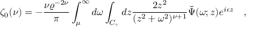

# 印刷数学公式识别算法-LaTeX-OCR

## 1. 算法简介

原始项目：
> [https://github.com/lukas-blecher/LaTeX-OCR](https://github.com/lukas-blecher/LaTeX-OCR)


`LaTeX-OCR`使用[`LaTeX-OCR印刷公式数据集`](https://drive.google.com/drive/folders/13CA4vAmOmD_I_dSbvLp-Lf0s6KiaNfuO)进行训练，在对应测试集上的精度如下：

| 模型        | 骨干网络       |配置文件 | BLEU score  | normed edit distance  |  ExpRate  |下载链接|
|-----------|------------| ----- |:-----------:|:---------------------:|:---------:| ----- |
| LaTeX-OCR | Hybrid ViT |[rec_latex_ocr.yml](https://github.com/PaddlePaddle/PaddleOCR/blob/main/configs/rec/rec_latex_ocr.yml)|   0.8821    |        0.0823         |  40.01%   |[训练模型](https://paddleocr.bj.bcebos.com/contribution/rec_latex_ocr_train.tar)|

## 2. 环境配置
请先参考[《运行环境准备》](../../ppocr/environment.md)配置PaddleOCR运行环境，参考[《项目克隆》](../../ppocr/blog/clone.md)克隆项目代码。

此外，需要安装额外的依赖：
```shell
pip install -r docs/algorithm/formula_recognition/requirements.txt
```

## 3. 模型训练、评估、预测

### 3.1 pickle 标签文件生成
从[谷歌云盘](https://drive.google.com/drive/folders/13CA4vAmOmD_I_dSbvLp-Lf0s6KiaNfuO)中下载 formulae.zip 和 math.txt，之后，使用如下命令，生成 pickle 标签文件。

```shell
# 创建 LaTeX-OCR 数据集目录
mkdir -p train_data/LaTeXOCR
# 解压formulae.zip ，并拷贝math.txt
unzip -d train_data/LaTeXOCR path/formulae.zip
cp path/math.txt train_data/LaTeXOCR
# 将原始的 .txt 文件转换为 .pkl 文件，从而对不同尺度的图像进行分组
# 训练集转换
python ppocr/utils/formula_utils/math_txt2pkl.py --image_dir=train_data/LaTeXOCR/train --mathtxt_path=train_data/LaTeXOCR/math.txt --output_dir=train_data/LaTeXOCR/
# 验证集转换
python ppocr/utils/formula_utils/math_txt2pkl.py --image_dir=train_data/LaTeXOCR/val --mathtxt_path=train_data/LaTeXOCR/math.txt --output_dir=train_data/LaTeXOCR/
# 测试集转换
python ppocr/utils/formula_utils/math_txt2pkl.py --image_dir=train_data/LaTeXOCR/test --mathtxt_path=train_data/LaTeXOCR/math.txt --output_dir=train_data/LaTeXOCR/
```

### 3.2 模型训练

请参考[文本识别训练教程](../../ppocr/model_train/recognition.md)。PaddleOCR对代码进行了模块化，训练`LaTeX-OCR`识别模型时需要**更换配置文件**为`LaTeX-OCR`的[配置文件](https://github.com/PaddlePaddle/PaddleOCR/blob/main/configs/rec/rec_latex_ocr.yml)。

#### 启动训练


具体地，在完成数据准备后，便可以启动训练，训练命令如下：
```shell
#单卡训练 (默认训练方式)
python3 tools/train.py -c configs/rec/rec_latex_ocr.yml
#多卡训练，通过--gpus参数指定卡号
python3 -m paddle.distributed.launch --gpus '0,1,2,3'  tools/train.py -c configs/rec/rec_latex_ocr.yml
```

**注意：**

- 默认每训练22个epoch（60000次iteration）进行1次评估，若您更改训练的batch_size，或更换数据集，请在训练时作出如下修改
```
python3 tools/train.py -c configs/rec/rec_latex_ocr.yml -o Global.eval_batch_step=[0,{length_of_dataset//batch_size*22}]
```

### 3.3 评估

可下载已训练完成的[模型文件](https://paddleocr.bj.bcebos.com/contribution/rec_latex_ocr_train.tar)，使用如下命令进行评估：

```shell
# 注意将pretrained_model的路径设置为本地路径。若使用自行训练保存的模型，请注意修改路径和文件名为{path/to/weights}/{model_name}。
# 验证集评估
python3 tools/eval.py -c configs/rec/rec_latex_ocr.yml -o Global.pretrained_model=./rec_latex_ocr_train/best_accuracy.pdparams
# 测试集评估
python3 tools/eval.py -c configs/rec/rec_latex_ocr.yml -o Global.pretrained_model=./rec_latex_ocr_train/best_accuracy.pdparams Eval.dataset.data_dir=./train_data/LaTeXOCR/test Eval.dataset.data=./train_data/LaTeXOCR/latexocr_test.pkl
```

### 3.4 预测

使用如下命令进行单张图片预测：
```shell
# 注意将pretrained_model的路径设置为本地路径。
python3 tools/infer_rec.py -c configs/rec/rec_latex_ocr.yml  -o  Global.infer_img='./docs/datasets/images/pme_demo/0000013.png' Global.pretrained_model=./rec_latex_ocr_train/best_accuracy.pdparams
# 预测文件夹下所有图像时，可修改infer_img为文件夹，如 Global.infer_img='./doc/datasets/pme_demo/'。
```

## 4. 推理部署

### 4.1 Python推理
首先将训练得到best模型，转换成inference model。这里以训练完成的模型为例（[模型下载地址](https://paddleocr.bj.bcebos.com/contribution/rec_latex_ocr_train.tar)），可以使用如下命令进行转换：

```shell
# 注意将pretrained_model的路径设置为本地路径。
python3 tools/export_model.py -c configs/rec/rec_latex_ocr.yml -o Global.pretrained_model=./rec_latex_ocr_train/best_accuracy.pdparams Global.save_inference_dir=./inference/rec_latex_ocr_infer/ 

# 目前的静态图模型支持的最大输出长度为512
```
**注意：**
- 如果您是在自己的数据集上训练的模型，并且调整了字典文件，请检查配置文件中的`rec_char_dict_path`是否为所需要的字典文件。
- [转换后模型下载地址](https://paddleocr.bj.bcebos.com/contribution/rec_latex_ocr_infer.tar)

转换成功后，在目录下有三个文件：
```
/inference/rec_latex_ocr_infer/
    ├── inference.pdiparams         # 识别inference模型的参数文件
    ├── inference.pdiparams.info    # 识别inference模型的参数信息，可忽略
    └── inference.pdmodel           # 识别inference模型的program文件
```

执行如下命令进行模型推理：

```shell
python3 tools/infer/predict_rec.py --image_dir='./docs/datasets/images/pme_demo/0000295.png' --rec_algorithm="LaTeXOCR" --rec_batch_num=1 --rec_model_dir="./inference/rec_latex_ocr_infer/"  --rec_char_dict_path="./ppocr/utils/dict/latex_ocr_tokenizer.json"

# 预测文件夹下所有图像时，可修改image_dir为文件夹，如 --image_dir='./doc/datasets/pme_demo/'。
```
&nbsp;



执行命令后，上面图像的预测结果（识别的文本）会打印到屏幕上，示例如下：
```shell
Predicts of ./doc/datasets/pme_demo/0000295.png:\zeta_{0}(\nu)=-{\frac{\nu\varrho^{-2\nu}}{\pi}}\int_{\mu}^{\infty}d\omega\int_{C_{+}}d z{\frac{2z^{2}}{(z^{2}+\omega^{2})^{\nu+1}}}{\tilde{\Psi}}(\omega;z)e^{i\epsilon z}~~~,
```


**注意**：

- 需要注意预测图像为**白底黑字**，即手写公式部分为黑色，背景为白色的图片。
- 在推理时需要设置参数`rec_char_dict_path`指定字典，如果您修改了字典，请修改该参数为您的字典文件。
- 如果您修改了预处理方法，需修改`tools/infer/predict_rec.py`中 LaTeX-OCR 的预处理为您的预处理方法。


### 4.2 C++推理部署

由于C++预处理后处理还未支持 LaTeX-OCR，所以暂未支持

### 4.3 Serving服务化部署

暂不支持

### 4.4 更多推理部署

暂不支持

## 5. FAQ

1. LaTeX-OCR 数据集来自于[LaTeXOCR源repo](https://github.com/lukas-blecher/LaTeX-OCR) 。
