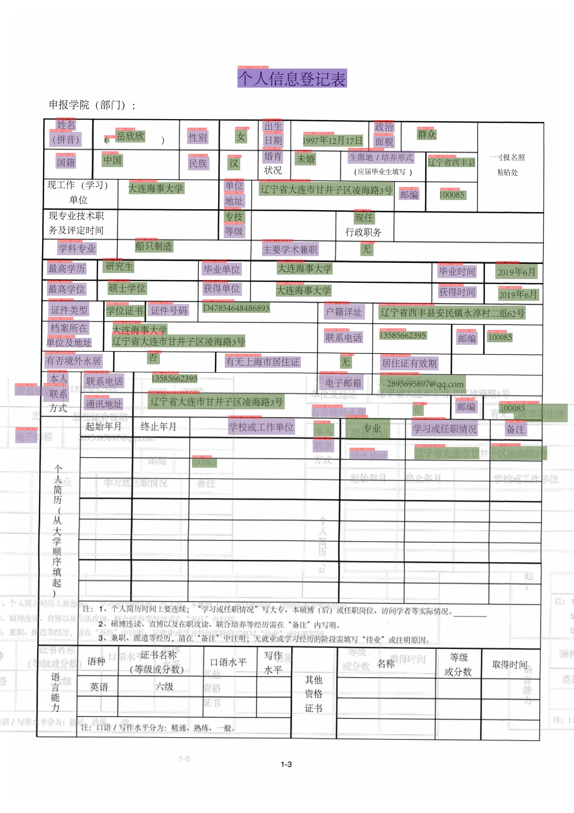

# KIE Algorithm - LayoutXLM

## 1. Introduction

Paper:

> [LayoutXLM: Multimodal Pre-training for Multilingual Visually-rich Document Understanding](https://arxiv.org/abs/2104.08836)
>
> Yiheng Xu, Tengchao Lv, Lei Cui, Guoxin Wang, Yijuan Lu, Dinei Florencio, Cha Zhang, Furu Wei
>
> 2021

On XFUND_zh dataset, the algorithm reproduction Hmean is as follows.

|Model|Backbone|Task |Cnnfig|Hmean|Download link|
| --- | --- |--|--- | --- | --- |
|LayoutXLM|LayoutXLM-base|SER |[ser_layoutxlm_xfund_zh.yml](https://github.com/PaddlePaddle/PaddleOCR/tree/main/configs/kie/layoutlm_series/ser_layoutxlm_xfund_zh.yml)|90.38%|[trained model](https://paddleocr.bj.bcebos.com/pplayout/ser_LayoutXLM_xfun_zh.tar)/[inference model](https://paddleocr.bj.bcebos.com/pplayout/ser_LayoutXLM_xfun_zh_infer.tar)|
|LayoutXLM|LayoutXLM-base|RE | [re_layoutxlm_xfund_zh.yml](https://github.com/PaddlePaddle/PaddleOCR/tree/main/configs/kie/layoutlm_series/re_layoutxlm_xfund_zh.yml)|74.83%|[trained model](https://paddleocr.bj.bcebos.com/pplayout/re_LayoutXLM_xfun_zh.tar)/[inference model](https://paddleocr.bj.bcebos.com/pplayout/re_LayoutXLM_xfun_zh_infer.tar)|

## 2. Environment

Please refer to ["Environment Preparation"](../../ppocr/environment.en.md) to configure the PaddleOCR environment, and refer to ["Project Clone"](../../ppocr/blog/clone.en.md)to clone the project code.

## 3. Model Training / Evaluation / Prediction

Please refer to [KIE tutorial](../../ppocr/model_train/kie.en.md)。PaddleOCR has modularized the code structure, so that you only need to **replace the configuration file** to train different models.

## 4. Inference and Deployment

### 4.1 Python Inference

#### SER

First, we need to export the trained model into inference model. Take LayoutXLM model trained on XFUND_zh as an example ([trained model download link](https://paddleocr.bj.bcebos.com/pplayout/ser_LayoutXLM_xfun_zh.tar)). Use the following command to export.

``` bash
wget https://paddleocr.bj.bcebos.com/pplayout/ser_LayoutXLM_xfun_zh.tar
tar -xf ser_LayoutXLM_xfun_zh.tar
python3 tools/export_model.py -c configs/kie/layoutlm_series/ser_layoutxlm_xfund_zh.yml -o Architecture.Backbone.checkpoints=./ser_LayoutXLM_xfun_zh Global.save_inference_dir=./inference/ser_layoutxlm_infer
```

Use the following command to infer using LayoutXLM SER model:

```bash linenums="1"
cd ppstructure
python3 kie/predict_kie_token_ser.py \
  --kie_algorithm=LayoutXLM \
  --ser_model_dir=../inference/ser_layoutxlm_infer \
  --image_dir=./docs/kie/input/zh_val_42.jpg \
  --ser_dict_path=../train_data/XFUND/class_list_xfun.txt \
  --vis_font_path=../doc/fonts/simfang.ttf
```

The SER visualization results are saved in the `./output` directory by default. The results are as follows.



#### RE

First, we need to export the trained model into inference model. Take LayoutXLM model trained on XFUND_zh as an example ([trained model download link](https://paddleocr.bj.bcebos.com/pplayout/re_LayoutXLM_xfun_zh.tar)). Use the following command to export.

``` bash
wget https://paddleocr.bj.bcebos.com/pplayout/re_LayoutXLM_xfun_zh.tar
tar -xf re_LayoutXLM_xfun_zh.tar
python3 tools/export_model.py -c configs/kie/layoutlm_series/re_layoutxlm_xfund_zh.yml -o Architecture.Backbone.checkpoints=./re_LayoutXLM_xfun_zh Global.save_inference_dir=./inference/re_layoutxlm_infer
```

Use the following command to infer using LayoutXLM RE model:

```bash linenums="1"
cd ppstructure
python3 kie/predict_kie_token_ser_re.py \
  --kie_algorithm=LayoutXLM \
  --re_model_dir=../inference/re_layoutxlm_infer \
  --ser_model_dir=../inference/ser_layoutxlm_infer \
  --image_dir=./docs/kie/input/zh_val_42.jpg \
  --ser_dict_path=../train_data/XFUND/class_list_xfun.txt \
  --vis_font_path=../doc/fonts/simfang.ttf
```

The RE visualization results are saved in the `./output` directory by default. The results are as follows.


### 4.2 C++ Inference

Not supported

### 4.3 Serving

Not supported

### 4.4 More

Not supported

## 5. FAQ

## Citation

```bibtex
@article{DBLP:journals/corr/abs-2104-08836,
  author    = {Yiheng Xu and
               Tengchao Lv and
               Lei Cui and
               Guoxin Wang and
               Yijuan Lu and
               Dinei Flor{\^{e}}ncio and
               Cha Zhang and
               Furu Wei},
  title     = {LayoutXLM: Multimodal Pre-training for Multilingual Visually-rich
               Document Understanding},
  journal   = {CoRR},
  volume    = {abs/2104.08836},
  year      = {2021},
  url       = {https://arxiv.org/abs/2104.08836},
  eprinttype = {arXiv},
  eprint    = {2104.08836},
  timestamp = {Thu, 14 Oct 2021 09:17:23 +0200},
  biburl    = {https://dblp.org/rec/journals/corr/abs-2104-08836.bib},
  bibsource = {dblp computer science bibliography, https://dblp.org}
}

@article{DBLP:journals/corr/abs-1912-13318,
  author    = {Yiheng Xu and
               Minghao Li and
               Lei Cui and
               Shaohan Huang and
               Furu Wei and
               Ming Zhou},
  title     = {LayoutLM: Pre-training of Text and Layout for Document Image Understanding},
  journal   = {CoRR},
  volume    = {abs/1912.13318},
  year      = {2019},
  url       = {http://arxiv.org/abs/1912.13318},
  eprinttype = {arXiv},
  eprint    = {1912.13318},
  timestamp = {Mon, 01 Jun 2020 16:20:46 +0200},
  biburl    = {https://dblp.org/rec/journals/corr/abs-1912-13318.bib},
  bibsource = {dblp computer science bibliography, https://dblp.org}
}

@article{DBLP:journals/corr/abs-2012-14740,
  author    = {Yang Xu and
               Yiheng Xu and
               Tengchao Lv and
               Lei Cui and
               Furu Wei and
               Guoxin Wang and
               Yijuan Lu and
               Dinei A. F. Flor{\^{e}}ncio and
               Cha Zhang and
               Wanxiang Che and
               Min Zhang and
               Lidong Zhou},
  title     = {LayoutLMv2: Multi-modal Pre-training for Visually-Rich Document Understanding},
  journal   = {CoRR},
  volume    = {abs/2012.14740},
  year      = {2020},
  url       = {https://arxiv.org/abs/2012.14740},
  eprinttype = {arXiv},
  eprint    = {2012.14740},
  timestamp = {Tue, 27 Jul 2021 09:53:52 +0200},
  biburl    = {https://dblp.org/rec/journals/corr/abs-2012-14740.bib},
  bibsource = {dblp computer science bibliography, https://dblp.org}
}
```
