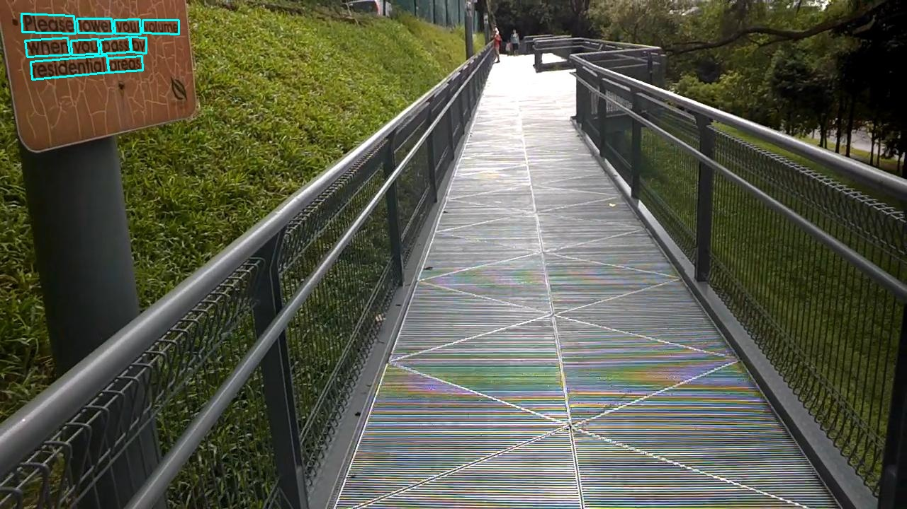

# EAST

## 1. Introduction

Paper:
> [EAST: An Efficient and Accurate Scene Text Detector](https://arxiv.org/abs/1704.03155)
> Xinyu Zhou, Cong Yao, He Wen, Yuzhi Wang, Shuchang Zhou, Weiran He, Jiajun Liang
> CVPR, 2017

On the ICDAR2015 dataset, the text detection result is as follows:

|Model|Backbone|Configuration|Precision|Recall|Hmean|Download|
| --- | --- | --- | --- | --- | --- | --- |
|EAST|ResNet50_vd| [det_r50_vd_east.yml](https://github.com/PaddlePaddle/PaddleOCR/tree/main/configs/det/det_r50_vd_east.yml)|88.71%|    81.36%|    84.88%|    [model](https://paddleocr.bj.bcebos.com/dygraph_v2.0/en/det_r50_vd_east_v2.0_train.tar)|
|EAST|MobileNetV3|[det_mv3_east.yml](https://github.com/PaddlePaddle/PaddleOCR/tree/main/configs/det/det_mv3_east.yml) | 78.20%|    79.10%|    78.65%|    [model](https://paddleocr.bj.bcebos.com/dygraph_v2.0/en/det_mv3_east_v2.0_train.tar)|

## 2. Environment

Please prepare your environment referring to [prepare the environment](../../ppocr/environment.en.md) and [clone the repo](../../ppocr/blog/clone.en.md).

## 3. Model Training / Evaluation / Prediction

The above EAST model is trained using the ICDAR2015 text detection public dataset. For the download of the dataset, please refer to [ocr_datasets](./dataset/ocr_datasets_en.md).

After the data download is complete, please refer to [Text Detection Training Tutorial](../../ppocr/model_train/detection.en.md) for training. PaddleOCR has modularized the code structure, so that you only need to **replace the configuration file** to train different detection models.

## 4. Inference and Deployment

### 4.1 Python Inference

First, convert the model saved in the EAST text detection training process into an inference model. Taking the model based on the Resnet50_vd backbone network and trained on the ICDAR2015 English dataset as example ([model download link](https://paddleocr.bj.bcebos.com/dygraph_v2.0/en/det_r50_vd_east_v2.0_train.tar)), you can use the following command to convert:

```bash linenums="1"
python3 tools/export_model.py -c configs/det/det_r50_vd_east.yml -o Global.pretrained_model=./det_r50_vd_east_v2.0_train/best_accuracy  Global.save_inference_dir=./inference/det_r50_east/
```

For EAST text detection model inference, you need to set the parameter --det_algorithm="EAST", run the following command:

```bash linenums="1"
python3 tools/infer/predict_det.py --image_dir="./doc/imgs_en/img_10.jpg" --det_model_dir="./inference/det_r50_east/" --det_algorithm="EAST"
```

The visualized text detection results are saved to the `./inference_results` folder by default, and the name of the result file is prefixed with `det_res`.



### 4.2 C++ Inference

Since the post-processing is not written in CPP, the EAST text detection model does not support CPP inference.

### 4.3 Serving

Not supported

### 4.4 More

Not supported

## 5. FAQ

## Citation

```bibtex
@inproceedings{zhou2017east,
  title={East: an efficient and accurate scene text detector},
  author={Zhou, Xinyu and Yao, Cong and Wen, He and Wang, Yuzhi and Zhou, Shuchang and He, Weiran and Liang, Jiajun},
  booktitle={Proceedings of the IEEE conference on Computer Vision and Pattern Recognition},
  pages={5551--5560},
  year={2017}
}
```
