# 场景应用

PaddleOCR场景应用覆盖通用，制造、金融、交通行业的主要OCR垂类应用，在PP-OCR、PP-Structure的通用能力基础之上，以notebook的形式展示利用场景数据微调、模型优化方法、数据增广等内容，为开发者快速落地OCR应用提供示范与启发。

## 教程文档

### 通用

| 类别                   | 亮点                                                         | 模型下载       | 教程                                    | 示例图                                                       |
| ---------------------- | ------------------------------------------------------------ | -------------- | --------------------------------------- | ------------------------------------------------------------ |
| 高精度中文识别模型SVTR | 比PP-OCRv3识别模型精度高3%， 可用于数据挖掘或对预测效率要求不高的场景。 | [模型下载](#_7) | [中文](./高精度中文识别模型.md)/English | 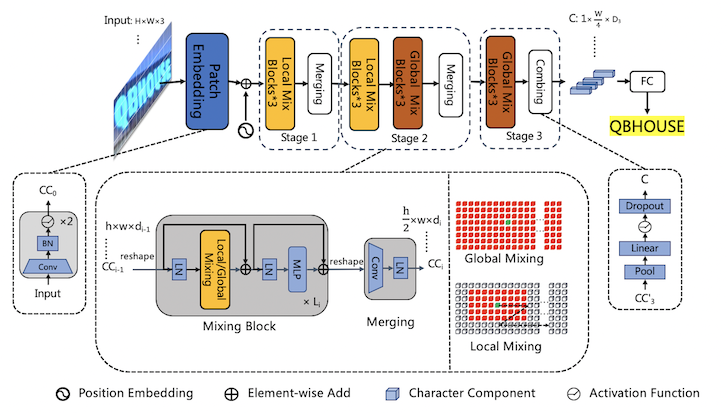 |
| 手写体识别             | 新增字形支持                                                 | [模型下载](#_7) | [中文](./手写文字识别.md)/English       | 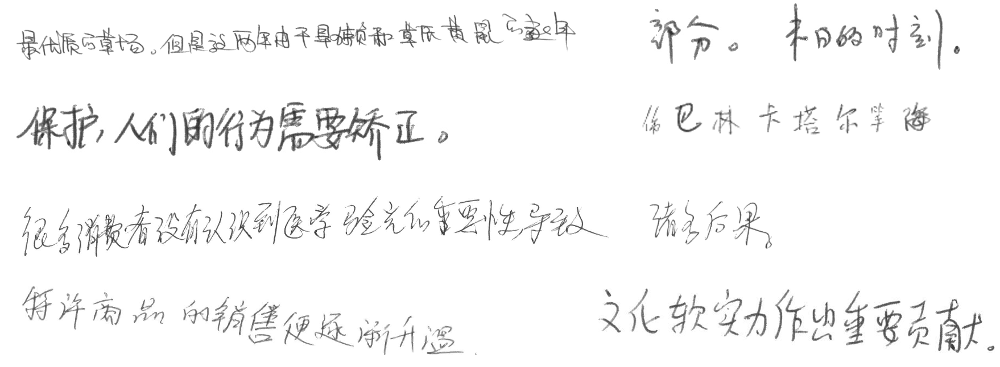 |

### 制造

| 类别           | 亮点                           | 模型下载       | 教程                                                         | 示例图                                                       |
| -------------- | ------------------------------ | -------------- | ------------------------------------------------------------ | ------------------------------------------------------------ |
| 数码管识别     | 数码管数据合成、漏识别调优     | [模型下载](#_7) | [中文](./光功率计数码管字符识别/光功率计数码管字符识别.md)/English | 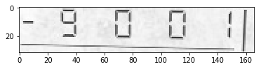 |
| 液晶屏读数识别 | 检测模型蒸馏、Serving部署      | [模型下载](#_7) | [中文](./液晶屏读数识别.md)/English                          | 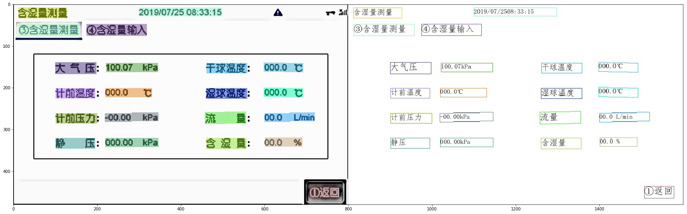 |
| 包装生产日期   | 点阵字符合成、过曝过暗文字识别 | [模型下载](#_7) | [中文](./包装生产日期识别.md)/English                        | 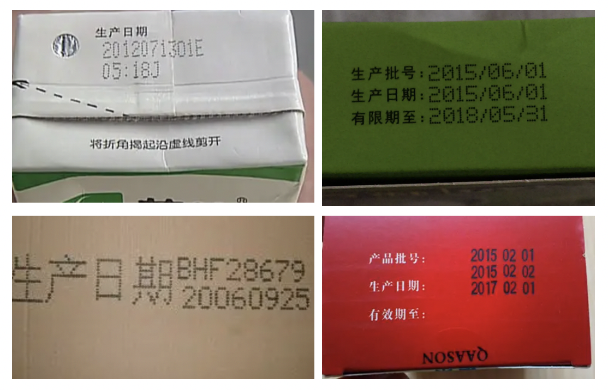 |
| PCB文字识别    | 小尺寸文本检测与识别           | [模型下载](#_7) | [中文](./PCB字符识别/PCB字符识别.md)/English                 | 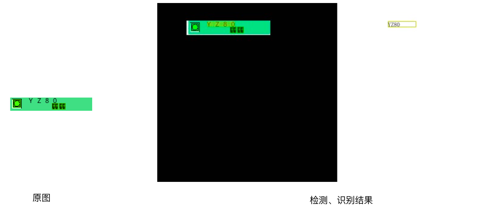 |
| 电表识别       | 大分辨率图像检测调优           | [模型下载](#_7) |                                                              |                                                              |
| 液晶屏缺陷检测 | 非文字字符识别                 |                |                                                              |                                                              |

### 金融

| 类别           | 亮点                          | 模型下载       | 教程                                      | 示例图                                                       |
| -------------- | ----------------------------- | -------------- | ----------------------------------------- | ------------------------------------------------------------ |
| 表单VQA        | 多模态通用表单结构化提取      | [模型下载](#_7) | [中文](./多模态表单识别.md)/English       | 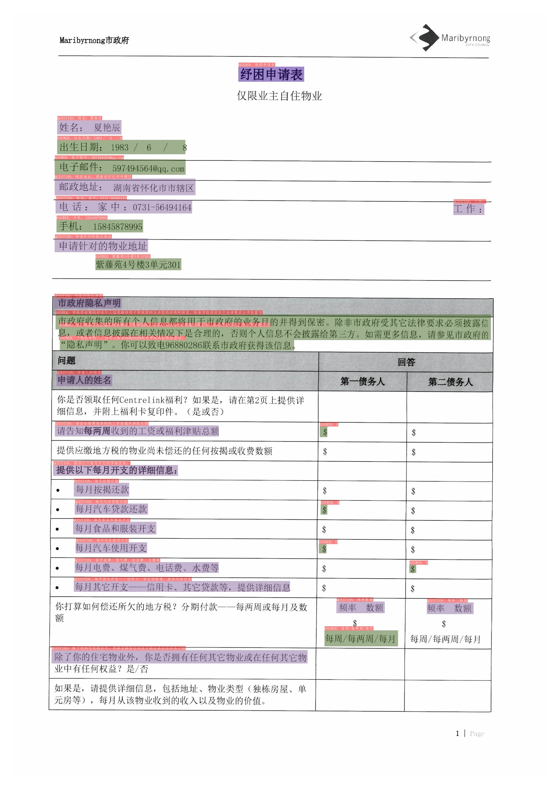 |
| 增值税发票     | 关键信息抽取，SER、RE任务训练 | [模型下载](#_7) | [中文](./发票关键信息抽取.md)/English     | 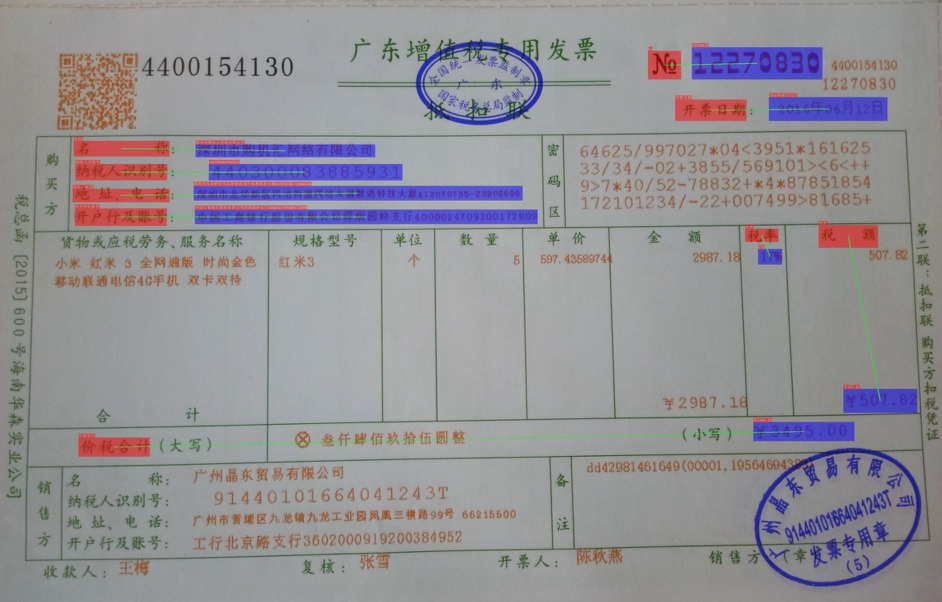 |
| 印章检测与识别 | 端到端弯曲文本识别            | [模型下载](#_7) | [中文](./印章弯曲文字识别.md)/English     | 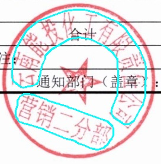 |
| 通用卡证识别   | 通用结构化提取                | [模型下载](#_7) | [中文](./快速构建卡证类OCR.md)/English    | 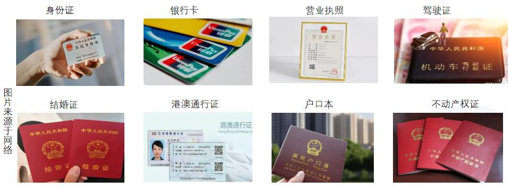 |
| 身份证识别     | 结构化提取、图像阴影          |                |                                           |                                                              |
| 合同比对       | 密集文本检测、NLP关键信息抽取 | [模型下载](#_7) | [中文](./扫描合同关键信息提取.md)/English |  |

### 交通

| 类别              | 亮点                           | 模型下载       | 教程                                | 示例图                                                       |
| ----------------- | ------------------------------ | -------------- | ----------------------------------- | ------------------------------------------------------------ |
| 车牌识别          | 多角度图像、轻量模型、端侧部署 | [模型下载](#_7) | [中文](./轻量级车牌识别.md)/English | 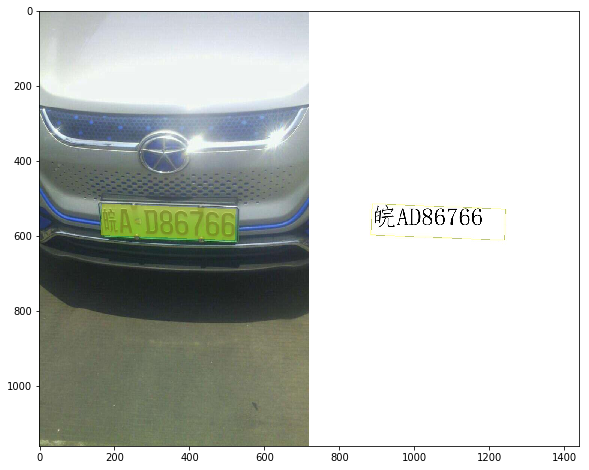 |
| 驾驶证/行驶证识别 | 尽请期待                       |                |                                     |                                                              |
| 快递单识别        | 尽请期待                       |                |                                     |                                                              |

## 模型下载

🎁《动手学OCR》、《OCR产业范例20讲》电子书、OCR垂类模型、PDF2Word软件以及其他学习大礼包领取链接：[百度网盘 PaddleOCR 开源大礼包](https://pan.baidu.com/s/1h__OYbbQ_rASB-m8ZC1bCA)，提取码：4232

如果您是企业开发者且未在上述场景中找到合适的方案，可以填写[OCR应用合作调研问卷](https://paddle.wjx.cn/vj/QwF7GKw.aspx)，免费与官方团队展开不同层次的合作，包括但不限于问题抽象、确定技术方案、项目答疑、共同研发等。如果您已经使用PaddleOCR落地项目，也可以填写此问卷，与飞桨平台共同宣传推广，提升企业技术品宣。期待您的提交！
