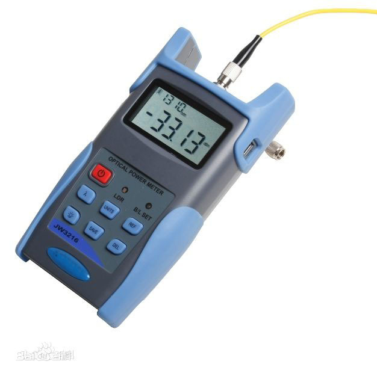
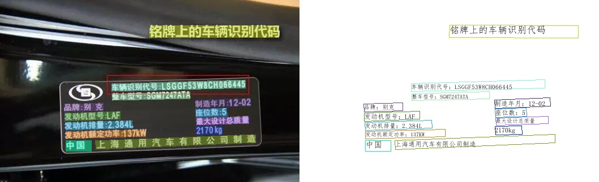
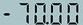
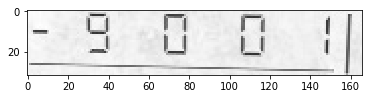

# 光功率计数码管字符识别

## 1. 背景介绍

光功率计（optical power meter ）是指用于测量绝对光功率或通过一段光纤的光功率相对损耗的仪器。在光纤系统中，测量光功率是最基本的，非常像电子学中的万用表；在光纤测量中，光功率计是重负荷常用表。



目前光功率计缺少将数据直接输出的功能，需要人工读数。这一项工作单调重复，如果可以使用机器替代人工，将节约大量成本。针对上述问题，希望通过摄像头拍照->智能读数的方式高效地完成此任务。

为实现智能读数，通常会采取文本检测+文本识别的方案：

第一步，使用文本检测模型定位出光功率计中的数字部分；

第二步，使用文本识别模型获得准确的数字和单位信息。

本项目主要介绍如何完成第二步文本识别部分，包括：真实评估集的建立、训练数据的合成、基于 PP-OCRv3 和 SVTR_Tiny 两个模型进行训练，以及评估和推理。

本项目难点如下：

- 光功率计数码管字符数据较少，难以获取。
- 数码管中小数点占像素较少，容易漏识别。

针对以上问题， 本例选用 PP-OCRv3 和 SVTR_Tiny 两个高精度模型训练，同时提供了真实数据挖掘案例和数据合成案例。基于 PP-OCRv3 模型，在构建的真实评估集上精度从 52% 提升至 72%，SVTR_Tiny 模型精度可达到 78.9%。

aistudio项目链接: [光功率计数码管字符识别](https://aistudio.baidu.com/aistudio/projectdetail/4049044?contributionType=1)

## 2. PaddleOCR 快速使用

PaddleOCR 旨在打造一套丰富、领先、且实用的OCR工具库，助力开发者训练出更好的模型，并应用落地。



官方提供了适用于通用场景的高精轻量模型，首先使用官方提供的 PP-OCRv3 模型预测图片，验证下当前模型在光功率计场景上的效果。

### 准备环境

```bash linenums="1"
python3 -m pip install -U pip
python3 -m pip install paddleocr
```

### 测试效果

测试图：



```bash linenums="1"
paddleocr --lang=ch --det=Fase --image_dir=data
```

得到如下测试结果：

```bash linenums="1"
('.7000', 0.6885431408882141)
```

发现数字识别较准，然而对负号和小数点识别不准确。 由于PP-OCRv3的训练数据大多为通用场景数据，在特定的场景上效果可能不够好。因此需要基于场景数据进行微调。

下面就主要介绍如何在光功率计（数码管）场景上微调训练。

## 3. 开始训练

### 3.1 数据准备

特定的工业场景往往很难获取开源的真实数据集，光功率计也是如此。在实际工业场景中，可以通过摄像头采集的方法收集大量真实数据，本例中重点介绍数据合成方法和真实数据挖掘方法，如何利用有限的数据优化模型精度。

数据集分为两个部分：合成数据，真实数据， 其中合成数据由 text_renderer 工具批量生成得到， 真实数据通过爬虫等方式在百度图片中搜索并使用 PPOCRLabel 标注得到。

#### 合成数据

本例中数据合成工具使用的是 [text_renderer](https://github.com/Sanster/text_renderer)， 该工具可以合成用于文本识别训练的文本行数据:


```bash linenums="1"
export https_proxy=http://172.19.57.45:3128
git clone https://github.com/oh-my-ocr/text_renderer
```

```bash linenums="1"
python3 setup.py develop
python3 -m pip install -r docker/requirements.txt
python3 main.py \
    --config example_data/example.py \
    --dataset img \
    --num_processes 2 \
    --log_period 10
```

给定字体和语料，就可以合成较为丰富样式的文本行数据。 光功率计识别场景，目标是正确识别数码管文本，因此需要收集部分数码管字体，训练语料，用于合成文本识别数据。

将收集好的语料存放在 example_data 路径下：

```bash linenums="1"
ln -s ./fonts/DS* text_renderer/example_data/font/
ln -s ./corpus/digital.txt text_renderer/example_data/text/
```

修改`text_renderer/example_data/font_list/font_list.txt`,选择需要的字体开始合成：

```bash linenums="1"
python3 main.py \
    --config example_data/digital_example.py \
    --dataset img \
    --num_processes 2 \
    --log_period 10
```

合成图片会被存在目录 text_renderer/example_data/digital/chn_data 下

查看合成的数据样例：



#### 真实数据挖掘

模型训练需要使用真实数据作为评价指标，否则很容易过拟合到简单的合成数据中。没有开源数据的情况下，可以利用部分无标注数据+标注工具获得真实数据。

##### 1. 数据搜集

使用[爬虫工具](https://github.com/Joeclinton1/google-images-download.git)获得无标注数据

##### 2. [PPOCRLabel](https://github.com/PFCCLab/PPOCRLabel) 完成半自动标注

PPOCRLabel是一款适用于OCR领域的半自动化图形标注工具，内置PP-OCR模型对数据自动标注和重新识别。使用Python3和PyQT5编写，支持矩形框标注、表格标注、不规则文本标注、关键信息标注模式，导出格式可直接用于PaddleOCR检测和识别模型的训练。


收集完数据后就可以进行分配了，验证集中一般都是真实数据，训练集中包含合成数据+真实数据。本例中标注了155张图片，其中训练集和验证集的数目为100和55。

最终 `data` 文件夹应包含以下几部分：

```text linenums="1"
|-data
  |- synth_train.txt
  |- real_train.txt
  |- real_eval.txt
  |- synthetic_data
      |- word_001.png
      |- word_002.jpg
      |- word_003.jpg
      | ...
  |- real_data
      |- word_001.png
      |- word_002.jpg
      |- word_003.jpg
      | ...
  ...
```

### 3.2 模型选择

本案例提供了2种文本识别模型：PP-OCRv3 识别模型 和 SVTR_Tiny：

[PP-OCRv3 识别模型](../ppocr/blog/PP-OCRv3_introduction.md)：PP-OCRv3的识别模块是基于文本识别算法SVTR优化。SVTR不再采用RNN结构，通过引入Transformers结构更加有效地挖掘文本行图像的上下文信息，从而提升文本识别能力。并进行了一系列结构改进加速模型预测。

[SVTR_Tiny](https://arxiv.org/abs/2205.00159):SVTR提出了一种用于场景文本识别的单视觉模型，该模型在patch-wise image tokenization框架内，完全摒弃了序列建模，在精度具有竞争力的前提下，模型参数量更少，速度更快。

以上两个策略在自建中文数据集上的精度和速度对比如下：

| ID | 策略 |  模型大小 | 精度 | 预测耗时（CPU + MKLDNN)|
|-----|-----|--------|----| --- |
| 01 | PP-OCRv2 | 8M | 74.80% | 8.54ms |
| 02 | SVTR_Tiny | 21M | 80.10% | 97.00ms |
| 03 | SVTR_LCNet(h32) | 12M | 71.90% | 6.60ms |
| 04 | SVTR_LCNet(h48) | 12M | 73.98% | 7.60ms |
| 05 | + GTC | 12M | 75.80% | 7.60ms |
| 06 | + TextConAug | 12M | 76.30% | 7.60ms |
| 07 | + TextRotNet | 12M | 76.90% | 7.60ms |
| 08 | + UDML | 12M | 78.40% | 7.60ms |
| 09 | + UIM | 12M | 79.40% | 7.60ms |

### 3.3 开始训练

首先下载 PaddleOCR 代码库

```bash linenums="1"
git clone -b release/2.5 https://github.com/PaddlePaddle/PaddleOCR.git
```

PaddleOCR提供了训练脚本、评估脚本和预测脚本，本节将以 PP-OCRv3 中文识别模型为例：

#### Step1：下载预训练模型

首先下载 pretrain model，您可以下载训练好的模型在自定义数据上进行finetune

```bash linenums="1"
cd PaddleOCR/
# 下载PP-OCRv3 中文预训练模型
wget -P ./pretrain_models/ https://paddleocr.bj.bcebos.com/PP-OCRv3/chinese/ch_PP-OCRv3_rec_train.tar
# 解压模型参数
cd pretrain_models
tar -xf ch_PP-OCRv3_rec_train.tar && rm -rf ch_PP-OCRv3_rec_train.tar
```

#### Step2：自定义字典文件

接下来需要提供一个字典（{word_dict_name}.txt），使模型在训练时，可以将所有出现的字符映射为字典的索引。

因此字典需要包含所有希望被正确识别的字符，{word_dict_name}.txt需要写成如下格式，并以 `utf-8` 编码格式保存：

```text linenums="1"
0
1
2
3
4
5
6
7
8
9
-
.
```

word_dict.txt 每行有一个单字，将字符与数字索引映射在一起，“3.14” 将被映射成 [3, 11, 1, 4]

- 内置字典

  PaddleOCR内置了一部分字典，可以按需使用。

  `ppocr/utils/ppocr_keys_v1.txt` 是一个包含6623个字符的中文字典

  `ppocr/utils/ic15_dict.txt` 是一个包含36个字符的英文字典

- 自定义字典

  内置字典面向通用场景，具体的工业场景中，可能需要识别特殊字符，或者只需识别某几个字符，此时自定义字典会更提升模型精度。例如在光功率计场景中，需要识别数字和单位。

遍历真实数据标签中的字符，制作字典`digital_dict.txt`如下所示：

```text linenums="1"
-
.
0
1
2
3
4
5
6
7
8
9
B
E
F
H
L
N
T
W
d
k
m
n
o
z
```

#### Step3：修改配置文件

为了更好的使用预训练模型，训练推荐使用[ch_PP-OCRv3_rec_distillation.yml](https://github.com/PaddlePaddle/PaddleOCR/tree/main/configs/rec/PP-OCRv3/ch_PP-OCRv3_rec_distillation.yml)配置文件，并参考下列说明修改配置文件：

以 `ch_PP-OCRv3_rec_distillation.yml` 为例：

```yaml linenums="1"
Global:
  ...
  # 添加自定义字典，如修改字典请将路径指向新字典
  character_dict_path: ppocr/utils/dict/digital_dict.txt
  ...
  # 识别空格
  use_space_char: True


Optimizer:
  ...
  # 添加学习率衰减策略
  lr:
    name: Cosine
    learning_rate: 0.001
  ...

...

Train:
  dataset:
    # 数据集格式，支持LMDBDataSet以及SimpleDataSet
    name: SimpleDataSet
    # 数据集路径
    data_dir: ./data/
    # 训练集标签文件
    label_file_list:
    - ./train_data/digital_img/digital_train.txt  #11w
    - ./train_data/digital_img/real_train.txt     #100
    - ./train_data/digital_img/dbm_img/dbm.txt    #3w
    ratio_list:
    - 0.3
    - 1.0
    - 1.0
    transforms:
      ...
      - RecResizeImg:
          # 修改 image_shape 以适应长文本
          image_shape: [3, 48, 320]
      ...
  loader:
    ...
    # 单卡训练的batch_size
    batch_size_per_card: 256
    ...

Eval:
  dataset:
    # 数据集格式，支持LMDBDataSet以及SimpleDataSet
    name: SimpleDataSet
    # 数据集路径
    data_dir: ./data
    # 验证集标签文件
    label_file_list:
    - ./train_data/digital_img/real_val.txt
    transforms:
      ...
      - RecResizeImg:
          # 修改 image_shape 以适应长文本
          image_shape: [3, 48, 320]
      ...
  loader:
    # 单卡验证的batch_size
    batch_size_per_card: 256
    ...
```

**注意，训练/预测/评估时的配置文件请务必与训练一致。**

#### Step4：启动训练

*如果您安装的是cpu版本，请将配置文件中的 `use_gpu` 字段修改为false*

```bash linenums="1"
# GPU训练 支持单卡，多卡训练
# 训练数码管数据 训练日志会自动保存为 "{save_model_dir}" 下的train.log

#单卡训练（训练周期长，不建议）
python3 tools/train.py -c configs/rec/PP-OCRv3/ch_PP-OCRv3_rec_distillation.yml -o Global.pretrained_model=./pretrain_models/ch_PP-OCRv3_rec_train/best_accuracy

# 多卡训练，通过--gpus参数指定卡号
python3 -m paddle.distributed.launch --gpus '0,1,2,3'  tools/train.py -c configs/rec/PP-OCRv3/ch_PP-OCRv3_rec_distillation.yml -o Global.pretrained_model=./pretrain_models/en_PP-OCRv3_rec_train/best_accuracy
```

PaddleOCR支持训练和评估交替进行, 可以在 `configs/rec/PP-OCRv3/ch_PP-OCRv3_rec_distillation.yml` 中修改 `eval_batch_step` 设置评估频率，默认每500个iter评估一次。评估过程中默认将最佳acc模型，保存为 `output/ch_PP-OCRv3_rec_distill/best_accuracy` 。

如果验证集很大，测试将会比较耗时，建议减少评估次数，或训练完再进行评估。

### SVTR_Tiny 训练

SVTR_Tiny 训练步骤与上面一致，SVTR支持的配置和模型训练权重可以参考[算法介绍文档](../algorithm/text_recognition/algorithm_rec_svtr.md)

#### Step1：下载预训练模型

```bash linenums="1"
# 下载 SVTR_Tiny 中文识别预训练模型和配置文件
wget https://paddleocr.bj.bcebos.com/PP-OCRv3/chinese/rec_svtr_tiny_none_ctc_ch_train.tar
# 解压模型参数
tar -xf rec_svtr_tiny_none_ctc_ch_train.tar && rm -rf rec_svtr_tiny_none_ctc_ch_train.tar
```

#### Step2：自定义字典文件

字典依然使用自定义的 digital_dict.txt

#### Step3：修改配置文件

配置文件中对应修改字典路径和数据路径

#### Step4：启动训练

```bash linenums="1"
# 单卡训练
python tools/train.py -c rec_svtr_tiny_none_ctc_ch_train/rec_svtr_tiny_6local_6global_stn_ch.yml \
           -o Global.pretrained_model=./rec_svtr_tiny_none_ctc_ch_train/best_accuracy
```

### 3.4 验证效果

将训练完成的模型放置在对应目录下即可完成模型推理

#### 指标评估

训练中模型参数默认保存在`Global.save_model_dir`目录下。在评估指标时，需要设置`Global.checkpoints`指向保存的参数文件。评估数据集可以通过 `configs/rec/PP-OCRv3/ch_PP-OCRv3_rec_distillation.yml`  修改Eval中的 `label_file_path` 设置。

```bash linenums="1"
# GPU 评估， Global.checkpoints 为待测权重
python3 -m paddle.distributed.launch --gpus '0' tools/eval.py -c configs/rec/PP-OCRv3/ch_PP-OCRv3_rec_distillation.yml -o Global.checkpoints={path/to/weights}/best_accuracy
```

#### 测试识别效果

使用 PaddleOCR 训练好的模型，可以通过以下脚本进行快速预测。

默认预测图片存储在 `infer_img` 里，通过 `-o Global.checkpoints` 加载训练好的参数文件：

根据配置文件中设置的 `save_model_dir` 和 `save_epoch_step` 字段，会有以下几种参数被保存下来：

```text linenums="1"
output/rec/
├── best_accuracy.pdopt
├── best_accuracy.pdparams
├── best_accuracy.states
├── config.yml
├── iter_epoch_3.pdopt
├── iter_epoch_3.pdparams
├── iter_epoch_3.states
├── latest.pdopt
├── latest.pdparams
├── latest.states
└── train.log
```

其中 best_accuracy.*是评估集上的最优模型；iter_epoch_x.* 是以 `save_epoch_step` 为间隔保存下来的模型；latest.* 是最后一个epoch的模型。

```bash linenums="1"
# 预测英文结果
python3 tools/infer_rec.py -c configs/rec/PP-OCRv3/ch_PP-OCRv3_rec_distillation.yml -o Global.pretrained_model={path/to/weights}/best_accuracy  Global.infer_img=test_digital.png
```

预测图片：


得到输入图像的预测结果：

```yaml linenums="1"
infer_img: test_digital.png
        result: ('-70.00', 0.9998967)
```
