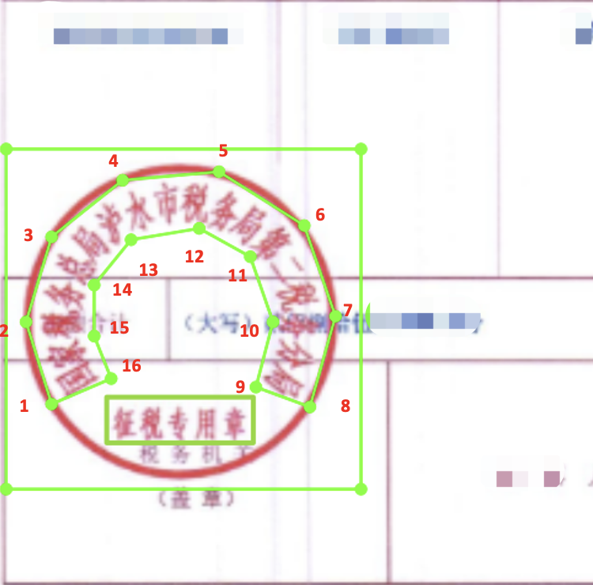
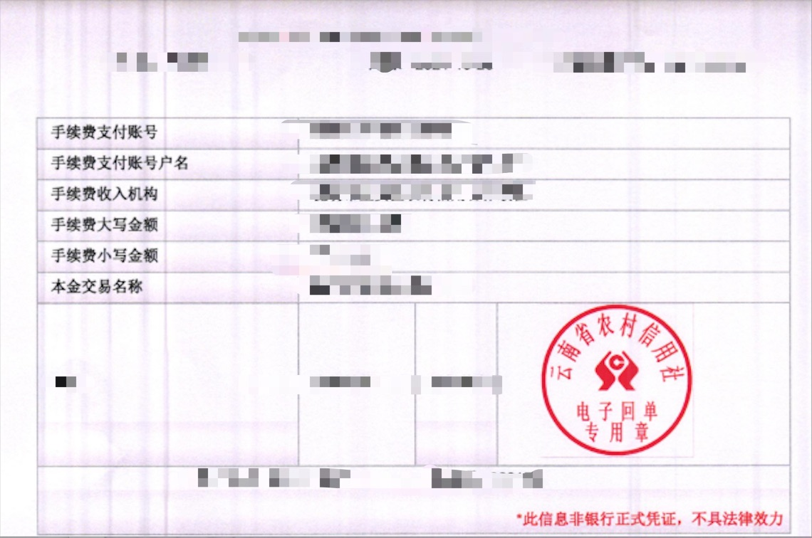
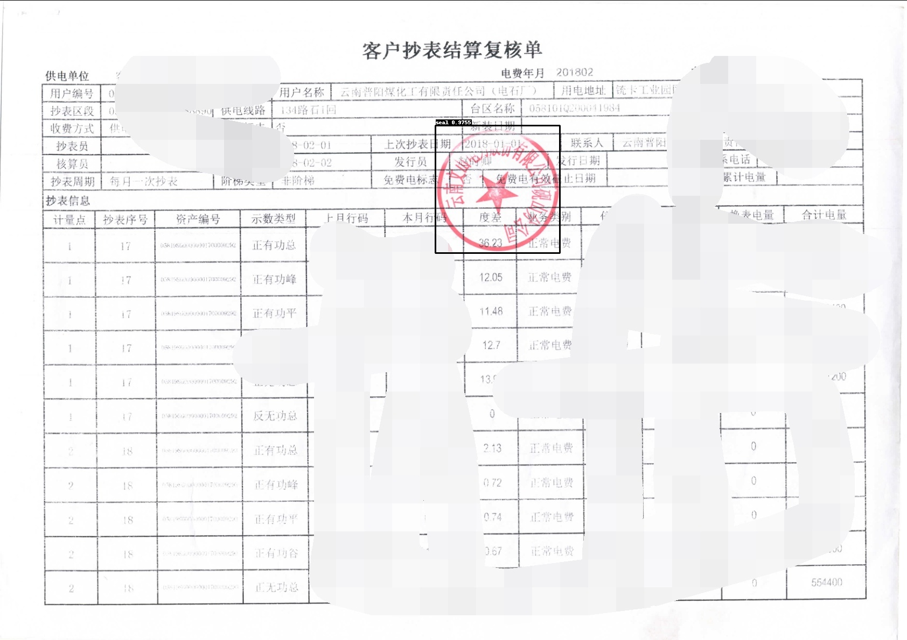
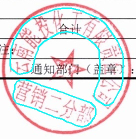

## 1. 项目介绍

弯曲文字识别在OCR任务中有着广泛的应用，比如：自然场景下的招牌，艺术文字，以及常见的印章文字识别。

在本项目中，将以印章识别任务为例，介绍如何使用PaddleDetection和PaddleOCR完成印章检测和印章文字识别任务。

项目难点：

1. 缺乏训练数据
2. 图像质量参差不齐，图像模糊，文字不清晰

针对以上问题，本项目选用PaddleOCR里的PPOCRLabel工具完成数据标注。基于PaddleDetection完成印章区域检测，然后通过PaddleOCR里的端对端OCR算法和两阶段OCR算法分别完成印章文字识别任务。不同任务的精度效果如下：

| 任务 | 训练数据数量 | 精度 |
| -------- | - | -------- |
| 印章检测 | 1000    | 95.00%  |
| 印章文字识别-端对端OCR方法 | 700    | 47.00%  |
| 印章文字识别-两阶段OCR方法 |  700   | 55.00%  |

点击进入 [AI Studio 项目](https://aistudio.baidu.com/aistudio/projectdetail/4586113)

## 2. 环境搭建

本项目需要准备PaddleDetection和PaddleOCR的项目运行环境，其中PaddleDetection用于实现印章检测任务，PaddleOCR用于实现文字识别任务

### 2.1 准备PaddleDetection环境

下载PaddleDetection代码：

```bash linenums="1"
!git clone https://github.com/PaddlePaddle/PaddleDetection.git
# 如果克隆github代码较慢，请从gitee上克隆代码
#git clone https://gitee.com/PaddlePaddle/PaddleDetection.git
```

安装PaddleDetection依赖

```bash linenums="1"
!cd PaddleDetection && pip install -r requirements.txt
```

### 2.2 准备PaddleOCR环境

下载PaddleOCR代码：

```bash linenums="1"
!git clone https://github.com/PaddlePaddle/PaddleOCR.git
# 如果克隆github代码较慢，请从gitee上克隆代码
#git clone https://gitee.com/PaddlePaddle/PaddleOCR.git
```

安装PaddleOCR依赖

```bash linenums="1"
!cd PaddleOCR && git checkout dygraph  && pip install -r requirements.txt
```

## 3. 数据集准备

### 3.1 数据标注

本项目中使用[PPOCRLabel](https://github.com/PFCCLab/PPOCRLabel)工具标注印章检测数据，标注内容包括印章的位置以及印章中文字的位置和文字内容。

注：PPOCRLabel的使用方法参考[文档](https://github.com/PFCCLab/PPOCRLabel)。

PPOCRlabel标注印章数据步骤：

- 打开数据集所在文件夹
- 按下快捷键Q进行4点（多点）标注——针对印章文本识别，
  - 印章弯曲文字包围框采用偶数点标注（比如4点，8点，16点），按照阅读顺序，以16点标注为例，从文字左上方开始标注->到文字右上方标注8个点->到文字右下方->文字左下方8个点，一共8个点，形成包围曲线，参考下图。如果文字弯曲程度不高，为了减小标注工作量，可以采用4点、8点标注，需要注意的是，文字上下点数相同。（总点数尽量不要超过18个）
  - 对于需要识别的印章中非弯曲文字，采用4点框标注即可
  - 对应包围框的文字部分默认是”待识别”，需要修改为包围框内的具体文字内容
- 快捷键W进行矩形标注——针对印章区域检测，印章检测区域保证标注框包围整个印章，包围框对应文字可以设置为'印章区域'，方便后续处理。
- 针对印章中的水平文字可以视情况考虑矩形或四点标注：保证按行标注即可。如果背景文字与印章文字比较接近，标注时尽量避开背景文字。
- 标注完成后修改右侧文本结果，确认无误后点击下方check（或CTRL+V)，确认本张图片的标注。
- 所有图片标注完成后，在顶部菜单栏点击File -> Export Label导出label.txt。

标注完成后，可视化效果如下：


数据标注完成后，标签中包含印章检测的标注和印章文字识别的标注，如下所示：

```text linenums="1"
img/1.png    [{"transcription": "印章区域", "points": [[87, 245], [214, 245], [214, 369], [87, 369]], "difficult": false}, {"transcription": "国家税务总局泸水市税务局第二税务分局", "points": [[110, 314], [116, 290], [131, 275], [152, 273], [170, 277], [181, 289], [186, 303], [186, 312], [201, 311], [198, 289], [189, 272], [175, 259], [152, 252], [124, 257], [100, 280], [94, 312]], "difficult": false}, {"transcription": "征税专用章", "points": [[117, 334], [183, 334], [183, 352], [117, 352]], "difficult": false}]
```

标注中包含表示'印章区域'的坐标和'印章文字'坐标以及文字内容。

### 3.2 数据处理

标注时为了方便标注，没有区分印章区域的标注框和文字区域的标注框，可以通过python代码完成标签的划分。

在本项目的'/home/aistudio/work/seal_labeled_datas'目录下，存放了标注的数据示例，如下：



标签文件'/home/aistudio/work/seal_labeled_datas/Label.txt'中的标注内容如下：

```text linenums="1"
img/test1.png   [{"transcription": "待识别", "points": [[408, 232], [537, 232], [537, 352], [408, 352]], "difficult": false}, {"transcription": "电子回单", "points": [[437, 305], [504, 305], [504, 322], [437, 322]], "difficult": false}, {"transcription": "云南省农村信用社", "points": [[417, 290], [434, 295], [438, 281], [446, 267], [455, 261], [472, 258], [489, 264], [498, 277], [502, 295], [526, 289], [518, 267], [503, 249], [475, 232], [446, 239], [429, 255], [418, 275]], "difficult": false}, {"transcription": "专用章", "points": [[437, 319], [503, 319], [503, 338], [437, 338]], "difficult": false}]
```

为了方便训练，我们需要通过python代码将用于训练印章检测和训练印章文字识别的标注区分开。

<details>

```python linenums="1"
import numpy as np
import json
import cv2
import os
from shapely.geometry import Polygon


def poly2box(poly):
    xmin = np.min(np.array(poly)[:, 0])
    ymin = np.min(np.array(poly)[:, 1])
    xmax = np.max(np.array(poly)[:, 0])
    ymax = np.max(np.array(poly)[:, 1])
    return np.array([[xmin, ymin], [xmax, ymin], [xmax, ymax], [xmin, ymax]])


def draw_text_det_res(dt_boxes, src_im, color=(255, 255, 0)):
    for box in dt_boxes:
        box = np.array(box).astype(np.int32).reshape(-1, 2)
        cv2.polylines(src_im, [box], True, color=color, thickness=2)
    return src_im

class LabelDecode(object):
    def __init__(self, **kwargs):
        pass

    def __call__(self, data):
        label = json.loads(data['label'])

        nBox = len(label)
        seal_boxes = self.get_seal_boxes(label)

        gt_label = []

        for seal_box in seal_boxes:
            seal_anno = {'seal_box': seal_box}
            boxes, txts, txt_tags = [], [], []

            for bno in range(0, nBox):
                box = label[bno]['points']
                txt = label[bno]['transcription']
                try:
                    ints = self.get_intersection(box, seal_box)
                except Exception as E:
                    print(E)
                    continue

                if abs(Polygon(box).area - self.get_intersection(box, seal_box)) < 1e-3 and \
                    abs(Polygon(box).area - self.get_union(box, seal_box)) > 1e-3:

                    boxes.append(box)
                    txts.append(txt)
                    if txt in ['*', '###', '待识别']:
                        txt_tags.append(True)
                    else:
                        txt_tags.append(False)

            seal_anno['polys'] = boxes
            seal_anno['texts'] = txts
            seal_anno['ignore_tags'] = txt_tags

            gt_label.append(seal_anno)

        return gt_label

    def get_seal_boxes(self, label):

        nBox = len(label)
        seal_box = []
        for bno in range(0, nBox):
            box = label[bno]['points']
            if len(box) == 4:
                seal_box.append(box)

        if len(seal_box) == 0:
            return None

        seal_box = self.valid_seal_box(seal_box)
        return seal_box


    def is_seal_box(self, box, boxes):
        is_seal = True
        for poly in boxes:
            if list(box.shape()) != list(box.shape.shape()):
                if abs(Polygon(box).area - self.get_intersection(box, poly)) < 1e-3:
                    return False
            else:
                if np.sum(np.array(box) - np.array(poly)) < 1e-3:
                    # continue when the box is same with poly
                    continue
                if abs(Polygon(box).area - self.get_intersection(box, poly)) < 1e-3:
                    return False
        return is_seal


    def valid_seal_box(self, boxes):
        if len(boxes) == 1:
            return boxes

        new_boxes = []
        flag = True
        for k in range(0, len(boxes)):
            flag = True
            tmp_box = boxes[k]
            for i in range(0, len(boxes)):
                if k == i: continue
                if abs(Polygon(tmp_box).area - self.get_intersection(tmp_box, boxes[i])) < 1e-3:
                    flag = False
                    continue
            if flag:
                new_boxes.append(tmp_box)

        return new_boxes


    def get_union(self, pD, pG):
        return Polygon(pD).union(Polygon(pG)).area

    def get_intersection_over_union(self, pD, pG):
        return get_intersection(pD, pG) / get_union(pD, pG)

    def get_intersection(self, pD, pG):
        return Polygon(pD).intersection(Polygon(pG)).area

    def expand_points_num(self, boxes):
        max_points_num = 0
        for box in boxes:
            if len(box) > max_points_num:
                max_points_num = len(box)
        ex_boxes = []
        for box in boxes:
            ex_box = box + [box[-1]] * (max_points_num - len(box))
            ex_boxes.append(ex_box)
        return ex_boxes


def gen_extract_label(data_dir, label_file, seal_gt, seal_ppocr_gt):
    label_decode_func = LabelDecode()
    gts = open(label_file, "r").readlines()

    seal_gt_list = []
    seal_ppocr_list = []

    for idx, line in enumerate(gts):
        img_path, label = line.strip().split("\t")
        data = {'label': label, 'img_path':img_path}
        res = label_decode_func(data)
        src_img = cv2.imread(os.path.join(data_dir, img_path))
        if res is None:
            print("ERROR! res is None!")
            continue

        anno = []
        for i, gt in enumerate(res):
            # print(i, box, type(box), )
            anno.append({'polys': gt['seal_box'], 'cls':1})

        seal_gt_list.append(f"{img_path}\t{json.dumps(anno)}\n")
        seal_ppocr_list.append(f"{img_path}\t{json.dumps(res)}\n")

    if not os.path.exists(os.path.dirname(seal_gt)):
        os.makedirs(os.path.dirname(seal_gt))
    if not os.path.exists(os.path.dirname(seal_ppocr_gt)):
        os.makedirs(os.path.dirname(seal_ppocr_gt))

    with open(seal_gt, "w") as f:
        f.writelines(seal_gt_list)
        f.close()

    with open(seal_ppocr_gt, 'w') as f:
        f.writelines(seal_ppocr_list)
        f.close()

def vis_seal_ppocr(data_dir, label_file, save_dir):

    datas = open(label_file, 'r').readlines()
    for idx, line in enumerate(datas):
        img_path, label = line.strip().split('\t')
        img_path = os.path.join(data_dir, img_path)

        label = json.loads(label)
        src_im = cv2.imread(img_path)
        if src_im is None:
            continue

        for anno in label:
            seal_box = anno['seal_box']
            txt_boxes = anno['polys']

             # vis seal box
            src_im = draw_text_det_res([seal_box], src_im, color=(255, 255, 0))
            src_im = draw_text_det_res(txt_boxes, src_im, color=(255, 0, 0))

        save_path = os.path.join(save_dir, os.path.basename(img_path))
        if not os.path.exists(save_dir):
            os.makedirs(save_dir)
        # print(src_im.shape)
        cv2.imwrite(save_path, src_im)


def draw_html(img_dir, save_name):
    import glob

    images_dir = glob.glob(img_dir + "/*")
    print(len(images_dir))

    html_path = save_name
    with open(html_path, 'w') as html:
        html.write('<html>\n<body>\n')
        html.write('<table border="1">\n')
        html.write("<meta http-equiv=\"Content-Type\" content=\"text/html; charset=utf-8\" />")

        html.write("<tr>\n")
        html.write(f'<td> \n GT')

        for i, filename in enumerate(sorted(images_dir)):
            if filename.endswith("txt"): continue
            print(filename)

            base = "{}".format(filename)
            if True:
                html.write("<tr>\n")
                html.write(f'<td> {filename}\n GT')
                html.write('<td>GT 310\n</td>' % (base))
                html.write("</tr>\n")

        html.write('<style>\n')
        html.write('span {\n')
        html.write('    color: red;\n')
        html.write('}\n')
        html.write('</style>\n')
        html.write('</table>\n')
        html.write('</html>\n</body>\n')
    print("ok")


def crop_seal_from_img(label_file, data_dir, save_dir, save_gt_path):

    if not os.path.exists(save_dir):
        os.makedirs(save_dir)

    datas = open(label_file, 'r').readlines()
    all_gts = []
    count = 0
    for idx, line in enumerate(datas):
        img_path, label = line.strip().split('\t')
        img_path = os.path.join(data_dir, img_path)

        label = json.loads(label)
        src_im = cv2.imread(img_path)
        if src_im is None:
            continue

        for c, anno in enumerate(label):
            seal_poly = anno['seal_box']
            txt_boxes = anno['polys']
            txts = anno['texts']
            ignore_tags = anno['ignore_tags']

            box = poly2box(seal_poly)
            img_crop = src_im[box[0][1]:box[2][1], box[0][0]:box[2][0], :]

            save_path = os.path.join(save_dir, f"{idx}_{c}.jpg")
            cv2.imwrite(save_path, np.array(img_crop))

            img_gt = []
            for i in range(len(txts)):
                txt_boxes_crop = np.array(txt_boxes[i])
                txt_boxes_crop[:, 1] -= box[0, 1]
                txt_boxes_crop[:, 0] -= box[0, 0]
                img_gt.append({'transcription': txts[i], "points": txt_boxes_crop.tolist(), "ignore_tag": ignore_tags[i]})

            if len(img_gt) >= 1:
                count += 1
            save_gt = f"{os.path.basename(save_path)}\t{json.dumps(img_gt)}\n"

            all_gts.append(save_gt)

    print(f"The num of all image: {len(all_gts)}, and the number of useful image: {count}")
    if not os.path.exists(os.path.dirname(save_gt_path)):
        os.makedirs(os.path.dirname(save_gt_path))

    with open(save_gt_path, "w") as f:
        f.writelines(all_gts)
        f.close()
    print("Done")


if __name__ == "__main__":
    # 数据处理
    gen_extract_label("./seal_labeled_datas", "./seal_labeled_datas/Label.txt", "./seal_ppocr_gt/seal_det_img.txt", "./seal_ppocr_gt/seal_ppocr_img.txt")
    vis_seal_ppocr("./seal_labeled_datas", "./seal_ppocr_gt/seal_ppocr_img.txt", "./seal_ppocr_gt/seal_ppocr_vis/")
    draw_html("./seal_ppocr_gt/seal_ppocr_vis/", "./vis_seal_ppocr.html")
    seal_ppocr_img_label = "./seal_ppocr_gt/seal_ppocr_img.txt"
    crop_seal_from_img(seal_ppocr_img_label, "./seal_labeled_datas/", "./seal_img_crop", "./seal_img_crop/label.txt")
```

</details>

处理完成后，生成的文件如下：

```text linenums="1"
├── seal_img_crop/
│   ├── 0_0.jpg
│   ├── ...
│   └── label.txt
├── seal_ppocr_gt/
│   ├── seal_det_img.txt
│   ├── seal_ppocr_img.txt
│   └── seal_ppocr_vis/
│       ├── test1.png
│       ├── ...
└── vis_seal_ppocr.html

```

其中`seal_img_crop/label.txt`文件为印章识别标签文件，其内容格式为：

```text linenums="1"
0_0.jpg    [{"transcription": "\u7535\u5b50\u56de\u5355", "points": [[29, 73], [96, 73], [96, 90], [29, 90]], "ignore_tag": false}, {"transcription": "\u4e91\u5357\u7701\u519c\u6751\u4fe1\u7528\u793e", "points": [[9, 58], [26, 63], [30, 49], [38, 35], [47, 29], [64, 26], [81, 32], [90, 45], [94, 63], [118, 57], [110, 35], [95, 17], [67, 0], [38, 7], [21, 23], [10, 43]], "ignore_tag": false}, {"transcription": "\u4e13\u7528\u7ae0", "points": [[29, 87], [95, 87], [95, 106], [29, 106]], "ignore_tag": false}]
```

可以直接用于PaddleOCR的PGNet算法的训练。

`seal_ppocr_gt/seal_det_img.txt`为印章检测标签文件，其内容格式为：

```text linenums="1"
img/test1.png    [{"polys": [[408, 232], [537, 232], [537, 352], [408, 352]], "cls": 1}]
```

为了使用PaddleDetection工具完成印章检测模型的训练，需要将`seal_det_img.txt`转换为COCO或者VOC的数据标注格式。

可以直接使用下述代码将印章检测标注转换成VOC格式。

<details>

```python linenums="1"
import numpy as np
import json
import cv2
import os
from shapely.geometry import Polygon

seal_train_gt = "./seal_ppocr_gt/seal_det_img.txt"
# 注：仅用于示例，实际使用中需要分别转换训练集和测试集的标签
seal_valid_gt = "./seal_ppocr_gt/seal_det_img.txt"

def gen_main_train_txt(mode='train'):
    if mode == "train":
        file_path = seal_train_gt
    if mode in ['valid', 'test']:
        file_path = seal_valid_gt

    save_path = f"./seal_VOC/ImageSets/Main/{mode}.txt"
    save_train_path = f"./seal_VOC/{mode}.txt"
    if not os.path.exists(os.path.dirname(save_path)):
        os.makedirs(os.path.dirname(save_path))

    datas = open(file_path, 'r').readlines()
    img_names = []
    train_names = []
    for line in datas:
        img_name = line.strip().split('\t')[0]
        img_name = os.path.basename(img_name)
        (i_name, extension) = os.path.splitext(img_name)
        t_name = 'JPEGImages/'+str(img_name)+' '+'Annotations/'+str(i_name)+'.xml\n'
        train_names.append(t_name)
        img_names.append(i_name + "\n")

    with open(save_train_path, "w") as f:
        f.writelines(train_names)
        f.close()

    with open(save_path, "w") as f:
        f.writelines(img_names)
        f.close()

    print(f"{mode} save done")


def gen_xml_label(mode='train'):
    if mode == "train":
        file_path = seal_train_gt
    if mode in ['valid', 'test']:
        file_path = seal_valid_gt

    datas = open(file_path, 'r').readlines()
    img_names = []
    train_names = []
    anno_path = "./seal_VOC/Annotations"
    img_path = "./seal_VOC/JPEGImages"

    if not os.path.exists(anno_path):
        os.makedirs(anno_path)
    if not os.path.exists(img_path):
        os.makedirs(img_path)

    for idx, line in enumerate(datas):
        img_name, label = line.strip().split('\t')
        img = cv2.imread(os.path.join("./seal_labeled_datas", img_name))
        cv2.imwrite(os.path.join(img_path, os.path.basename(img_name)), img)
        height, width, c = img.shape
        img_name = os.path.basename(img_name)
        (i_name, extension) = os.path.splitext(img_name)
        label = json.loads(label)

        xml_file = open(("./seal_VOC/Annotations" + '/' + i_name + '.xml'), 'w')
        xml_file.write('<annotation>\n')
        xml_file.write('    <folder>seal_VOC</folder>\n')
        xml_file.write('    <filename>' + str(img_name) + '</filename>\n')
        xml_file.write('    <path>' + 'Annotations/' + str(img_name) + '</path>\n')
        xml_file.write('    <size>\n')
        xml_file.write('        <width>' + str(width) + '</width>\n')
        xml_file.write('        <height>' + str(height) + '</height>\n')
        xml_file.write('        <depth>3</depth>\n')
        xml_file.write('    </size>\n')
        xml_file.write('    <segmented>0</segmented>\n')

        for anno in label:
            poly = anno['polys']
            if anno['cls'] == 1:
                gt_cls = 'redseal'
            xmin = np.min(np.array(poly)[:, 0])
            ymin = np.min(np.array(poly)[:, 1])
            xmax = np.max(np.array(poly)[:, 0])
            ymax = np.max(np.array(poly)[:, 1])
            xmin,ymin,xmax,ymax= int(xmin),int(ymin),int(xmax),int(ymax)
            xml_file.write('    <object>\n')
            xml_file.write('        <name>'+str(gt_cls)+'</name>\n')
            xml_file.write('        <pose>Unspecified</pose>\n')
            xml_file.write('        <truncated>0</truncated>\n')
            xml_file.write('        <difficult>0</difficult>\n')
            xml_file.write('        <bndbox>\n')
            xml_file.write('            <xmin>'+str(xmin)+'</xmin>\n')
            xml_file.write('            <ymin>'+str(ymin)+'</ymin>\n')
            xml_file.write('            <xmax>'+str(xmax)+'</xmax>\n')
            xml_file.write('            <ymax>'+str(ymax)+'</ymax>\n')
            xml_file.write('        </bndbox>\n')
            xml_file.write('    </object>\n')
        xml_file.write('</annotation>')
        xml_file.close()
    print(f'{mode} xml save done!')


gen_main_train_txt()
gen_main_train_txt('valid')
gen_xml_label('train')
gen_xml_label('valid')

```

</details>

数据处理完成后，转换为VOC格式的印章检测数据存储在~/data/seal_VOC目录下，目录组织结构为：

```text linenums="1"
├── Annotations/
├── ImageSets/
│   └── Main/
│       ├── train.txt
│       └── valid.txt
├── JPEGImages/
├── train.txt
└── valid.txt
└── label_list.txt
```

Annotations下为数据的标签，JPEGImages目录下为图像文件，label_list.txt为标注检测框类别标签文件。

在接下来一节中，将介绍如何使用PaddleDetection工具库完成印章检测模型的训练。

## 4. 印章检测实践

在实际应用中，印章多是出现在合同，发票，公告等场景中，印章文字识别的任务需要排除图像中背景文字的影响，因此需要先检测出图像中的印章区域。

借助PaddleDetection目标检测库可以很容易的实现印章检测任务，使用PaddleDetection训练印章检测任务流程如下：

- 选择算法
- 修改数据集配置路径
- 启动训练

**算法选择**

PaddleDetection中有许多检测算法可以选择，考虑到每条数据中印章区域较为清晰，且考虑到性能需求。在本项目中，我们采用mobilenetv3为backbone的ppyolo算法完成印章检测任务，对应的配置文件是：configs/ppyolo/ppyolo_mbv3_large.yml

**修改配置文件**

配置文件中的默认数据路径是COCO，
需要修改为印章检测的数据路径，主要修改如下:
在配置文件'configs/ppyolo/ppyolo_mbv3_large.yml'末尾增加如下内容：

```yaml linenums="1"
metric: VOC
map_type: 11point
num_classes: 2

TrainDataset:
  !VOCDataSet
    dataset_dir: dataset/seal_VOC
    anno_path: train.txt
    label_list: label_list.txt
    data_fields: ['image', 'gt_bbox', 'gt_class', 'difficult']

EvalDataset:
  !VOCDataSet
    dataset_dir: dataset/seal_VOC
    anno_path: test.txt
    label_list: label_list.txt
    data_fields: ['image', 'gt_bbox', 'gt_class', 'difficult']

TestDataset:
  !ImageFolder
    anno_path: dataset/seal_VOC/label_list.txt
```

配置文件中设置的数据路径在PaddleDetection/dataset目录下，我们可以将处理后的印章检测训练数据移动到PaddleDetection/dataset目录下或者创建一个软连接。

```bash linenums="1"
!ln -s seal_VOC ./PaddleDetection/dataset/
```

另外图象中印章数量比较少，可以调整NMS后处理的检测框数量，即keep_top_k，nms_top_k 从100，1000，调整为10，100。在配置文件'configs/ppyolo/ppyolo_mbv3_large.yml'末尾增加如下内容完成后处理参数的调整

```yaml linenums="1"
BBoxPostProcess:
  decode:
    name: YOLOBox
    conf_thresh: 0.005
    downsample_ratio: 32
    clip_bbox: true
    scale_x_y: 1.05
  nms:
    name: MultiClassNMS
    keep_top_k: 10  # 修改前100
    nms_threshold: 0.45
    nms_top_k: 100  # 修改前1000
    score_threshold: 0.005
```

修改完成后，需要在PaddleDetection中增加印章数据的处理代码，即在PaddleDetection/ppdet/data/source/目录下创建seal.py文件，文件中填充如下代码：

<details>

```python linenums="1"
import os
import numpy as np
from ppdet.core.workspace import register, serializable
from .dataset import DetDataset
import cv2
import json

from ppdet.utils.logger import setup_logger
logger = setup_logger(__name__)


@register
@serializable
class SealDataSet(DetDataset):
    """
    Load dataset with COCO format.

    Args:
        dataset_dir (str): root directory for dataset.
        image_dir (str): directory for images.
        anno_path (str): coco annotation file path.
        data_fields (list): key name of data dictionary, at least have 'image'.
        sample_num (int): number of samples to load, -1 means all.
        load_crowd (bool): whether to load crowded ground-truth.
            False as default
        allow_empty (bool): whether to load empty entry. False as default
        empty_ratio (float): the ratio of empty record number to total
            record's, if empty_ratio is out of [0. ,1.), do not sample the
            records and use all the empty entries. 1. as default
    """

    def __init__(self,
                 dataset_dir=None,
                 image_dir=None,
                 anno_path=None,
                 data_fields=['image'],
                 sample_num=-1,
                 load_crowd=False,
                 allow_empty=False,
                 empty_ratio=1.):
        super(SealDataSet, self).__init__(dataset_dir, image_dir, anno_path,
                                          data_fields, sample_num)
        self.load_image_only = False
        self.load_semantic = False
        self.load_crowd = load_crowd
        self.allow_empty = allow_empty
        self.empty_ratio = empty_ratio

    def _sample_empty(self, records, num):
        # if empty_ratio is out of [0. ,1.), do not sample the records
        if self.empty_ratio < 0. or self.empty_ratio >= 1.:
            return records
        import random
        sample_num = min(
            int(num * self.empty_ratio / (1 - self.empty_ratio)), len(records))
        records = random.sample(records, sample_num)
        return records

    def parse_dataset(self):
        anno_path = os.path.join(self.dataset_dir, self.anno_path)
        image_dir = os.path.join(self.dataset_dir, self.image_dir)

        records = []
        empty_records = []
        ct = 0

        assert anno_path.endswith('.txt'), \
            'invalid seal_gt file: ' + anno_path

        all_datas = open(anno_path, 'r').readlines()

        for idx, line in enumerate(all_datas):
            im_path, label = line.strip().split('\t')
            img_path = os.path.join(image_dir, im_path)
            label = json.loads(label)
            im_h, im_w, im_c = cv2.imread(img_path).shape

            coco_rec = {
                'im_file': img_path,
                'im_id': np.array([idx]),
                'h': im_h,
                'w': im_w,
            } if 'image' in self.data_fields else {}

            if not self.load_image_only:
                bboxes = []
                for anno in label:
                    poly = anno['polys']
                    # poly to box
                    x1 = np.min(np.array(poly)[:, 0])
                    y1 = np.min(np.array(poly)[:, 1])
                    x2 = np.max(np.array(poly)[:, 0])
                    y2 = np.max(np.array(poly)[:, 1])
                eps = 1e-5
                if x2 - x1 > eps and y2 - y1 > eps:
                    clean_box = [
                        round(float(x), 3) for x in [x1, y1, x2, y2]
                    ]
                    anno = {'clean_box': clean_box, 'gt_cls':int(anno['cls'])}
                    bboxes.append(anno)
                else:
                    logger.info("invalid box")

            num_bbox = len(bboxes)
            if num_bbox <= 0:
                continue

            gt_bbox = np.zeros((num_bbox, 4), dtype=np.float32)
            gt_class = np.zeros((num_bbox, 1), dtype=np.int32)
            is_crowd = np.zeros((num_bbox, 1), dtype=np.int32)
            # gt_poly = [None] * num_bbox

            for i, box in enumerate(bboxes):
                gt_class[i][0] = box['gt_cls']
                gt_bbox[i, :] = box['clean_box']
                is_crowd[i][0] = 0

            gt_rec = {
                        'is_crowd': is_crowd,
                        'gt_class': gt_class,
                        'gt_bbox': gt_bbox,
                        # 'gt_poly': gt_poly,
                    }

            for k, v in gt_rec.items():
                if k in self.data_fields:
                    coco_rec[k] = v

            records.append(coco_rec)
            ct += 1
            if self.sample_num > 0 and ct >= self.sample_num:
                break
        self.roidbs = records
```

</details>

**启动训练**

启动单卡训练的命令为：

```bash linenums="1"
!python3  tools/train.py  -c configs/ppyolo/ppyolo_mbv3_large.yml  --eval

# 分布式训练命令为：
!python3 -m paddle.distributed.launch   --gpus 0,1,2,3,4,5,6,7  tools/train.py  -c configs/ppyolo/ppyolo_mbv3_large.yml  --eval
```

训练完成后，日志中会打印模型的精度：

```bash linenums="1"
[07/05 11:42:09] ppdet.engine INFO: Eval iter: 0
[07/05 11:42:14] ppdet.metrics.metrics INFO: Accumulating evaluatation results...
[07/05 11:42:14] ppdet.metrics.metrics INFO: mAP(0.50, 11point) = 99.31%
[07/05 11:42:14] ppdet.engine INFO: Total sample number: 112, averge FPS: 26.45840794253432
[07/05 11:42:14] ppdet.engine INFO: Best test bbox ap is 0.996.
```

我们可以使用训练好的模型观察预测结果：

```bash linenums="1"
!python3 tools/infer.py -c configs/ppyolo/ppyolo_mbv3_large.yml -o weights=./output/ppyolo_mbv3_large/model_final.pdparams  --img_dir=./test.jpg
```

预测结果如下：



## 5. 印章文字识别实践

在使用ppyolo检测到印章区域后，接下来借助PaddleOCR里的文字识别能力，完成印章中文字的识别。

PaddleOCR中的OCR算法包含文字检测算法，文字识别算法以及OCR端对端算法。

文字检测算法负责检测到图像中的文字，再由文字识别模型识别出检测到的文字，进而实现OCR的任务。文字检测+文字识别串联完成OCR任务的架构称为两阶段的OCR算法。相对应的端对端的OCR方法可以用一个算法同时完成文字检测和识别的任务。

| 文字检测 | 文字识别 | 端对端算法 |
| -------- | -------- | -------- |
| DB\DB++\EAST\SAST\PSENet     | SVTR\CRNN\NRTN\Abinet\SAR\...     | PGNet     |

本节中将分别介绍端对端的文字检测识别算法以及两阶段的文字检测识别算法在印章检测识别任务上的实践。

### 5.1 端对端印章文字识别实践

本节介绍使用PaddleOCR里的PGNet算法完成印章文字识别。

PGNet属于端对端的文字检测识别算法，在PaddleOCR中的配置文件为：
[PaddleOCR/configs/e2e/e2e_r50_vd_pg.yml](https://github.com/PaddlePaddle/PaddleOCR/blob/release/2.6/configs/e2e/e2e_r50_vd_pg.yml)

使用PGNet完成文字检测识别任务的步骤为：

- 修改配置文件
- 启动训练

PGNet默认配置文件的数据路径为totaltext数据集路径，本次训练中，需要修改为上一节数据处理后得到的标签文件和数据目录：

训练数据配置修改后如下：

```yaml linenums="1"
Train:
  dataset:
    name: PGDataSet
    data_dir: ./train_data/seal_ppocr
    label_file_list: [./train_data/seal_ppocr/seal_ppocr_img.txt]
    ratio_list: [1.0]
```

测试数据集配置修改后如下：

```yaml linenums="1"
Eval:
  dataset:
    name: PGDataSet
    data_dir: ./train_data/seal_ppocr_test
    label_file_list: [./train_data/seal_ppocr_test/seal_ppocr_img.txt]
```

启动训练的命令为:

```bash linenums="1"
!python3 tools/train.py -c configs/e2e/e2e_r50_vd_pg.yml
```

模型训练完成后，可以得到最终的精度为47.4%。数据量较少，以及数据质量较差会影响模型的训练精度，如果有更多的数据参与训练，精度将进一步提升。

如需获取已训练模型，请点击文末的链接，加入官方交流群获取全部OCR垂类模型下载链接、《动手学OCR》电子书等全套OCR学习资料🎁

### 5.2 两阶段印章文字识别实践

上一节介绍了使用PGNet实现印章识别任务的训练流程。本小节将介绍使用PaddleOCR里的文字检测和文字识别算法分别完成印章文字的检测和识别。

#### 5.2.1 印章文字检测

PaddleOCR中包含丰富的文字检测算法，包含DB，DB++，EAST，SAST，PSENet等等。其中DB，DB++，PSENet均支持弯曲文字检测，本项目中，使用DB++作为印章弯曲文字检测算法。

PaddleOCR中发布的db++文字检测算法模型是英文文本检测模型，因此需要重新训练模型。

修改[DB++配置文件](DB++的默认配置文件位于[configs/det/det_r50_db++_icdar15.yml](https://github.com/PaddlePaddle/PaddleOCR/blob/release/2.6/configs/det/det_r50_db%2B%2B_icdar15.yml)
中的数据路径：

```yaml linenums="1"
Train:
  dataset:
    name: SimpleDataSet
    data_dir: ./train_data/seal_ppocr
    label_file_list: [./train_data/seal_ppocr/seal_ppocr_img.txt]
    ratio_list: [1.0]
```

测试数据集配置修改后如下：

```yaml linenums="1"
Eval:
  dataset:
    name: SimpleDataSet
    data_dir: ./train_data/seal_ppocr_test
    label_file_list: [./train_data/seal_ppocr_test/seal_ppocr_img.txt]
```

启动训练：

```bash linenums="1"
!python3 tools/train.py  -c  configs/det/det_r50_db++_icdar15.yml -o Global.epoch_num=100
```

考虑到数据较少，通过Global.epoch_num设置仅训练100个epoch。
模型训练完成后，在测试集上预测的可视化效果如下：



如需获取已训练模型，请点击文末的链接，加入官方交流群获取全部OCR垂类模型下载链接、《动手学OCR》电子书等全套OCR学习资料🎁

#### 5.2.2 印章文字识别

上一节中完成了印章文字的检测模型训练，本节介绍印章文字识别模型的训练。识别模型采用SVTR算法，SVTR算法是IJCAI收录的文字识别算法，SVTR模型具备超轻量高精度的特点。

在启动训练之前，需要准备印章文字识别需要的数据集，需要使用如下代码，将印章中的文字区域剪切出来构建训练集。

```python linenums="1"
import cv2
import numpy as np

def get_rotate_crop_image(img, points):
    '''
    img_height, img_width = img.shape[0:2]
    left = int(np.min(points[:, 0]))
    right = int(np.max(points[:, 0]))
    top = int(np.min(points[:, 1]))
    bottom = int(np.max(points[:, 1]))
    img_crop = img[top:bottom, left:right, :].copy()
    points[:, 0] = points[:, 0] - left
    points[:, 1] = points[:, 1] - top
    '''
    assert len(points) == 4, "shape of points must be 4*2"
    img_crop_width = int(
        max(
            np.linalg.norm(points[0] - points[1]),
            np.linalg.norm(points[2] - points[3])))
    img_crop_height = int(
        max(
            np.linalg.norm(points[0] - points[3]),
            np.linalg.norm(points[1] - points[2])))
    pts_std = np.float32([[0, 0], [img_crop_width, 0],
                          [img_crop_width, img_crop_height],
                          [0, img_crop_height]])
    M = cv2.getPerspectiveTransform(points, pts_std)
    dst_img = cv2.warpPerspective(
        img,
        M, (img_crop_width, img_crop_height),
        borderMode=cv2.BORDER_REPLICATE,
        flags=cv2.INTER_CUBIC)
    dst_img_height, dst_img_width = dst_img.shape[0:2]
    if dst_img_height * 1.0 / dst_img_width >= 1.5:
        dst_img = np.rot90(dst_img)
    return dst_img


def run(data_dir, label_file, save_dir):
    datas = open(label_file, 'r').readlines()
    for idx, line in enumerate(datas):
        img_path, label = line.strip().split('\t')
        img_path = os.path.join(data_dir, img_path)

        label = json.loads(label)
        src_im = cv2.imread(img_path)
        if src_im is None:
            continue

        for anno in label:
            seal_box = anno['seal_box']
            txt_boxes = anno['polys']
            crop_im = get_rotate_crop_image(src_im, text_boxes)

            save_path = os.path.join(save_dir, f'{idx}.png')
            if not os.path.exists(save_dir):
                os.makedirs(save_dir)
            # print(src_im.shape)
            cv2.imwrite(save_path, crop_im)

```

数据处理完成后，即可配置训练的配置文件。SVTR配置文件选择[configs/rec/PP-OCRv3/ch_PP-OCRv3_rec.yml](https://github.com/PaddlePaddle/PaddleOCR/blob/release/2.6/configs/rec/PP-OCRv3/ch_PP-OCRv3_rec.yml)
修改SVTR配置文件中的训练数据部分如下：

```yaml linenums="1"
Train:
  dataset:
    name: SimpleDataSet
    data_dir: ./train_data/seal_ppocr_crop/
    label_file_list:
    - ./train_data/seal_ppocr_crop/train_list.txt
```

修改预测部分配置文件：

```yaml linenums="1"
Train:
  dataset:
    name: SimpleDataSet
    data_dir: ./train_data/seal_ppocr_crop/
    label_file_list:
    - ./train_data/seal_ppocr_crop_test/train_list.txt
```

启动训练：

```bash linenums="1"
!python3 tools/train.py -c configs/rec/PP-OCRv3/ch_PP-OCRv3_rec.yml

```

训练完成后可以发现测试集指标达到了61%。
由于数据较少，训练时会发现在训练集上的acc指标远大于测试集上的acc指标，即出现过拟合现象。通过补充数据和一些数据增强可以缓解这个问题。
