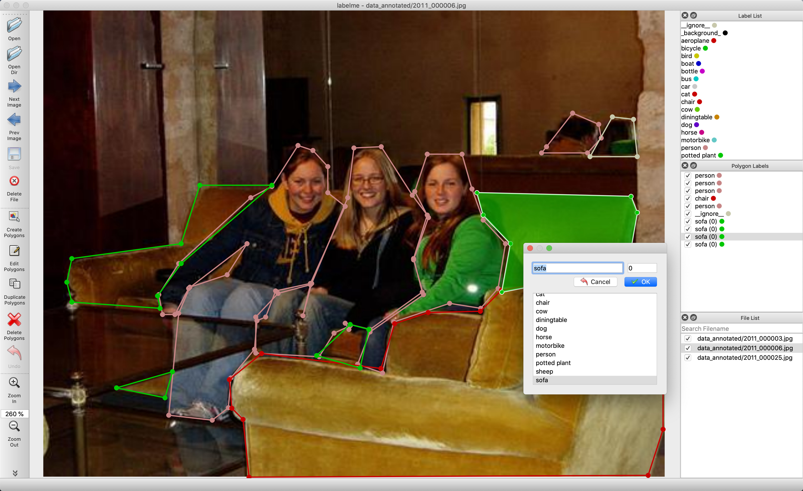
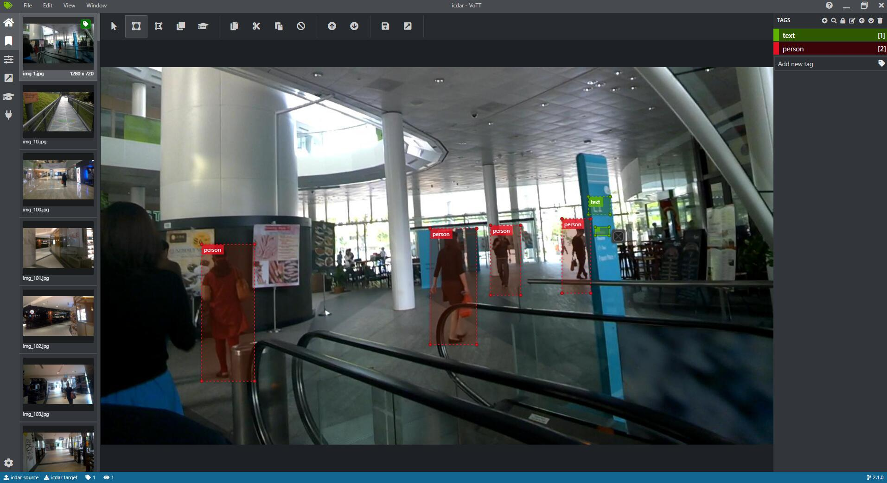

# 数据标注工具

这里整理了常用的数据标注工具，持续更新中，欢迎各位小伙伴贡献工具～

## 1. labelImg

- 工具描述：矩形标注
- 工具地址：<https://github.com/tzutalin/labelImg>
- 示意图：
    

## 2. roLabelImg

- 工具描述：基于labelImg重写的标注工具，支持旋转矩形标注
- 工具地址：<https://github.com/cgvict/roLabelImg>
- 示意图：
    

## 3. labelme

- 工具描述：支持四点、多边形、圆形等多种标注
- 工具地址：<https://github.com/wkentaro/labelme>
- 示意图：
    

## 4. Vott

- 工具描述：支持矩形,多边形等图片标注.支持视频标注.方便使用的快捷键以及比较好看的界面.同时支持导出多种标签格式.
- 工具地址：<https://github.com/microsoft/VoTT>
- 示意图：
    
