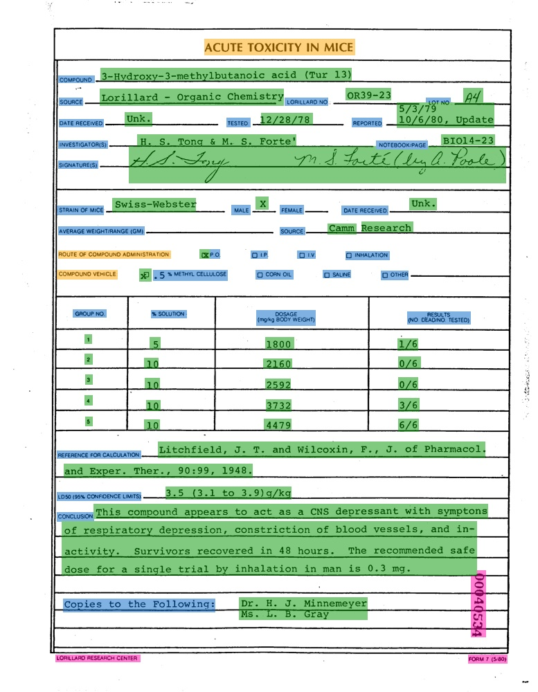

# 关键信息抽取数据集

这里整理了常见的关键信息抽取数据集，持续更新中，欢迎各位小伙伴贡献数据集～

## 1. FUNSD数据集

- **数据来源**：<https://guillaumejaume.github.io/FUNSD/>
- **数据简介**：FUNSD数据集是一个用于表单理解的数据集，它包含199张真实的、完全标注的扫描版图片，类型包括市场报告、广告以及学术报告等，并分为149张训练集以及50张测试集。FUNSD数据集适用于多种类型的DocVQA任务，如字段级实体分类、字段级实体连接等。部分图像以及标注框可视化如下所示:

    
    

    图中，橙色区域代表`header`，淡蓝色区域代表`question`, 绿色区域表`answer`，粉红色代区域表`other`。

- **下载地址**：<https://guillaumejaume.github.io/FUNSD/download/>

## 2. XFUND数据集

- **数据来源**：<https://github.com/doc-analysis/XFUND>
- **数据简介**：XFUND是一个多语种表单理解数据集，它包含7种不同语种的表单数据，并且全部用人工进行了键-值对形式的标注。其中每个语种的数据都包含了199张表单数据，并分为149张训练集以及50张测试集。部分图像以及标注框可视化如下所示:

    
    

- **下载地址**：<https://github.com/doc-analysis/XFUND/releases/tag/v1.0>

## 3. wildreceipt数据集

- **数据来源**：<https://arxiv.org/abs/2103.14470>
- **数据简介**：wildreceipt数据集是英文发票数据集，包含26个类别（此处类别体系包含`Ignore`类别），共标注了50000个文本框。其中训练集包含1267张图片，测试集包含472张图片。部分图像以及标注框可视化如下所示:

    
    

**注：** 这里对于类别为`Ignore`或者`Others`的文本，没有进行可视化。

- **下载地址**：
    - 原始数据下载地址：[链接](https://download.openmmlab.com/mmocr/data/wildreceipt.tar)
    - 数据格式转换后适配于PaddleOCR训练的数据下载地址：[链接](https://paddleocr.bj.bcebos.com/ppstructure/dataset/wildreceipt.tar)
