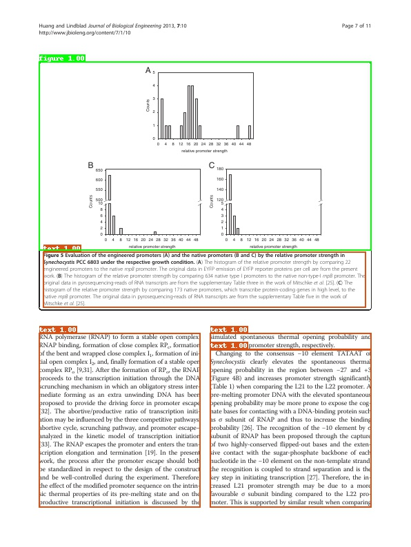
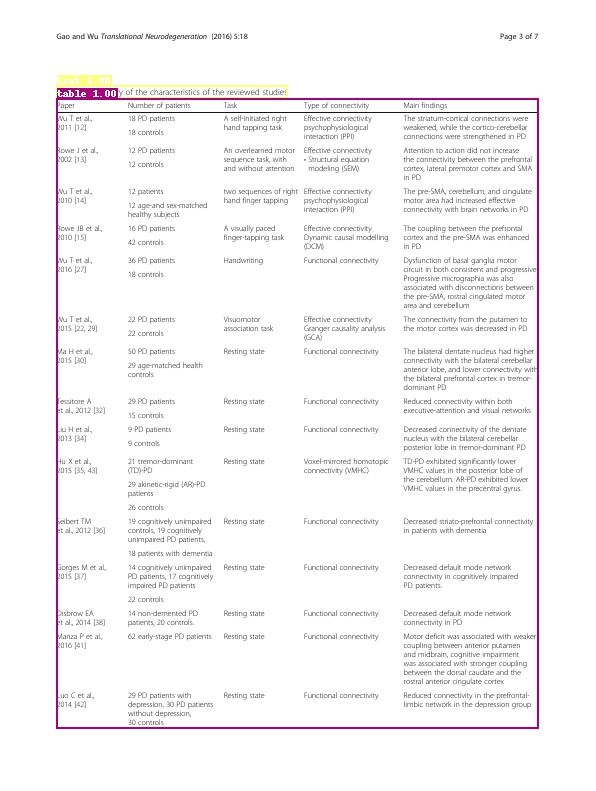
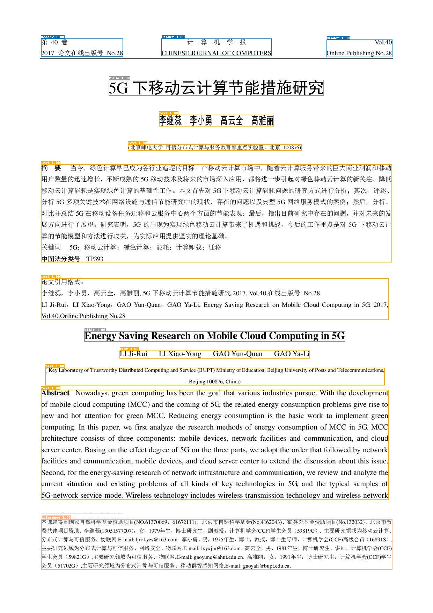
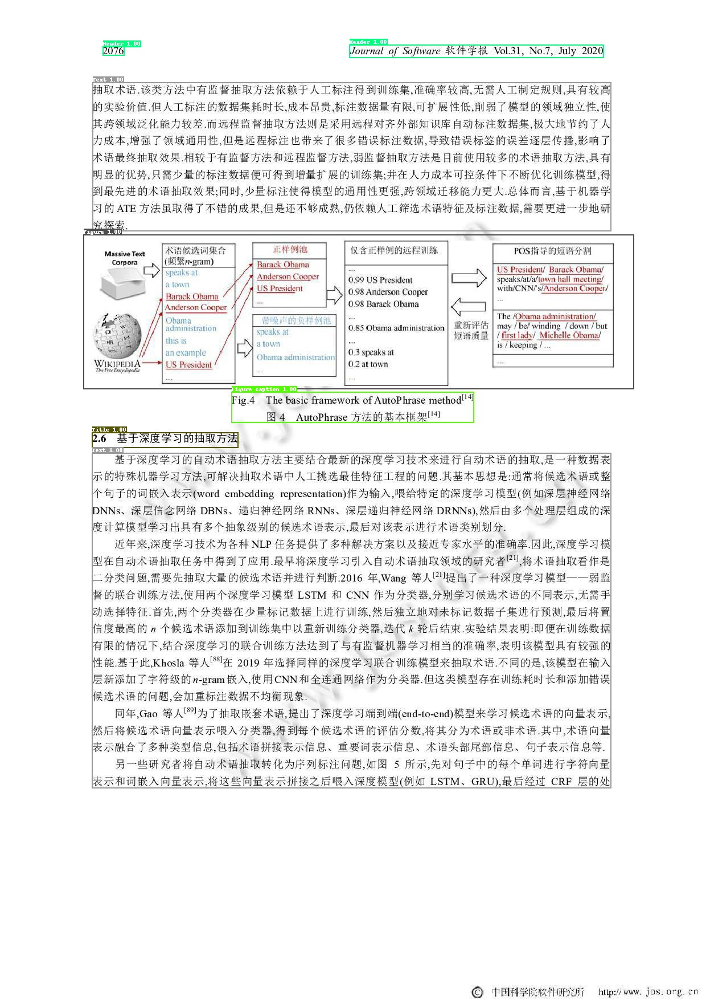

## 版面分析数据集

这里整理了常用版面分析数据集，持续更新中，欢迎各位小伙伴贡献数据集～

版面分析数据集多为目标检测数据集，除了开源数据，用户还可使用合成工具自行合成，如[labelme](https://github.com/wkentaro/labelme)等。

### 1、publaynet数据集

- **数据来源**：<https://github.com/ibm-aur-nlp/PubLayNet>
- **数据简介**：publaynet数据集的训练集合中包含35万张图像，验证集合中包含1.1万张图像。总共包含5个类别，分别是： `text, title, list, table, figure`。部分图像以及标注框可视化如下所示。

    
    

- **下载地址**：<https://developer.ibm.com/exchanges/data/all/publaynet/>
- **说明**：使用该数据集时，需要遵守[CDLA-Permissive](https://cdla.io/permissive-1-0/)协议。

### 2、CDLA数据集

- **数据来源**：<https://github.com/buptlihang/CDLA>
- **数据简介**：CDLA据集的训练集合中包含5000张图像，验证集合中包含1000张图像。总共包含10个类别，分别是： `Text, Title, Figure, Figure caption, Table, Table caption, Header, Footer, Reference, Equation`。部分图像以及标注框可视化如下所示。

    
    

- **下载地址**：<https://github.com/buptlihang/CDLA>
- **说明**：基于[PaddleDetection](https://github.com/PaddlePaddle/PaddleDetection/tree/develop)套件，在该数据集上训练目标检测模型时，在转换label时，需要将`label.txt`中的`__ignore__`与`_background_`去除。

### 3、TableBank数据集

- **数据来源**：<https://doc-analysis.github.io/tablebank-page/index.html>
- **数据简介**：TableBank数据集包含Latex（训练集187199张，验证集7265张，测试集5719张）与Word（训练集73383张，验证集2735张，测试集2281张）两种类别的文档。仅包含`Table` 1个类别。部分图像以及标注框可视化如下所示。

    
    

- **下载地址**：<https://doc-analysis.github.io/tablebank-page/index.html>
- **说明**：使用该数据集时，需要遵守[Apache-2.0](https://github.com/doc-analysis/TableBank/blob/master/LICENSE)协议。
