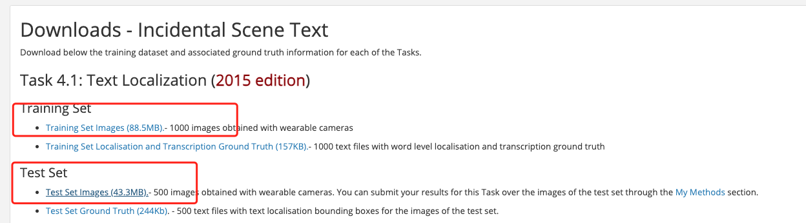

# OCR datasets

Here is a list of public datasets commonly used in OCR, which are being continuously updated. Welcome to contribute datasets~

## 1. Text detection

### 1.1 PaddleOCR text detection format annotation

The annotation file formats supported by the PaddleOCR text detection algorithm are as follows, separated by "\t":

```text linenums="1"
"Image file name             Image annotation information encoded by json.dumps"
ch4_test_images/img_61.jpg    [{"transcription": "MASA", "points": [[310, 104], [416, 141], [418, 216], [312, 179]]}, {...}]
```

The image annotation after **json.dumps()** encoding is a list containing multiple dictionaries.

The `points` in the dictionary represent the coordinates (x, y) of the four points of the text box, arranged clockwise from the point at the upper left corner.

`transcription` represents the text of the current text box. **When its content is "###" it means that the text box is invalid and will be skipped during training.**

If you want to train PaddleOCR on other datasets, please build the annotation file according to the above format.

### 1.2 Public dataset

| dataset | Image download link | PaddleOCR format annotation download link |
|---|---|---|
| ICDAR 2015 | <https://rrc.cvc.uab.es/?ch=4&com=downloads>            | [train](https://paddleocr.bj.bcebos.com/dataset/train_icdar2015_label.txt) / [test](https://paddleocr.bj.bcebos.com/dataset/test_icdar2015_label.txt) |
| ctw1500 | <https://paddleocr.bj.bcebos.com/dataset/ctw1500.zip>   | Included in the downloaded image zip                                                                                                           |
| total text | <https://paddleocr.bj.bcebos.com/dataset/total_text.tar> |  Included in the downloaded image zip  |

#### 1.2.1 ICDAR 2015

The icdar2015 dataset contains train set which has 1000 images obtained with wearable cameras and test set which has 500 images obtained with wearable cameras. The icdar2015 dataset can be downloaded from the link in the table above. Registration is required for downloading.

After registering and logging in, download the part marked in the red box in the figure below. And, the content downloaded by `Training Set Images` should be saved as the folder `icdar_c4_train_imgs`, and the content downloaded by `Test Set Images` is saved as the folder `ch4_test_images`



Decompress the downloaded dataset to the working directory, assuming it is decompressed under PaddleOCR/train_data/. Then download the PaddleOCR format annotation file from the table above.

PaddleOCR also provides a data format conversion script, which can convert the official website label to the PaddleOCR format. The data conversion tool is in `ppocr/utils/gen_label.py`, here is the training set as an example:

```bash linenums="1"
# Convert the label file downloaded from the official website to train_icdar2015_label.txt
python gen_label.py --mode="det" --root_path="/path/to/icdar_c4_train_imgs/"  \
                    --input_path="/path/to/ch4_training_localization_transcription_gt" \
                    --output_label="/path/to/train_icdar2015_label.txt"
```

After decompressing the data set and downloading the annotation file, PaddleOCR/train_data/ has two folders and two files, which are:

```text linenums="1"
/PaddleOCR/train_data/icdar2015/text_localization/
  └─ icdar_c4_train_imgs/         Training data of icdar dataset
  └─ ch4_test_images/             Testing data of icdar dataset
  └─ train_icdar2015_label.txt    Training annotation of icdar dataset
  └─ test_icdar2015_label.txt     Test annotation of icdar dataset
```

## 2. Text recognition

### 2.1 PaddleOCR text recognition format annotation

The text recognition algorithm in PaddleOCR supports two data formats:

- `lmdb` is used to train data sets stored in lmdb format, use [lmdb_dataset.py](../../../ppocr/data/lmdb_dataset.py) to load;
- `common dataset` is used to train data sets stored in text files, use [simple_dataset.py](../../../ppocr/data/simple_dataset.py) to load.

If you want to use your own data for training, please refer to the following to organize your data.

#### Training set

It is recommended to put the training images in the same folder, and use a txt file (rec_gt_train.txt) to store the image path and label. The contents of the txt file are as follows:

- Note: by default, the image path and image label are split with \t, if you use other methods to split, it will cause training error

```text linenums="1"
" Image file name           Image annotation "

train_data/rec/train/word_001.jpg   简单可依赖
train_data/rec/train/word_002.jpg   用科技让复杂的世界更简单
...
```

The final training set should have the following file structure:

```text linenums="1"
|-train_data
  |-rec
    |- rec_gt_train.txt
    |- train
        |- word_001.png
        |- word_002.jpg
        |- word_003.jpg
        | ...
```

#### Test set

Similar to the training set, the test set also needs to be provided a folder containing all images (test) and a rec_gt_test.txt. The structure of the test set is as follows:

```text linenums="1"
|-train_data
  |-rec
    |-ic15_data
        |- rec_gt_test.txt
        |- test
            |- word_001.jpg
            |- word_002.jpg
            |- word_003.jpg
            | ...
```

### 2.2 Public dataset

| dataset | Image download link | PaddleOCR format annotation download link |
|---|---|---|
| en benchmark(MJ, SJ, IIIT, SVT, IC03, IC13, IC15, SVTP, and CUTE.) | [DTRB](https://github.com/clovaai/deep-text-recognition-benchmark#download-lmdb-dataset-for-traininig-and-evaluation-from-here) | LMDB format, which can be loaded directly with [lmdb_dataset.py](../../../ppocr/data/lmdb_dataset.py) |
|ICDAR 2015| <http://rrc.cvc.uab.es/?ch=4&com=downloads> | [train](https://paddleocr.bj.bcebos.com/dataset/rec_gt_train.txt)/ [test](https://paddleocr.bj.bcebos.com/dataset/rec_gt_test.txt) |
| Multilingual datasets |[Baidu network disk](https://pan.baidu.com/s/1bS_u207Rm7YbY33wOECKDA) Extraction code: frgi <br> [google drive](https://drive.google.com/file/d/18cSWX7wXSy4G0tbKJ0d9PuIaiwRLHpjA/view) | Included in the downloaded image zip |

#### 2.1 ICDAR 2015

The ICDAR 2015 dataset can be downloaded from the link in the table above for quick validation. The lmdb format dataset required by en benchmark can also be downloaded from the table above.

Then download the PaddleOCR format annotation file from the table above.

PaddleOCR also provides a data format conversion script, which can convert the ICDAR official website label to the data format supported by PaddleOCR. The data conversion tool is in `ppocr/utils/gen_label.py`, here is the training set as an example:

```bash linenums="1"
# Convert the label file downloaded from the official website to rec_gt_label.txt
python gen_label.py --mode="rec" --input_path="{path/of/origin/label}" --output_label="rec_gt_label.txt"
```

The data format is as follows, (a) is the original picture, (b) is the Ground Truth text file corresponding to each picture:


## 3. Data storage path

The default storage path for PaddleOCR training data is `PaddleOCR/train_data`, if you already have a dataset on your disk, just create a soft link to the dataset directory:

```bash linenums="1"
# linux and mac os
ln -sf <path/to/dataset> <path/to/paddle_ocr>/train_data/dataset
# windows
mklink /d <path/to/paddle_ocr>/train_data/dataset <path/to/dataset>
```
