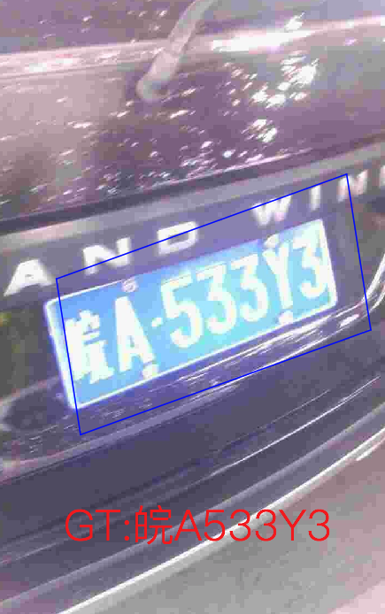

# 垂类多语言OCR数据集

这里整理了常用垂类和多语言OCR数据集，持续更新中，欢迎各位小伙伴贡献数据集～

## 中国城市车牌数据集

- **数据来源**：[CCPD](https://github.com/detectRecog/CCPD)
- **数据简介**: 包含超过25万张中国城市车牌图片及车牌检测、识别信息的标注。包含以下几种不同场景中的车牌图片信息。
    - CCPD-Base: 通用车牌图片
    - CCPD-DB: 车牌区域亮度较亮、较暗或者不均匀
    - CCPD-FN: 车牌离摄像头拍摄位置相对更远或者更近
    - CCPD-Rotate: 车牌包含旋转（水平20\~50度，竖直-10\~10度）
    - CCPD-Tilt: 车牌包含旋转（水平15\~45度，竖直15\~45度）
    - CCPD-Blur: 车牌包含由于摄像机镜头抖动导致的模糊情况
    - CCPD-Weather: 车牌在雨天、雪天或者雾天拍摄得到
    - CCPD-Challenge: 至今在车牌检测识别任务中最有挑战性的一些图片
    - CCPD-NP: 没有安装车牌的新车图片。

      

- **下载地址**
    - 百度云下载地址(提取码是hm0U): [link](https://pan.baidu.com/s/1i5AOjAbtkwb17Zy-NQGqkw)
    - Google drive下载地址：[link](https://drive.google.com/file/d/1rdEsCUcIUaYOVRkx5IMTRNA7PcGMmSgc/view)

## 银行信用卡数据集

- **数据来源**: [source](https://www.kesci.com/home/dataset/5954cf1372ead054a5e25870)

- **数据简介**: 训练数据共提供了三类数据
    - 1.招行样卡数据： 包括卡面图片数据及标注数据，总共618张图片
    - 2.单字符数据： 包括图片及标注数据，总共37张图片。
    - 3.仅包含其他银行卡面，不具有更细致的信息，总共50张图片。

    - demo图片展示如下，标注信息存储在excel表格中，下面的demo图片标注为
        - 前8位卡号：62257583
        - 卡片种类：本行卡
        - 有效期结束：07/41
        - 卡用户拼音：MICHAEL

    

- **下载地址**: [cmb2017-2.zip](https://cdn.kesci.com/cmb2017-2.zip)

## 验证码数据集-Captcha

- **数据来源**: [captcha](https://github.com/lepture/captcha)
- **数据简介**: 这是一个数据合成的工具包，可以根据输入的文本，输出验证码图片，使用该工具包生成几张demo图片如下：

    

- **下载地址**: 该数据集是生成得到，无下载地址。

## 多语言数据集(Multi-lingual scene text detection and recognition)

- **数据来源**: [source](https://rrc.cvc.uab.es/?ch=15&com=downloads)
- **数据简介**: 多语言检测数据集MLT同时包含了语种识别和检测任务。
    - 在检测任务中，训练集包含10000张图片，共有10种语言，每种语言包含1000张训练图片。测试集包含10000张图片。
    - 在识别任务中，训练集包含111998个样本。
- **下载地址**: 训练集较大，分2部分下载，需要在网站上注册之后才能下载：
[link](https://rrc.cvc.uab.es/?ch=15&com=downloads)
