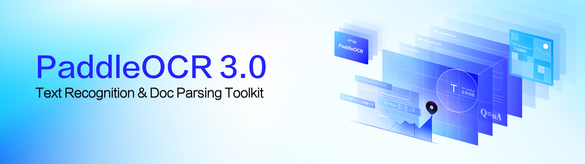
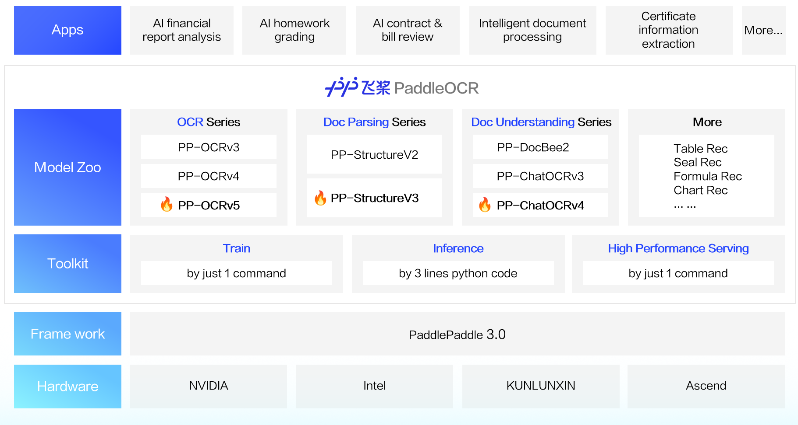
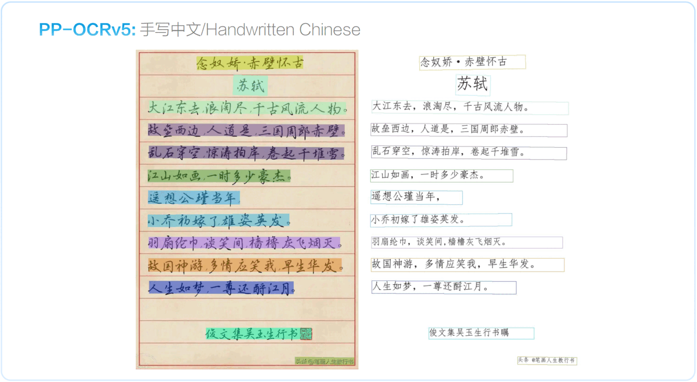
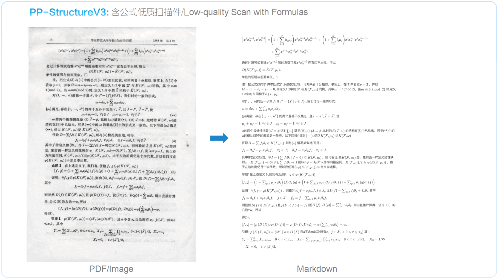

Since its initial release, PaddleOCR has gained widespread acclaim across academia, industry, and research communities, thanks to its cutting-edge algorithms and proven performance in real-world applications. It’s already powering popular open-source projects like Umi-OCR, OmniParser, MinerU, and RAGFlow, making it the go-to OCR toolkit for developers worldwide.

On May 20, 2025, the PaddlePaddle team unveiled PaddleOCR 3.0, fully compatible with the official release of the [PaddlePaddle 3.0](https://github.com/PaddlePaddle/Paddle) framework. This update further **boosts text-recognition accuracy**, adds support for **multiple text-type recognition** and **handwriting recognition**, and meets the growing demand from large-model applications for **high-precision parsing of complex documents**. When combined with the **ERNIE 4.5 Turbo**, it significantly enhances key-information extraction accuracy. PaddleOCR 3.0 also introduces support for domestic hardware platforms such as **KUNLUNXIN** and **Ascend**.

Three Major New Features in PaddleOCR 3.0:

- 🖼️ Universal-Scene Text Recognition Model [PP-OCRv5](version3.x/algorithm/PP-OCRv5/PP-OCRv5.en.md): A single model that handles five different text types plus complex handwriting. Overall recognition accuracy has increased by 13 percentage points over the previous generation.[Online Demo](https://aistudio.baidu.com/community/app/91660/webUI)

- 🧮 General Document-Parsing Solution [PP-StructureV3](./version3.x/algorithm/PP-StructureV3/PP-StructureV3.en.md): Delivers high-precision parsing of multi-layout, multi-scene PDFs, outperforming many open- and closed-source solutions on public benchmarks. [Online Demo](https://aistudio.baidu.com/community/app/518494/webUI)

- 📈 Intelligent Document-Understanding Solution [PP-ChatOCRv4](./version3.x/algorithm/PP-ChatOCRv4/PP-ChatOCRv4.en.md): Natively powered by the ERNIE 4.5 Turbo, achieving 15 percentage points higher accuracy than its predecessor.[Online Demo](https://aistudio.baidu.com/community/app/518493/webUI)

In addition to providing an outstanding model library, PaddleOCR 3.0 also offers user-friendly tools covering model training, inference, and service deployment, so developers can rapidly bring AI applications to production.

You can [Quick Start](./quick_start.en.md) directly, find comprehensive documentation in the [PaddleOCR Docs](https://paddlepaddle.github.io/PaddleOCR/main/index.html), get support via [Github Issus](https://github.com/PaddlePaddle/PaddleOCR/issues), and explore our OCR courses on [OCR courses on AIStudio](https://aistudio.baidu.com/course/introduce/25207).

## 🔄 Quick Overview of Execution Results

## 👩‍👩‍👧‍👦 Community
* 👫 Join the [PaddlePaddle Community](https://github.com/PaddlePaddle/community), where you can engage with [paddlepaddle developers](https://www.paddlepaddle.org.cn/developercommunity), researchers, and enthusiasts from around the world.
* 🎓 Learn from experts through workshops, tutorials, and Q&A sessions [hosted by the AI Studio](https://aistudio.baidu.com/learn/center).
* 🏆 Participate in [hackathons, challenges, and competitions](https://aistudio.baidu.com/competition) to showcase your skills and win exciting prizes.
* 📣 Stay updated with the latest news, announcements, and events by following our [Twitter](https://x.com/PaddlePaddle) and [WeChat](https://mp.weixin.qq.com/s/vYj1ZDcAfJ1lu_DzlOKgtQ)).
