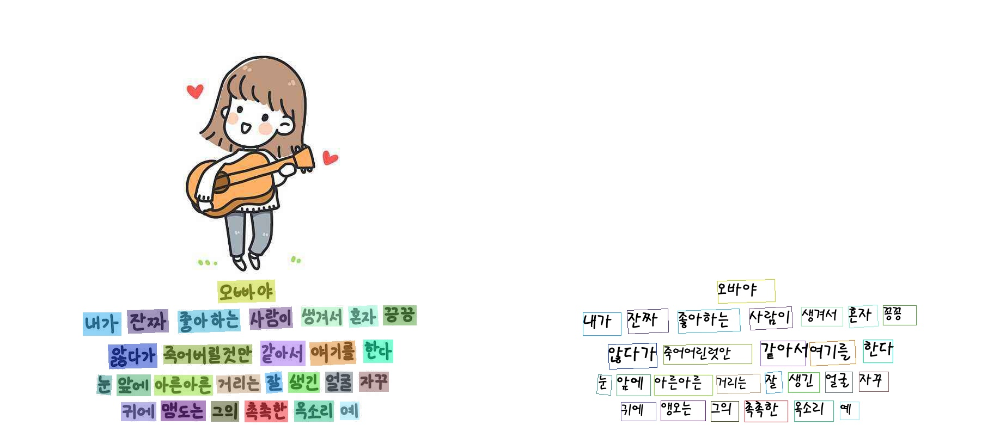

 
  

      
      
      
      
      
      
      
  

## Introduction

PaddleOCR aims to create multilingual, awesome, leading, and practical OCR tools that help users train better models and apply them into practice.

## 🚀 Community

PaddleOCR is being oversight by a [PMC](https://github.com/PaddlePaddle/PaddleOCR/issues/12122). Issues and PRs will be reviewed on a best-effort basis. For a complete overview of PaddlePaddle community, please visit [community](https://github.com/PaddlePaddle/community).

⚠️ Note: The [Issues](https://github.com/PaddlePaddle/PaddleOCR/issues) module is only for reporting program 🐞 bugs, for the rest of the questions, please move to the [Discussions](https://github.com/PaddlePaddle/PaddleOCR/discussions). Please note that if the Issue mentioned is not a bug, it will be moved to the Discussions module.

## 📣 Recent updates

- **🔥 2024.10.18 release PaddleOCR v2.9, including**:
  * PaddleX, an All-in-One development tool based on PaddleOCR's advanced technology, supports low-code full-process development capabilities in the OCR field:
     * 🎨 [**Rich Model One-Click Call**](https://paddlepaddle.github.io/PaddleOCR/latest/en/paddlex/quick_start.html): Integrates **17 models** related to text image intelligent analysis, general OCR, general layout parsing, table recognition, formula recognition, and seal recognition into 6 pipelines, which can be quickly experienced through a simple **Python API one-click call**. In addition, the same set of APIs also supports a total of **200+ models** in image classification, object detection, image segmentation, and time series forcasting, forming 20+ single-function modules, making it convenient for developers to use **model combinations**.

     * 🚀 [**High Efficiency and Low barrier of entry**](https://paddlepaddle.github.io/PaddleOCR/latest/en/paddlex/overview.html): Provides two methods based on **unified commands** and **GUI** to achieve simple and efficient use, combination, and customization of models. Supports multiple deployment methods such as **high-performance inference, service-oriented deployment, and edge deployment**. Additionally, for various mainstream hardware such as **NVIDIA GPU, Kunlunxin XPU, Ascend NPU, Cambricon MLU, and Haiguang DCU**, models can be developed with **seamless switching**.

  * Supports [PP-ChatOCRv3-doc](https://github.com/PaddlePaddle/PaddleX/blob/release/3.0-beta1/docs/pipeline_usage/tutorials/information_extration_pipelines/document_scene_information_extraction_en.md), [high-precision layout detection model based on RT-DETR](https://github.com/PaddlePaddle/PaddleX/blob/release/3.0-beta1/docs/module_usage/tutorials/ocr_modules/layout_detection_en.md) and [high-efficiency layout area detection model based on PicoDet](https://github.com/PaddlePaddle/PaddleX/blob/release/3.0-beta1/docs/module_usage/tutorials/ocr_modules/layout_detection_en.md), [high-precision table structure recognition model](https://github.com/PaddlePaddle/PaddleX/blob/release/3.0-beta1/docs/module_usage/tutorials/ocr_modules/table_structure_recognition_en.md), text image unwarping model [UVDoc](https://github.com/PaddlePaddle/PaddleX/blob/release/3.0-beta1/docs/module_usage/tutorials/ocr_modules/text_image_unwarping_en.md), formula recognition model [LatexOCR](https://github.com/PaddlePaddle/PaddleX/blob/release/3.0-beta1/docs/module_usage/tutorials/ocr_modules/formula_recognition_en.md), and [document image orientation classification model based on PP-LCNet](https://github.com/PaddlePaddle/PaddleX/blob/release/3.0-beta1/docs/module_usage/tutorials/ocr_modules/doc_img_orientation_classification_en.md).

- **🔥2023.8.7 Release PaddleOCR[release/2.7](https://github.com/PaddlePaddle/PaddleOCR/tree/release/2.7)**

    - Release [PP-OCRv4](./ppocr/overview.en.md), support mobile version and server version

        - PP-OCRv4-mobile：When the speed is comparable, the effect of the Chinese scene is improved by 4.5% compared with PP-OCRv3, the English scene is improved by 10%, and the average recognition accuracy of the 80-language multilingual model is increased by more than 8%.
        - PP-OCRv4-server：Release the OCR model with the highest accuracy at present, the detection model accuracy increased by 4.9% in the Chinese and English scenes, and the recognition model accuracy increased by 2%
        refer [quickstart](./quick_start.en.md) quick use by one line command, At the same time, the whole process of model training, reasoning, and high-performance deployment can also be completed with few code in the [General OCR Industry Solution](https://aistudio.baidu.com/aistudio/modelsdetail?modelId=286) in PaddleX.

    - Release[PP-ChatOCR](https://aistudio.baidu.com/aistudio/modelsdetail?modelId=332), a new scheme for extracting key information of general scenes using PP-OCR model and ERNIE LLM.

- 🔨**2022.11 Add implementation of [4 cutting-edge algorithms](./algorithm/overview.en.md)**：Text Detection [DRRG](./algorithm/text_detection/algorithm_det_drrg.en.md),  Text Recognition [RFL](./algorithm/text_recognition/algorithm_rec_rfl.en.md), Image Super-Resolution [Text Telescope](./algorithm/super_resolution/algorithm_sr_telescope.en.md)，Handwritten Mathematical Expression Recognition [CAN](./algorithm/formula_recognition/algorithm_rec_can.en.md)

- **2022.10 release [optimized JS version PP-OCRv3 model](./ppocr/infer_deploy/paddle_js.en.md)** with 4.3M model size, 8x faster inference time, and a ready-to-use web demo

    - 💥 **Live Playback: Introduction to PP-StructureV2 optimization strategy**. Scan [the QR code below](#Community) using WeChat, follow the PaddlePaddle official account and fill out the questionnaire to join the WeChat group, get the live link and 20G OCR learning materials (including PDF2Word application, 10 models in vertical scenarios, etc.)

- **🔥2022.8.24 Release PaddleOCR [release/2.6](https://github.com/PaddlePaddle/PaddleOCR/tree/release/2.6)**

    - Release [PP-StructureV2](./ppstructure/)，with functions and performance fully upgraded, adapted to Chinese scenes, and new support for [Layout Recovery](./ppstructure/model_train/recovery_to_doc.en.md) and **one line command to convert PDF to Word**;
    - [Layout Analysis](./ppstructure/model_train/train_layout.en.md) optimization: model storage reduced by 95%, while speed increased by 11 times, and the average CPU time-cost is only 41ms;
    - [Table Recognition](./ppstructure/model_train/train_table.en.md) optimization: 3 optimization strategies are designed, and the model accuracy is improved by 6% under comparable time consumption;
    - [Key Information Extraction](./ppstructure/model_train/train_kie.en.md) optimization：a visual-independent model structure is designed, the accuracy of semantic entity recognition is increased by 2.8%, and the accuracy of relation extraction is increased by 9.1%.

- **🔥2022.8 Release [OCR scene application collection](./applications/overview.md)**

    - Release **9 vertical models** such as digital tube, LCD screen, license plate, handwriting recognition model, high-precision SVTR model, etc, covering the main OCR vertical applications in general, manufacturing, finance, and transportation industries.

- **2022.8 Add implementation of [8 cutting-edge algorithms](./algorithm/overview.en.md)**

    - Text Detection: [FCENet](./algorithm/text_detection/algorithm_det_fcenet.en.md), [DB++](./algorithm/text_detection/algorithm_det_db.en.md)
    - Text Recognition: [ViTSTR](./algorithm/text_recognition/algorithm_rec_vitstr.en.md), [ABINet](./algorithm/text_recognition/algorithm_rec_abinet.en.md), [VisionLAN](./algorithm/text_recognition/algorithm_rec_visionlan.en.md), [SPIN](./algorithm/text_recognition/algorithm_rec_spin.en.md), [RobustScanner](./algorithm/text_recognition/algorithm_rec_robustscanner.en.md)
    - Table Recognition: [TableMaster](./algorithm/table_recognition/algorithm_table_master.en.md)
- **2022.5.9 Release PaddleOCR [release/2.5](https://github.com/PaddlePaddle/PaddleOCR/tree/release/2.5)**

    - Release [PP-OCRv3](./ppocr/overview.en.md#pp-ocrv3): With comparable speed, the effect of Chinese scene is further improved by 5% compared with PP-OCRv2, the effect of English scene is improved by 11%, and the average recognition accuracy of 80 language multilingual models is improved by more than 5%.
    - Release [PPOCRLabelv2](https://github.com/PFCCLab/PPOCRLabel): Add the annotation function for table recognition task, key information extraction task and irregular text image.
    - Release interactive e-book [*"Dive into OCR"*](./blog/ocr_book.en.md), covers the cutting-edge theory and code practice of OCR full stack technology.
- [more](./update.en.md)

## 🌟 Features

PaddleOCR support a variety of cutting-edge algorithms related to OCR, and developed industrial featured models/solution [PP-OCR](./ppocr/overview.md)、[PP-Structure](./ppstructure/overview.md) and [PP-ChatOCR](https://aistudio.baidu.com/aistudio/projectdetail/6488689) on this basis, and get through the whole process of data production, model training, compression, inference and deployment.

> It is recommended to start with the “quick experience” in the document tutorial

## 📖 Technical exchange and cooperation

- PaddleX provides a one-stop full-process high-efficiency development platform for flying paddle ecological model training, pressure, and push. Its mission is to help AI technology quickly land, and its vision is to make everyone an AI Developer!

    - PaddleX currently covers areas such as image classification, object detection, image segmentation, 3D, OCR, and time series prediction, and has built-in 36 basic single models, such as RP-DETR, PP-YOLOE, PP-HGNet, PP-LCNet, PP- LiteSeg, etc.; integrated 12 practical industrial solutions, such as PP-OCRv4, PP-ChatOCR, PP-ShiTu, PP-TS, vehicle-mounted road waste detection, identification of prohibited wildlife products, etc.
    - PaddleX provides two AI development modes: "Toolbox" and "Developer". The toolbox mode can tune key hyperparameters without code, and the developer mode can perform single-model training, push and multi-model serial inference with low code, and supports both cloud and local terminals.
    - PaddleX also supports joint innovation and development, profit sharing! At present, PaddleX is rapidly iterating, and welcomes the participation of individual developers and enterprise developers to create a prosperous AI technology ecosystem!

## 🇺🇳 Guideline for New Language Requests

If you want to request a new language support, a PR with 1 following files are needed：

- In folder [ppocr/utils/dict](./ppocr/utils/dict),
it is necessary to submit the dict text to this path and name it with `{language}_dict.txt` that contains a list of all characters. Please see the format example from other files in that folder.

If your language has unique elements, please tell me in advance within any way, such as useful links, wikipedia and so on.

More details, please refer to [Multilingual OCR Development Plan](https://github.com/PaddlePaddle/PaddleOCR/issues/1048).

## Visualization

## PP-OCRv3

### PP-OCRv3 Chinese model

### PP-OCRv3 English model

### PP-OCRv3 Multilingual model

#### PP-StructureV2

- layout analysis + table recognition

  

- SER (Semantic entity recognition)

  

  

  

- RE (Relation Extraction)

  

  

  

## 📄 License

This project is released under <a href="https://github.com/PaddlePaddle/PaddleOCR/blob/master/LICENSE">Apache 2.0 license</a>
