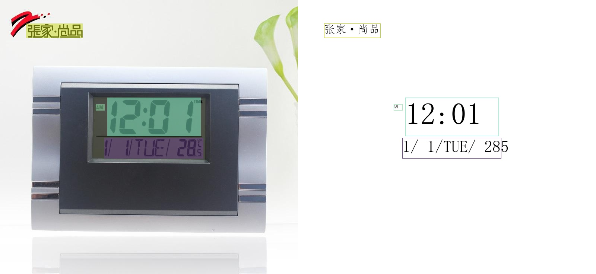
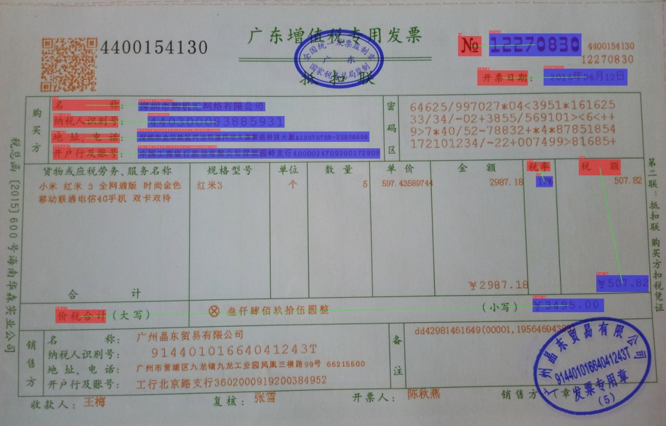

 
  

      
      
      
      
      
      
      
  

## 简介

PaddleOCR 旨在打造一套丰富、领先、且实用的 OCR 工具库，助力开发者训练出更好的模型，并应用落地。

## 🚀 社区

PaddleOCR 由 [PMC](https://github.com/PaddlePaddle/PaddleOCR/issues/12122) 监督。Issues 和 PRs 将在尽力的基础上进行审查。欲了解 PaddlePaddle 社区的完整概况，请访问 [community](https://github.com/PaddlePaddle/community)。

⚠️注意：[Issues](https://github.com/PaddlePaddle/PaddleOCR/issues)模块仅用来报告程序🐞Bug，其余提问请移步[Discussions](https://github.com/PaddlePaddle/PaddleOCR/discussions)模块提问。如所提Issue不是Bug，会被移到Discussions模块，敬请谅解。

## 📣 近期更新

- **🔥2024.10.1 添加OCR领域低代码全流程开发能力**:
  * 飞桨低代码开发工具PaddleX，依托于PaddleOCR的先进技术，支持了OCR领域的低代码全流程开发能力：
     * 🎨 [**模型丰富一键调用**](https://paddlepaddle.github.io/PaddleOCR/latest/paddlex/quick_start.html)：将文本图像智能分析、通用OCR、通用版面解析、通用表格识别、公式识别、印章文本识别涉及的**17个模型**整合为6条模型产线，通过极简的**Python API一键调用**，快速体验模型效果。此外，同一套API，也支持图像分类、目标检测、图像分割、时序预测等共计**200+模型**，形成20+单功能模块，方便开发者进行**模型组合**使用。
     * 🚀[**提高效率降低门槛**](https://paddlepaddle.github.io/PaddleOCR/latest/paddlex/overview.html)：提供基于**统一命令**和**图形界面**两种方式，实现模型简洁高效的使用、组合与定制。支持**高性能推理、服务化部署和端侧部署**等多种部署方式。此外，对于各种主流硬件如**英伟达GPU、昆仑芯、昇腾、寒武纪和海光**等，进行模型开发时，都可以**无缝切换**。

  * 支持文档场景信息抽取v3([PP-ChatOCRv3-doc](https://github.com/PaddlePaddle/PaddleX/blob/release/3.0-beta1/docs/pipeline_usage/tutorials/information_extration_pipelines/document_scene_information_extraction.md))、基于RT-DETR的[高精度版面区域检测模型](https://github.com/PaddlePaddle/PaddleX/blob/release/3.0-beta1/docs/module_usage/tutorials/ocr_modules/layout_detection.md)和PicoDet的[高效率版面区域检测模型](https://github.com/PaddlePaddle/PaddleX/blob/release/3.0-beta1/docs/module_usage/tutorials/ocr_modules/layout_detection.md)、高精度表格结构识别模型[SLANet_Plus](https://github.com/PaddlePaddle/PaddleX/blob/release/3.0-beta1/docs/module_usage/tutorials/ocr_modules/table_structure_recognition.md)、文本图像矫正模型[UVDoc](https://github.com/PaddlePaddle/PaddleX/blob/release/3.0-beta1/docs/module_usage/tutorials/ocr_modules/text_image_unwarping.md)、公式识别模型[LatexOCR](https://github.com/PaddlePaddle/PaddleX/blob/release/3.0-beta1/docs/module_usage/tutorials/ocr_modules/formula_recognition.md)、基于PP-LCNet的[文档图像方向分类模型](https://github.com/PaddlePaddle/PaddleX/blob/release/3.0-beta1/docs/module_usage/tutorials/ocr_modules/doc_img_orientation_classification.md)
  
- **🔥2024.7 添加 PaddleOCR 算法模型挑战赛冠军方案**：
    - 赛题一：OCR 端到端识别任务冠军方案——[场景文本识别算法-SVTRv2](https://paddlepaddle.github.io/PaddleOCR/latest/algorithm/text_recognition/algorithm_rec_svtrv2.html)；
    - 赛题二：通用表格识别任务冠军方案——[表格识别算法-SLANet-LCNetV2](https://paddlepaddle.github.io/PaddleOCR/latest/algorithm/table_recognition/algorithm_table_slanet.html)。

> [更多](./update.md)

## 🌟 特性

支持多种 OCR 相关前沿算法，在此基础上打造产业级特色模型PP-OCR、PP-Structure和PP-ChatOCR，并打通数据生产、模型训练、压缩、预测部署全流程。

## 效果展示

### 超轻量PP-OCRv3效果展示

#### PP-OCRv3中文模型

#### PP-OCRv3英文数字模型

#### PP-OCRv3多语言模型

#### PP-Structure 文档分析

- 版面分析+表格识别

  

- SER（语义实体识别）

  

  

  

- RE（关系提取）

  

  

  

## 许可证书

本项目的发布受<a href="https://github.com/PaddlePaddle/PaddleOCR/blob/master/LICENSE">Apache 2.0 license</a>许可认证。
