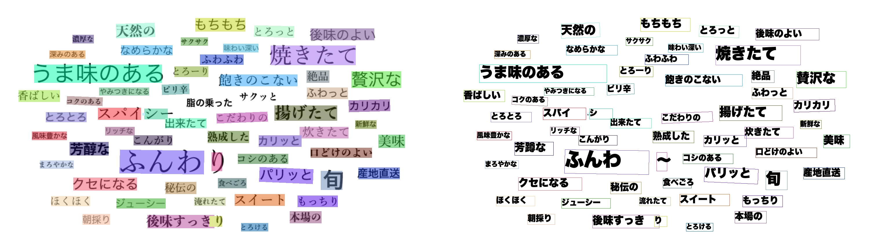
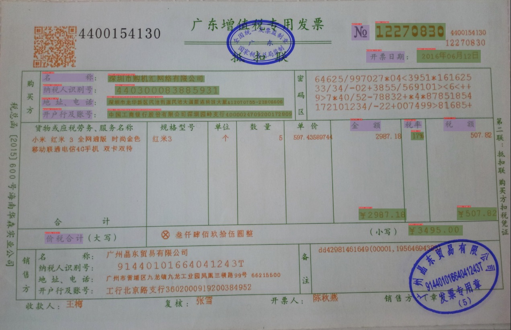

 
  

      
      
      
      
      
      
      
  

## 简介

PaddleOCR 旨在打造一套丰富、领先、且实用的 OCR 工具库，助力开发者训练出更好的模型，并应用落地。

## 🚀 社区

PaddleOCR 由 [PMC](https://github.com/PaddlePaddle/PaddleOCR/issues/12122) 监督。Issues 和 PRs 将在尽力的基础上进行审查。欲了解 PaddlePaddle 社区的完整概况，请访问 [community](https://github.com/PaddlePaddle/community)。

⚠️注意：[Issues](https://github.com/PaddlePaddle/PaddleOCR/issues)模块仅用来报告程序🐞Bug，其余提问请移步[Discussions](https://github.com/PaddlePaddle/PaddleOCR/discussions)模块提问。如所提Issue不是Bug，会被移到Discussions模块，敬请谅解。

## 📣 近期更新

- **🔥🔥2025.3.7 PaddleOCR 2.10 版本，主要包含如下内容**：

  - **重磅新增 OCR 领域 12 个自研单模型：**
    - **[版面区域检测](https://paddlepaddle.github.io/PaddleX/latest/module_usage/tutorials/ocr_modules/layout_detection.html)** 系列 3 个模型：PP-DocLayout-L、PP-DocLayout-M、PP-DocLayout-S，支持预测 23 个常见版面类别，中英论文、研报、试卷、书籍、杂志、合同、报纸等丰富类型的文档实现高质量版面检测，**mAP@0.5 最高达 90.4%，轻量模型端到端每秒处理超百页文档图像。**
    - **[公式识别](https://paddlepaddle.github.io/PaddleX/latest/module_usage/tutorials/ocr_modules/formula_recognition.html)** 系列 2 个模型：PP-FormulaNet-L、PP-FormulaNet-S，支持 5 万种 LaTeX 常见词汇，支持识别高难度印刷公式和手写公式，其中 **PP-FormulaNet-L 较开源同等量级模型精度高 6 个百分点，PP-FormulaNet-S 较同等精度模型速度快 16 倍。**
    - **[表格结构识别](https://paddlepaddle.github.io/PaddleX/latest/module_usage/tutorials/ocr_modules/table_structure_recognition.html)** 系列 2 个模型：SLANeXt_wired、SLANeXt_wireless。飞桨自研新一代表格结构识别模型，分别支持有线表格和无线表格的结构预测。相比于SLANet_plus，SLANeXt在表格结构方面有较大提升，**在内部高难度表格识别评测集上精度高 6 个百分点。**
    - **[表格分类](https://paddlepaddle.github.io/PaddleX/latest/module_usage/tutorials/ocr_modules/table_classification.html)** 系列 1 个模型：PP-LCNet_x1_0_table_cls，超轻量级有线表格和无线表格的分类模型。
    - **[表格单元格检测](https://paddlepaddle.github.io/PaddleX/latest/module_usage/tutorials/ocr_modules/table_cells_detection.html)** 系列 2 个模型：RT-DETR-L_wired_table_cell_det、RT-DETR-L_wireless_table_cell_det，分别支持有线表格和无线表格的单元格检测，可配合SLANeXt_wired、SLANeXt_wireless、文本检测、文本识别模块完成对表格的端到端预测。（参见本次新增的表格识别v2产线）
    - **[文本识别](https://paddlepaddle.github.io/PaddleX/latest/module_usage/tutorials/ocr_modules/text_recognition.html)** 系列 1 个模型： PP-OCRv4_server_rec_doc，**支持1.5万+字典，文字识别范围更广，与此同时提升了部分文字的识别精准度，在内部数据集上，精度较 PP-OCRv4_server_rec 高 3 个百分点以上。**
    - **[文本行方向分类](https://paddlepaddle.github.io/PaddleX/latest/module_usage/tutorials/ocr_modules/text_recognition.html)** 系列 1 个模型：PP-LCNet_x0_25_textline_ori，**存储只有 0.3M** 的超轻量级文本行方向分类模型。

   - **重磅推出 4 条高价值多模型组合方案：** 
     - **[文档图像预处理产线](https://paddlepaddle.github.io/PaddleX/latest/pipeline_usage/tutorials/ocr_pipelines/doc_preprocessor.html)**：通过超轻量级模型组合使用，实现对文档图像的扭曲和方向的矫正。
     - **[版面解析v2产线](https://paddlepaddle.github.io/PaddleX/latest/pipeline_usage/tutorials/ocr_pipelines/layout_parsing_v2.html)**：组合多个自研的不同类型的 OCR 类模型，优化复杂版面阅读顺序，实现多种复杂 PDF 文件端到端转换 Markdown 文件和 JSON 文件。在多个文档场景下，转换效果较其他开源方案更好。可以为大模型训练和应用提供高质量的数据生产能力。
     - **[表格识别v2产线](https://paddlepaddle.github.io/PaddleX/latest/pipeline_usage/tutorials/ocr_pipelines/table_recognition_v2.html)**：**提供更好的表格端到端识别能力。** 通过将表格分类模块、表格单元格检测模块、表格结构识别模块、文本检测模块、文本识别模块等组合使用，实现对多种样式的表格预测，用户可自定义微调其中任意模块以提升垂类表格的效果。
     - **[PP-ChatOCRv4-doc产线](https://paddlepaddle.github.io/PaddleX/latest/pipeline_usage/tutorials/information_extraction_pipelines/document_scene_information_extraction_v4.html)**：在 PP-ChatOCRv3-doc 的基础上，**融合了多模态大模型，优化了 Prompt 和多模型组合后处理逻辑，更好地解决了版面分析、生僻字、多页 pdf、表格、印章识别等常见的复杂文档信息抽取难点问题，准确率较 PP-ChatOCRv3-doc 高 15 个百分点。其中，大模型升级了本地部署的能力，提供了标准的 OpenAI 调用接口，支持对本地大模型如 DeepSeek-R1 部署的调用。**

- **🔥2024.10.1 添加OCR领域低代码全流程开发能力**:
    - 飞桨低代码开发工具PaddleX，依托于PaddleOCR的先进技术，支持了OCR领域的低代码全流程开发能力：
        - 🎨 [**模型丰富一键调用**](https://paddlepaddle.github.io/PaddleOCR/latest/paddlex/quick_start.html)：将文本图像智能分析、通用OCR、通用版面解析、通用表格识别、公式识别、印章文本识别涉及的**17个模型**整合为6条模型产线，通过极简的**Python API一键调用**，快速体验模型效果。此外，同一套API，也支持图像分类、目标检测、图像分割、时序预测等共计**200+模型**，形成20+单功能模块，方便开发者进行**模型组合**使用。
        - 🚀[**提高效率降低门槛**](https://paddlepaddle.github.io/PaddleOCR/latest/paddlex/overview.html)：提供基于**统一命令**和**图形界面**两种方式，实现模型简洁高效的使用、组合与定制。支持**高性能推理、服务化部署和端侧部署**等多种部署方式。此外，对于各种主流硬件如**英伟达GPU、昆仑芯、昇腾、寒武纪和海光**等，进行模型开发时，都可以**无缝切换**。

    - 支持文档场景信息抽取v3[PP-ChatOCRv3-doc](https://github.com/PaddlePaddle/PaddleX/blob/release/3.0-beta1/docs/pipeline_usage/tutorials/information_extraction_pipelines/document_scene_information_extraction.md)、基于RT-DETR的[高精度版面区域检测模型](https://github.com/PaddlePaddle/PaddleX/blob/release/3.0-beta1/docs/module_usage/tutorials/ocr_modules/layout_detection.md)和PicoDet的[高效率版面区域检测模型](https://github.com/PaddlePaddle/PaddleX/blob/release/3.0-beta1/docs/module_usage/tutorials/ocr_modules/layout_detection.md)、高精度表格结构识别模型[SLANet_Plus](https://github.com/PaddlePaddle/PaddleX/blob/release/3.0-beta1/docs/module_usage/tutorials/ocr_modules/table_structure_recognition.md)、文本图像矫正模型[UVDoc](https://github.com/PaddlePaddle/PaddleX/blob/release/3.0-beta1/docs/module_usage/tutorials/ocr_modules/text_image_unwarping.md)、公式识别模型[LatexOCR](https://github.com/PaddlePaddle/PaddleX/blob/release/3.0-beta1/docs/module_usage/tutorials/ocr_modules/formula_recognition.md)、基于PP-LCNet的[文档图像方向分类模型](https://github.com/PaddlePaddle/PaddleX/blob/release/3.0-beta1/docs/module_usage/tutorials/ocr_modules/doc_img_orientation_classification.md)

- **🔥2024.7 添加 PaddleOCR 算法模型挑战赛冠军方案**：
    - 赛题一：OCR 端到端识别任务冠军方案——[场景文本识别算法-SVTRv2](https://paddlepaddle.github.io/PaddleOCR/latest/algorithm/text_recognition/algorithm_rec_svtrv2.html)；
    - 赛题二：通用表格识别任务冠军方案——[表格识别算法-SLANet-LCNetV2](https://paddlepaddle.github.io/PaddleOCR/latest/algorithm/table_recognition/algorithm_table_slanet.html)。

> [更多](./update.md)

## 🌟 特性

支持多种 OCR 相关前沿算法，在此基础上打造产业级特色模型PP-OCR、PP-Structure和PP-ChatOCR，并打通数据生产、模型训练、压缩、预测部署全流程。

## 效果展示

### 超轻量PP-OCRv3效果展示

#### PP-OCRv3中文模型

#### PP-OCRv3英文数字模型

#### PP-OCRv3多语言模型

#### PP-Structure 文档分析

- 版面分析+表格识别

  

- SER（语义实体识别）

  

  

  

- RE（关系提取）

  

  

  

## 许可证书

本项目的发布受<a href="https://github.com/PaddlePaddle/PaddleOCR/blob/master/LICENSE">Apache 2.0 license</a>许可认证。
