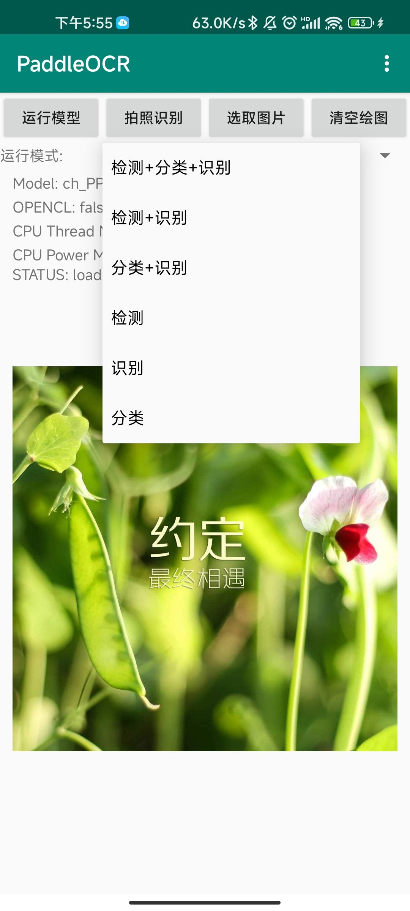
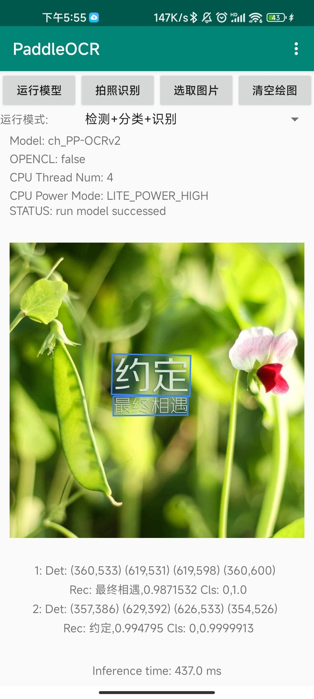
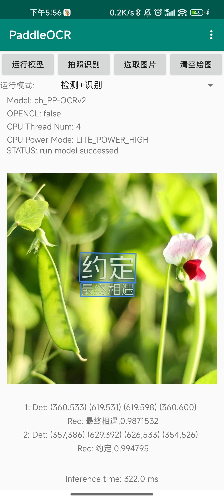
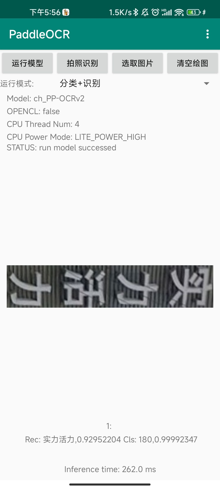
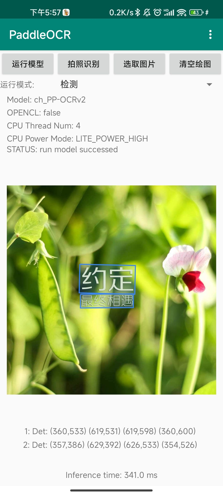
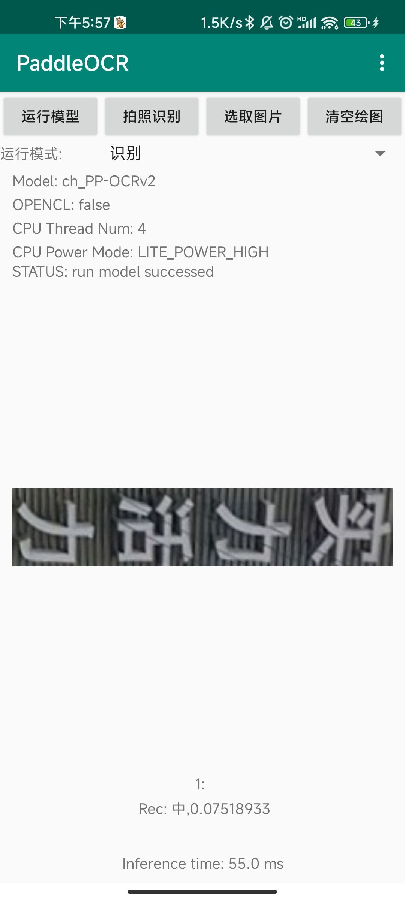
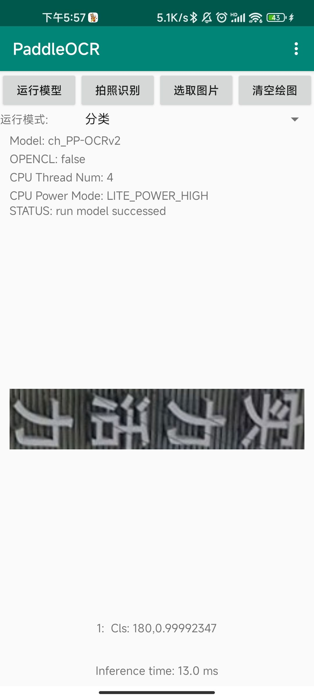

# Android Demo

## 1. Introduction

This document describes the [Android Demo](https://github.com/PaddlePaddle/PaddleOCR/tree/main/deploy/android_demo) for PaddleOCR. The demo currently supports text detection, text direction classification, and text recognition models. It is developed using [PaddleLite v2.10](https://github.com/PaddlePaddle/Paddle-Lite/tree/release/v2.10).

## 2. Recent Updates

- **February 27, 2022**
  - Updated the prediction library to PaddleLite v2.10.
  - Added support for six operation modes:
    - Detection + Classification + Recognition
    - Detection + Recognition
    - Classification + Recognition
    - Detection
    - Recognition
    - Classification

## 3. Quick Start

### 3.1 Environment Setup

1. **Install Android Studio:**  
   Download and install Android Studio on your development machine. For detailed instructions, please refer to the [Android Studio official website](https://developer.android.com/studio).

2. **Prepare Your Android Device:**  
   Ensure that you have an Android phone and enable USB debugging. To do so, navigate to:  
   **Settings → Developer Options → Enable Developer Options and USB Debugging.**

   **Note:** If your Android Studio installation does not have the NDK configured, please follow the [Install and Configure NDK and CMake](https://developer.android.com/studio/projects/install-ndk) guide. You may choose the latest NDK version or use the same version as the PaddleLite prediction library.

### 3.2 Importing the Project

1. In Android Studio, select **File → New → Import Project…** and follow the wizard to import the project.
2. Upon successful import, your project interface should resemble the following:  
   [](./images/import_demo.jpg)

### 3.3 Running the Demo

1. Connect your Android device to your computer.
2. Click the **Run** button in the Android Studio toolbar.  
   - Your device may prompt you with "Allow installation of software from USB." Click **Allow**.
3. Once the installation is complete, the app icon will appear on the last page of your home screen.
4. Tap the app icon to launch the application. The home page will display as shown below:  
   

On the home screen, you will find the following elements:

- **Run Model:** Executes the model(s) using the selected operation mode.
- **Take Photo for Recognition:** Activates the device camera to capture an image. After taking a photo, tap **Run Model** to perform recognition.
- **Select Image:** Opens the photo gallery to select an image. After selection, tap **Run Model** to perform recognition.
- **Clear Drawing:** Clears any drawn text boxes from the currently displayed image.
- **Dropdown List:** Allows you to choose one of the six supported operation modes. The default mode is **Detection + Classification + Recognition**.
- **Menu Button:** Opens the settings interface for configurations related to the models and built-in images.

When you tap **Run Model**, the demo executes the corresponding model(s) in your selected mode. For example, in **Detection + Classification + Recognition** mode, the output appears as follows:
  


The status display area shows the current model status (e.g., `run model successed`), indicating that the model ran successfully. The recognition results are formatted as follows:

```text
Serial Number: Det: (x1,y1)(x2,y2)(x3,y3)(x4,y4) Rec: Recognized Text, Confidence Score Cls: Classification Label, Classification Score
```

### 3.4 Operation Modes

The PaddleOCR demo supports six operation modes, shown in the illustration below:



The expected output for each mode is as follows:

| **Detection + Classification + Recognition**                                   | **Detection + Recognition**                            | **Classification + Recognition**                        |
|----------------------------------------------------------------------------------|--------------------------------------------------------|--------------------------------------------------------|
|             |         |         |

| **Detection**                                                                  | **Recognition**                                        | **Classification**                                     |
|--------------------------------------------------------------------------------|--------------------------------------------------------|--------------------------------------------------------|
|                                     |             |             |

### 3.5 Settings

The settings interface allows you to customize the following parameters:

1. **General Settings**
   - **Enable Custom Settings:** Check this box to allow modifications.
   - **Model Path:** The file path to the model (use the default value unless necessary).
   - **Label Path:** The dictionary file for the text recognition model.
   - **Image Path:** The filename of the built-in image used for recognition.

2. **Model Runtime Settings:** (Changes here trigger an automatic model reload when returning to the main interface.)
   - **CPU Thread Number:** The number of CPU cores allocated for model inference.
   - **CPU Power Mode:** Defines the model’s execution strategy, corresponding to different core configurations.

3. **Input Settings**
   - **det long size:** The target value for the longer side of the image during DB model preprocessing. If the image's long side exceeds this value, it will be resized proportionally; if it is shorter, no resizing is applied.

4. **Output Settings**
   - **Score Threshold:** The minimum score threshold for detection boxes in DB model post-processing. Boxes scoring below this threshold are filtered out and not displayed.

## 4. Further Support

For additional support and updates:

1. Refer to the [Paddle-Lite Demo for OCR](https://github.com/PaddlePaddle/Paddle-Lite-Demo/tree/develop/ocr/android/app/cxx/ppocr_demo) for real-time recognition and prediction library updates.
2. Visit the [PaddleLite repository](https://github.com/PaddlePaddle/Paddle-Lite) for more development support and community discussions.
