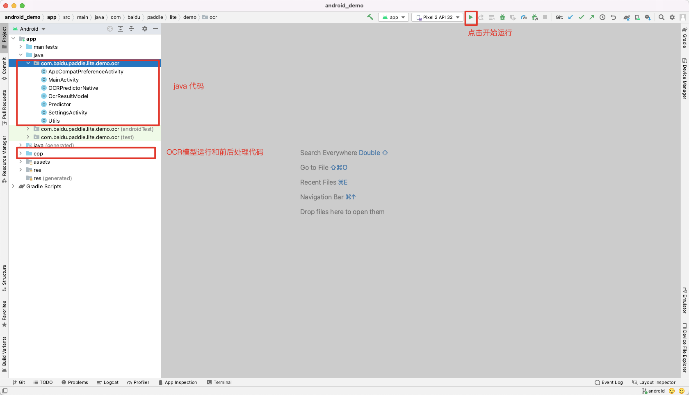
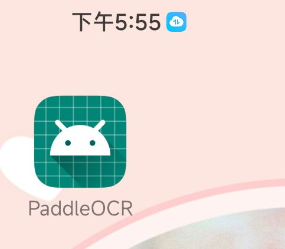
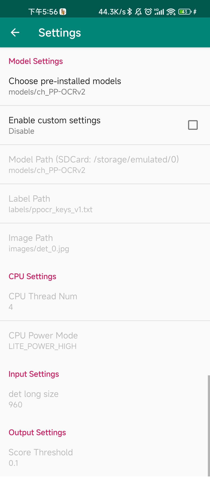

# Android Demo

## 1. 简介

此为PaddleOCR的Android Demo，目前支持文本检测，文本方向分类器和文本识别模型的使用。使用 [PaddleLite v2.10](https://github.com/PaddlePaddle/Paddle-Lite/tree/release/v2.10) 进行开发。

## 2. 近期更新

- 2022.02.27
    - 预测库更新到PaddleLite v2.10
    - 支持6种运行模式：
        - 检测+分类+识别
        - 检测+识别
        - 分类+识别
        - 检测
        - 识别
        - 分类

## 3. 快速使用

### 3.1 环境准备

1. 在本地环境安装好 Android Studio 工具，详细安装方法请见[Android Stuido 官网](https://developer.android.com/studio)。
2. 准备一部 Android 手机，并开启 USB 调试模式。开启方法: `手机设置 -> 查找开发者选项 -> 打开开发者选项和 USB 调试模式`

**注意**：如果您的 Android Studio 尚未配置 NDK ，请根据 Android Studio 用户指南中的[安装及配置 NDK 和 CMake](https://developer.android.com/studio/projects/install-ndk)内容，预先配置好 NDK 。您可以选择最新的 NDK 版本，或者使用 Paddle Lite 预测库版本一样的 NDK

### 3.2 导入项目

点击 File->New->Import Project...， 然后跟着Android Studio的引导导入
导入完成后呈现如下界面


### 3.3 运行demo

将手机连接上电脑后，点击Android Studio工具栏中的运行按钮即可运行demo。在此过程中，手机会弹出"允许从 USB 安装软件权限"的弹窗，点击允许即可。

软件安转到手机上后会在手机主屏最后一页看到如下app



点击app图标即可启动app，启动后app主页如下


app主页中有四个按钮，一个下拉列表和一个菜单按钮，他们的功能分别为

- 运行模型：按照已选择的模式，运行对应的模型组合
- 拍照识别：唤起手机相机拍照并获取拍照的图像，拍照完成后需要点击运行模型进行识别
- 选取图片：唤起手机相册拍照选择图像，选择完成后需要点击运行模型进行识别
- 清空绘图：清空当前显示图像上绘制的文本框，以便进行下一次识别(每次识别使用的图像都是当前显示的图像)
- 下拉列表：进行运行模式的选择，目前包含6种运行模式，默认模式为**检测+分类+识别**详细说明见下一节。
- 菜单按钮：点击后会进入菜单界面，进行模型和内置图像有关设置

点击运行模型后，会按照所选择的模式运行对应的模型，**检测+分类+识别**模式下运行的模型结果如下所示：


模型运行完成后，模型和运行状态显示区`STATUS`字段显示了当前模型的运行状态，这里显示为`run model successed`表明模型运行成功。

模型的运行结果显示在运行结果显示区，显示格式为

```text
序号：Det：(x1,y1)(x2,y2)(x3,y3)(x4,y4) Rec: 识别文本,识别置信度 Cls：分类类别,分类分时
```

### 3.4 运行模式

PaddleOCR demo共提供了6种运行模式，如下图


每种模式的运行结果如下表所示

| 检测+分类+识别                                               | 检测+识别                                        | 分类+识别                                        |
| ------------------------------------------------------------ | ------------------------------------------------ | ------------------------------------------------ |
|  |  |  |

| 检测                                         | 识别                                         | 分类                                         |
| -------------------------------------------- | -------------------------------------------- | -------------------------------------------- |
|  |  |  |

### 3.5 设置

设置界面如下



在设置界面可以进行如下几项设定：

1. 普通设置
   - Enable custom settings: 选中状态下才能更改设置
   - Model Path: 所运行的模型地址，使用默认值就好
   - Label Path: 识别模型的字典
   - Image Path: 进行识别的内置图像名
2. 模型运行态设置，此项设置更改后返回主界面时，会自动重新加载模型
   - CPU Thread Num: 模型运行使用的CPU核心数量
   - CPU Power Mode: 模型运行模式，大小核设定
3. 输入设置
   - det long size: DB模型预处理时图像的长边长度，超过此长度resize到该值，短边进行等比例缩放，小于此长度不进行处理。
4. 输出设置
   - Score Threshold: DB模型后处理box的阈值，低于此阈值的box进行过滤，不显示。

## 4 更多支持

1. 实时识别，更新预测库可参考 <https://github.com/PaddlePaddle/Paddle-Lite-Demo/tree/develop/ocr/android/app/cxx/ppocr_demo>
2. 更多Paddle-Lite相关问题可前往[Paddle-Lite](https://github.com/PaddlePaddle/Paddle-Lite) ，获得更多开发支持
