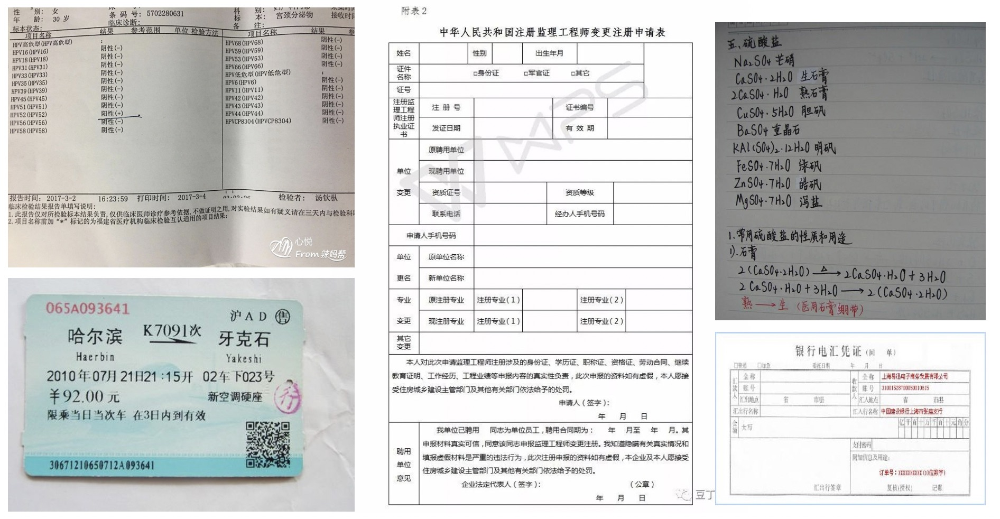

# Benchmark

本文给出了中英文OCR系列模型精度指标和在各平台预测耗时的benchmark。

## 测试数据

针对OCR实际应用场景，包括合同，车牌，铭牌，火车票，化验单，表格，证书，街景文字，名片，数码显示屏等，收集的300张图像，每张图平均有17个文本框，下图给出了一些图像示例。

## 评估指标

说明：

- 检测输入图像的长边尺寸是960。
- 评估耗时阶段为图像预测耗时，不包括图像的预处理和后处理。
- `Intel至强6148`为服务器端CPU型号，测试中使用Intel MKL-DNN 加速。
- `骁龙855`为移动端处理平台型号。

预测模型大小和整体识别精度对比

|   模型名称    | 整体模型 大小\(M\) | 检测模型 大小\(M\) | 方向分类器 模型大小\(M\) | 识别模型 大小\(M\) | 整体识别 F\-score |
| :-----------: | :-------------------: | :-------------------: | :-------------------------: | :-------------------: | :------------------: |
|   PP-OCRv2    |         11\.6         |         3\.0          |            0\.9             |         8\.6          |       0\.5224        |
| PP-OCR mobile |         8\.1          |         2\.6          |            0\.9             |         4\.6          |        0\.503        |
| PP-OCR server |        155\.1         |         47\.2         |            0\.9             |          107          |        0\.570        |

预测模型在CPU和GPU上的速度对比，单位ms

|   模型名称    |  CPU  | T4 GPU |
| :-----------: | :---: | :----: |
|   PP-OCRv2    |  330  |  111   |
| PP-OCR mobile |  356  |  11 6  |
| PP-OCR server | 1056  |  200   |
