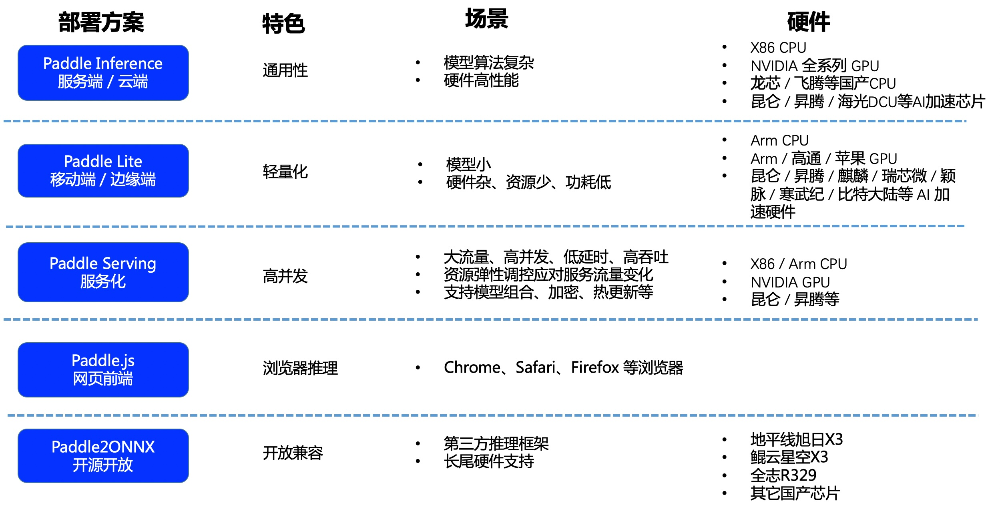

# PP-OCR 模型推理部署

## Paddle 推理部署方式简介

飞桨提供多种部署方案，以满足不同场景的部署需求，请根据实际情况进行选择：

## PP-OCR 推理部署

PP-OCR模型已打通多种场景部署方案，点击链接获取具体的使用教程。

- [Python 推理](./python_infer.md)
- [C++ 推理](./cpp_infer.md)
- [Serving 服务化部署（Python/C++）](./paddle_server.md)
- [Paddle-Lite 端侧部署（ARM CPU/OpenCL ARM GPU）](./lite.md)
- [Paddle.js 部署](./paddle_js.md)
- [Jetson 推理](./Jetson_infer.md)
- [Paddle2ONNX 推理](./paddle2onnx.md)

需要PP-OCR以外的学术算法模型的推理部署，请直接进入相应算法主页面，[入口](../../algorithm/overview.md)。
