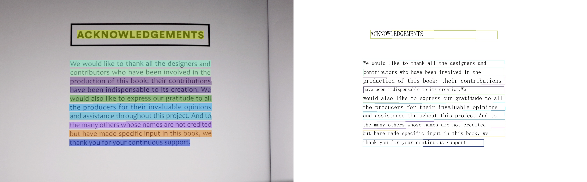

# Paddle2ONNX Model Conversion and Prediction

This chapter introduces how to convert PaddleOCR models to ONNX models and perform predictions based on the ONNXRuntime engine. We also prepared an [online AI Studio project](https://aistudio.baidu.com/projectdetail/8808858) for your convenience.

## 1. Environment Setup

You need to prepare the environments for PaddleOCR, Paddle2ONNX model conversion, and ONNXRuntime prediction.

### PaddleOCR

Clone the PaddleOCR repository, use the main branch, and install it. Since the PaddleOCR repository is relatively large and cloning via `git clone` can be slow, this tutorial has already downloaded it.

```bash linenums="1"
git clone -b main https://github.com/PaddlePaddle/PaddleOCR.git
cd PaddleOCR && python3 -m pip install -e .
```

### Paddle2ONNX

Paddle2ONNX supports converting models in the PaddlePaddle format to the ONNX format. Operators currently stably support exporting ONNX Opset versions 7~19, and some Paddle operators support conversion to lower ONNX Opsets. For more details, please refer to [Paddle2ONNX](https://github.com/PaddlePaddle/Paddle2ONNX.git).

- Install Paddle2ONNX

  ```bash linenums="1"
  python3 -m pip install paddle2onnx
  ```

- Install ONNXRuntime

  ```bash linenums="1"
  python3 -m pip install onnxruntime
  ```

## 2. Model Conversion

### Get Paddle Static Graph Models

There are two ways to obtain Paddle static graph models: download the prediction models provided by PaddleOCR in the [model list](../ppocr/model_list.en.md); or refer to the [Model Export Instructions](./python_infer.en.md#inference) to convert trained weights into inference models.

Using the PP-OCR series English detection, recognition, and classification models as examples:

#### Download Provided Inference Models

=== "PP-OCRv3"

    ```bash linenums="1"
    wget -nc -P ./inference https://paddleocr.bj.bcebos.com/PP-OCRv3/english/en_PP-OCRv3_det_infer.tar
    cd ./inference && tar xf en_PP-OCRv3_det_infer.tar && cd ..

    wget -nc  -P ./inference https://paddleocr.bj.bcebos.com/PP-OCRv3/english/en_PP-OCRv3_rec_infer.tar
    cd ./inference && tar xf en_PP-OCRv3_rec_infer.tar && cd ..

    wget -nc  -P ./inference https://paddleocr.bj.bcebos.com/dygraph_v2.0/ch/ch_ppocr_mobile_v2.0_cls_infer.tar
    cd ./inference && tar xf ch_ppocr_mobile_v2.0_cls_infer.tar && cd ..
    ```

=== "PP-OCRv4"

    ```bash linenums="1"
    wget -nc -P ./inference https://paddleocr.bj.bcebos.com/PP-OCRv3/english/en_PP-OCRv3_det_infer.tar
    cd ./inference && tar xf en_PP-OCRv3_det_infer.tar && cd ..

    wget -nc  -P ./inference https://paddleocr.bj.bcebos.com/PP-OCRv4/english/en_PP-OCRv4_rec_infer.tar
    cd ./inference && tar xf en_PP-OCRv4_rec_infer.tar && cd ..

    wget -nc  -P ./inference https://paddleocr.bj.bcebos.com/dygraph_v2.0/ch/ch_ppocr_mobile_v2.0_cls_infer.tar
    cd ./inference && tar xf ch_ppocr_mobile_v2.0_cls_infer.tar && cd ..
    ```

#### Convert Dynamic Graph to Static Graph (Optional)

Download dynamic graph models:

```bash linenums="1"
wget -nc -P pretrained https://paddleocr.bj.bcebos.com/PP-OCRv4/chinese/ch_PP-OCRv4_det_train.tar
cd pretrained && tar xf ch_PP-OCRv4_det_train.tar && cd ..

wget -nc -P pretrained https://paddleocr.bj.bcebos.com/PP-OCRv4/chinese/ch_PP-OCRv4_rec_train.tar
cd pretrained && tar xf ch_PP-OCRv4_rec_train.tar && cd ..

wget -nc -P pretrained https://paddleocr.bj.bcebos.com/dygraph_v2.0/ch/ch_ppocr_mobile_v2.0_cls_train.tar
cd pretrained && tar xf ch_ppocr_mobile_v2.0_cls_train.tar && cd ..
```

Convert to static graph models:

```bash linenums="1"
python3 tools/export_model.py -c configs/det/ch_PP-OCRv4/ch_PP-OCRv4_det_student.yml \
-o Global.pretrained_model=./pretrained/ch_PP-OCRv4_det_train/best_accuracy \
Global.save_inference_dir=./inference/ch_PP-OCRv4_det_infer/

python3 tools/export_model.py -c configs/rec/PP-OCRv4/ch_PP-OCRv4_rec.yml \
-o Global.pretrained_model=./pretrained/ch_PP-OCRv4_rec_train/student \
Global.save_inference_dir=./inference/ch_PP-OCRv4_rec_infer/

python3 tools/export_model.py -c configs/cls/cls_mv3.yml \
-o Global.pretrained_model=./pretrained/ch_ppocr_mobile_v2.0_cls_train/best_accuracy \
Global.save_inference_dir=./inference/ch_ppocr_mobile_v2.0_cls_infer/
```

### Model Conversion

Use Paddle2ONNX to convert Paddle static graph models to the ONNX model format:

=== "PP-OCRv3"

    ```bash linenums="1"
    paddle2onnx --model_dir ./inference/en_PP-OCRv3_det_infer \
    --model_filename inference.pdmodel \
    --params_filename inference.pdiparams \
    --save_file ./inference/det_onnx/model.onnx \
    --opset_version 11 \
    --enable_onnx_checker True

    paddle2onnx --model_dir ./inference/en_PP-OCRv3_rec_infer \
    --model_filename inference.pdmodel \
    --params_filename inference.pdiparams \
    --save_file ./inference/rec_onnx/model.onnx \
    --opset_version 11 \
    --enable_onnx_checker True

    paddle2onnx --model_dir ./inference/ch_ppocr_mobile_v2.0_cls_infer \
    --model_filename inference.pdmodel \
    --params_filename inference.pdiparams \
    --save_file ./inference/cls_onnx/model.onnx \
    --opset_version 11 \
    --enable_onnx_checker True
    ```

=== "PP-OCRv4"

    ```bash linenums="1"
    paddle2onnx --model_dir ./inference/en_PP-OCRv3_det_infer \
    --model_filename inference.pdmodel \
    --params_filename inference.pdiparams \
    --save_file ./inference/det_onnx/model.onnx \
    --opset_version 11 \
    --enable_onnx_checker True

    paddle2onnx --model_dir ./inference/en_PP-OCRv4_rec_infer \
    --model_filename inference.pdmodel \
    --params_filename inference.pdiparams \
    --save_file ./inference/rec_onnx/model.onnx \
    --opset_version 11 \
    --enable_onnx_checker True

    paddle2onnx --model_dir ./inference/ch_ppocr_mobile_v2.0_cls_infer \
    --model_filename inference.pdmodel \
    --params_filename inference.pdiparams \
    --save_file ./inference/cls_onnx/model.onnx \
    --opset_version 11 \
    --enable_onnx_checker True
    ```

After execution, the ONNX models will be saved respectively under `./inference/det_onnx/`, `./inference/rec_onnx/`, and `./inference/cls_onnx/`.

- **Note**: For OCR models, dynamic shapes must be used during conversion; otherwise, the prediction results may slightly differ from directly using Paddle for prediction. Additionally, the following models currently do not support conversion to ONNX models: NRTR, SAR, RARE, SRN.

- **Note**: After [Paddle2ONNX version v1.2.3](https://github.com/PaddlePaddle/Paddle2ONNX/releases/tag/v1.2.3), dynamic shapes are supported by default, i.e., `float32[p2o.DynamicDimension.0,3,p2o.DynamicDimension.1,p2o.DynamicDimension.2]`. The option `--input_shape_dict` has been deprecated. If you need to adjust shapes, you can use the following command to adjust the input shape of the Paddle model.

  ```bash linenums="1"
  python3 -m paddle2onnx.optimize --input_model inference/det_onnx/model.onnx \
    --output_model inference/det_onnx/model.onnx \
    --input_shape_dict "{'x': [-1,3,-1,-1]}"
  ```

If you have optimization requirements for the exported ONNX model, it is recommended to use [OnnxSlim](https://github.com/inisis/OnnxSlim) to optimize the model:

```bash linenums="1"
pip install onnxslim
onnxslim model.onnx slim.onnx
```

## 3. Inference and Prediction

Using the Chinese OCR model as an example, you can perform prediction using ONNXRuntime by executing the following command:

```bash linenums="1"
python3 tools/infer/predict_system.py --use_gpu=False --use_onnx=True \
--det_model_dir=./inference/det_onnx/model.onnx  \
--rec_model_dir=./inference/rec_onnx/model.onnx  \
--cls_model_dir=./inference/cls_onnx/model.onnx  \
--image_dir=./docs/infer_deploy/images/img_12.jpg \
--rec_char_dict_path=ppocr/utils/en_dict.txt
```

Taking the English OCR model as an example, you can perform prediction using Paddle Inference by executing the following command:

=== "PP-OCRv3"

    ```bash linenums="1"
    python3 tools/infer/predict_system.py --use_gpu=False \
    --cls_model_dir=./inference/ch_ppocr_mobile_v2.0_cls_infer \
    --rec_model_dir=./inference/en_PP-OCRv3_rec_infer \
    --det_model_dir=./inference/en_PP-OCRv3_det_infer \
    --image_dir=./docs/infer_deploy/images/img_12.jpg\
    --rec_char_dict_path=ppocr/utils/en_dict.txt
    ```

=== "PP-OCRv4"

    ```bash linenums="1"
    python3 tools/infer/predict_system.py --use_gpu=False \
    --cls_model_dir=./inference/ch_ppocr_mobile_v2.0_cls_infer \
    --rec_model_dir=./inference/en_PP-OCRv4_rec_infer \
    --det_model_dir=./inference/en_PP-OCRv3_det_infer \
    --image_dir=./docs/infer_deploy/images/img_12.jpg \
    --rec_char_dict_path=ppocr/utils/en_dict.txt
    ```

After executing the command, the terminal will print out the predicted recognition information, and the visualization results will be saved under `./inference_results/`.

**ONNXRuntime Execution Result:**



**Paddle Inference Execution Result:**


Using ONNXRuntime for prediction, terminal output:

```bash linenums="1"
[2022/10/10 12:06:28] ppocr DEBUG: dt_boxes num : 11, elapse : 0.3568880558013916
[2022/10/10 12:06:31] ppocr DEBUG: rec_res num  : 11, elapse : 2.6445000171661377
[2022/10/10 12:06:31] ppocr DEBUG: 0  Predict time of doc/imgs_en/img_12.jpg: 3.021s
[2022/10/10 12:06:31] ppocr DEBUG: ACKNOWLEDGEMENTS, 0.997
[2022/10/10 12:06:31] ppocr DEBUG: We would like to thank all the designers and, 0.976
[2022/10/10 12:06:31] ppocr DEBUG: contributors who have been involved in the, 0.979
[2022/10/10 12:06:31] ppocr DEBUG: production of this book; their contributions, 0.989
[2022/10/10 12:06:31] ppocr DEBUG: have been indispensable to its creation. We, 0.956
[2022/10/10 12:06:31] ppocr DEBUG: would also like to express our gratitude to all, 0.991
[2022/10/10 12:06:31] ppocr DEBUG: the producers for their invaluable opinions, 0.978
[2022/10/10 12:06:31] ppocr DEBUG: and assistance throughout this project. And to, 0.988
[2022/10/10 12:06:31] ppocr DEBUG: the many others whose names are not credited, 0.958
[2022/10/10 12:06:31] ppocr DEBUG: but have made specific input in this book, we, 0.970
[2022/10/10 12:06:31] ppocr DEBUG: thank you for your continuous support., 0.998
[2022/10/10 12:06:31] ppocr DEBUG: The visualized image saved in ./inference_results/img_12.jpg
[2022/10/10 12:06:31] ppocr INFO: The predict total time is 3.2482550144195557
```

Using Paddle Inference for prediction, terminal output:

```bash linenums="1"
[2022/10/10 12:06:28] ppocr DEBUG: dt_boxes num : 11, elapse : 0.3568880558013916
[2022/10/10 12:06:31] ppocr DEBUG: rec_res num  : 11, elapse : 2.6445000171661377
[2022/10/10 12:06:31] ppocr DEBUG: 0  Predict time of doc/imgs_en/img_12.jpg: 3.021s
[2022/10/10 12:06:31] ppocr DEBUG: ACKNOWLEDGEMENTS, 0.997
[2022/10/10 12:06:31] ppocr DEBUG: We would like to thank all the designers and, 0.976
[2022/10/10 12:06:31] ppocr DEBUG: contributors who have been involved in the, 0.979
[2022/10/10 12:06:31] ppocr DEBUG: production of this book; their contributions, 0.989
[2022/10/10 12:06:31] ppocr DEBUG: have been indispensable to its creation. We, 0.956
[2022/10/10 12:06:31] ppocr DEBUG: would also like to express our gratitude to all, 0.991
[2022/10/10 12:06:31] ppocr DEBUG: the producers for their invaluable opinions, 0.978
[2022/10/10 12:06:31] ppocr DEBUG: and assistance throughout this project. And to, 0.988
[2022/10/10 12:06:31] ppocr DEBUG: the many others whose names are not credited, 0.958
[2022/10/10 12:06:31] ppocr DEBUG: but have made specific input in this book, we, 0.970
[2022/10/10 12:06:31] ppocr DEBUG: thank you for your continuous support., 0.998
[2022/10/10 12:06:31] ppocr DEBUG: The visualized image saved in ./inference_results/img_12.jpg
[2022/10/10 12:06:31] ppocr INFO: The predict total time is 3.2482550144195557
```
