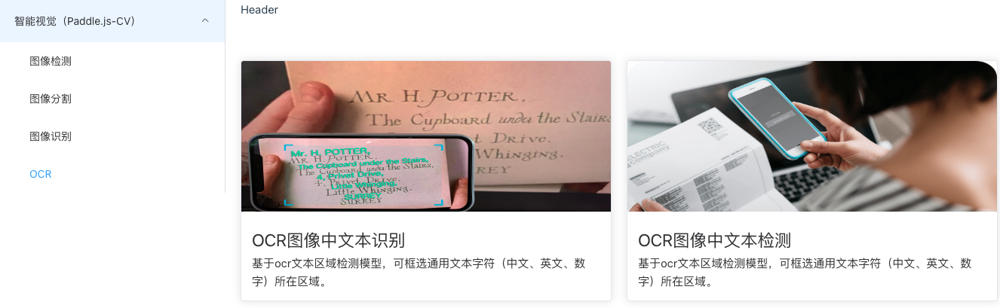
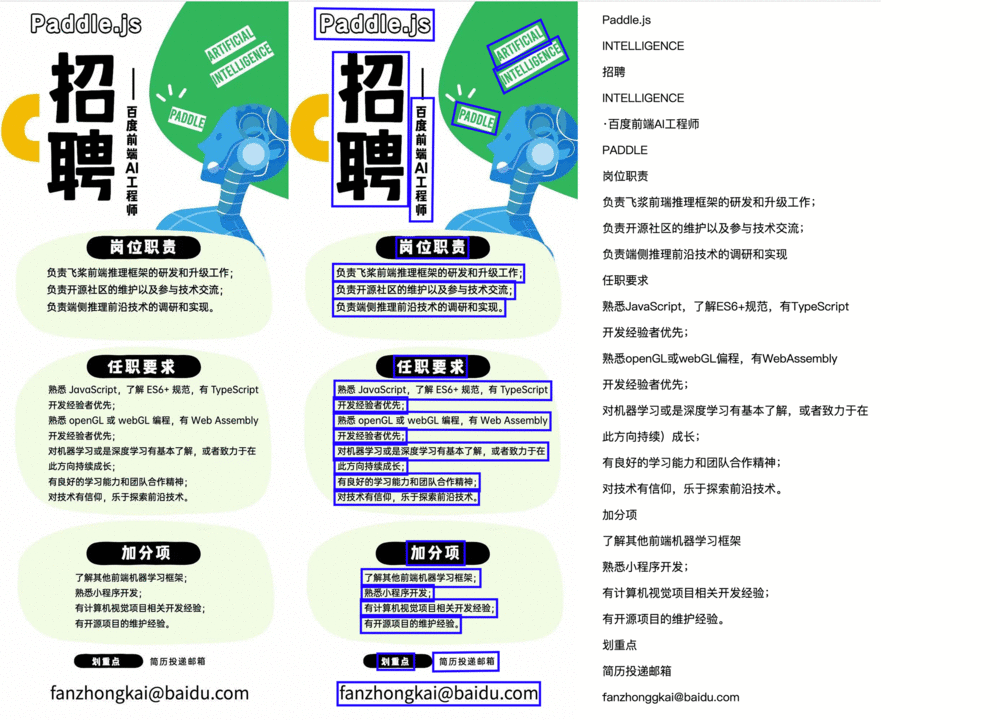

# Paddle.js Introduction

[Paddle.js](https://github.com/PaddlePaddle/Paddle.js) is a web project for Baidu PaddlePaddle, which is an open source deep learning framework running in the browser. Paddle.js can either load a pre-trained model, or transforming a model from paddle-hub with model transforming tools provided by Paddle.js. It could run in every browser with WebGL/WebGPU/WebAssembly supported. It could also run in Baidu Smartprogram and wechat miniprogram.

## Web Demo

Run OCR demo in browser refer to [tutorial](https://github.com/PaddlePaddle/FastDeploy/blob/cd0ee79c91d4ed1103abdc65ff12ccadd23d0827/examples/application/js/WebDemo.md).

|demo|web demo dicrctory|visualization|
|-|-|-|
|PP-OCRv3|[TextDetection、TextRecognition](https://github.com/PaddlePaddle/FastDeploy/tree/develop/examples/application/js/web_demo/src/pages/cv/ocr/)||

## Mini Program Demo

The Mini Program demo running tutorial reference
Run OCR demo in wechat miniprogram refer to [tutorial](https://github.com/PaddlePaddle/FastDeploy/tree/develop/examples/application/js/mini_program).

|demo|directory|
|-|-|
|Text Detection| [ocrdetecXcx](https://github.com/PaddlePaddle/FastDeploy/tree/develop/examples/application/js/mini_program/ocrdetectXcx/) |
|Text Recognition| [ocrXcx](https://github.com/PaddlePaddle/FastDeploy/tree/develop/examples/application/js/mini_program/ocrXcx/) |

