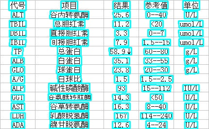
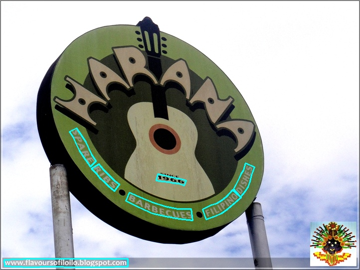
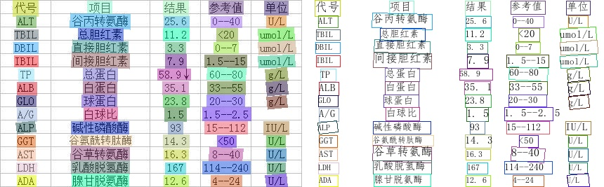

# 基于Python预测引擎推理

inference 模型（`paddle.jit.save`保存的模型）
一般是模型训练，把模型结构和模型参数保存在文件中的固化模型，多用于预测部署场景。
训练过程中保存的模型是checkpoints模型，保存的只有模型的参数，多用于恢复训练等。
与checkpoints模型相比，inference 模型会额外保存模型的结构信息，在预测部署、加速推理上性能优越，灵活方便，适合于实际系统集成。

本文介绍针对PP-OCR模型库的Python推理引擎使用方法，内容依次为文本检测、文本识别、方向分类器以及三者串联在CPU、GPU上的预测方法。

## 一、训练模型转inference模型

### 检测模型转inference模型

下载超轻量级中文检测模型：

```bash linenums="1"
wget -P ./ch_lite/ https://paddleocr.bj.bcebos.com/dygraph_v2.0/ch/ch_ppocr_mobile_v2.0_det_train.tar && tar xf ./ch_lite/ch_ppocr_mobile_v2.0_det_train.tar -C ./ch_lite/
```

上述模型是以MobileNetV3为backbone训练的DB算法，将训练好的模型转换成inference模型只需要运行如下命令：

```bash linenums="1"
# -c 后面设置训练算法的yml配置文件
# -o 配置可选参数
# Global.pretrained_model 参数设置待转换的训练模型地址，不用添加文件后缀 .pdmodel，.pdopt或.pdparams。
# Global.save_inference_dir参数设置转换的模型将保存的地址。

python3 tools/export_model.py -c configs/det/ch_ppocr_v2.0/ch_det_mv3_db_v2.0.yml -o Global.pretrained_model=./ch_lite/ch_ppocr_mobile_v2.0_det_train/best_accuracy Global.save_inference_dir=./inference/det_db/
```

转inference模型时，使用的配置文件和训练时使用的配置文件相同。另外，还需要设置配置文件中的`Global.pretrained_model`参数，其指向训练中保存的模型参数文件。
转换成功后，在模型保存目录下有三个文件：

```text linenums="1"
inference/det_db/
    ├── inference.pdiparams         # 检测inference模型的参数文件
    ├── inference.pdiparams.info    # 检测inference模型的参数信息，可忽略
    └── inference.pdmodel           # 检测inference模型的program文件
```

### 识别模型转inference模型

下载超轻量中文识别模型：

```bash linenums="1"
wget -P ./ch_lite/ https://paddleocr.bj.bcebos.com/dygraph_v2.0/ch/ch_ppocr_mobile_v2.0_rec_train.tar && tar xf ./ch_lite/ch_ppocr_mobile_v2.0_rec_train.tar -C ./ch_lite/
```

识别模型转inference模型与检测的方式相同，如下：

```bash linenums="1"
# -c 后面设置训练算法的yml配置文件
# -o 配置可选参数
# Global.pretrained_model 参数设置待转换的训练模型地址，不用添加文件后缀 .pdmodel，.pdopt或.pdparams。
# Global.save_inference_dir参数设置转换的模型将保存的地址。

python3 tools/export_model.py -c configs/rec/ch_ppocr_v2.0/rec_chinese_lite_train_v2.0.yml -o Global.pretrained_model=./ch_lite/ch_ppocr_mobile_v2.0_rec_train/best_accuracy  Global.save_inference_dir=./inference/rec_crnn/
```

**注意：** 如果您是在自己的数据集上训练的模型，并且调整了中文字符的字典文件，请注意修改配置文件中的`character_dict_path`是否是所需要的字典文件。

转换成功后，在目录下有三个文件：

```bash linenums="1"
/inference/rec_crnn/
    ├── inference.pdiparams         # 识别inference模型的参数文件
    ├── inference.pdiparams.info    # 识别inference模型的参数信息，可忽略
    └── inference.pdmodel           # 识别inference模型的program文件
```

### 方向分类模型转inference模型

下载方向分类模型：

```bash linenums="1"
wget -P ./ch_lite/ https://paddleocr.bj.bcebos.com/dygraph_v2.0/ch/ch_ppocr_mobile_v2.0_cls_train.tar && tar xf ./ch_lite/ch_ppocr_mobile_v2.0_cls_train.tar -C ./ch_lite/
```

方向分类模型转inference模型与检测的方式相同，如下：

```bash linenums="1"
# -c 后面设置训练算法的yml配置文件
# -o 配置可选参数
# Global.pretrained_model 参数设置待转换的训练模型地址，不用添加文件后缀 .pdmodel，.pdopt或.pdparams。
# Global.save_inference_dir参数设置转换的模型将保存的地址。

python3 tools/export_model.py -c configs/cls/cls_mv3.yml -o Global.pretrained_model=./ch_lite/ch_ppocr_mobile_v2.0_cls_train/best_accuracy  Global.save_inference_dir=./inference/cls/
```

转换成功后，在目录下有三个文件：

```text linenums="1"
/inference/cls/
    ├── inference.pdiparams         # 分类inference模型的参数文件
    ├── inference.pdiparams.info    # 分类inference模型的参数信息，可忽略
    └── inference.pdmodel           # 分类inference模型的program文件
```

## 二、文本检测模型推理

文本检测模型推理，默认使用DB模型的配置参数。当不使用DB模型时，在推理时，需要通过传入相应的参数进行算法适配，细节参考下文。

### 1. 超轻量中文检测模型推理

超轻量中文检测模型推理，可以执行如下命令：

```bash linenums="1"
# 下载超轻量中文检测模型：
wget  https://paddleocr.bj.bcebos.com/dygraph_v2.0/ch/ch_ppocr_mobile_v2.0_det_infer.tar
tar xf ch_ppocr_mobile_v2.0_det_infer.tar
python3 tools/infer/predict_det.py --image_dir="./doc/imgs/00018069.jpg" --det_model_dir="./ch_ppocr_mobile_v2.0_det_infer/"
```

可视化文本检测结果默认保存到`./inference_results`文件夹里面，结果文件的名称前缀为`det_res`。结果示例如下：



通过参数`limit_type`和`det_limit_side_len`来对图片的尺寸进行限制，
`limit_type`可选参数为[`max`, `min`]，
`det_limit_size_len` 为正整数，一般设置为32 的倍数，比如960。

参数默认设置为`limit_type='max', det_limit_side_len=960`。表示网络输入图像的最长边不能超过960，
如果超过这个值，会对图像做等宽比的resize操作，确保最长边为`det_limit_side_len`。
设置为`limit_type='min', det_limit_side_len=960` 则表示限制图像的最短边为960。

如果输入图片的分辨率比较大，而且想使用更大的分辨率预测，可以设置det_limit_side_len 为想要的值，比如1216：

```bash linenums="1"
python3 tools/infer/predict_det.py --image_dir="./doc/imgs/1.jpg" --det_model_dir="./inference/det_db/" --det_limit_type=max --det_limit_side_len=1216
```

如果想使用CPU进行预测，执行命令如下

```bash linenums="1"
python3 tools/infer/predict_det.py --image_dir="./doc/imgs/1.jpg" --det_model_dir="./inference/det_db/"  --use_gpu=False
```

### 2. DB文本检测模型推理

首先将DB文本检测训练过程中保存的模型，转换成inference model。以基于Resnet50_vd骨干网络，在ICDAR2015英文数据集训练的模型为例（ [模型下载地址](https://paddleocr.bj.bcebos.com/dygraph_v2.0/en/det_r50_vd_db_v2.0_train.tar) )，可以使用如下命令进行转换：

```bash linenums="1"
python3 tools/export_model.py -c configs/det/det_r50_vd_db.yml -o Global.pretrained_model=./det_r50_vd_db_v2.0_train/best_accuracy  Global.save_inference_dir=./inference/det_db
```

DB文本检测模型推理，可以执行如下命令：

```bash linenums="1"
python3 tools/infer/predict_det.py --image_dir="./doc/imgs_en/img_10.jpg" --det_model_dir="./inference/det_db/"
```

可视化文本检测结果默认保存到`./inference_results`文件夹里面，结果文件的名称前缀为`det_res`。结果示例如下：


**注意**：由于ICDAR2015数据集只有1000张训练图像，且主要针对英文场景，所以上述模型对中文文本图像检测效果会比较差。

### 3. EAST文本检测模型推理

首先将EAST文本检测训练过程中保存的模型，转换成inference model。以基于Resnet50_vd骨干网络，在ICDAR2015英文数据集训练的模型为例（ [模型下载地址](https://paddleocr.bj.bcebos.com/dygraph_v2.0/en/det_r50_vd_east_v2.0_train.tar) )，可以使用如下命令进行转换：

```bash linenums="1"
python3 tools/export_model.py -c configs/det/det_r50_vd_east.yml -o Global.pretrained_model=./det_r50_vd_east_v2.0_train/best_accuracy  Global.save_inference_dir=./inference/det_east
```

**EAST文本检测模型推理，需要设置参数`--det_algorithm="EAST"`**，可以执行如下命令：

```bash linenums="1"
python3 tools/infer/predict_det.py --det_algorithm="EAST" --image_dir="./doc/imgs_en/img_10.jpg" --det_model_dir="./inference/det_east/"
```

可视化文本检测结果默认保存到`./inference_results`文件夹里面，结果文件的名称前缀为`det_res`。结果示例如下：


**注意**：本代码库中，EAST后处理Locality-Aware NMS有python和c++两种版本，c++版速度明显快于python版。由于c++版本nms编译版本问题，只有python3.5环境下会调用c++版nms，其他情况将调用python版nms。

### 4. SAST文本检测模型推理

#### (1). 四边形文本检测模型（ICDAR2015）

首先将SAST文本检测训练过程中保存的模型，转换成inference model。以基于Resnet50_vd骨干网络，在ICDAR2015英文数据集训练的模型为例([模型下载地址](https://paddleocr.bj.bcebos.com/dygraph_v2.0/en/det_r50_vd_sast_icdar15_v2.0_train.tar))，可以使用如下命令进行转换：

```bash linenums="1"
python3 tools/export_model.py -c configs/det/det_r50_vd_sast_icdar15.yml -o Global.pretrained_model=./det_r50_vd_sast_icdar15_v2.0_train/best_accuracy  Global.save_inference_dir=./inference/det_sast_ic15

```

**SAST文本检测模型推理，需要设置参数`--det_algorithm="SAST"`**，可以执行如下命令：

```bash linenums="1"
python3 tools/infer/predict_det.py --det_algorithm="SAST" --image_dir="./doc/imgs_en/img_10.jpg" --det_model_dir="./inference/det_sast_ic15/"
```

可视化文本检测结果默认保存到`./inference_results`文件夹里面，结果文件的名称前缀为`det_res`。结果示例如下：


#### (2). 弯曲文本检测模型（Total-Text）

首先将SAST文本检测训练过程中保存的模型，转换成inference model。以基于Resnet50_vd骨干网络，在Total-Text英文数据集训练的模型为例（[模型下载地址](https://paddleocr.bj.bcebos.com/dygraph_v2.0/en/det_r50_vd_sast_totaltext_v2.0_train.tar))，可以使用如下命令进行转换：

```bash linenums="1"
python3 tools/export_model.py -c configs/det/det_r50_vd_sast_totaltext.yml -o Global.pretrained_model=./det_r50_vd_sast_totaltext_v2.0_train/best_accuracy  Global.save_inference_dir=./inference/det_sast_tt

```

SAST文本检测模型推理，需要设置参数`--det_algorithm="SAST"`，同时，还需要增加参数`--det_sast_polygon=True`，可以执行如下命令：

```bash linenums="1"
python3 tools/infer/predict_det.py --det_algorithm="SAST" --image_dir="./doc/imgs_en/img623.jpg" --det_model_dir="./inference/det_sast_tt/" --det_sast_polygon=True
```

可视化文本检测结果默认保存到`./inference_results`文件夹里面，结果文件的名称前缀为`det_res`。结果示例如下：



**注意**：本代码库中，SAST后处理Locality-Aware NMS有python和c++两种版本，c++版速度明显快于python版。由于c++版本nms编译版本问题，只有python3.5环境下会调用c++版nms，其他情况将调用python版nms。

## 三、文本识别模型推理

下面将介绍超轻量中文识别模型推理、基于CTC损失的识别模型推理和基于Attention损失的识别模型推理。对于中文文本识别，建议优先选择基于CTC损失的识别模型，实践中也发现基于Attention损失的效果不如基于CTC损失的识别模型。此外，如果训练时修改了文本的字典，请参考下面的自定义文本识别字典的推理。

### 1. 超轻量中文识别模型推理

超轻量中文识别模型推理，可以执行如下命令：

```bash linenums="1"
# 下载超轻量中文识别模型：
wget  https://paddleocr.bj.bcebos.com/dygraph_v2.0/ch/ch_ppocr_mobile_v2.0_rec_infer.tar
tar xf ch_ppocr_mobile_v2.0_rec_infer.tar
python3 tools/infer/predict_rec.py --image_dir="./doc/imgs_words/ch/word_4.jpg" --rec_model_dir="ch_ppocr_mobile_v2.0_rec_infer"
```


执行命令后，上面图像的预测结果（识别的文本和得分）会打印到屏幕上，示例如下：

```bash linenums="1"
Predicts of ./doc/imgs_words/ch/word_4.jpg:('实力活力', 0.98458153)
```

### 2. 基于CTC损失的识别模型推理

我们以 CRNN 为例，介绍基于CTC损失的识别模型推理。 Rosetta 使用方式类似，不用设置识别算法参数rec_algorithm。

首先将 CRNN 文本识别训练过程中保存的模型，转换成inference model。以基于Resnet34_vd骨干网络，使用MJSynth和SynthText两个英文文本识别合成数据集训练
的模型为例（ [模型下载地址](https://paddleocr.bj.bcebos.com/dygraph_v2.0/en/rec_r34_vd_none_bilstm_ctc_v2.0_train.tar) )，可以使用如下命令进行转换：

```bash linenums="1"
python3 tools/export_model.py -c configs/rec/rec_r34_vd_none_bilstm_ctc.yml -o Global.pretrained_model=./rec_r34_vd_none_bilstm_ctc_v2.0_train/best_accuracy  Global.save_inference_dir=./inference/rec_crnn
```

CRNN 文本识别模型推理，可以执行如下命令：

```bash linenums="1"
python3 tools/infer/predict_rec.py --image_dir="./doc/imgs_words_en/word_336.png" --rec_model_dir="./inference/rec_crnn/" --rec_image_shape="3, 32, 100" --rec_char_dict_path="./ppocr/utils/ic15_dict.txt"
```


执行命令后，上面图像的识别结果如下：

```bash linenums="1"
Predicts of ./doc/imgs_words_en/word_336.png:('super', 0.9999073)
```

**注意**：由于上述模型是参考[DTRB](https://arxiv.org/abs/1904.01906)文本识别训练和评估流程，与超轻量级中文识别模型训练有两方面不同：

- 训练时采用的图像分辨率不同，训练上述模型采用的图像分辨率是[3，32，100]，而中文模型训练时，为了保证长文本的识别效果，训练时采用的图像分辨率是[3, 32, 320]。预测推理程序默认的形状参数是训练中文采用的图像分辨率，即[3, 32, 320]。因此，这里推理上述英文模型时，需要通过参数rec_image_shape设置识别图像的形状。

- 字符列表，DTRB论文中实验只是针对26个小写英文本母和10个数字进行实验，总共36个字符。所有大小字符都转成了小写字符，不在上面列表的字符都忽略，认为是空格。因此这里没有输入字符字典，而是通过如下命令生成字典.因此在推理时需要设置参数rec_char_dict_path，指定为英文字典"./ppocr/utils/ic15_dict.txt"。

```python linenums="1"
self.character_str = "0123456789abcdefghijklmnopqrstuvwxyz"
dict_character = list(self.character_str)
```

### 3. 基于SRN损失的识别模型推理

基于SRN损失的识别模型，需要额外设置识别算法参数 --rec_algorithm="SRN"。
同时需要保证预测shape与训练时一致，如： --rec_image_shape="1, 64, 256"

```bash linenums="1"
python3 tools/infer/predict_rec.py --image_dir="./doc/imgs_words_en/word_336.png" \
                                   --rec_model_dir="./inference/srn/" \
                                   --rec_image_shape="1, 64, 256" \
                                   --rec_char_dict_path="./ppocr/utils/ic15_dict.txt" \
                                   --rec_algorithm="SRN"
```

### 4. 自定义文本识别字典的推理

如果训练时修改了文本的字典，在使用inference模型预测时，需要通过`--rec_char_dict_path`指定使用的字典路径

```bash linenums="1"
python3 tools/infer/predict_rec.py --image_dir="./doc/imgs_words_en/word_336.png" --rec_model_dir="./your inference model" --rec_image_shape="3, 32, 100"  --rec_char_dict_path="your text dict path"
```

### 5. 多语言模型的推理

如果您需要预测的是其他语言模型，在使用inference模型预测时，需要通过`--rec_char_dict_path`指定使用的字典路径, 同时为了得到正确的可视化结果，
需要通过 `--vis_font_path` 指定可视化的字体路径，`doc/fonts/` 路径下有默认提供的小语种字体，例如韩文识别：

```bash linenums="1"
python3 tools/infer/predict_rec.py --image_dir="./doc/imgs_words/korean/1.jpg" --rec_model_dir="./your inference model"  --rec_char_dict_path="ppocr/utils/dict/korean_dict.txt" --vis_font_path="doc/fonts/korean.ttf"
```


执行命令后，上图的预测结果为：

``` text
Predicts of ./doc/imgs_words/korean/1.jpg:('바탕으로', 0.9948904)
```

## 四、方向分类模型推理

下面将介绍方向分类模型推理。

### 1. 方向分类模型推理

方向分类模型推理，可以执行如下命令：

```bash linenums="1"
# 下载超轻量中文方向分类器模型：
wget  https://paddleocr.bj.bcebos.com/dygraph_v2.0/ch/ch_ppocr_mobile_v2.0_cls_infer.tar
tar xf ch_ppocr_mobile_v2.0_cls_infer.tar
python3 tools/infer/predict_cls.py --image_dir="./doc/imgs_words/ch/word_4.jpg" --cls_model_dir="ch_ppocr_mobile_v2.0_cls_infer"
```


执行命令后，上面图像的预测结果（分类的方向和得分）会打印到屏幕上，示例如下：

```bash linenums="1"
Predicts of ./doc/imgs_words/ch/word_4.jpg:['0', 0.9999982]
```

## 五、文本检测、方向分类和文字识别串联推理

### 1. 超轻量中文OCR模型推理

在执行预测时，需要通过参数`image_dir`指定单张图像或者图像集合的路径、参数`det_model_dir`,`cls_model_dir`和`rec_model_dir`分别指定检测，方向分类和识别的inference模型路径。参数`use_angle_cls`用于控制是否启用方向分类模型。`use_mp`表示是否使用多进程。`total_process_num`表示在使用多进程时的进程数。可视化识别结果默认保存到 ./inference_results 文件夹里面。

```bash linenums="1"
# 使用方向分类器
python3 tools/infer/predict_system.py --image_dir="./doc/imgs/00018069.jpg" --det_model_dir="./inference/det_db/" --cls_model_dir="./inference/cls/" --rec_model_dir="./inference/rec_crnn/" --use_angle_cls=true

# 不使用方向分类器
python3 tools/infer/predict_system.py --image_dir="./doc/imgs/00018069.jpg" --det_model_dir="./inference/det_db/" --rec_model_dir="./inference/rec_crnn/" --use_angle_cls=false

# 使用多进程
python3 tools/infer/predict_system.py --image_dir="./doc/imgs/00018069.jpg" --det_model_dir="./inference/det_db/" --rec_model_dir="./inference/rec_crnn/" --use_angle_cls=false --use_mp=True --total_process_num=6
```

执行命令后，识别结果图像如下：



### 2. 其他模型推理

如果想尝试使用其他检测算法或者识别算法，请参考上述文本检测模型推理和文本识别模型推理，更新相应配置和模型。

**注意：由于检测框矫正逻辑的局限性，暂不支持使用SAST弯曲文本检测模型（即，使用参数`--det_sast_polygon=True`时）进行模型串联。**

下面给出基于EAST文本检测和STAR-Net文本识别执行命令：

```bash linenums="1"
python3 tools/infer/predict_system.py --image_dir="./doc/imgs_en/img_10.jpg" --det_model_dir="./inference/det_east/" --det_algorithm="EAST" --rec_model_dir="./inference/starnet/" --rec_image_shape="3, 32, 100" --rec_char_dict_path="./ppocr/utils/ic15_dict.txt"
```

执行命令后，识别结果图像如下：


## 六、参数解释

更多关于预测过程的参数解释如下所示。

- 全局信息

| 参数名称 | 类型 | 默认值 | 含义 |
| :--: | :--: | :--: | :--: |
|  image_dir | str | 无，必须显式指定 | 图像或者文件夹路径 |
|  vis_font_path | str | "./doc/fonts/simfang.ttf" | 用于可视化的字体路径 |
|  drop_score | float | 0.5 | 识别得分小于该值的结果会被丢弃，不会作为返回结果 |
|  use_pdserving | bool | False | 是否使用Paddle Serving进行预测 |
|  warmup | bool | False | 是否开启warmup，在统计预测耗时的时候，可以使用这种方法 |
|  draw_img_save_dir | str | "./inference_results" | 系统串联预测OCR结果的保存文件夹 |
|  save_crop_res | bool | False  | 是否保存OCR的识别文本图像 |
|  crop_res_save_dir | str | "./output" | 保存OCR识别出来的文本图像路径 |
|  use_mp | bool | False | 是否开启多进程预测  |
|  total_process_num | int | 6 | 开启的进城数，`use_mp`为`True`时生效  |
|  process_id | int | 0 | 当前进程的id号，无需自己修改  |
|  benchmark | bool | False | 是否开启benchmark，对预测速度、显存占用等进行统计  |
|  save_log_path | str | "./log_output/" | 开启`benchmark`时，日志结果的保存文件夹 |
|  show_log | bool | True | 是否显示预测中的日志信息  |
|  use_onnx | bool | False | 是否开启onnx预测 |

- 预测引擎相关

| 参数名称 | 类型 | 默认值 | 含义 |
| :--: | :--: | :--: | :--: |
|  use_gpu | bool | True | 是否使用GPU进行预测 |
|  ir_optim | bool | True | 是否对计算图进行分析与优化，开启后可以加速预测过程 |
|  use_tensorrt | bool | False | 是否开启tensorrt |
|  min_subgraph_size | int | 15 | tensorrt中最小子图size，当子图的size大于该值时，才会尝试对该子图使用trt engine计算 |
|  precision | str | fp32 | 预测的精度，支持`fp32`, `fp16`, `int8` 3种输入 |
|  enable_mkldnn | bool | True | 是否开启mkldnn |
|  cpu_threads | int | 10 | 开启mkldnn时，cpu预测的线程数 |

- 文本检测模型相关

| 参数名称 | 类型 | 默认值 | 含义 |
| :--: | :--: | :--: | :--: |
|  det_algorithm | str | "DB" | 文本检测算法名称，目前支持`DB`, `EAST`, `SAST`, `PSE`  |
|  det_model_dir | str | xx | 检测inference模型路径 |
|  det_limit_side_len | int | 960 | 检测的图像边长限制 |
|  det_limit_type | str | "max" | 检测的变成限制类型，目前支持`min`, `max`，`min`表示保证图像最短边不小于`det_limit_side_len`，`max`表示保证图像最长边不大于`det_limit_side_len` |

其中，DB算法相关参数如下

| 参数名称 | 类型 | 默认值 | 含义 |
| :--: | :--: | :--: | :--: |
|  det_db_thresh | float | 0.3 | DB输出的概率图中，得分大于该阈值的像素点才会被认为是文字像素点 |
|  det_db_box_thresh | float | 0.6 | 检测结果边框内，所有像素点的平均得分大于该阈值时，该结果会被认为是文字区域 |
|  det_db_unclip_ratio | float | 1.5 | `Vatti clipping`算法的扩张系数，使用该方法对文字区域进行扩张 |
|  max_batch_size | int | 10 | 预测的batch size |
|  use_dilation | bool | False | 是否对分割结果进行膨胀以获取更优检测效果 |
|  det_db_score_mode | str | "fast" | DB的检测结果得分计算方法，支持`fast`和`slow`，`fast`是根据polygon的外接矩形边框内的所有像素计算平均得分，`slow`是根据原始polygon内的所有像素计算平均得分，计算速度相对较慢一些，但是更加准确一些。 |

EAST算法相关参数如下

| 参数名称 | 类型 | 默认值 | 含义 |
| :--: | :--: | :--: | :--: |
|  det_east_score_thresh | float | 0.8 | EAST后处理中score map的阈值 |
|  det_east_cover_thresh | float | 0.1 | EAST后处理中文本框的平均得分阈值 |
|  det_east_nms_thresh | float | 0.2 | EAST后处理中nms的阈值 |

SAST算法相关参数如下

| 参数名称 | 类型 | 默认值 | 含义 |
| :--: | :--: | :--: | :--: |
|  det_sast_score_thresh | float | 0.5 | SAST后处理中的得分阈值 |
|  det_sast_nms_thresh | float | 0.5 | SAST后处理中nms的阈值 |
|  det_sast_polygon | bool | False | 是否多边形检测，弯曲文本场景（如Total-Text）设置为True |

PSE算法相关参数如下

| 参数名称 | 类型 | 默认值 | 含义 |
| :--: | :--: | :--: | :--: |
|  det_pse_thresh | float | 0.0 | 对输出图做二值化的阈值 |
|  det_pse_box_thresh | float | 0.85 | 对box进行过滤的阈值，低于此阈值的丢弃 |
|  det_pse_min_area | float | 16 | box的最小面积，低于此阈值的丢弃 |
|  det_pse_box_type | str | "box" | 返回框的类型，box:四点坐标，poly: 弯曲文本的所有点坐标 |
|  det_pse_scale | int | 1 | 输入图像相对于进后处理的图的比例，如`640*640`的图像，网络输出为`160*160`，scale为2的情况下，进后处理的图片shape为`320*320`。这个值调大可以加快后处理速度，但是会带来精度的下降 |

- 文本识别模型相关

| 参数名称 | 类型 | 默认值 | 含义 |
| :--: | :--: | :--: | :--: |
|  rec_algorithm | str | "CRNN" | 文本识别算法名称，目前支持`CRNN`, `SRN`, `RARE`, `NETR`, `SAR` |
|  rec_model_dir | str | 无，如果使用识别模型，该项是必填项 | 识别inference模型路径 |
|  rec_image_shape | list | [3, 32, 320] | 识别时的图像尺寸， |
|  rec_batch_num | int | 6 | 识别的batch size |
|  max_text_length | int | 25 | 识别结果最大长度，在`SRN`中有效 |
|  rec_char_dict_path | str | "./ppocr/utils/ppocr_keys_v1.txt" | 识别的字符字典文件 |
|  use_space_char | bool | True | 是否包含空格，如果为`True`，则会在最后字符字典中补充`空格`字符 |

- 端到端文本检测与识别模型相关

| 参数名称 | 类型 | 默认值 | 含义 |
| :--: | :--: | :--: | :--: |
|  e2e_algorithm | str | "PGNet" | 端到端算法名称，目前支持`PGNet` |
|  e2e_model_dir | str | 无，如果使用端到端模型，该项是必填项 | 端到端模型inference模型路径 |
|  e2e_limit_side_len | int | 768 | 端到端的输入图像边长限制 |
|  e2e_limit_type | str | "max" | 端到端的边长限制类型，目前支持`min`, `max`，`min`表示保证图像最短边不小于`e2e_limit_side_len`，`max`表示保证图像最长边不大于`e2e_limit_side_len` |
|  e2e_pgnet_score_thresh | float | 0.5 | 端到端得分阈值，小于该阈值的结果会被丢弃 |
|  e2e_char_dict_path | str | "./ppocr/utils/ic15_dict.txt" | 识别的字典文件路径 |
|  e2e_pgnet_valid_set | str | "totaltext" | 验证集名称，目前支持`totaltext`, `partvgg`，不同数据集对应的后处理方式不同，与训练过程保持一致即可 |
|  e2e_pgnet_mode | str | "fast" | PGNet的检测结果得分计算方法，支持`fast`和`slow`，`fast`是根据polygon的外接矩形边框内的所有像素计算平均得分，`slow`是根据原始polygon内的所有像素计算平均得分，计算速度相对较慢一些，但是更加准确一些。 |

- 方向分类器模型相关

| 参数名称 | 类型 | 默认值 | 含义 |
| :--: | :--: | :--: | :--: |
|  use_angle_cls | bool | False | 是否使用方向分类器 |
|  cls_model_dir | str | 无，如果需要使用，则必须显式指定路径 | 方向分类器inference模型路径 |
|  cls_image_shape | list | [3, 48, 192] | 预测尺度 |
|  label_list | list | ['0', '180'] | class id对应的角度值 |
|  cls_batch_num | int | 6 | 方向分类器预测的batch size |
|  cls_thresh | float | 0.9 | 预测阈值，模型预测结果为180度，且得分大于该阈值时，认为最终预测结果为180度，需要翻转 |

## 七、FAQ

- 如果是使用paddle2.0之前版本的代码导出的`inference模型`，则其文件名为`model`与`params`，分别对应paddle2.0或者之后版本导出的`inference.pdmodel`与`inference.pdiparams`；不过目前PaddleOCR的release分支已经不支持paddle2.0之前版本导出的inference 模型，如果希望使用，需要使用develop分支（静态图分支）的代码与文档。
