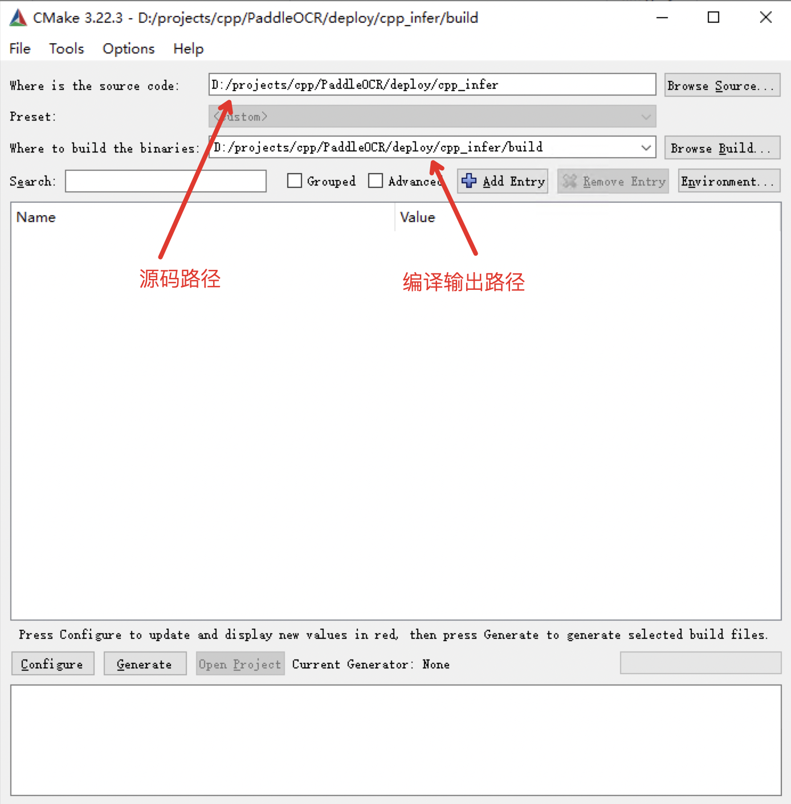
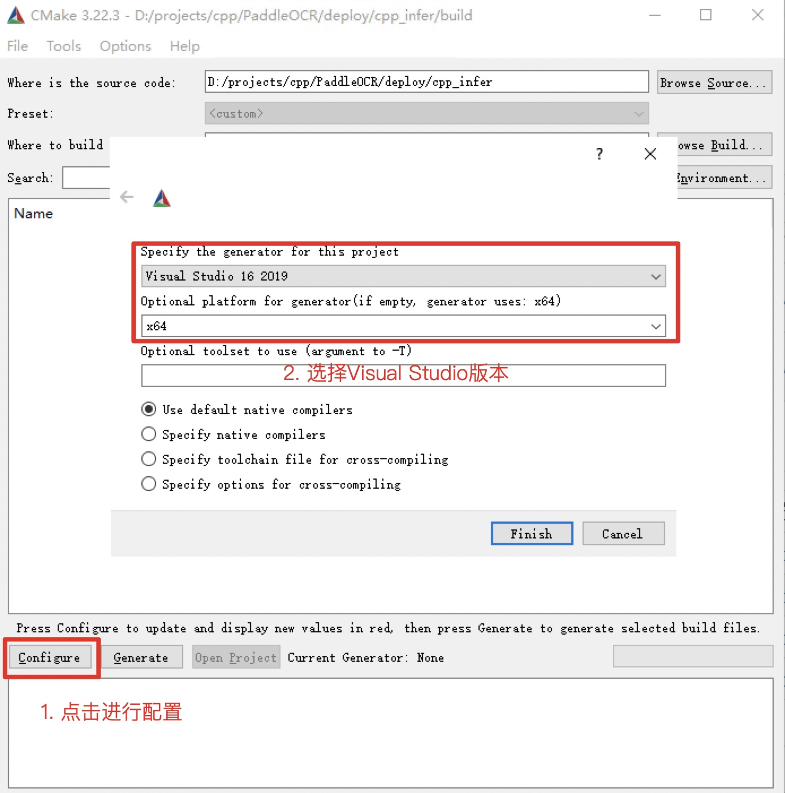
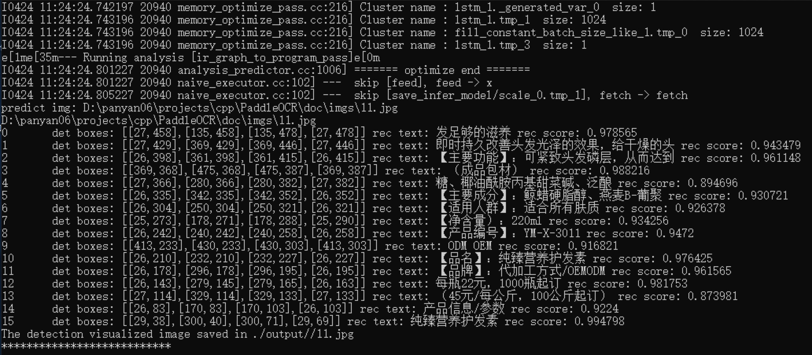

# Visual Studio 2022 Community CMake Compilation Guide

PaddleOCR has been tested on Windows using `Visual Studio 2022 Community`. Microsoft started supporting direct `CMake` project management from `Visual Studio 2017`, but it wasn't fully stable and reliable until `2019`. If you want to use CMake for project management and compilation, we recommend using `Visual Studio 2022`.

**All examples below assume the working directory is **`D:\projects\cpp`**.**

## 1. Environment Preparation

### 1.1 Install Required Dependencies

- Visual Studio 2019 or newer
- CUDA 10.2, cuDNN 7+ (only required for the GPU version of the prediction library). Additionally, the NVIDIA Computing Toolkit must be installed, and the NVIDIA cuDNN library must be downloaded.
- CMake 3.22+

Ensure that the above dependencies are installed before proceeding. In this tutorial the Community Edition of `VS2022` was used.

### 1.2 Download PaddlePaddle C++ Prediction Library and OpenCV

#### 1.2.1 Download PaddlePaddle C++ Prediction Library

PaddlePaddle C++ prediction libraries offer different precompiled versions for various `CPU` and `CUDA` configurations. Download the appropriate version from: [C++ Prediction Library Download List](https://www.paddlepaddle.org.cn/inference/master/guides/install/download_lib.html#windows)

After extraction, the `D:\projects\paddle_inference` directory should contain:

```
paddle_inference
├── paddle # Core Paddle library and header files
|
├── third_party # Third-party dependencies and headers
|
└── version.txt # Version and compilation information
```

#### 1.2.2 Install and Configure OpenCV

1. Download OpenCV for Windows from the [official release page](https://github.com/opencv/opencv/releases).
2. Run the downloaded executable and extract OpenCV to a specified directory, e.g., `D:\projects\cpp\opencv`.

#### 1.2.3 Download PaddleOCR Code

```bash
git clone https://github.com/PaddlePaddle/Paddle.git
git checkout develop
```

## 2. Running the Project

### Step 1: Create a Visual Studio Project

Once CMake is installed, open the `cmake-gui` application. Specify the source code directory in the first input box and the build output directory in the second input box.



### Step 2: Run CMake Configuration

Click the `Configure` button at the bottom of the interface. The first time you run it, a prompt will appear asking for the Visual Studio configuration. Select your `Visual Studio` version and set the target platform to `x64`. Click `Finish` to start the configuration process.



The first run will result in errors, which is expected. You now need to configure OpenCV and the prediction library.

- **For CPU version**, configure the following variables:

  - `OPENCV_DIR`: Path to the OpenCV `lib` folder
  - `OpenCV_DIR`: Same as `OPENCV_DIR`
  - `PADDLE_LIB`: Path to the `paddle_inference` folder

- **For GPU version**, configure additional variables:

  - `CUDA_LIB`: CUDA path, e.g., `C:\Program Files\NVIDIA GPU Computing Toolkit\CUDA\v11.2\lib\x64`
  - `CUDNN_LIB`: Path to extracted CuDNN library, e.g., `D:\CuDNN-8.9.7.29`
  - `TENSORRT_DIR`: Path to extracted TensorRT, e.g., `D:\TensorRT-8.0.1.6`
  - `WITH_GPU`: Check this option
  - `WITH_TENSORRT`: Check this option

Example configuration:


Once configured, click `Configure` again.

**Note:**

1. If using `openblas`, uncheck `WITH_MKL`.
2. If you encounter the error `unable to access 'https://github.com/LDOUBLEV/AutoLog.git/': gnutls_handshake() failed`, update `deploy/cpp_infer/external-cmake/auto-log.cmake` to use `https://gitee.com/Double_V/AutoLog`.

### Step 3: Generate Visual Studio Project

Click `Generate` to create the `.sln` file for the Visual Studio project.


Click `Open Project` to launch the project in Visual Studio. The interface should look like this:


Before building the solution, perform the following steps:

1. Change `Debug` to `Release` mode.
2. Download [dirent.h](https://paddleocr.bj.bcebos.com/deploy/cpp_infer/cpp_files/dirent.h) and copy it to the Visual Studio include directory, e.g., `C:\Program Files\Microsoft Visual Studio\2022\Community\VC\Tools\MSVC\include`.

Click `Build -> Build Solution`. Once completed, the `ppocr.exe` file should appear in the `build/Release/` folder.

Before running, copy the following files to `build/Release/`:

1. `paddle_inference/paddle/lib/paddle_inference.dll`
2. `paddle_inference/paddle/lib/common.dll`
3. `paddle_inference/third_party/install/mklml/lib/mklml.dll`
4. `paddle_inference/third_party/install/mklml/lib/libiomp5md.dll`
5. `paddle_inference/third_party/install/onednn/lib/mkldnn.dll`
6. `opencv/build/x64/vc15/bin/opencv_world455.dll`
7. If using the `openblas` version, also copy `paddle_inference/third_party/install/openblas/lib/openblas.dll`.

### Step 4: Run the Prediction

The compiled executable is located in the `build/Release/` directory. Open `cmd` and navigate to `D:\projects\cpp\PaddleOCR\deploy\cpp_infer\`:

```
cd /d D:\projects\cpp\PaddleOCR\deploy\cpp_infer
```

Run the prediction using `ppocr.exe`. For more usage details, refer to the to the [Instructions](./cpp_infer.en.md) section of running the demo.

```shell
# Switch terminal encoding to UTF-8
CHCP 65001

# If using PowerShell, run this command before execution to fix character encoding issues:
$OutputEncoding = [console]::InputEncoding = [console]::OutputEncoding = New-Object System.Text.UTF8Encoding

# Execute prediction
.\build\Release\ppocr.exe system --det_model_dir=D:\projects\cpp\ch_PP-OCRv2_det_slim_quant_infer --rec_model_dir=D:\projects\cpp\ch_PP-OCRv2_rec_slim_quant_infer --image_dir=D:\projects\cpp\PaddleOCR\doc\imgs\11.jpg
```

<br>

## Sample result:


## FAQ

- **Issue:** Application fails to start with error `(0xc0000142)` and `cmd` output shows `You are using Paddle compiled with TensorRT, but TensorRT dynamic library is not found.`
- **Solution:** Copy all `.dll` files from the `TensorRT` directory's `lib` folder into the `release` directory and try running it again.
