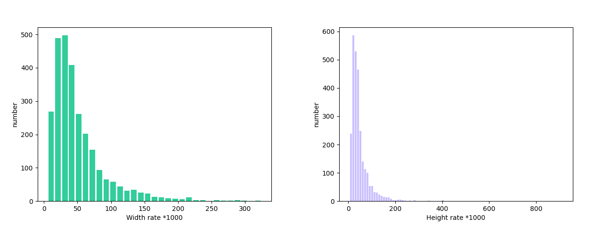

# 文本检测模块开发教程

## 一、概述
文本检测模块是OCR（光学字符识别）系统中的关键组成部分，负责在图像中定位和标记出包含文本的区域。该模块的性能直接影响到整个OCR系统的准确性和效率。文本检测模块通常会输出文本区域的边界框（Bounding Boxes），这些边界框将作为输入传递给文本识别模块进行后续处理。

## 二、支持模型列表

<details>
   <summary> 👉模型列表详情</summary>

|模型|检测Hmean（%）|GPU推理耗时（ms）|CPU推理耗时|模型存储大小（M)|介绍|
|-|-|-|-|-|-|
|PP-OCRv4_server_det|82.69|83.3501|2434.01|109|PP-OCRv4 的服务端文本检测模型，精度更高，适合在性能较好的服务器上部署|
|PP-OCRv4_mobile_det|77.79|10.6923|120.177|4.7|PP-OCRv4 的移动端文本检测模型，效率更高，适合在端侧设备部署|

</details>

## 三、快速集成
> ❗ 在快速集成前，请先安装 PaddleX 的 wheel 包，详细请参考 [PaddleX本地安装教程](../installation/installation.md)。
> 
几行代码即可完成文本检测模块的推理，可以任意切换该模块下的模型，您也可以将文本检测的模块中的模型推理集成到您的项目中。

```python
from paddlex import create_model
model = create_model("PP-OCRv4_mobile_det")
output = model.predict("https://paddle-model-ecology.bj.bcebos.com/paddlex/imgs/demo_image/general_ocr_001.png", batch_size=1)
for res in output:
    res.print(json_format=False)
    res.save_to_img("./output/")
    res.save_to_json("./output/res.json")
```
关于更多 PaddleX 的单模型推理的 API 的使用方法，可以参考 [PaddleX单模型Python脚本使用说明](../instructions/model_python_API.md)。

## 四、二次开发
如果你追求更高精度的现有模型，可以使用 PaddleX 的二次开发能力开发更好的文本检测模型。在使用 PaddleX 开发文本检测模型之前，请务必安装 PaddleX 的 PaddleOCR 插件，安装过程可以参考 [PaddleX本地安装教程](../installation/installation.md)。

### 4.1 数据准备
在进行模型训练前，需要准备相应任务模块的数据集。PaddleX 针对每一个模块提供了数据校验功能，**只有通过数据校验的数据才可以进行模型训练**。
此外，PaddleX 为每一个模块都提供了 Demo 数据集，您可以基于官方提供的 Demo 数据完成后续的开发。若您希望用私有数据集进行后续的模型训练，可以参考 [PaddleX文本检测/文本识别任务模块数据标注教程](../data_anotation/text_detection\regognition.md)。

#### 4.1.1 Demo 数据下载

您可以参考下面的命令将 Demo 数据集下载到指定文件夹：

```bash
wget https://paddle-model-ecology.bj.bcebos.com/paddlex/data/ocr_det_dataset_examples.tar -P ./dataset
tar -xf ./dataset/ocr_det_dataset_examples.tar -C ./dataset/
```
#### 4.1.2 数据校验

一行命令即可完成数据校验：

```bash
python main.py -c paddlex/configs/text_detection/PP-OCRv4_mobile_det.yaml \
    -o Global.mode=check_dataset \
    -o Global.dataset_dir=./dataset/ocr_det_dataset_examples
```
执行上述命令后，PaddleX 会对数据集进行校验，并统计数据集的基本信息，命令运行成功后会在log中打印出`Check dataset passed !`信息。校验结果文件保存在`./output/check_dataset_result.json`，同时相关产出会保存在当前目录的`./output/check_dataset`目录下，产出目录中包括可视化的示例样本图片和样本分布直方图。

<details>
  <summary>👉 <b>校验结果详情（点击展开）</b></summary>
校验结果文件具体内容为：

```bash
{
  "done_flag": true,
  "check_pass": true,
  "attributes": {
    "train_samples": 200,
    "train_sample_paths": [
      "../dataset/ocr_det_dataset_examples/images/train_img_61.jpg",
      "../dataset/ocr_det_dataset_examples/images/train_img_289.jpg"
    ],
    "val_samples": 50,
    "val_sample_paths": [
      "../dataset/ocr_det_dataset_examples/images/val_img_61.jpg",
      "../dataset/ocr_det_dataset_examples/images/val_img_137.jpg"
    ]
  },
  "analysis": {
    "histogram": "check_dataset/histogram.png"
  },
  "dataset_path": "./dataset/ocr_det_dataset_examples",
  "show_type": "image",
  "dataset_type": "TextDetDataset"
}
```
上述校验结果中，`check_pass` 为 `true` 表示数据集格式符合要求，其他部分指标的说明如下：

* `attributes.train_samples`：该数据集训练集样本数量为 200；
* `attributes.val_samples`：该数据集验证集样本数量为 50；
* `attributes.train_sample_paths`：该数据集训练集样本可视化图片相对路径列表；
* `attributes.val_sample_paths`：该数据集验证集样本可视化图片相对路径列表；


另外，数据集校验还对数据集中所有图片的长宽分布情况进行了分析分析，并绘制了分布直方图（histogram.png）： 


</details>

#### 4.1.3 数据集格式转换/数据集划分（可选）

在您完成数据校验之后，可以通过**修改配置文件**或是**追加超参数**的方式对数据集的格式进行转换，也可以对数据集的训练/验证比例进行重新划分。

<details>
  <summary>👉 <b>格式转换/数据集划分详情（点击展开）</b></summary>


**（1）数据集格式转换**

文本检测不支持数据格式转换。

**（2）数据集划分**

数据集划分的参数可以通过修改配置文件中 `CheckDataset` 下的字段进行设置，配置文件中部分参数的示例说明如下：

* `CheckDataset`:
  * `split`:
    * `enable`: 是否进行重新划分数据集，为 `True` 时进行数据集格式转换，默认为 `False`；
    * `train_percent`: 如果重新划分数据集，则需要设置训练集的百分比，类型为0-100之间的任意整数，需要保证与 `val_percent` 的值之和为100；


例如，您想重新划分数据集为 训练集占比90%、验证集占比10%，则需将配置文件修改为：

```bash
......
CheckDataset:
  ......
  split:
    enable: True
    train_percent: 90
    val_percent: 10
  ......
```
随后执行命令：

```bash
python main.py -c paddlex/configs/text_detection/PP-OCRv4_mobile_det.yaml \
    -o Global.mode=check_dataset \
    -o Global.dataset_dir=./dataset/ocr_det_dataset_examples
```
数据划分执行之后，原有标注文件会被在原路径下重命名为 `xxx.bak`。

以上参数同样支持通过追加命令行参数的方式进行设置：

```bash
python main.py -c paddlex/configs/text_detection/PP-OCRv4_mobile_det.yaml  \
    -o Global.mode=check_dataset \
    -o Global.dataset_dir=./dataset/ocr_det_dataset_examples \
    -o CheckDataset.split.enable=True \
    -o CheckDataset.split.train_percent=90 \
    -o CheckDataset.split.val_percent=10
```
</details>

### 4.2 模型训练
一条命令即可完成模型的训练，以此处 PP-OCRv4 移动端文本检测模型（`PP-OCRv4_mobile_det`）的训练为例：

```bash
python main.py -c paddlex/configs/text_detection/PP-OCRv4_mobile_det.yaml \
    -o Global.mode=train \
    -o Global.dataset_dir=./dataset/ocr_det_dataset_examples
```
需要如下几步：

* 指定模型的`.yaml` 配置文件路径（此处为`PP-OCRv4_mobile_det.yaml`）
* 指定模式为模型训练：`-o Global.mode=train`
* 指定训练数据集路径：`-o Global.dataset_dir`
其他相关参数均可通过修改`.yaml`配置文件中的`Global`和`Train`下的字段来进行设置，也可以通过在命令行中追加参数来进行调整。如指定前 2 卡 gpu 训练：`-o Global.device=gpu:0,1`；设置训练轮次数为 10：`-o Train.epochs_iters=10`。更多可修改的参数及其详细解释，可以查阅查阅模型对应任务模块的配置文件说明 [PaddleX通用模型配置文件参数说明](../instructions/config_parameters_common.md)。

<details>
  <summary>👉 <b>更多说明（点击展开）</b></summary>

* 模型训练过程中，PaddleX 会自动保存模型权重文件，默认为`output`，如需指定保存路径，可通过配置文件中 `-o Global.output` 字段进行设置。
* PaddleX 对您屏蔽了动态图权重和静态图权重的概念。在模型训练的过程中，会同时产出动态图和静态图的权重，在模型推理时，默认选择静态图权重推理。
* 训练其他模型时，需要的指定相应的配置文件，模型和配置的文件的对应关系，可以查阅 [PaddleX模型列表（CPU/GPU）](../support_list/models_list.md)。
在完成模型训练后，所有产出保存在指定的输出目录（默认为`./output/`）下，通常有以下产出：

* `train_result.json`：训练结果记录文件，记录了训练任务是否正常完成，以及产出的权重指标、相关文件路径等；
* `train.log`：训练日志文件，记录了训练过程中的模型指标变化、loss 变化等；
* `config.yaml`：训练配置文件，记录了本次训练的超参数的配置；
* `.pdparams`、`.pdema`、`.pdopt.pdstate`、`.pdiparams`、`.pdmodel`：模型权重相关文件，包括网络参数、优化器、EMA、静态图网络参数、静态图网络结构等；
</details>

### **4.3 模型评估**
在完成模型训练后，可以对指定的模型权重文件在验证集上进行评估，验证模型精度。使用 PaddleX 进行模型评估，一条命令即可完成模型的评估：

```bash
python main.py -c paddlex/configs/text_detection/PP-OCRv4_mobile_det.yaml \
    -o Global.mode=evaluate \
    -o Global.dataset_dir=./dataset/ocr_det_dataset_examples
```
与模型训练类似，需要如下几步：

* 指定模型的`.yaml` 配置文件路径（此处为`PP-OCRv4_mobile_det.yaml`）
* 指定模式为模型评估：`-o Global.mode=evaluate`
* 指定验证数据集路径：`-o Global.dataset_dir`
其他相关参数均可通过修改`.yaml`配置文件中的`Global`和`Evaluate`下的字段来进行设置，详细请参考 [PaddleX通用模型配置文件参数说明](../instructions/config_parameters_common.md)。


<details>
  <summary>👉 <b>更多说明（点击展开）</b></summary>

在模型评估时，需要指定模型权重文件路径，每个配置文件中都内置了默认的权重保存路径，如需要改变，只需要通过追加命令行参数的形式进行设置即可，如`-o Evaluate.weight_path=./output/best_accuracy/best_accuracy.pdparams`。

在完成模型评估后，会产出`evaluate_result.json，其记录了`评估的结果，具体来说，记录了评估任务是否正常完成，以及模型的评估指标，包含 `precision`、`recall`、`hmean`。

</details>

### **4.4 模型推理和模型集成**
在完成模型的训练和评估后，即可使用训练好的模型权重进行推理预测或者进行Python集成。

#### 4.4.1 模型推理
通过命令行的方式进行推理预测，只需如下一条命令：

```bash
python main.py -c paddlex/configs/text_detection/PP-OCRv4_mobile_det.yaml \
    -o Global.mode=predict \
    -o Predict.model_dir="./output/best_accuracy/inference" \
    -o Predict.input="https://paddle-model-ecology.bj.bcebos.com/paddlex/imgs/demo_image/general_ocr_001.png"
```
与模型训练和评估类似，需要如下几步：

* 指定模型的`.yaml` 配置文件路径（此处为`PP-OCRv4_mobile_det.yaml`）
* 指定模式为模型推理预测：`-o Global.mode=predict`
* 指定模型权重路径：`-o Predict.model_dir="./output/best_accuracy/inference"`
* 指定输入数据路径：`-o Predict.input="..."`
其他相关参数均可通过修改`.yaml`配置文件中的`Global`和`Predict`下的字段来进行设置，详细请参考 [PaddleX通用模型配置文件参数说明](../../module_usage/instructions/config_parameters_common.md)。

* 也可以用 PaddleX 的 wheel 包进行推理，方便地将模型集成到您自己的项目中。
#### 4.4.2 模型集成
模型可以直接集成到 PaddleX 产线中，也可以直接集成到您自己的项目中。

1.**产线集成**

文本检测模块可以集成的 PaddleX 产线有[通用 OCR 产线](../pipeline_usage/OCR.md)、[表格识别产线](../pipeline_usage/table_recognition.md)、[文档场景信息抽取产线v3（PP-ChatOCRv3）](../pipeline_usage/document_scene_information_extraction.md)，只需要替换模型路径即可完成相关产线的文本检测模块的模型更新。

2.**模块集成**

您产出的权重可以直接集成到文本检测模块中，可以参考[快速集成](#三快速集成)的 Python 示例代码，只需要将模型替换为你训练的到的模型路径即可。
