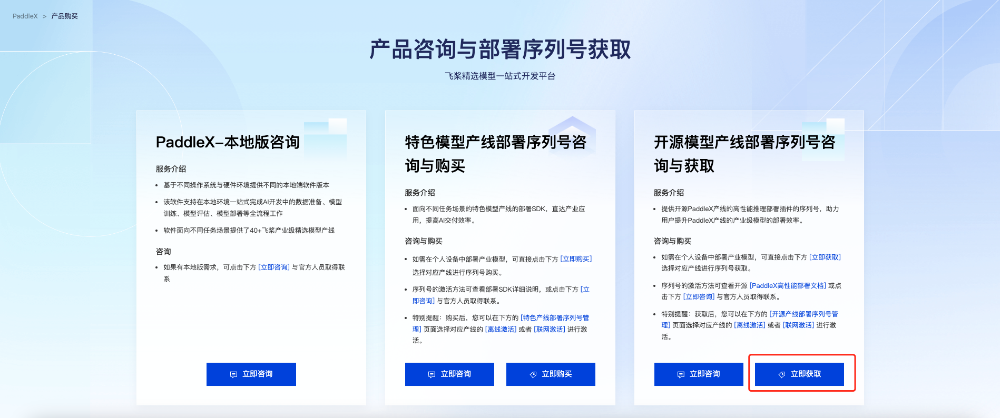
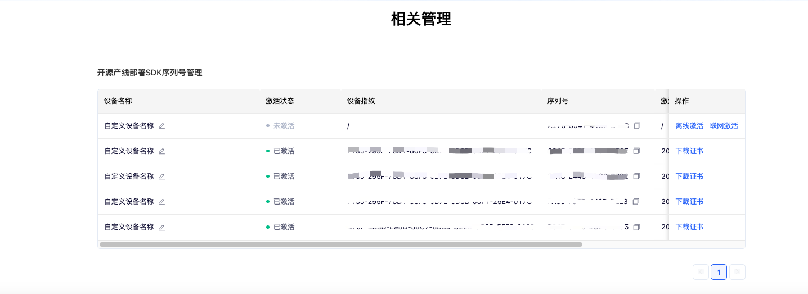

# PaddleX 高性能部署指南

在实际生产环境中，许多应用对部署策略的性能指标（尤其是响应速度）有着较严苛的标准，以确保系统的高效运行与用户体验的流畅性。为此，PaddleX 提供高性能推理插件，旨在对模型推理及前后处理进行深度性能优化，实现端到端流程的显著提速。本文档将首先介绍高性能推理插件的安装和使用方式，然后列举目前支持使用高性能推理插件的产线与模型。

## 1.高性能推理插件的安装与使用

使用高性能推理插件前，请确保您已经按照[PaddleX本地安装教程]() 完成了PaddleX的安装，且按照PaddleX产线命令行使用说明或PaddleX产线Python脚本使用说明跑通了产线的基本推理。

### 1.1 安装高性能推理插件

在下表中根据处理器架构、操作系统、设备类型、Python 版本等信息，找到对应的安装指令并在部署环境中执行：

<table>
  <tr>
    <th>处理器架构</th>
    <th>操作系统</th>
    <th>设备类型</th>
    <th>Python 版本</th>
    <th>安装指令</th>
  </tr>
  <tr>
    <td rowspan="7">x86-64</td>
    <td rowspan="7">Linux</td>
    <td rowspan="4">CPU</td>
  </tr>
  <tr>
    <td>3.8</td>
    <td>curl -s https://paddle-model-ecology.bj.bcebos.com/paddlex/PaddleX3.0/deploy/paddlex_hpi/install_script/latest/install_paddlex_hpi.py | python3 - --arch x86_64 --os linux --device cpu --py 38</td>
  </tr>
  <tr>
    <td>3.9</td>
    <td>curl -s https://paddle-model-ecology.bj.bcebos.com/paddlex/PaddleX3.0/deploy/paddlex_hpi/install_script/latest/install_paddlex_hpi.py | python3 - --arch x86_64 --os linux --device cpu --py 39</td>
  </tr>
  <tr>
    <td>3.10</td>
    <td>curl -s https://paddle-model-ecology.bj.bcebos.com/paddlex/PaddleX3.0/deploy/paddlex_hpi/install_script/latest/install_paddlex_hpi.py | python3 - --arch x86_64 --os linux --device cpu --py 310</td>
  </tr>
  <tr>
    <td rowspan="3">GPU</td>
    <td>3.8</td>
    <td>curl -s https://paddle-model-ecology.bj.bcebos.com/paddlex/PaddleX3.0/deploy/paddlex_hpi/install_script/latest/install_paddlex_hpi.py | python3 - --arch x86_64 --os linux --device gpu_cuda118_cudnn86 --py 38</td>
  </tr>
  <tr>
    <td>3.9</td>
    <td>curl -s https://paddle-model-ecology.bj.bcebos.com/paddlex/PaddleX3.0/deploy/paddlex_hpi/install_script/latest/install_paddlex_hpi.py | python3 - --arch x86_64 --os linux --device gpu_cuda118_cudnn86 --py 39</td>
  </tr>
  <tr>
    <td>3.10</td>
    <td>curl -s https://paddle-model-ecology.bj.bcebos.com/paddlex/PaddleX3.0/deploy/paddlex_hpi/install_script/latest/install_paddlex_hpi.py | python3 - --arch x86_64 --os linux --device gpu_cuda118_cudnn86 --py 310</td>
  </tr>
</table>

* 对于 Linux 系统，使用 Bash 执行安装指令。
* 当设备类型为 CPU 时，安装的高性能推理插件仅支持使用 CPU 进行推理；对于其他设备类型，安装的高性能推理插件则支持使用 CPU 或其他设备进行推理。

### 1.2 获取序列号与激活

在 [飞桨AI Studio星河社区-人工智能学习与实训社区](https://aistudio.baidu.com/paddlex/commercialization) 页面的“开源模型产线部署序列号咨询与获取”部分选择“立即获取”，如下图所示：



选择需要部署的产线，并点击“获取”。之后，可以在页面下方的“开源产线部署SDK序列号管理”部分找到获取到的序列号：



使用序列号完成激活后，即可使用高性能推理插件。PaddleX 提供离线激活和在线激活两种方式（均只支持 Linux 系统）：

* 联网激活：在使用推理 API 或 CLI 时，通过参数指定序列号及联网激活，使程序自动完成激活。
* 离线激活：按照序列号管理界面中的指引（点击“操作”中的“离线激活”），获取机器的设备指纹，并将序列号与设备指纹绑定以获取证书，完成激活。使用这种激活方式，需要手动将证书存放在机器的${HOME}/.baidu/paddlex/licenses目录中（如果目录不存在，需要创建目录），并在使用推理 API 或 CLI 时指定序列号。
请注意：每个序列号只能绑定到唯一的设备指纹，且只能绑定一次。这意味着用户如果使用不同的机器部署模型，则必须为每台机器准备单独的序列号。

### 1.3 启用高性能推理插件

对于 PaddleX CLI，指定 `--use_hpip`，并设置序列号，即可启用高性能推理插件。如果希望进行联网激活，在第一次使用序列号时，需指定 `--update_license`，以通用图像分类产线为例：

```diff
paddlex \
    --pipeline image_classification \
    --input https://paddle-model-ecology.bj.bcebos.com/paddlex/imgs/demo_image/general_image_classification_001.jpg \
    --device gpu:0 \
+   --use_hpip \
+   --serial_number {序列号}

# 如果希望进行联网激活
paddlex \
    --pipeline image_classification \
    --input https://paddle-model-ecology.bj.bcebos.com/paddlex/imgs/demo_image/general_image_classification_001.jpg \
    --device gpu:0 \
+   --use_hpip \
+   --serial_number {序列号}
+   --update_license
```

对于 PaddleX Python API，启用高性能推理插件的方法类似。仍以通用图像分类产线为例：

```diff
from paddlex import create_pipeline

pipeline = create_pipeline(
    pipeline="image_classification",
+   use_hpip=True,
+   serial_number="{序列号}",
)
 
 output = pipeline.predict("https://paddle-model-ecology.bj.bcebos.com/paddlex/imgs/demo_image/general_image_classification_001.jpg")
```

启用高性能推理插件得到的推理结果与未启用插件时一致。对于部分模型，在首次启用高性能推理插件时，可能需要花费较长时间完成推理引擎的构建。PaddleX 将在推理引擎的第一次构建完成后将相关信息缓存在模型目录，并在后续复用缓存中的内容以提升初始化速度。

### 1.4 修改高性能推理配置

PaddleX 为每个模型提供默认的高性能推理配置，并将其存储在模型的配置文件中。由于实际部署环境的多样性，使用默认配置可能无法在特定环境中获取理想的性能，甚至可能出现推理失败的情况。对于默认配置无法满足要求的情形，可以通过如下方式，尝试更换模型的推理后端：

1. 找到模型目录中的 `inference.yml` 文件，定位到其中的Hpi字段；
2. 修改 `selected_backends` 的值。具体而言，`selected_backends` 可能被设置如下：

    ```
    selected_backends:
        cpu: paddle_infer
        gpu: onnx_runtime
    ```

    其中每一项均按照 `{设备类型}: {推理后端名称}` 的格式填写，默认选用在官方测试环境中推理耗时最短的后端。`supported_backends` 中记录了官方测试环境中模型支持的推理后端，可供参考。
    目前所有可选的推理后端如下：

    * `paddle_infer`：标准的 Paddle Inference 推理引擎。支持 CPU 和 GPU。
    * `paddle_tensorrt`：[Paddle-TensorRT](https://www.paddlepaddle.org.cn/lite/v2.10/optimize/paddle_trt.html)，Paddle 官方出品的高性能深度学习推理库，采用子图的形式对 TensorRT 进行了集成，以实现进一步优化加速。仅支持 GPU。
    * `openvino`：[OpenVINO](https://github.com/openvinotoolkit/openvino)，Intel 提供的深度学习推理工具，优化了多种 Intel 硬件上的模型推理性能。仅支持 CPU。
    * `onnx_runtime`：[ONNX Runtime](https://onnxruntime.ai/)，跨平台、高性能的推理引擎。支持 CPU 和 GPU。
    * `tensorrt`：[TensorRT](https://developer.nvidia.com/tensorrt)，NVIDIA 提供的高性能深度学习推理库，针对 NVIDIA GPU 进行优化以提升速度。仅支持 GPU。

    以下是目前的官方测试环境的部分关键信息：

    * CPU：Intel Xeon Gold 5117
    * GPU：NVIDIA Tesla T4
    * CUDA版本：11.8
    * cuDNN版本：8.6
    * Docker 镜像：registry.baidubce.com/paddlepaddle/paddle:latest-dev-cuda11.8-cudnn8.6-trt8.5-gcc82

## 2、支持使用高性能推理插件的产线与模型

<table>
  <tr>
    <th>模型产线</th>
    <th>产线模块</th>
    <th>具体模型</th>
  </tr>
  <tr>
    <td>通用图像分类</td>
    <td>图像分类</td>
    <td>ResNet18<br/>ResNet34<details>
    <summary><b>more</b></summary>ResNet50<br/>ResNet101<br/>ResNet152<br/>ResNet18_vd<br/>ResNet34_vd<br/>ResNet50_vd<br/>ResNet101_vd<br/>ResNet152_vd<br/>ResNet200_vd<br/>PP-LCNet_x0_25<br/>PP-LCNet_x0_35<br/>PP-LCNet_x0_5<br/>PP-LCNet_x0_75<br/>PP-LCNet_x1_0<br/>PP-LCNet_x1_5<br/>PP-LCNet_x2_0<br/>PP-LCNet_x2_5<br/>PP-LCNetV2_small<br/>PP-LCNetV2_base<br/>PP-LCNetV2_large<br/>MobileNetV3_large_x0_35<br/>MobileNetV3_large_x0_5<br/>MobileNetV3_large_x0_75<br/>MobileNetV3_large_x1_0<br/>MobileNetV3_large_x1_25<br/>MobileNetV3_small_x0_35<br/>MobileNetV3_small_x0_5<br/>MobileNetV3_small_x0_75<br/>MobileNetV3_small_x1_0<br/>MobileNetV3_small_x1_25<br/>ConvNeXt_tiny<br/>ConvNeXt_small<br/>ConvNeXt_base_224<br/>ConvNeXt_base_384<br/>ConvNeXt_large_224<br/>ConvNeXt_large_384<br/>MobileNetV1_x0_25<br/>MobileNetV1_x0_5<br/>MobileNetV1_x0_75<br/>MobileNetV1_x1_0<br/>MobileNetV2_x0_25<br/>MobileNetV2_x0_5<br/>MobileNetV2_x1_0<br/>MobileNetV2_x1_5<br/>MobileNetV2_x2_0<br/>SwinTransformer_tiny_patch4_window7_224<br/>SwinTransformer_small_patch4_window7_224<br/>SwinTransformer_base_patch4_window7_224<br/>SwinTransformer_base_patch4_window12_384<br/>SwinTransformer_large_patch4_window7_224<br/>SwinTransformer_large_patch4_window12_384<br/>PP-HGNet_small<br/>PP-HGNet_tiny<br/>PP-HGNet_base<br/>PP-HGNetV2-B0<br/>PP-HGNetV2-B1<br/>PP-HGNetV2-B2<br/>PP-HGNetV2-B3<br/>PP-HGNetV2-B4<br/>PP-HGNetV2-B5<br/>PP-HGNetV2-B6<br/>CLIP_vit_base_patch16_224<br/>CLIP_vit_large_patch14_224</details></td>
  </tr>


  <tr>
    <td>通用目标检测</td>
    <td>目标检测</td>
    <td>PP-YOLOE_plus-S<br/>PP-YOLOE_plus-M<details>
        <summary><b>more</b></summary>PP-YOLOE_plus-L<br/>PP-YOLOE_plus-X<br/>YOLOX-N<br/>YOLOX-T<br/>YOLOX-S<br/>YOLOX-M<br/>YOLOX-L<br/>YOLOX-X<br/>YOLOv3-DarkNet53<br/>YOLOv3-ResNet50_vd_DCN<br/>YOLOv3-MobileNetV3<br/>RT-DETR-R18<br/>RT-DETR-R50<br/>RT-DETR-L<br/>RT-DETR-H<br/>RT-DETR-X<br/>PicoDet-S<br/>PicoDet-L</details></td>
  </tr>

  <tr>
    <td>通用语义分割</td>
    <td>语义分割</td>
    <td>Deeplabv3-R50<br/>Deeplabv3-R101<details>
    <summary><b>more</b></summary>Deeplabv3_Plus-R50<br/>Deeplabv3_Plus-R101<br/>PP-LiteSeg-T<br/>OCRNet_HRNet-W48<br/>OCRNet_HRNet-W18<br/>SeaFormer_tiny<br/>SeaFormer_small<br/>SeaFormer_base<br/>SeaFormer_large<br/>SegFormer-B0<br/>SegFormer-B1<br/>SegFormer-B2<br/>SegFormer-B3<br/>SegFormer-B4<br/>SegFormer-B5</details></td>
  </tr>

  <tr>
    <td>通用实例分割</td>
    <td>实例分割</td>
    <td>Mask-RT-DETR-L<br/>Mask-RT-DETR-H</td>
  </tr>

  <tr>
    <td rowspan="2">通用OCR</td>
    <td>文本检测</td>
    <td>PP-OCRv4_server_det<br/>PP-OCRv4_mobile_det</td>
  </tr>

  <tr>
    <td>文本识别</td>
    <td>PP-OCRv4_server_rec<br/>PP-OCRv4_mobile_rec<br/>LaTeX_OCR_rec<br/>ch_RepSVTR_rec<br/>ch_SVTRv2_rec</td>
  </tr>

  <tr>
    <td rowspan="5">通用表格识别</td>
    <td>版面区域检测</td>
    <td>PicoDet_layout_1x</td>
  </tr>

  <tr>
    <td rowspan="2">表格识别</td>
    <td>SLANet</td>
  </tr>

  <tr>
    <td>SLANet_plus</td>
  </tr>

  <tr>
    <td>文本检测</td>
    <td>PP-OCRv4_server_det<br/>PP-OCRv4_mobile_det</td>
  </tr>

  <tr>
    <td>文本识别</td>
    <td>PP-OCRv4_server_rec<br/>PP-OCRv4_mobile_rec</td>
  </tr>

  <tr>
    <td rowspan="15">文档场景信息抽取v3产线</td>
    <td>表格结构识别</td>
    <td>SLANet</td>
  </tr>

  <tr>
    <td>版面区域定位</td>
    <td>PicoDet_layout_1x</td>
  </tr>

  <tr>
    <td rowspan="2">文本检测</td>
    <td>PP-OCRv4_server_det</td>
  </tr>

  <tr>
    <td>PP-OCRv4_mobile_det</td>
  </tr>

  <tr>
    <td rowspan="4">文本识别</td>
    <td>PP-OCRv4_server_rec</td>
  </tr>

  <tr>
    <td>PP-OCRv4_mobile_rec</td>
  </tr>

  <tr>
    <td>ch_RepSVTR_rec</td>
  </tr>

  <tr>
    <td>ch_SVTRv2_rec</td>
  </tr>

  <tr>
    <td rowspan="2">印章文本检测</td>
    <td>PP-OCRv4_server_seal_det</td>
  </tr>

  <tr>
    <td>PP-OCRv4_mobile_seal_det</td>
  </tr>

  <tr>
    <td>图像矫正</td>
    <td>UVDoc</td>
  </tr>

  <tr>
    <td>文档图像方向分类</td>
    <td>PP-LCNet_x1_0_doc_ori</td>
  </tr>
</table>
