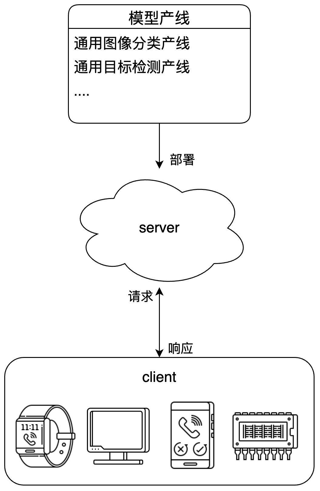

# PaddleX 服务化部署指南

服务化部署是实际生产环境中常见的一种部署形式。通过将推理功能封装为服务，客户端可以通过网络请求来访问这些服务，以获取推理结果。PaddleX 支持用户以低成本实现产线的服务化部署。本文档将首先介绍使用 PaddleX 进行服务化部署的基本流程，然后介绍将服务用于生产环境时的注意事项以及可能需要执行的操作。
**注意**
- **服务化部署提供模型产线的服务，而不具体到某个产线模块。**

服务化部署示例图：



## 1、基本流程

### 1.1 安装服务化部署插件

执行如下指令，安装服务化部署插件：

```
paddlex --install serving
```

### 1.2 启动服务

通过 PaddleX CLI 启动服务，指令格式为：

```shell
paddlex --serve --pipeline {产线名称或产线配置文件路径} [{其他命令行选项}]
```


--pipeline可指定为官方产线名称或本地产线配置文件路径。PaddleX 以此构建产线并部署为服务。如需调整配置（如模型路径、batch_size、部署设备等）
与服务化部署相关的命令行选项如下：

| 名称             | 说明                                                                                                                                                        |
|------------------|-------------------------------------------------------------------------------------------------------------------------------------------------------------|
| `--pipeline`       | 产线名称或产线配置文件路径。                                                                                                                                |
| `--device`         | 产线部署设备。默认为 `cpu`（如机器不支持 `GPU`）或 `gpu`（如机器支持 `GPU`）。                                                                                       |
| `--host`           | 服务器绑定的主机名或 IP 地址。默认为0.0.0.0。                                                                                                               |
| `--port`           | 服务器监听的端口号。默认为8080。                                                                                                                            |
| `--use_hpip`       | 如果指定，则启用高性能推理插件。                                                                                                                            |
| `--serial_number`  | 高性能推理插件使用的序列号。只在启用高性能推理插件时生效。 请注意，并非所有产线、模型都支持使用高性能推理插件，详细的支持情况请参考[PaddleX 高性能部署指南](./high_performance_deploy.md)。 |
| `--update_license` | 如果指定，则进行联网激活。只在启用高性能推理插件时生效。                                                                                                    |

</table>

### 1.3 调用服务

请参考各产线使用教程中的 **“开发集成/部署”** 部分。

| 模型产线               | 使用教程                       |
|------------------------|--------------------------------|
| 通用OCR产线            | [通用OCR产线使用教程](../pipeline_usage/OCR.md)            |
| 通用表格识别产线       | [通用表格识别产线使用教程](../pipeline_usage/table_recognition.md)       |
| 文档场景信息抽取v3产线 | [文档场景信息抽取v3产线使用教程](../pipeline_usage/document_scene_information_extraction.md) |

## 2、将服务用于生产

将服务应用于生产环境中时，服务的稳定性、高效性与安全性尤为重要。以下是一些针对将服务用于生产的建议。

### 2.1 使用 PaddleX 高性能推理插件

在对于服务响应时间要求较严格的应用场景中，可以使用 PaddleX 高性能推理插件对模型推理及前后处理进行加速，从而降低响应时间、提升吞吐量。

使用 PaddleX 高性能推理插件，请参考[PaddleX 高性能部署指南](./high_performance_deploy.md)中安装高性能推理插件、获取序列号与激活部分完成插件的安装与序列号的申请。同时，不是所有的产线、模型和环境都支持使用高性能推理插件，支持的详细情况请参考支持使用高性能推理插件的产线与模型部分。

在启动 PaddleX 产线服务时，可以通过指定 `--use_hpip` 及序列号以使用高性能推理插件。如果希望进行联网激活 需指定 `--update_license`。使用示例：

```
paddlex --serve --pipeline image_classfication --use_hpip --serial_number {序列号}

# 如果希望进行联网激活
paddlex --serve --pipeline image_classfication --use_hpip --serial_number {序列号} --update_license
```

### 2.2 考虑安全性

一个典型的场景是，应用接受来自网络的输入，PaddleX 产线服务作为应用中的一个模块，通过 API 与其他模块交互。此时，PaddleX 产线服务在应用中所处的位置尤为重要。PaddleX 提供的服务化部署方案专注于提供高效性和易用性，但未对请求体的内容进行足够的安全检查。来自网络的恶意请求，例如超大尺寸的图像或精心构造的数据，都可能导致服务崩溃等严重后果。因此，建议将 PaddleX 产线服务放置于应用内部，不直接处理外部输入，确保其只处理可信赖的请求。在应用的外层，需要添加合适的防护措施，例如输入验证、身份验证等。
